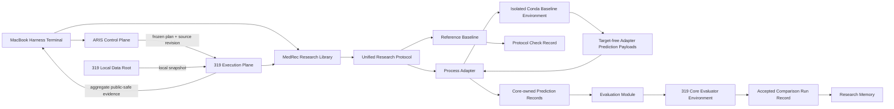

# Architecture

MedRec Research separates reusable scientific semantics from workflow orchestration and imported baseline runtimes. The central design question is whether two result rows mean the same thing. Shared folders or identical metric names do not make methods comparable; shared cohort identity, split membership, prediction semantics, evaluation, adaptation limits, and provenance do.

## System map



## Deep modules

The core library exposes a small set of scientific interfaces. Dataset Manifest construction concentrates membership checks, dataset identity, and privacy constraints. Prediction Adapter validation keeps targets in the core and joins target-free wire payloads to eligible visits. Evaluation owns Comparison Mode metrics and edge cases. Run Record creation binds public-safe provenance to authoritative registry and manifest state. The Baseline Registry owns source and smoke readiness; Comparison Qualifications bind later gates to one protocol version, Dataset Manifest, and Adaptation Budget. Comparison Scope owns those identity comparisons, while Live Benchmark Authority correlates current program, audit, review, registry, scope, and published selection records before status can project. Reproduction Characterization owns public-safe stability provenance behind Selection Acceptance. The HITL Control Plane concentrates atomic decision invariants in `ResearchContractStore`, durable worker scheduling in `ExecutionOrchestrator`, remote capability checks in `RemotePreflightProbe`, and multi-agent coordination in `AgentTeamBridge`.

These modules are deep because callers do not reimplement their invariants. Their public interfaces are the test surface.

The process seam has one production implementation and fake subprocesses in tests. It remains a provisional seam until the first real external baseline adapter exists. Baseline-specific libraries, CUDA stacks, and working-directory assumptions stay behind it; no second adapter interface should be invented in advance.

## Scientific modes

Reproduction Mode and Comparison Mode answer different questions. Reproduction Mode asks whether a pinned source can reproduce its recorded behavior. Comparison Mode asks how methods behave under one shared protocol. A result from one mode cannot support a claim in the other.

The current Run Record schema accepts Comparison Mode evidence only. Reproduction Characterization is a Selection-Acceptance-gated, public-safe Reproduction Mode stability record; it preserves provenance but cannot create Comparison Qualification or experimental evidence. The synthetic reference emits a Protocol Check Record, not research evidence.

Comparison Mode freezes the Baseline Core. A Prediction Adapter can map files, identifiers, tensors, and output records. If integration changes model logic, loss, feature availability, thresholding, or selection behavior, the result is a modified method and must receive a separate registry identity.

## Ownership

The core Python package owns public-safe schemas, deterministic evaluation, registry validation, process validation, and the synthetic vertical slice. The MacBook owns ARIS orchestration, protocol checks, remote submission, monitoring, and public-safe intake. The 319 execution plane owns real-data computation, external Baseline Environments, the separate Core Evaluator Environment, GPU jobs, and restricted outputs. Research Memory owns accepted scientific state and failed-route constraints. The 319 Local Data Root owns all restricted data and private run artifacts.

## Dependency direction

The core package has no ARIS or baseline-framework dependency. ARIS may call the package from the Harness Terminal. Baseline processes emit target-free payloads on 319. The Core Evaluator Environment attaches core-owned targets, validates complete eligible-visit coverage, recomputes metrics, and emits a candidate Run Record. Only audited aggregate evidence crosses back to the Mac. None of these modules may import ARIS into the core or place private paths in a public interface.

## Repository layout

```text
baselines/      Baseline identities and integration metadata
docs/           Decisions, specifications, plans, and operational playbooks
environments/   Isolated baseline and 319 core-evaluator declarations
fixtures/       Public synthetic data only
research/       Curated Research Memory and Failure Records
src/            Reusable protocol implementation
tests/          Tests through public module interfaces
```

Runtime logs, ARIS traces, checkpoints, data snapshots, and patient-level outputs are ignored local state, not architecture.
