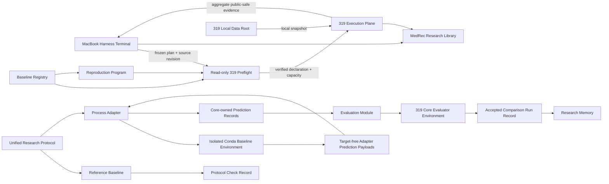

# Architecture

MedRec Research separates reusable scientific semantics from workflow orchestration and imported baseline runtimes. The central design question is whether two result rows mean the same thing. Shared folders or identical metric names do not make methods comparable; shared cohort identity, split membership, prediction semantics, evaluation, adaptation limits, and provenance do.

## System map



## Deep modules

The core library exposes a small set of scientific interfaces. Dataset Manifest construction concentrates membership checks, dataset identity, and privacy constraints. Prediction Adapter validation keeps targets in the core and joins target-free wire payloads to eligible visits. Evaluation owns Comparison Mode metrics and edge cases. Run Record creation binds public-safe provenance to authoritative registry and manifest state. The Baseline Registry owns source and smoke readiness; Comparison Qualifications bind later gates to one protocol version, Dataset Manifest, and Adaptation Budget. Comparison Scope owns those identity comparisons. CLI handlers own path I/O and presentation, while `commands.py` holds only deterministic value transformations shared by those handlers.

These modules are deep because callers do not reimplement their invariants. Their public interfaces are the test surface.

The Comparison Mode process seam has one production Prediction Adapter and fake subprocesses in tests. Baseline-specific libraries, CUDA stacks, and working-directory assumptions stay behind it; no second adapter interface should be invented in advance.

Reproduction Mode uses a different deep module. A Reproduction Program owns the source-native data gate, mechanical invocation adaptation, training, checkpoint selection, upstream test procedure, and aggregate result finalization for one shared lineage. `RemoteExecutor` consumes the program declaration from the Baseline Registry, generates complete external data and run paths, accepts only approved 319 aliases, and performs the read-only preflight immediately before submission. Dry-run exercises this same interface without SSH; real submission additionally requires an exact clean harness revision and a 319-verified environment identity.

## Scientific modes

Reproduction Mode and Comparison Mode answer different questions. Reproduction Mode asks whether a pinned source can reproduce its recorded behavior. Comparison Mode asks how methods behave under one shared protocol. A result from one mode cannot support a claim in the other.

The current Run Record schema accepts Comparison Mode evidence only. The synthetic reference emits a Protocol Check Record, not research evidence.

Comparison Mode freezes the Baseline Core. A Prediction Adapter can map files, identifiers, tensors, and output records. If integration changes model logic, loss, feature availability, thresholding, or selection behavior, the result is a modified method and must receive a separate registry identity.

## Ownership

The core Python package owns public-safe schemas, deterministic evaluation, registry validation, process validation, and the synthetic vertical slice. The MacBook owns protocol checks, remote submission, monitoring, and public-safe intake. The 319 execution plane owns real-data computation, external Baseline Environments, the separate Core Evaluator Environment, GPU jobs, and restricted outputs. Research Memory owns accepted scientific state and failed-route constraints. The 319 Local Data Root owns all restricted data and private run artifacts.

## Dependency direction

The core package has no baseline-framework dependency. Baseline processes emit target-free payloads on 319. The Core Evaluator Environment attaches core-owned targets, validates complete eligible-visit coverage, recomputes metrics, and emits a candidate Run Record. Only audited aggregate evidence crosses back to the Mac. None of these modules may place private paths in a public interface.

## Repository layout

```text
baselines/      Baseline Registry plus implemented Reproduction Programs
docs/           Decisions, specifications, plans, and operational playbooks
environments/   Verified or explicitly provisional 319 environment declarations
fixtures/       Public synthetic data only
research/       Curated Research Memory and Failure Records
src/            Reusable protocol implementation
tests/          Tests through public module interfaces
```

Runtime logs, checkpoints, data snapshots, and patient-level outputs are ignored local state, not architecture.

### Baselines

`baselines/registry.toml` is the only authority for baseline identity, Reproduction Program declarations, and Reproduction Lanes. A program declaration owns its repository-relative entrypoint, external 319 source root, dataset and run subdirectories, Conda environment name, required inputs, import probe, and verified identities. Each baseline and reproduction lane points to its declared program and profile rather than duplicating launch configuration.

For the MoleRec Table 1 attempt, the two programs intentionally bind to the same `medrec-molerec-table1` compatibility environment so all seven lanes share one frozen runtime contract. `environments/safedrug-archived.yml` and its lock remain historical recovery declarations until the authorized post-attempt cleanup decision.

Two standalone Reproduction Programs are provided:

1. `baselines/safedrug_archived.py`: The SafeDrug archived reproduction program (covering `gamenet`, `safedrug`, `retain`, `leap-safedrug`).
2. `baselines/molerec.py`: The MoleRec Table 1 reproduction program (covering `molerec`, `molerec-embedding`).

Both programs are decomposed into clear single-responsibility submodules (`*_contract.py`, `*_data.py`, `*_logs.py`, `*_probe.py`, `*_runner.py`) behind clean CLI façades.

There are no `adapters/`, `audits/`, `programs/`, `runners/`, or `scripts/` subdirectories under `baselines/`. A Prediction Adapter belongs there only after Comparison Mode needs a target-free translation module. Audits are durable evidence under `research/`; operating instructions belong in `docs/playbooks/`; run artifacts remain outside Git. Empty directories do not define modules or seams.
