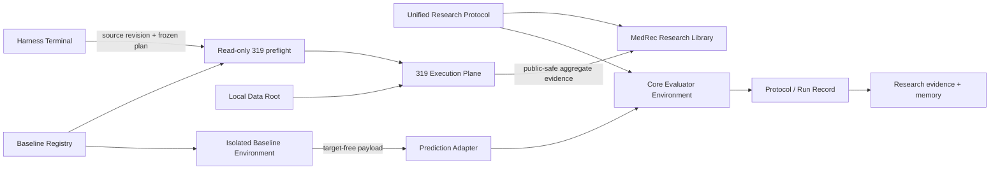

# Architecture

MedRec Research separates reusable scientific semantics, external baseline runtimes, research evidence, and restricted execution. The main architectural question is whether two result rows mean the same thing; identical metric names are insufficient without aligned cohort, split, information budget, prediction semantics, adaptation limits, and evaluation.

## System map



## Execution boundary

The local MacBook Air is the Harness Terminal. It owns core tests, synthetic protocol checks, submission, monitoring, and public-safe evidence intake.

The 319 Execution Plane owns real EHR processing, model training, GPU inference, external Baseline Environments, and restricted artifacts. Real-data work is submitted only after the remote preflight.

The Local Data Root is repository-independent. Patient data, split membership, patient-level predictions, checkpoints, and private traces remain outside Git.

## Scientific modes

### Reproduction Mode

Reproduction Mode asks whether a pinned upstream source can reproduce its recorded behavior. A Reproduction Program owns source-native data gates, mechanical invocation adaptation, training, checkpoint selection, upstream evaluation semantics, and aggregate finalization for one source lineage.

Concrete program callers use narrow `probe(request)` and `execute(request)` façades. CLI entrypoints are transport wrappers rather than a second scientific interface.

### Comparison Mode

Comparison Mode asks how methods behave under the Unified Research Protocol. The protocol owns shared cohort/split semantics, information entitlement, evaluation, and adaptation limits.

A Baseline Core is frozen in Comparison Mode. A Prediction Adapter may translate representations and target-free wire payloads but may not change model logic, loss, feature availability, thresholding, or checkpoint selection. A scientific change receives a separate method identity.

Reproduction and Comparison evidence are not interchangeable.

## Core ownership

`src/medrec_research/` owns reusable idea-agnostic research capability: public-safe schemas, deterministic evaluation, registry validation, process validation, remote orchestration primitives, and protocol-facing abstractions.

Promotion follows demonstrated reuse:

```text
idea/baseline-local code
→ repeated real use
→ stable semantics
→ clear owner
→ reusable core interface
```

Scientific hypotheses may fail while leaving reusable instrumentation, dataset abstractions, evaluation code, or execution utilities.

The core package does not depend on external baseline frameworks. Baseline-specific Conda/CUDA/runtime assumptions stay behind process boundaries.

## Baselines

`baselines/registry.toml` is the authority for baseline identity, pinned source, supported scientific modes, Reproduction Program/profile bindings, environment identity, and readiness.

Root `baselines/` contains harness-owned baseline programs and integration code, not copied upstream repositories. Imported source remains external unless provenance, license, and need justify bringing it into the Active Research Home.

Baseline processes emit target-free payloads. Core-owned targets are attached and evaluated only in the core evaluation boundary.

## Research ownership

`research/` owns early scientific work:

- `prototypes/`: bounded pre-Idea screens;
- `ideas/`: formal Ideas and frozen scientific contracts;
- `benchmarks/`: dataset/task contracts and public-safe benchmark records;
- `diagnostics/`: decision-changing bounded diagnostics;
- `memory/`: current synthesis, scientific decisions, failure memory, literature/search provenance, and archives.

Run-local evidence remains with the owning experiment. `research/memory/current-research-state.md` is the short live synthesis; `research/memory/decisions/` records append-only scientific belief changes.

`papers/` owns mature publication-facing survivor packages and claim-support experiments. It is not an archive for speculative ideas.

## Knowledge ownership

Current facts and historical causality are separate:

- `docs/`, this file, and `CONTEXT.md`: current system facts;
- `.agents/notes/`: append-only engineering decisions and trade-offs;
- research run artifacts: scientific evidence;
- `research/memory/decisions/`: scientific belief updates;
- `Handoff.md`: current task pointer.

See `docs/KNOWLEDGE_HOMES.md` for the full ownership contract.

## Repository layout

```text
.agents/notes/          Engineering decision history
baselines/              Baseline Registry and harness-owned baseline programs
docs/                   Current specs, playbooks, guides, and active plans
environments/           Verified/provisional execution environment declarations
fixtures/               Public synthetic data only
papers/                 Publication-facing survivor packages
research/               Scientific prototypes, Ideas, benchmarks, diagnostics, memory
src/medrec_research/     Reusable research library
tests/                   Tests through supported public interfaces
```

Runtime logs, checkpoints, private data snapshots, patient-level outputs, and restricted traces are local execution state, not repository architecture.
