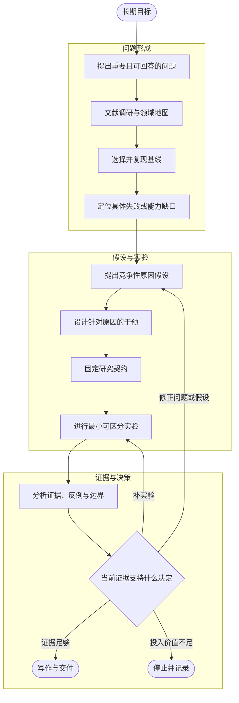

<!-- markdownlint-disable MD013 -->

# 从第一性原理到 AI 科研工作流

> 适用范围：以深度学习为主的实验型研究，也适用于多数需要文献、实现、实验和论证的科研任务。AI 可以参与检索、整理、编码、运行和初步评审，但不能替代领域判断、证据核查与作者责任。

科研的核心不是产出更多想法、实验或文字，而是持续减少重要的不确定性。一个负结果若排除了错误解释，仍然是进展；一个好看的数字若无法归因，也不能支持研究结论。（[S02]、[S18]、[S31]）

AI 没有改变这条标准。它常能加快信息处理和执行，也可能把不完整的证据组织成流畅、可信的叙述。因此，AI 科研工作流必须同时守住三件事：问题可检验，推理有因果链，结论可追溯。

本文把材料分为三层。规范层使用 `Axx` 标记，来自研究诚信、可复现性、报告和 AI 治理的权威资料，用来界定透明度、责任和披露要求；证据层是支撑某一研究主张的原始数据、代码、运行、统计分析和可定位文献，它决定结论能写到何处；经验层包含 `Sxx`、`P01`、`B01` 和原 AI 工作流中的论坛材料，提供问题拆解、训练和操作建议，必须在本地验证。`Sxx` 只链接到实际阅读的公开资料，不把经验材料升级为规范。来源能支持到哪一层，正文就写到哪一层。

## 一页结论

1. 从长期目标和真实失败出发，不从方法名、热点或模型生成的题目清单出发。
2. 把现象拆成竞争性原因假设，让每个假设给出不同、可观察的预测。
3. 文献调研用于建立问题树和技术树。调研质量会限制后续想法的质量。
4. 先复现可信基线，再判断改动是否有效。代码能运行不等于基线已复现。
5. 方法必须作用于推测的原因，并能先改变一个可测的中间量。
6. 在实验前固定假设、评价口径、成功标准、失败信号、资源上限和停止条件。
7. 每次实验只承担明确的证据职责，优先做成本最低的可区分实验。
8. 结论、图表、运行、配置、代码、数据与文献之间必须形成完整证据链。
9. AI 通常适合检索、准备、监控和汇总。研究问题、异常解释、新颖性和最终结论必须有明确责任人。
10. 上下文是一种有限资源。长日志、历史争论和原始材料应落盘，主控会话只读取当前任务需要的结构化信息。

## 研究主线

一轮研究可以压缩为下面的循环：



这不是线性流水线。任何一环出现反证都可以回退。工作流的质量不取决于环节多少，而取决于每一步是否留下可检查的输入、决定和产物。

## 1. 先定义要改变什么

任何研究行动都应回答六个问题。

| 问题 | 要写出的内容 | 不能接受的写法 |
| --- | --- | --- |
| 长期目标是什么 | 希望长期改变的能力、场景或科学认识 | “做一个热门方向” |
| 当前任务是什么 | 长期目标中最值得推进的一块具体任务 | “提升模型效果” |
| 系统卡在哪里 | 可复现的输入、预期、实际输出、出现条件和指标 | “结果不太好” |
| 为什么会卡住 | 至少两个能推出不同观察预测的解释 | “可能是数据或模型问题” |
| 准备改变什么 | 直接作用于原因的设计、实现或训练干预 | “换一个模块试试” |
| 什么结果会改变决定 | 支持、削弱或区分假设的预设标准 | “跑完再看” |

如果其中一项写不清，下一步通常不是扩大实现，而是补阅读、补观察，或缩小问题。（[S01]、[S21]、[S26]）

### 问题简报模板

```markdown
# Problem brief：<project-id>

## 长期目标
希望改变的能力、场景或科学认识：

## 当前问题
任务、对象、输入、输出与边界：

## 评价设定
- 数据与切分：
- 主指标与次要指标：
- 对照与资源口径：
- 当前可用算力和时间：

## 已知失败
- 失败案例：
- 出现条件：
- 相对基线的差异与波动：

## 当前未知
- 尚不能区分的解释：
- 最需要减少的不确定性：

## 本轮退出条件
- 继续：
- 修改：
- 停止：
```

### 重要问题来自明确缺口

值得投入的问题通常同时满足四个条件：

- 它影响真实任务、核心能力或领域认识，而非只让局部指标更漂亮。
- 已有方法在明确条件下失效、代价过高或缺少解释；失败能由案例、分层统计或文献证据描述。
- 研究者能获得足以判断的证据，而非只有一个难以解释的总分。
- 当前切口与资源相配。长期问题可以很大，本轮问题必须可完成。

“热门”不能替代问题价值。“以前没人把两个组件拼在一起”也不足以证明研究价值。先问缺口是否真实，再问新方法是否必要。（[S01]、[S08]、[S24]、[S30]）

## 2. 用调研建立问题树和技术树

文献调研不是写论文前补背景，而是为选题、基线、假设和实验建立领域上下文。与其积累摘要，不如维护两张持续更新的图。

| 地图 | 应记录什么 | 它回答什么 |
| --- | --- | --- |
| 问题树 | 长期目标、子任务、评价目标、真实约束、典型失败、已解决和未解决的问题 | 这个题为何值得做，缺口究竟在哪 |
| 技术树 | 主要路线、核心假设、作用机制、代表工作、改进关系、代价和失败条件 | 现有方法为何有效，又为何失效 |

每读一篇关键论文，都要把它放回两棵树，而不是只记模型结构。阅读至少应提取：研究问题、困难解释、方法干预、依赖条件、证据、限制、相邻路线和遗留问题。（[S11]、[S30]）

### 把检索和阅读分开

检索负责扩大候选集，阅读负责核查证据。把两者塞进同一个长会话，会让搜索摘要、未经核实的判断和后续推理互相污染。

调研至少要回答：

- 当前问题属于什么任务、设定和评价协议？
- 主流基线与相邻路线分别解决了什么，留下什么缺口？
- 哪些工作有可用代码、数据、权重和训练细节？
- 候选改动是否已被做过，或只是已有方法的换名组合？
- 支持这些判断的证据位于论文哪一节、哪张表或哪幅图？

初筛时读取标题、摘要和引言；比较机制时读取方法；核对结论时读取实验、附录和代码。不要默认把整批 PDF 与长日志塞进一个会话。

### 文献卡模板

```markdown
## 文献卡：<paper-id>

- 题目、作者与年份：
- URL、固定版本与收集日期：
- 访问状态：已阅读 / 部分可读 / 受阻 / 背景
- 代码、数据与许可证：
- 研究任务与评价设定：
- 作者对困难的解释：
- 核心方法及其假设：
- 关键实验结论：
- 失败条件与资源代价：
- 与当前问题的关系：支持 / 竞争 / 基线 / 排除
- 实际读取范围：摘要 / 引言 / 方法 / 实验 / 附录 / 代码
- 可核查证据：章节、表格、图编号或原文摘录
- 不得据此推断的内容：
- 未确认事项：
```

顶会收录和开源代码可以帮助筛选，不能替代对设定、证据和适用性的核查。

### 来源台账记录“看到了什么”

引用只有 URL 不够。网页会漂移，仓库会更新，PDF 或图片也可能只能提取部分内容。来源台账应同时记录收集日期、固定版本、访问状态、实际读取范围、正文使用了什么，以及哪些内容没有读到。

| 状态 | 可以怎样使用 | 不能怎样使用 |
| --- | --- | --- |
| 已阅读 | 支持实际读到且可定位的内容 | 外推到未读章节或更深层链接 |
| 部分可读 | 说明目录、摘要或迁移关系 | 根据标题、元数据猜测正文结论 |
| 受阻 | 记录访问失败和尝试方式 | 把模型摘要或搜索片段当作原文证据 |
| 背景 | 说明课程、个人或领域关系 | 支撑具体的方法结论 |

仓库来源应固定提交；发生漂移的网页应记录旧用途与当前状态；OCR 只能支持可靠识别的可见内容。上游许可不清楚时，保留归属并做原创综合，不镜像全文。还要给检索设置边界：只追踪理解当前问题所需的直接资料，避免无限递归外链。完整实例见[来源台账](first-principles-research-practice-sources.md)。

## 3. 选择并复现基线

基线是实验锚点。没有可信基线，改动后的数字缺少可解释的参照。

选择基线前确认：

- 任务、数据、预处理、训练预算和指标与当前问题兼容。
- 代码、依赖、权重和数据访问条件可获得。
- 原论文的数字、随机种子与评测流程足以形成比较目标。
- 基线有清晰的改动边界，不会迫使你同时改变多个变量。

“代码跑起来”不是复现完成。复现报告至少包含环境版本、数据版本与校验、实际命令、随机种子、硬件、训练时间、学习曲线、重跑次数、原报告数字，以及差异与解释。

运行前还要约定可接受的误差范围。若基线未达标，先定位环境、数据、代码、训练或原论文复现性问题；不要直接叠加新方法。

### 先说明你要复现什么

本文采用 NASEM 的术语：计算可复现性（`reproducibility`）指用相同输入数据、计算步骤、方法、代码和分析条件得到一致的计算结果；新数据重复检验（`replicability`）指围绕同一科学问题，用新数据得到一致的结果。泛化则是另一项主张：结果在新的目标人群、场景或条件下是否仍成立。（[A07]）

大多数“把一个基线重新跑起来”的工作属于计算可复现性，不应写成独立的新数据重复检验。若数字不一致，先诊断数据、环境、代码、训练、测量和随机性；计算结果未复现或新数据上的趋势未重现，都不能单凭一次不一致推定原研究错误或存在不端。（[A07]）

## 4. 从失败信号提出想法

高质量想法通常不来自脱离实验的发散，而来自具体失败、分层差异、消融结果和与已有解释冲突的稳定现象。

### 先把失败写成事实

不要写“方法无效”。写清：

- 输入属于什么条件，是否按难度、长度、分布、子群或任务阶段分层。
- 预期行为与实际行为分别是什么，差异和波动多大。
- 最早偏离预期的是数据、表示、检索、训练、推理、后处理还是评价。
- 失败是个例、稳定模式还是随机波动；它相对基线和简单替代方案如何。
- 已有修复为何不够：无效、只在部分条件有效、代价过高，还是违反目标约束。

失败案例的作用是约束解释。条件越具体，越容易判断应保持什么、改变什么、测量什么。（[S01]、[S18]、[S29]）

### 区分四类负结果

| 类型 | 含义 | 能否形成科研结论 |
| --- | --- | --- |
| 运行无效 | 代码、环境、数据或评测不可信 | 不能，先修复运行 |
| 假设不支持 | 实现和评价可信，但改动未产生预期效果 | 可以，记录适用条件与反证 |
| 条件性信号 | 效果只在特定样本、预算、噪声或规模下出现 | 可以，先定位边界 |
| 新机制线索 | 稳定结果与现有解释冲突 | 可以，形成新的候选假设 |

负结果不是自动有价值。只有当运行可信、条件明确，并减少了某个不确定性时，它才成为证据。

### 用竞争性假设代替模糊猜测

面对同一失败，至少写出两个可区分的解释。

| 假设 | 若为真，应先观察到什么 | 最小验证 |
| --- | --- | --- |
| 表示信息不足 | 关键特征无法从中间表示恢复；补充信息先改善相关子任务 | 固定其余条件，只替换或补充该信息 |
| 训练信号有偏 | 训练样本或损失对失败子群覆盖不足；重加权先改变该类误差 | 固定模型与评测，改变采样或损失权重 |
| 优化未到达预期解 | 小数据或简化版本也无法拟合，或种子波动很大 | 玩具任务、学习曲线与重复运行 |
| 评价或实现有误 | 同一输出在独立实现或人工检查中不一致 | 核对输入、标签、单位、掩码、聚合与脚本 |

实验的任务不是替一个想法找支持，而是让不同解释给出不同结果。（[S02]、[S18]、[S27]）

### 方法必须作用于原因

提出方法前，先完成下面这句话：

> 现有方法在 ______ 条件下错误处理或缺少 ______，因此我改变 ______；这应先使 ______ 发生变化，随后在 ______ 上体现。若第一个变化没有出现，我会优先怀疑 ______。

这句话连接失败 `F`、原因 `R`、干预 `I`、中间变化 `Z` 和目标结果 `Y`：

```text
失败 F -> 原因 R -> 干预 I -> 中间变化 Z -> 目标结果 Y
```

每一项都必须落到观察。若干预与原因没有直接关系，实验很可能只是盲试；若中间变化不可测，最终提升也很难归因。（[S21]、[S27]、[S29]）

### 新颖性放回两棵树判断

新颖性可能来自新的重要失败条件、更有解释力的原因、能被归因的机制改变、新的可复现权衡，或由此产生的新问题。它很少等同于组件组合形式。

候选想法入选后，应做一次定向检索，明确最相近工作、共同假设、真正差异和预期反例。新颖性是需要证据支持的判断，不是模型或作者的一句声明。（[S11]、[S19]、[S30]）

### AI 如何参与想法生成与评审

AI 可以基于文献卡、可信基线和失败信号生成多个候选。每个候选只需回答三件事：改什么、为什么可能有效、如何证伪。

候选评审应使用隔离上下文。评审者只读取当前候选、基线和必要文献，按新颖性、可行性、基线兼容性、实现成本、预期收益和失败模式给出 `go`、`revise` 或 `kill`。多方可以提出意见，但必须由一个责任人结束讨论并作决定。多个模型同意不构成证据。

## 5. 在结果出来前固定研究契约

研究契约用于阻止事后修改标准。写代码前固定假设、设定、判据和资源边界；实验开始后不覆盖原版本。需要修改时新增版本，记录修改原因、修改前已知结果和影响范围。

```markdown
## 研究契约 v1：<idea-id>

### 假设
在 <任务 / 数据 / 预算 / 指标> 下，<方法改动> 将通过 <预期机制> 改善 <主指标>。

### 固定设定
- 基线与代码提交：
- 数据版本、切分与预处理：
- 训练预算、硬件与随机种子：
- 主指标与次要指标：

### 成功信号
- 主成功标准：
- 稳定性与重跑标准：
- 必要消融及各自预期：

### 独立失败信号
- 哪些现象即使主指标偶有提升，也判定为失败：
- 何时停止继续投入：

### 资源与边界
- 最大运行次数、算力预算和截止点：
- 不允许自行改变的超参数、切分或评价规则：

### 变更记录
- v2：改动、原因、改动前已知结果、影响范围：
```

失败不能只定义为“没有成功”。主指标微涨但方差过大、只在数据泄漏条件下有效、破坏核心效率指标，都是独立失败信号。

### 研究契约不是自动的预注册

研究契约是项目内部的版本化控制。只有在看到相关结果前形成可核验、带时间戳且不被覆盖的记录，才可称为预注册。注册报告（`Registered Report`）更进一步：期刊在结果未知前评审问题和方法，并可能给出原则性接收；它不是内部契约或预注册的同义词。

这些机制让决策时点和事后变更可见，不能替代合理的研究设计、可靠的执行或独立核查。无论采用哪种机制，都应保留原计划、偏离原因和偏离后已知的结果。（[A03]）

### 把探索与确认明确分开

研究契约不会消灭探索，它的作用是让读者知道哪些结果承受确认性主张，哪些结果仍在生成假设。两类工作都重要，但不能混写。

| 工作类型 | 可以做什么 | 应如何报告 |
| --- | --- | --- |
| 探索 | 查看模式、修改假设、尝试多个分析或模型 | 保留决策轨迹；把结果写为线索或候选解释 |
| 确认 | 检验预先写明的假设、指标和分析路径 | 报告全部预设分析、偏离及其理由；主张不超过预设范围 |

若同一测试集被反复查看并用于挑选架构、特征或超参数，它就不再提供独立确认。此时应把最终比较视为相对该测试集的探索性结果，并使用封存数据、外部数据或新的独立运行作确认。需要改动契约时，结果未知前的改动可以形成 `v2`；已经看过相关结果后的新分析应标为探索性，并保留 `v1`、时间和理由。（[A03]）

## 6. 设计能回答问题的实验

实验不是为方法寻找好看的数字，而是用有限资源区分解释。每次运行开始前，先写下它承担的证据职责：实现检查、机制检查、基线比较、消融归因、鲁棒性验证，还是失败边界定位。

### 优先做最小可区分实验

最小可区分实验规模小、成本低，但能让关键假设给出不同结果。例如，若争论在于“新模块补足了缺失信息”还是“只是参数更多”，就应控制参数量和输入信息，并测量该模块是否先改善相关中间任务。只比较最终总分回答不了这个问题。

最小不等于随意。实验必须保留与问题有关的条件、明确对照和可解释指标；结论也只能覆盖已测试的条件。（[S27]、[S28]、[S29]）

### 由近到远建立证据

1. 检查实现与数据：确认最小输入、损失、输出和评测按预期工作。
2. 检查机制：测量方法声称改变的中间量，或在受控条件下观察预期方向。
3. 小规模验证：用快速设置排除明显错误，识别敏感变量。
4. 公平比较：统一数据、资源、调参范围和评价规则。
5. 消融与反例：移除或替换关键部分，寻找预期失效条件。
6. 现实条件验证：在完整设置中检查结果是否保持，并报告代价和限制。

不同证据回答不同问题。

| 证据 | 需要回答的问题 | 常见误用 |
| --- | --- | --- |
| 基线比较 | 在统一约束下，整体方案是否有实际收益 | 只选弱基线或只报告有利设置 |
| 消融 | 哪个部件、信息或目标造成差异 | 一次移除多个部件，却归因给一个 |
| 敏感性分析 | 结论依赖哪些超参数、预算或数据条件 | 只展示最佳点，隐去不稳定性 |
| 分层误差分析 | 方法在哪些条件下有效或失败 | 只给平均值，掩盖子群退化 |
| 机制代理量 | 声称的过程是否发生 | 把相关性当成充分因果证据 |
| 反例与边界 | 主张的适用范围在哪里 | 删除失败案例 |

每张图表都应服务于一个明确主张。若它既不能比较方案、检验机制，也不能划出边界，就还没有回答研究问题。（[S14]、[S31]）

## 7. 让实现与运行可审计

长时间实验常在科研推理之外失败：依赖安装中断、数据下载不完整、SSH 断开、进程退出却未被发现、GPU 利用率异常或损失变成 `NaN`。这些故障不能被解释为方法结论。

每个后台运行至少要有：

- 可重放的环境安装和数据准备脚本；下载前先检查已有路径与完整性。
- 不依赖交互式连接存活的进程管理，如 `tmux` 或集群调度器。
- 心跳、退出码、标准输出、错误输出、资源利用率、损失和关键指标监控。
- 超时、`NaN`、长期无进度、数据校验失败和低效运行的告警或停止条件。
- 与运行绑定的代码提交、配置、数据版本、随机种子和输出目录。

环境准备、下载和长时间作业可交给独立执行器。主控只接收结构化状态和最终摘要，不接收几万行安装日志。

### 用轻量 QA/QC 先判断运行能不能用

质量保证（QA）在运行前预防错误；质量控制（QC）在运行中和运行后发现错误。可借用 EPA 质量计划的结构，但不必把每个小实验写成合规文件：先定义结果应满足的性能与验收条件，再记录执行、检查、纠偏和可用性决定。（[A01]、[B01]）

| 阶段 | 最小动作 | 失败后的处理 |
| --- | --- | --- |
| QA：运行前 | 固定数据版本、切分、指标实现、代码提交、资源预算、验收阈值和负责人 | 缺少任一关键项，不提交正式运行 |
| QC：运行中 | 检查数据哈希与模式、泄漏、已知小样本、退出码、资源异常、`NaN` 与日志心跳 | 停止或隔离运行，保留故障证据 |
| 复核：运行后 | 复算关键指标，核对对照、配置和输出目录；记录独立单位与不确定性来源 | 标为“可用”“带限制可用”或“运行无效” |

QC 失败不是负结果。它说明当前运行不能支撑科学解释；只有通过可用性复核的结果，才进入假设、机制和比较分析。

### 实验记录的单位是一次决定

记录不应只有运行命令和结果数字。它要让未来的你重建当时的问题、证据和选择。（[S03]、[S04]、[S05]）

```markdown
## 运行记录：<run-id>

- 日期与状态：
- 本轮问题：
- 目的：这次要减少哪个不确定性？
- 假设与预测：若假设成立，应该先观察到什么？

### 设置
- 代码提交、配置、随机种子、数据版本：
- 相比上一轮唯一有意改变的因素：
- 保持不变的条件与资源预算：

### 结果
- 主指标、分层指标、中间观察和异常：
- 预期与实际的差异：

### 分析
- 支持、削弱或无法区分哪些假设？
- 有哪些替代解释，已经怎样排除？
- 可信度、可复现性和适用范围：

### 决定
- 下一步做什么，为什么？
- 哪些路线停止、保留或需要补读？
```

“准确率从 0.71 变成 0.73”不是完整分析。还要写比较对象、条件是否一致、波动、分层变化、中间机制是否出现，以及为何选择下一步。

### 把运行记录升级为可引用工件

Git 提交可以定位一次运行所用的代码，但它本身不一定是稳定、可引用的研究工件。阶段性交付时，应把关键代码、数据或模型、环境说明和结果归档到适当平台，并记录精确版本、许可证、元数据、访问条件、来源关系和持久标识符。这样读者才能区分“这次运行用了什么”与“将来应引用或复用什么”。（[A04]、[A10]）

FAIR 不等于无条件公开。敏感数据、受许可限制的软件或模型可以采用受控访问、合成夹具或其他可核验替代方案；关键是让对象可发现，清楚说明访问与复用条件，而不是只留下一个会漂移的目录链接。（[A04]、[A10]）

## 8. 实验失败时如何诊断

“实验没有达到预期”可能混合三件事：目标指标未达标，预期机制未出现，或实现与测量不可信。先分开它们，再解释原因。

### 常见失败层次

| 层次 | 典型信号 | 优先检查 |
| --- | --- | --- |
| 问题定义 | 目标、标签、约束或评价与真实任务不一致 | 任务说明、成功标准、评价口径和边界条件 |
| 数据与输入 | 分布不一致、关键字段缺失、预处理破坏信息 | 数据统计、样本追踪、切分、单位、掩码、泄漏和标签质量 |
| 实现与管线 | 形状、索引、设备、随机性、缓存或评测链路错误 | 各阶段输入输出、不变量、小例子和交叉实现 |
| 优化与训练 | 小问题也拟合不了、曲线异常、种子差异大 | 小集过拟合、学习曲线、梯度、初始化、学习率和停止条件 |
| 方法假设 | 方法依赖的条件不成立，或干预没有作用于主因 | 文献假设、失败分层、机制代理量和反例 |
| 比较与统计 | 对照不公平、预算不一致、波动掩盖差异 | 资源口径、重复运行、方差、置信区间和全部预设比较 |

管线正确不证明机制正确；总分下降也不能直接证明假设错误。多层问题会产生相同的表面现象。

无论是计算结果不一致，还是新数据上的重复检验没有得到相同趋势，都先需要定位不一致来自哪里。结果差异本身不足以判定研究者有误或有不端。（[A07]）

### 诊断顺序

1. 复述预期：在哪些条件下应出现什么现象，依据是什么？
2. 固定事实：保存配置、代码、输入、随机性、日志和原始指标，确认能否复现。
3. 定位阶段：从数据到最终指标逐段检查，找出最早偏离的位置。
4. 检查不变量：范围、维度、计数、样本对应、损失分解、评测聚合和资源预算。
5. 缩小系统：使用玩具样本、小数据集、单个批次或最小模型。
6. 一次改变一个关键因素，并在修改前写下它检验的假设与预测。
7. 比较竞争性解释，优先运行能让它们产生不同结果的实验。
8. 标记结论强度：已证实、暂时支持、被排除、尚无结论。
9. 作出决定：继续、修复、改假设、缩小问题或停止路线，并记录理由。

慢下来理解假设、一次只改一件事、用玩具模型定位问题，看似拖慢单次运行，却会减少无效的大规模实验。（[S02]、[S18]、[S27]）

## 9. 按证据链分析和写作

分析时先比较结果与研究契约，再解释机制。结果出来后才修改标准，很容易把事后故事误当成发现。

| 结果状态 | 首先检查 | 后续动作 |
| --- | --- | --- |
| 达到主标准且稳定 | 重跑、种子、数据切分与基线一致性 | 扩展消融与泛化实验 |
| 有局部改善 | 条件、代价和统计稳定性 | 用最小补充实验定位机制 |
| 未达到预期 | 实现正确性、对照公平性和失败信号 | 记录负结果；修复、改假设或停止 |
| 出现异常 | 日志、资源、数据和指标实现 | 恢复运行可信度，不作科学解释 |

一条主张应形成完整链条：

```text
论文主张
  -> 图表或表格
  -> 运行 ID 与原始结果
  -> 配置、随机种子、数据版本和代码提交
  -> 研究契约中的假设与判据
  -> 相关文献中的可核查证据
```

可以维护一张主张证据表：

| 主张 | 直接证据 | 反例或限制 | 当前状态 |
| --- | --- | --- | --- |
| 问题重要 | 领域事实、任务约束、已有失败案例 | 适用场景边界 | 待核对 / 已支持 |
| 原因解释 | 机制观察、受控分析、文献依据 | 竞争性解释是否排除 | 待核对 / 已支持 |
| 方法贡献 | 公平比较、消融、机制代理量 | 失败条件与资源代价 | 待核对 / 已支持 |
| 泛化或稳健性 | 分层、重复和不同条件 | 未覆盖的分布与限制 | 待核对 / 已支持 |

### 为机器学习主张准备一份证据包

深度学习论文常把“可复现”缩成开源仓库。更稳妥的交付是让读者能够复跑、判断差异来自哪里，并知道哪些资产不能公开。NeurIPS 的清单要求把主张范围、设置、误差、算力、资产和复现路径说清；FAIR 原则进一步把数据、工具与工作流都视为需要发现、访问、互操作和复用的研究对象。（[A02]、[A04]）

| 项目 | 至少记录什么 |
| --- | --- |
| 主张与边界 | 已验证条件、关键假设、未测试分布和已知限制 |
| 实验设定 | 数据切分与预处理、超参数及其选择方式、随机种子和基线版本 |
| 不确定性 | 独立单位是什么、重复次数、误差条或区间表示什么、计算方法和前提 |
| 算力 | 单次运行的硬件、时长和内存；总预算，以及未纳入正文的主要预实验或失败运行 |
| 复现路径 | 代码提交、环境、数据访问方式、精确命令与预期输出 |
| 资产治理 | 数据、代码、模型和工具的来源、版本、许可证、访问限制与必要同意 |

不能公开代码、数据或权重时，也要写出原因和可行的验证路径，例如受控访问、可运行的合成夹具、模型服务或足以复现算法的规格说明。

### 统计解释不能只看阈值

每个主要比较至少应报告效应的方向和大小、独立单位、重复次数、误差条或区间的含义与计算方式、预设分析及其偏离、全部预设主要结果，以及失败边界。若使用 `p` 值，要说明它不表示假设为真的概率，也不表示效果大小或科学重要性；单次跨越某个阈值不能独自承担结论。（[A08]）

### 按研究设计选择报告规范

写作前先按研究设计、数据类型和应用场景查找当前适用的报告规范。报告清单能提高信息完整性，不能自动证明研究设计、执行或结论质量。涉及健康或医疗 AI 时，更要根据研究设计、数据来源和临床用途核对当前适用的专门规范，而不是把一个通用清单套到所有研究上。（[A09]）

### 阅读、讨论和写作贯穿全程

阅读要读出问题、机制和位置。第一遍确认术语、数据、设定和结果；第二遍检查困难解释、方法作用与证据；第三遍把论文放回问题树和技术树。（[S11]）

讨论要围绕待决问题。会前写清当前问题、已有事实、尚不能决定的地方、候选选项与希望对方挑战的假设；会后记录结论、分歧、下一步和负责人。导师或同行的作用是攻击问题表述、因果链和证据缺口，不是替研究者交出答案。（[S01]、[S12]）

写作应尽早开始。先写问题、核心判断和因果理由，再规划每张图要证明什么。这样能在昂贵实验前暴露缺基线、缺归因、缺反例和主张过大的问题。段落只承担一个任务，无法由实验、分析或引用直接支持的句子，应降级为假设、讨论或未来工作。（[S13]、[S14]）

报告与 rebuttal 也遵循同一原则：先说清问题，再给与主张匹配的证据。回应评审时逐条拆解关切，回答、举证、修改或承认限制；不要用一段泛泛辩护覆盖多个问题。（[S15]、[S17]）

## 10. AI 分工与上下文边界

若采用多模型协作，先按能力和责任分工，不按品牌分工。每个角色尽量只读取当前任务所需的版本化输入，并用固定产物交接。

| 角色 | 输入 | 输出 | 不应承担的职责 |
| --- | --- | --- | --- |
| 主控或决策者 | 结构化状态、评审与决策记录 | 下一步任务、最终 `go/revise/kill` | 长日志调试、无边界检索 |
| 检索者 | 问题简报、检索标准 | 文献卡、候选清单、证据位置 | 宣布新颖性已经证明 |
| 复现执行者 | 基线卡、运行清单 | 环境状态、结果和故障摘要 | 根据失败自行改变研究问题 |
| 想法生成者 | 已筛文献、可信基线、观察信号 | 可证伪的候选想法 | 脱离证据无限发散 |
| 独立评审者 | 单个想法、基线、必要文献 | 有理由的评分与决策建议 | 无期限优化或最终拍板 |
| 分析者 | 契约、可信结果 | 与预设判据逐项比对 | 倒推修改标准 |
| 写作者 | 已核查证据链 | 可追溯草稿 | 补造实验、数字或引用 |

### 记录实质性 AI 使用，并守住信息边界

研究者对 AI 辅助产生的科学内容仍负最终责任。生成的引用、摘要、代码、分析解释和数字都必须回到原始来源、可执行代码或实际运行核查；欧洲委员会把 AI 系统视为不能承担作者责任的工具，而非作者，ALLEA 也要求按学科规范报告外部服务、AI 和自动化工具的使用，以便验证或复核。（[A05]、[A06]）

当 AI 实质影响文献综述、研究缺口、假设、方法、数据分析或结果解释时，至少记录：工具和版本、使用日期、任务、输入的敏感等级、人工复核人、输出如何影响决定，以及引用或结果的核查状态。纯粹的拼写、格式或语言润色通常不属于同一等级，但目标期刊、机构或资助方的披露规则优先。（[A05]、[A02]）

不要把未公开工作、受保护数据、第三方个人信息或受合同限制的材料上传到外部 AI 系统，除非已核实系统的处理、保存和再利用条件，并满足机构规则、法律依据、同意和保密要求。对敏感项目，只记录可公开的任务摘要和审查结论，不记录原始提示词或原始数据。（[A05]）

对未公开材料的同行评审、项目评估或其他会影响他人且承担保密义务的活动，不应实质性委托给生成式 AI；若规则允许有限使用，也要先确认保密、利益冲突和披露要求。（[A05]）

### 自动化边界

下表分配核查责任，不是模型能力排名，也不是经过对照实验验证的通用结论。

| 事项 | 适合自动化的程度 | 必须保留的控制 |
| --- | --- | --- |
| 搜索、去重、格式转换、初筛 | 高 | 抽样核对来源、版本和相关性 |
| 环境准备、数据检查、作业提交、指标汇总 | 高 | 校验脚本、退出码、路径、资源和异常状态 |
| 基线复现 | 中 | 人工确认评价协议、合理误差和复现结论 |
| 想法发散与初评 | 中 | 独立查重、可证伪性与最终决策 |
| 结果解释与论文论证 | 低到中 | 契约对照、原始数据和领域判断 |
| 结论真实性、新颖性与作者责任 | 不可外包 | 研究者签核 |

交接文件可以是小型 Markdown、JSON 或表格。每份文件记录版本、创建时间、输入来源、结论强度和未决问题。原始日志与历史讨论应保留，但不默认进入主控上下文。

## 11. 从零开始的最小实践

先用一个小问题跑通完整链路，再增加复杂的 agent 编排。

1. 写一页 `problem-brief.md`，固定任务、指标、边界和资源上限。
2. 先收集一小组最相关论文，可从 5 至 10 篇开始；建立文献卡、问题树和技术树。
3. 选一个设定匹配且可获得代码的基线，写基线卡。
4. 用脚本和版本化配置复现基线；结果不可信就停下排查。
5. 收集并分层失败案例，定位最早出现偏离的阶段。
6. 为同一失败写出至少两个竞争性假设及其不同预测。
7. 从原因推出少量候选干预，让隔离上下文逐个评审。
8. 对入选方向做定向新颖性核查，并由责任人作最终决定。
9. 在实现前写研究契约，特别固定失败信号和停止条件。
10. 先做玩具或小规模的可区分实验，再扩展到公平基线比较。
11. 每次运行保存 ID、配置、提交、数据、种子、曲线、异常和决定。
12. 分析先对照契约，再检查机制、反例和边界。
13. 主张能回溯到真实运行、代码和文献后，才组织论文叙述。
14. 每轮根据证据继续、修改、缩小或停止，并更新两棵树。

复杂度应服务于可追溯性。若更多角色、工具和协议没有减少错误或沟通成本，就不该增加。

## 12. 把研究能力变成稳定节奏

一个研究项目同时训练三类能力：提出并界定问题、通过实验减少不确定性、把判断讲清楚。Pengsida 的训练框架把它们概括为 idea、实验和写作/展示；这里把它们落到可检查产物，而不把个人经验当作普遍规律。（[P01]）

| 能力 | 日常训练 | 可检查产物 |
| --- | --- | --- |
| 问题与 idea | 更新问题树、失败案例和竞争性假设 | `problem-brief.md`、文献卡、研究契约 |
| 实验 | 实现、诊断、复现和记录每次决定 | 运行记录、QA/QC 结论、分析报告 |
| 表达 | 讨论、写作、报告和回应反证 | 主张证据表、图表计划、报告或 rebuttal 草稿 |

- 每次工作前：写本轮问题、假设、预测和停止条件。
- 每次实验后：记录观察、替代解释、证据强度和下一步决定。
- 每周：更新失败案例、问题树与技术树，删除已被证据否定的假设。
- 每两周或每月：回看长期目标，检查当前任务是否仍是最重要的缺口；把阶段成果改写成一段可检查的论证。
- 每个阶段结束：整理哪些判断可靠、哪些仍是假设、哪些路线应停止，以及下一阶段最值得投入的问题。

持续性不是机械延长工时，而是持续对问题和证据负责。独立研究能力体现在没有标准答案时，仍能提出高分辨率问题，并设计一个可检验的下一步。（[S08]、[S19]、[S20]、[S24]）

## 仍待本地验证的问题

以下问题没有通用答案，不能用论坛经验或模型自评代替实验：

- 如何衡量文献调研是否足以支持当前选题？
- 模型的有效上下文何时被噪声稀释，阈值如何测量？
- 不同学科、任务和资料形态分别适合哪些检索工具或模型？
- 多模型评审何时能发现独立错误，何时只会放大共同偏见？
- 如何在证据约束与探索自由之间取得适合当前项目的平衡？

可以准备一组已知相关文献、可复现基线和已知失败案例，对检索、复现、评审与交接流程做盲测，再决定工具和角色分工。

## 开始新一轮研究前的检查表

- [ ] 长期目标、当前任务和成功条件都能用一句话写清。
- [ ] 有可复查的失败案例，而非抽象的“效果不好”。
- [ ] 已读最相近路线，知道其假设、机制和失败条件。
- [ ] 已写出至少两个竞争性解释及其不同预测。
- [ ] 基线已经复现，差异在预设范围内或得到解释。
- [ ] 已说明本轮要求的是计算可复现性、新数据重复检验还是泛化，三者没有混称。
- [ ] 方法直接作用于原因，并有可测的中间变化。
- [ ] 实验只承担明确的证据职责，比较条件公平。
- [ ] 成功、失败、消融、资源和停止标准已在结果前固定。
- [ ] 内部研究契约、预注册和注册报告没有混称；事后分析已标为探索性。
- [ ] 每个运行都绑定代码、配置、数据、种子和原始结果。
- [ ] 已区分探索性与确认性结果；若测试集参与反复选择，另有独立确认路径。
- [ ] 运行先经过 QA/QC；无效运行未被写成方法失败或负结论。
- [ ] 误差、区间或显著性信息说明了独立单位、重复次数、计算方法和捕获的波动来源。
- [ ] 已按研究设计核对当前适用的报告规范；清单没有被当作质量证明。
- [ ] 算力、资产版本、许可证、访问限制和数据治理要求已记录。
- [ ] 需要发表、共享或引用的代码、数据或模型已有带版本、许可证、元数据、访问条件和持久标识符的归档路径。
- [ ] 正面、负面和异常结果都被保留。
- [ ] 每个主张都有直接证据、反例检查和适用边界。
- [ ] AI 产出的引用、数字、结论和代码都经过独立核查。
- [ ] 实质性 AI 使用、人工责任人和敏感信息边界都有记录。
- [ ] 交接文件足以让下一位执行者继续工作，无需读取完整聊天记录。

若多项答案是否定的，先不要扩大实现或运行规模。回到问题、失败案例、假设或测量。研究速度取决于错误解释被多快排除，不取决于提交了多少作业。

## 来源与使用边界

本文合并并重写了《基于第一性原理的科研实践》和《AI 科研工作流结构化整理》。前者提供选题、因果假设、失败诊断、实验设计和长期训练方法；后者提供基线复现、研究契约、AI 分工、运行监控和上下文管理方法。

第一性原理部分的引用依据 2026-07-13 收集的[来源台账](first-principles-research-practice-sources.md)。本文只引用台账中标为“已阅读”的材料，并把标签直接链接到公开来源。台账中“部分可读”“受阻”和“背景”条目不支持正文的方法结论。

《AI 科研工作流结构化整理》可识别的上游材料包括《AI科研不完全指北：Top10 PhD烧了上万刀的真实经验。Context Is All You Need》《AI 科研不完全指北第二期：如何 Propose 一个 idea》和《看到挺多人对自动化ai科研感兴趣，我来分享一点自己的经验》。原稿没有提供可在本文中延续的完整 URL 与版本信息。

两份原稿都整理自公开研究经验，其中部分判断来自个人实践，而非可推广的对照实验。本文不比较具体模型或工具的优劣，也不声称多模型协作必然提高质量。上游 `learning_research` 仓库要求保留归属，但其根目录许可证未在台账收集时得到确认；本文只做原创综合，不复制原始正文。采用自动化方案前，仍应在自己的学科、数据、资源与风险边界内验证。

本轮补充的 `Axx` 来源包括政府、学术共同体或经过同行评议的标准性资料；它们支持具体的质量、透明度和责任要求，不把任何单一学科的合规规则外推为所有研究的唯一做法。`P01` 与 `B01` 是用户指定的经验性参考，用于训练结构和实践提示。`Sxx`、`P01`、`B01` 和论坛经验帖的价值在于提出可检验的工作方法；它们不能单独替代数据、运行或权威规范。

[S01]: https://pengsida.notion.site/idea-da6ce171c13846b7a7ffaa7473ffa6ea "如何培养想 idea 的能力"
[S02]: https://pengsida.notion.site/work-1aee6e718de6472f834d13da8f4ff097 "如何找到实验不 work 的原因"
[S03]: https://pengsida.notion.site/caf34717f4c046c69ee7e14ea953c46f "怎么做实验记录"
[S04]: https://pengsida.notion.site/a7b846d0082b458e8eb366f506f10182?pvs=25 "实验记录模板"
[S05]: https://pengsida.notion.site/3-24-492bf030bc8a48fcbe9dfd1a246678b1?pvs=25 "3.24 实验记录"
[S08]: https://pengsida.notion.site/p/1713fe292ff1808eb33be93ea2d79ad9?pvs=25 "博士生的楷模：Sebastian Starke"
[S11]: https://pengsida.notion.site/d192db870bc64436ae4a4a590b36772a "如何有效地读论文"
[S12]: https://pengsida.notion.site/d697ef578d784c869d4f8314f0d617da "如何高效地讨论"
[S13]: https://pengsida.notion.site/c13c7e52aab64c1a8e3576b97fcb9851 "怎么练习写论文"
[S14]: https://pengsida.notion.site/c1a22465a0fa4b15a12985223916048e "论文写作模板"
[S15]: https://pengsida.notion.site/slides-810f02670691444f8c94cc3d5b76dcbc "如何做学术报告 slides"
[S17]: https://pengsida.notion.site/rebuttal-af99ce47103e4917b6a5bd1fd4b3c022 "怎么 rebuttal"
[S18]: http://people.csail.mit.edu/billf/www/papers/doresearch.pdf "Bill Freeman：如何做研究"
[S19]: https://pengsida.net/files/John_Schulman_How_to_do_research.pdf "John Schulman：一份有立场的机器学习研究指南"
[S20]: https://pengsida.net/files/Michael_Nielsen_How_to_do_research.pdf "Michael Nielsen：高效研究的原则"
[S21]: https://pengsida.net/files/Zhihua_Zhou_How_to_do_research.pdf "周志华：科研经验"
[S24]: https://github.com/user-attachments/files/18051592/YouAndYourResearch.pdf "Richard Hamming：你和你的研究"
[S26]: https://pengsida.net/games003/GAMES003_files/week_1.pdf "GAMES003 第 1 周"
[S27]: https://pengsida.net/games003/GAMES003_files/week_3.pdf "GAMES003 第 3 周"
[S28]: https://pengsida.net/games003/GAMES003_files/week_5.pdf "GAMES003 第 5 周"
[S29]: https://pengsida.net/files/learning_research_v4.pdf "学习研究幻灯片"
[S30]: https://pengsida.net/files/research_topic_selection.pdf "研究选题幻灯片"
[S31]: https://pengsida.net/files/CCF_Talk.pdf "CCF 亿博是怎么炼成的"
[A01]: https://www.epa.gov/system/files/documents/2025-10/qapp-guidance_dtd_10012025_1.pdf "US EPA: Quality Assurance Project Plan Guidance (2025)"
[A02]: https://neurips.cc/public/guides/PaperChecklist "NeurIPS Paper Checklist Guidelines (2026)"
[A03]: https://www.cos.io/initiatives/prereg "Center for Open Science: Preregistration"
[A04]: https://doi.org/10.1038/sdata.2016.18 "Wilkinson et al. (2016): FAIR Guiding Principles"
[A05]: https://research-and-innovation.ec.europa.eu/document/download/2b6cf7e5-36ac-41cb-aab5-0d32050143dc_en?filename=ec_rtd_ai-guidelines.pdf+++ "European Commission: Living guidelines on the responsible use of generative AI in research (May 2026)"
[A06]: https://allea.org/wp-content/uploads/2023/06/European-Code-of-Conduct-Revised-Edition-2023.pdf "ALLEA: The European Code of Conduct for Research Integrity (2023)"
[A07]: https://www.nationalacademies.org/read/25303/chapter/2 "NASEM: Reproducibility and Replicability in Science (2019)"
[A08]: https://www.amstat.org/asa/files/pdfs/p-valuestatement.pdf "American Statistical Association: Statement on Statistical Significance and P-Values (2016)"
[A09]: https://www.equator-network.org/toolkits/selecting-the-appropriate-reporting-guideline "EQUATOR Network: Selecting the appropriate reporting guideline"
[A10]: https://doi.org/10.7717/peerj-cs.86 "FORCE11 Software Citation Principles (2016)"
[P01]: https://github.com/pengsida/learning_research/blob/master/getting_advanced_in_research.md "Peng Sida: 如何培养自己的科研能力"
[B01]: https://bookdown.org/yufree/sciguide/exp.html "于淼：现代科研指北，第 5 章“实验”"
