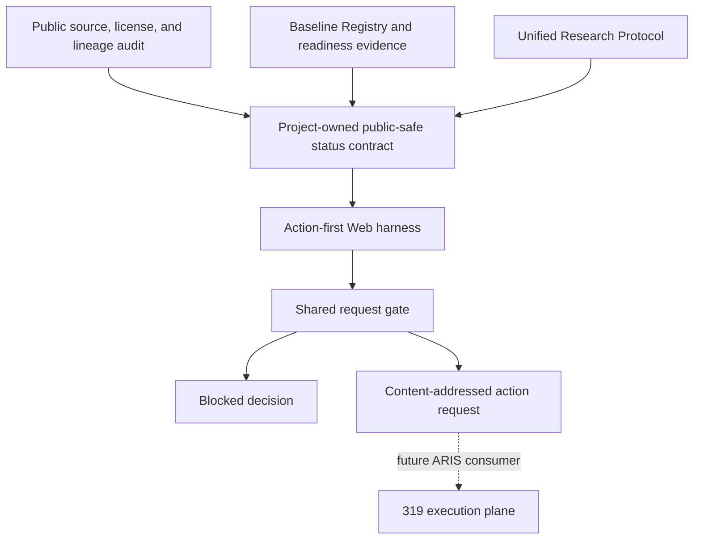
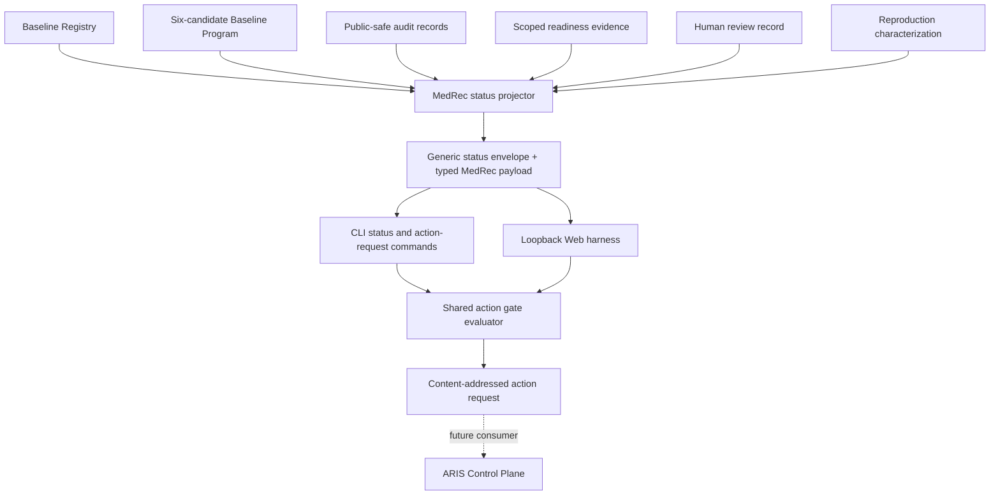
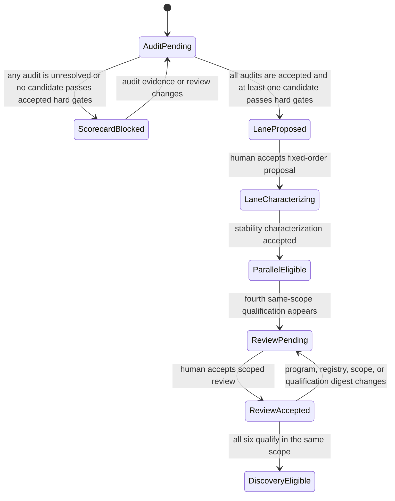

# MedRec Baseline Benchmark Harness - Plan

## Goal Capsule

| Item | Decision |
| --- | --- |
| Objective | Establish the next controlled research stage: audit, reproduce, qualify, and compare six historical medication-recommendation candidates before starting new-method discovery. |
| Product authority | `baselines/registry.toml`, the Baseline Program and audit records, the Unified Research Protocol, accepted readiness evidence, and scoped human-review records remain authoritative. Status snapshots are derived projections. |
| Execution profile | Build the local audit, fixed-order selection, scoped-readiness, status, action-request, CLI, and Web harness surfaces with public-safe records and a local commit. Do not clone baseline sources, create adapters or environments, configure a remote, deploy to 319, access real data, or run experiments. |
| Open blockers | No candidate is `comparison_ready`; LEAP has no verified official implementation; SafeDrug and MICRON have no verified license; source pins, environments, adapters, an immutable remote revision, and a dedicated 319 checkout remain absent. |
| Product Contract preservation | Changed: Goal Capsule execution profile, launcher clarification, Scope Boundaries, R8, R9, R19, F2, F4, and AE4 because the LFG invocation authorizes local implementation and the user set an explicit reproduction order: GAMENet, SafeDrug, MICRON, MoleRec, RETAIN, then `LEAP-SafeDrug`. Source and license remain hard gates. R1-R7, R10-R18, A1-A4, F1, F3, and AE1-AE3 otherwise remain unchanged. |

---

## Product Contract

### Summary

Create a six-candidate baseline program for RETAIN, GAMENet, SafeDrug, MICRON, MoleRec, and the separately named `LEAP-SafeDrug` derivative. The program must expose provenance, lineage, readiness, and blocked gates before it starts new-method discovery.

Add an action-first Web harness after the audit. It reads a project-owned, public-safe status contract and can only block or emit a preflight-gated action request for a future ARIS consumer.

### Problem Frame

The current repository has a tested synthetic protocol vertical slice but no comparison-ready external baseline. A method name alone does not establish comparable semantics: upstream repositories can share model code, preprocessing, split selection, or reporting logic.

LEAP makes this distinction concrete. GAMENet, SafeDrug, and MICRON compare against LEAP, and SafeDrug and MICRON contain a `Leap.py` path, but the audited public record has not verified an official LEAP repository. A derivative implementation can support a bounded comparison candidate only when its lineage stays visible; it cannot stand in for an official reproduction.

### Key Decisions

- **Six identities, not six labels.** The portfolio tracks scientific identity and four-layer lineage rather than treating paper names as independent implementations.
- **LEAP stays derivative until proven otherwise.** The SafeDrug-derived route is `LEAP-SafeDrug`; it never receives an official-LEAP label without a verified official upstream source.
- **Readiness precedes novelty.** The program audits every candidate, stabilizes one end-to-end reproduction lane, and opens new-method discovery only after all six candidates become `comparison_ready`.
- **Shared ancestry changes interpretation.** Shared pipelines remain usable comparators, but agreement among them is not independent replication evidence.
- **Status is a projection.** The project owns the status contract; the Web harness displays it and cannot become a second scientific database.
- **Launching is a gated request, not a control panel.** The harness may produce an action request after its evidence gates pass; ARIS remains the only execution owner and must re-evaluate current authorities before acting.



### Requirements

#### Baseline Portfolio

| ID | Requirement |
| --- | --- |
| R1. | The program must track RETAIN, GAMENet, SafeDrug, MICRON, MoleRec, and `LEAP-SafeDrug` as six candidate identities. |
| R2. | Each candidate must receive provenance, license, and four-layer lineage audit coverage for model core, data processing, split and selection, and evaluation and reporting before execution ranking. |
| R3. | Source provenance and license status must pass hard gates; an unverified candidate remains in audit and cannot win first-lane selection. |
| R4. | The SafeDrug `Leap.py` route must be called `LEAP-SafeDrug` and must not be called an official LEAP reproduction unless an official upstream source is verified. |
| R5. | Candidate status must expose shared lineage across all four audit layers. |
| R6. | Agreement among candidates with shared lineage must not count as independent replication evidence. |

#### Readiness and Sequencing

| ID | Requirement |
| --- | --- |
| R7. | The program must complete the six-candidate audit before ranking the first reproduction lane. |
| R8. | A versioned, predeclared selection specification must filter provenance and license hard gates, then choose the earliest eligible candidate in the fixed reproduction order; no unexplained numeric score may override that order. |
| R9. | GAMENet is first in the reproduction order but remains ineligible until its accepted source and license audits pass the same hard gates as every other candidate. |
| R10. | The program must stabilize one isolated end-to-end reproduction lane before it operates at most two isolated lanes in parallel. |
| R11. | Candidate advancement must use the existing `registered`, `smoke_ready`, and `comparison_ready` evidence gates without conflating Reproduction Mode and Comparison Mode. |
| R12. | Reaching four `comparison_ready` candidates must pause for human review and must not automatically unlock new-method discovery. |
| R13. | New-method discovery must remain closed until all six candidates are `comparison_ready`. |
| R19. | Reproduction sequencing must use the fixed order GAMENet, SafeDrug, MICRON, MoleRec, RETAIN, then `LEAP-SafeDrug`; an ineligible candidate is skipped while its blocker remains visible, and the relative order of later eligible candidates is preserved. |

#### Project Status and Web Harness

| ID | Requirement |
| --- | --- |
| R14. | The project must publish a generic, project-owned, public-safe status contract whose first consumer is MedRec. |
| R15. | The Web harness must lead with current stage, blocked gates, and next permitted action. |
| R16. | The action-request gate must refuse an action when required authorization, source identity, readiness evidence, or remote preflight is absent or mismatched. |
| R17. | Status output and the Web harness must exclude EHR data, split membership, patient-level predictions, weights, private logs, credentials, and private paths. |
| R18. | The Web harness must not own a database or any scientific source-of-truth state. |

### Actors

- A1. Research steward accepts readiness advances, the fixed-order lane selection, audit reviews, and the four-ready human review.
- A2. Baseline integration owner produces public-safe audit and qualification evidence while preserving the Baseline Core.
- A3. Status publisher derives the project status contract from authoritative research records.
- A4. Harness reader inspects current status and requests only actions that the gate allows.

### Key Flows

- F1. Candidate audit
  - **Trigger:** A candidate enters the six-baseline portfolio.
  - **Steps:** Record source and license evidence, map four-layer lineage, expose shared ancestry, and retain unresolved evidence as a block.
  - **Outcome:** The candidate becomes selection-eligible only after matching accepted Audit Reviews pass its hard gates.
  - **Covers:** R1, R2, R3, R4, R5, R6, R7.

- F2. First lane and readiness advance
  - **Trigger:** All six candidate audits complete.
  - **Steps:** Apply the predeclared hard gates and fixed reproduction order, select the earliest eligible candidate, establish one isolated reproduction lane, then advance only through existing readiness evidence gates.
  - **Outcome:** The program runs no more than two isolated lanes after the first lane stabilizes.
  - **Covers:** R8, R9, R10, R11, R19.

- F3. Discovery gate
  - **Trigger:** A candidate reaches `comparison_ready`.
  - **Steps:** Count qualified candidates, request a human review at four, and keep new-method discovery closed until all six qualify.
  - **Outcome:** No readiness count creates an automatic scientific promotion.
  - **Covers:** R12, R13.

- F4. Status and action request
  - **Trigger:** An operator opens the Web harness or requests a permitted action.
  - **Steps:** Render the authoritative public-safe status projection, reload the current authority bundle, evaluate the requested gate, and return either a blocked decision or a content-addressed action request without writing scientific state or executing work.
  - **Outcome:** The harness improves visibility without weakening evidence or privacy boundaries.
  - **Covers:** R14, R15, R16, R17, R18.

### Acceptance Examples

- AE1. **Covers R4.**
  - **Given:** The audit finds a `Leap.py` path in SafeDrug but no verified official LEAP repository.
  - **When:** The portfolio publishes the LEAP candidate.
  - **Then:** It shows `LEAP-SafeDrug` as a derivative identity and does not claim official reproduction.

- AE2. **Covers R3, R8.**
  - **Given:** A candidate has high comparison representativeness but lacks a verified license or pinned source.
  - **When:** The first-lane selector runs.
  - **Then:** The candidate remains ineligible regardless of its ranking signal.

- AE3. **Covers R12, R13.**
  - **Given:** Four candidates are `comparison_ready`.
  - **When:** The status contract receives the fourth readiness advance.
  - **Then:** It records a human-review gate and keeps new-method discovery closed.

- AE4. **Covers R16, R17, R18.**
  - **Given:** A requested action lacks valid remote preflight or a status artifact contains restricted material.
  - **When:** The harness evaluates the request or publication.
  - **Then:** It blocks the request or publication, emits no execution claim, and keeps restricted values out of the Web surface.

### Success Criteria

- Every candidate has a public-safe audit record that explains its identity, license position, four-layer lineage, and current readiness block.
- A reviewer can reconstruct the accepted hard-gate evidence and fixed-order reason that selected or skipped each candidate without treating shared lineage as independent confirmation.
- The Web harness shows real project status from the project-owned contract and cannot expose restricted research artifacts or mutate scientific state.
- New-method discovery remains unavailable until the six-candidate readiness gate is satisfied and the four-ready review has occurred when applicable.

### Scope Boundaries

#### Deferred for Later

- Clone or import baseline source, build Prediction Adapters, create source pins or environment locks, or advance readiness with real evidence.
- Configure a remote, create a private GitHub repository, push, or create the dedicated 319 checkout.
- Access real data, create Conda environments, train models, use GPUs, or accept experimental evidence.
- Add the ARIS runtime consumer, direct job execution, lane process locks, progress streaming, cancellation, or recovery controls.
- Extract a multi-project dashboard platform before a second project validates the generic status and action-request contracts.

#### Outside Product Identity

- Treat a derivative LEAP implementation as an official reproduction without verified provenance.
- Treat shared-pipeline agreement as independent replication evidence.
- Make clinical safety, therapeutic, or causal claims from this baseline program alone.
- Let the browser execute shell, SSH, arbitrary commands, or mutations to registry, audit, review, or readiness state.

### Dependencies and Assumptions

- The Unified Research Protocol and Baseline Integration Playbook remain the authority for scientific modes, readiness evidence, adapters, and comparison qualification.
- Public upstream sources, repository metadata, paper text, and licenses must provide enough evidence to pass the audit; unresolved evidence remains a block rather than an inferred pass.
- A reviewed immutable commit, remote, dedicated 319 checkout, and remote preflight are required before real execution but not before the public audit.

### Sources and Research

- `docs/specs/UNIFIED_RESEARCH_PROTOCOL.md`
- `docs/playbooks/BASELINE_INTEGRATION_PLAYBOOK.md`
- `docs/playbooks/REMOTE_319_EXECUTION_PLAYBOOK.md`
- `baselines/registry.toml`
- `research/README.md`
- [LEAP paper DOI](https://doi.org/10.1145/3097983.3098109)
- [RETAIN](https://github.com/mp2893/retain), [GAMENet](https://github.com/sjy1203/GAMENet), [SafeDrug](https://github.com/ycq091044/SafeDrug), [MICRON](https://github.com/ycq091044/MICRON), and [MoleRec](https://github.com/yangnianzu0515/MoleRec) upstream repositories
- GAMENet `code/baseline`, SafeDrug `src`, and MICRON `src` LEAP and RETAIN comparison implementations
- MoleRec README acknowledgement of the GAMENet and SafeDrug pipeline and SafeDrug commit `c7218d0`

---

## Planning Contract

### Key Technical Decisions

- KTD1. **Keep audit authority separate from the registry and from audit acceptance.** The registry continues to own runnable baseline identity and readiness, strict public-safe audit records own license, source-role, task semantics, and four-layer lineage, and content-addressed Audit Review records owned by the research steward decide whether a matching audit digest may satisfy a hard gate.
- KTD2. **Separate canonical model sources from medication-comparison implementations.** RETAIN's author repository is the canonical model source but implements sequence classification, while GAMENet, SafeDrug, and MICRON contain task-specific comparison variants; LEAP source resolution must preserve the same distinction.
- KTD3. **Count readiness only inside one Comparison Scope.** Four-ready and six-ready gates use `BaselineDefinition.qualifies_for(...)` for one protocol version, Dataset Manifest digest, and Adaptation Budget digest, and count only the six Baseline Program identities.
- KTD4. **Make human review content-addressed and invalidatable without unrelated churn.** A review record binds the Comparison Scope, program digest, a program-scoped digest of the six exact Baseline Definitions, and the qualification digests reviewed at the four-ready checkpoint. Drift in those authorities returns the checkpoint to pending; an additional fifth or sixth same-scope qualification does not invalidate an unchanged accepted four-ready review.
- KTD5. **Use a deterministic fixed-order selection specification.** Version 1 filters candidates whose accepted source or license Audit Review is not `pass`, then chooses the earliest remaining identity in GAMENet, SafeDrug, MICRON, MoleRec, RETAIN, `LEAP-SafeDrug` order. It records comparison representativeness, reproduction risk, and integration cost only as evidence-backed diagnostics; they cannot override the user-selected order. Unknown diagnostics remain `unresolved`, never silently coerced to a favorable value.
- KTD6. **Publish a generic envelope with a strict MedRec payload.** The envelope carries project identity, freshness, authority digests, gates, and action descriptors; the typed MedRec payload carries candidate and comparison semantics without accepting arbitrary extension dictionaries.
- KTD7. **Treat status integrity as drift detection, not authorization.** Canonical serialization and content digests detect stale or inconsistent snapshots. Every action decision receives an explicitly injected authority bundle and validates strict content-addressed Action Authorization and Remote Preflight records with issuer, source, project, target, action and authority-digest bindings, issue time, and expiry time.
- KTD8. **Generate action requests without executing them.** CLI and Web call one pure gate evaluator and emit a content-addressed request or blocked decision; a later ARIS consumer owns idempotency, runtime locking, execution, and recovery.
- KTD9. **Keep the harness dependency-free and local.** A standard-library loopback HTTP server serves package resources and reads one status snapshot; it has no database, no scientific write path, and no non-loopback mode.

### High-Level Technical Design





### Output Structure

```text
baselines/
  programs/classic-six.toml
  audits/{retain,gamenet,safedrug,micron,molerec,leap-safedrug}.toml
fixtures/
  benchmark/
  status/
docs/
  design/BENCHMARK_HARNESS_WIREFRAME.md
src/medrec_research/
  baseline_audit.py
  benchmark_program.py
  benchmark_state.py
  project_status.py
  action_gate.py
  harness.py
  web/
    __init__.py
    index.html
    app.css
    app.js
tests/
  unit/test_baseline_audit.py
  unit/test_benchmark_program.py
  unit/test_benchmark_state.py
  unit/test_project_status.py
  unit/test_action_gate.py
  integration/test_status_cli.py
  integration/test_harness_cli.py
```

### Assumptions

- The current LFG run includes local code, public audit artifacts, `leap-safedrug` registry identity, documentation, tests, browser verification, and local commits; remote creation, push, 319, source checkout, adapters, environments, and experiments remain excluded.
- An audit is resolved when every required field and lineage layer has a supported `pass`, `fail`, or `unresolved` disposition; only matching accepted Audit Reviews for `pass` source and license claims make a candidate selection-eligible.
- The bounded public search did not verify an official LEAP repository. `LEAP-SafeDrug` remains derivative, unofficial, license-unknown, and comparison-semantics-pending even though GAMENet provides an MIT LEAP comparison implementation.
- Status snapshots use injected UTC clocks, default to five-minute freshness, and accept remote preflight records with a maximum sixty-second freshness; expiry fails closed.
- Content digests protect against accidental drift and inconsistent inputs, not a malicious local writer who can recompute hashes. ARIS must re-evaluate current authorities before any future execution.
- V1 ends at an action request or blocked decision. It does not invoke a subprocess, persist an execution queue, acquire lane runtime locks, or claim that a 319 job started.

### Sequencing

Implement authority contracts before projections, and projections before interfaces. U1 enables U2 and U3; U2 and U3 enable U4; U4 enables U5; U4 and U5 enable U6; U7 integrates and documents the complete path.

### System-Wide Impact

| Surface | Impact |
| --- | --- |
| Scientific authority | Audit, review, and characterization become separate content-addressed inputs; status remains derived and cannot advance readiness. |
| Registry compatibility | Adding `leap-safedrug` changes the registry digest but does not advance any readiness or alter existing baseline definitions. |
| ARIS boundary | ARIS remains outside the package runtime and becomes the future consumer of action requests rather than a dependency of the gate evaluator. |
| CLI and Web parity | Both interfaces consume the same snapshot parser and gate evaluator, so the browser cannot invent a more permissive rule. |
| Privacy posture | New public contracts use closed schemas, bounded public URLs, digests, counts, and enums; they exclude free-form logs and restricted payloads. |
| Packaging | Static Web resources become package data and must survive wheel/sdist build and installation without a repository working directory. |

### Risks and Dependencies

| Risk | Mitigation |
| --- | --- |
| Public code is mistaken for licensed reusable code | Keep SafeDrug, MICRON, and `LEAP-SafeDrug` license gates unresolved and forbid source import before license evidence passes. |
| Shared lineage is collapsed into one note | Require one evidence-backed edge per model-core, data-processing, split-selection, and evaluation-reporting layer. |
| RETAIN or LEAP task semantics are misrepresented | Record canonical sources and medication-comparison implementations as distinct source roles and keep comparison semantics pending until characterized. |
| Global readiness counts mix incomparable qualifications | Bind all counts and discovery gates to one Comparison Scope, bind review receipts to the exact reviewed qualification cohort, and bind registry authority to a program-scoped six-definition digest. |
| Status JSON leaks restricted values | Reject unknown fields, arbitrary notes, unsafe or unapproved URLs, private paths, sensitive field names, and non-finite or non-canonical data before publication. |
| A stale snapshot enables an action | Bind requests to snapshot and authority digests, enforce freshness, and re-evaluate from current inputs before returning an allowed decision. |
| Local Web endpoints become a control plane | Bind a literal loopback address only, enforce exact Host and same-origin checks, deny actions by default, accept fixed action IDs only, and never provide a runner or scientific write endpoint. |
| Static resources disappear from built packages | Exercise installed-package and resource-loading smoke tests after wheel and sdist creation. |

---

## Implementation Units

### U1. Baseline Program and Audit Authorities

**Goal:** Define the exact six-candidate program and six public-safe audit records without overloading registry readiness semantics.

**Requirements:** R1-R7, R19, A1, A2, F1, AE1, AE2.

**Dependencies:** None.

**Files:** `src/medrec_research/baseline_audit.py`, `baselines/programs/classic-six.toml`, `baselines/audits/retain.toml`, `baselines/audits/gamenet.toml`, `baselines/audits/safedrug.toml`, `baselines/audits/micron.toml`, `baselines/audits/molerec.toml`, `baselines/audits/leap-safedrug.toml`, `fixtures/benchmark/audit-reviews.json`, `baselines/registry.toml`, `tests/unit/test_baseline_audit.py`, `tests/unit/test_registry.py`.

**Approach:** Follow the registry's frozen dataclass, strict-field, canonical-serialization, and content-digest pattern. Store source roles, immutable-ref disposition, license evidence, task/split/evaluation semantics, and four separate lineage layers in audit records. Every hard-gate evidence item binds its claim and source role to repository identity, an exact immutable revision, retrieval time, an evidence-content digest, and an immutable commit, blob, or archived public URL; mutable branch or README URLs are contextual only. A separate Audit Review binds candidate ID, audit digest, reviewed claims, reviewer or issuer, decision, issue time, and content digest. Add only the derivative `leap-safedrug` identity to the registry and keep it `registered` with unresolved source status.

**Execution note:** Start with failing contract tests and treat every unsupported claim as `unresolved`, never as an inferred pass.

**Patterns to follow:** `src/medrec_research/registry.py`, `src/medrec_research/_validation.py`, and `tests/unit/test_registry.py`.

**Test scenarios:**

- Load the exact six unique candidate IDs and reject a missing, duplicate, or extra candidate.
- Covers AE1. Reject any audit or registry representation that labels `leap-safedrug` official or omits its SafeDrug derivative lineage.
- Require resolved source, license, task, split, evaluation, and all four lineage-layer dispositions before the portfolio audit gate completes.
- Keep a fully documented `fail` or `unresolved` audit visible while preventing selection eligibility.
- Reject a self-asserted audit `pass` when no accepted Audit Review binds the exact audit digest and reviewed source or license claim.
- Reject mutable-only hard-gate evidence, a license claim bound to a different source revision, or evidence whose content digest and immutable URL no longer agree.
- Reject duplicate, circular, unknown-target, or evidence-free lineage edges independently in each layer.
- Distinguish RETAIN's canonical sequence-classification source from medication-comparison implementations.
- Preserve SafeDrug's reproduction branch warning and MoleRec's SafeDrug `c7218d0` processing lineage as public evidence without importing upstream code.
- Confirm the registry still reports every existing baseline at its original readiness and adds `leap-safedrug` only as `registered`.

**Verification:** All six audit files and their review records round-trip deterministically, produce stable digests, and expose no local paths, credentials, restricted identifiers, self-approved hard gates, or unsupported readiness claims.

### U2. Scorecard and Reproduction Stability Contract

**Goal:** Produce a deterministic fixed-order first-lane proposal and a falsifiable public-safe definition of when that lane is stable enough to permit two isolated lanes.

**Requirements:** R7-R11, R19, A1, A2, F2, AE2.

**Dependencies:** U1.

**Files:** `src/medrec_research/benchmark_program.py`, `fixtures/benchmark/selection-result.json`, `fixtures/benchmark/reproduction-characterization.json`, `tests/unit/test_benchmark_program.py`.

**Approach:** Bind selection-specification version, program digest, fixed priority ordinal, accepted Audit Review digests, and audit digests to every result. Filter source or license failures, preserve their blockers, and select the earliest eligible candidate in GAMENet, SafeDrug, MICRON, MoleRec, RETAIN, `LEAP-SafeDrug` order. The versioned specification declares the allowed hard-gate values, `unresolved` missing-value policy, evidence source, ascending ordinal direction, and `baseline_id` integrity check; diagnostic representativeness, reproduction-risk, and integration-cost fields use closed enumerations with cited audit evidence but never affect selection. Return a blocked result when no candidate passes and require a human-accepted lane proposal before characterization.

The Reproduction Stability Policy is also versioned. It requires at least two completed Reproduction Mode runs with the same source, environment, adapter, input-manifest, and declared seed policy; zero protocol violations; complete artifact digests; a predeclared per-output variance tolerance; an upstream-reference comparison; and zero failures among the planned attempts. A missing tolerance, reference, repeat, or integrity check forces `unresolved`. A content-addressed Reproduction Characterization binds the policy and public-safe evidence summaries without pretending to be an accepted Run Record.

**Execution note:** Prove hard-gate precedence and deterministic ordering before implementing ranking.

**Patterns to follow:** `BaselineDefinition.advance_readiness()` in `src/medrec_research/registry.py` and `ProtocolCheckRecord` content-addressing in `src/medrec_research/protocol_check.py`.

**Test scenarios:**

- Reject lane selection until all six audits have a resolved disposition and every hard-gate `pass` used for eligibility has a matching accepted Audit Review.
- Covers AE2. Exclude a highest-representativeness candidate when source or license is not `pass`.
- Select eligible candidates in exact GAMENet, SafeDrug, MICRON, MoleRec, RETAIN, `LEAP-SafeDrug` order with identical output for identical inputs.
- Skip an ineligible earlier candidate while retaining its blocker and preserving the relative order of later eligible candidates.
- Reject an unknown priority identity, duplicate ordinal, favorable coercion of an unresolved diagnostic, or any attempt to let a diagnostic override priority.
- Return a blocked result with reasons when no candidate is eligible.
- Treat GAMENet as the first eligible priority rather than an unconditional winner.
- Reject a lane selection receipt bound to a different selection-specification version, program, audit set, review set, or candidate.
- Require accepted, matching Reproduction Characterization evidence before the status permits a second lane.
- Reject any characterization that claims Comparison Mode evidence or omits the required repeats, planned-attempt failure budget, upstream split, selection, evaluation, seed policy, variance tolerance, upstream reference, artifact integrity, environment, or adapter-smoke identity.

**Verification:** One deterministic proposal or a deterministic blocked result is produced, and parallel-lane eligibility cannot be inferred from readiness strings or synthetic Protocol Check Records.

### U3. Scoped Readiness and Human Review Gate

**Goal:** Enforce the four-ready checkpoint and six-ready discovery gate inside one exact Comparison Scope.

**Requirements:** R11-R13, A1, F3, AE3.

**Dependencies:** U1.

**Files:** `src/medrec_research/benchmark_state.py`, `fixtures/benchmark/human-review.json`, `tests/unit/test_benchmark_state.py`.

**Approach:** Model Comparison Scope from protocol version, Dataset Manifest digest, and Adaptation Budget digest. Count only program candidates whose registry definitions qualify for that scope. Derive a program-scoped registry-view digest from the ordered six candidate IDs and their exact Baseline Definition digests. Represent review state as not-required, pending, or accepted, with accepted records bound to scope, program, the scoped registry view, and the qualification digests actually reviewed at the four-ready checkpoint. A fifth or sixth unchanged same-scope qualification does not invalidate that review.

**Execution note:** Use synthetic registry definitions to characterize state changes without creating real readiness evidence.

**Patterns to follow:** `BaselineDefinition.qualifies_for()` and `ComparisonQualification` in `src/medrec_research/registry.py`.

**Test scenarios:**

- Three same-scope qualified candidates leave review not-required and discovery closed.
- Covers AE3. The fourth same-scope candidate changes review to pending and keeps discovery closed.
- Four globally ready candidates with only three qualified for the active scope do not trigger review.
- A jump from three to six same-scope qualifications still requires review acceptance.
- Six same-scope candidates with no accepted review keep discovery closed.
- An accepted review bound to an older scope, program, scoped registry view, or reviewed qualification digest becomes pending.
- Adding a fifth or sixth same-scope qualification preserves an accepted four-ready review when the reviewed cohort and other bound authorities are unchanged.
- Six same-scope candidates with a current accepted review make discovery eligible without starting discovery.
- Registry baselines outside the six-candidate program affect neither counts nor review validity.

**Verification:** Review and discovery state derive only from exact-scope qualifications and valid content-addressed review evidence.

### U4. Public-Safe Project Status Contract

**Goal:** Publish a deterministic generic status envelope and strict MedRec projection from authoritative inputs.

**Requirements:** R5, R6, R11-R18, A3, F3, F4, AE3, AE4.

**Dependencies:** U1, U2, U3.

**Files:** `src/medrec_research/project_status.py`, `src/medrec_research/_validation.py`, `fixtures/status/blocked.json`, `fixtures/status/review-pending.json`, `fixtures/status/discovery-eligible.json`, `tests/unit/test_project_status.py`.

**Approach:** Use a versioned generic envelope with a typed MedRec payload, closed schemas, injected UTC clock, freshness bounds, authority digests, blocked gates, stable reason codes, and permitted action descriptors. Select the primary blocker deterministically by status-integrity or privacy failure, authorization failure, source or license gate, readiness gate, then remote-preflight order, with stable reason-code and candidate-ID tie-breaks; the displayed next action derives only from that blocker. Publish atomically, mark stale or degraded input as action-denied, and keep snapshots content-addressed without treating the digest as authorization.

Public evidence links must be absolute HTTPS URLs on a closed approved-hostname list. Validation rejects userinfo, credential-bearing queries, fragments, control characters, IP literals, localhost, private or link-local targets, scheme-relative forms, and non-HTTPS schemes including `javascript:`, `data:`, and `file:`. The renderer adds `rel="noopener noreferrer"` to every external evidence link.

**Execution note:** Add privacy and stale-input failures before the happy-path publisher.

**Patterns to follow:** `canonical_json()`, `strict_fields()`, and content-addressed record classes in `src/medrec_research/_validation.py`, `src/medrec_research/dataset.py`, and `src/medrec_research/protocol_check.py`.

**Test scenarios:**

- Identical authorities and injected time produce identical canonical snapshots and digests; authority drift changes the digest.
- Four-ready pending review and six-ready accepted review project the states defined in U3.
- Show shared lineage per layer and never translate shared agreement into an independent-replication count.
- Reject unknown fields, arbitrary notes, patient or visit identifiers, split membership, predictions, weights, logs, credentials, unapproved hostnames, Unix or Windows private paths, and credential-like URLs.
- Accept only approved absolute HTTPS evidence URLs; reject userinfo, credential queries, fragments, control characters, IP literals, localhost, private or link-local targets, scheme-relative values, and non-HTTPS schemes without echoing the rejected value.
- Choose the same primary blocker and derived next action for every permutation of an identical blocker set.
- Fail closed on expired, malformed, partially written, or authority-mismatched inputs.
- Preserve a last-known-good snapshot only as stale/degraded with zero permitted actions.
- Write a complete file atomically so interruption cannot expose partial JSON.

**Verification:** Status snapshots round-trip through their strict parser, retain only public-safe aggregate state, and never become an input that can advance scientific authority.

### U5. Shared Action Request Gate

**Goal:** Give CLI, Web, and future ARIS consumers one fail-closed action decision and request contract without executing commands.

**Requirements:** R14-R18, A3, A4, F4, AE4.

**Dependencies:** U4.

**Files:** `src/medrec_research/action_gate.py`, `fixtures/status/action-allowed.json`, `fixtures/status/action-blocked.json`, `tests/unit/test_action_gate.py`.

**Approach:** Accept only fixed action IDs advertised by the current snapshot plus snapshot, scope, authorization, preflight, and request identifiers. The caller explicitly injects an authority bundle; the evaluator never discovers authority from ambient files or environment variables. Strict content-addressed Action Authorization and Remote Preflight records bind issuer and evidence source, project ID, target ID, action ID, snapshot and current authority digests, issued-at and expires-at times, and record digest. Preflight additionally binds the immutable remote revision and declared remote profile. Reload current authority digests, enforce freshness and expiry, and return a content-addressed request or blocked decision with stable reason codes. Do not accept commands, arguments, paths, hosts, environment variables, or free-form payloads.

**Execution note:** Write denial and tamper tests first; V1 has no runner or execution side effect.

**Patterns to follow:** strict process-boundary validation in `src/medrec_research/adapters.py` without reusing the Prediction Adapter as a task runner.

**Test scenarios:**

- Covers AE4. Missing or mismatched authorization, scope, source, readiness, review, snapshot, or preflight evidence returns blocked.
- Reject missing, ambiently discovered, duplicate, malformed, expired, wrong-issuer, wrong-project, wrong-target, wrong-action, or digest-drifted authority records.
- Reject unknown action IDs and any request field for command, argv, path, host, environment, or arbitrary parameters.
- Reject a self-consistent snapshot whose authority digests no longer match current inputs.
- Expired snapshots and preflight evidence fail closed with stable reason codes.
- The same valid inputs and request identifier produce the same request digest.
- CLI and Web adapters receive the same allowed or blocked decision for the same input.
- Every denied and allowed request leaves registry, audits, review records, status files, and process state unchanged.

**Verification:** The evaluator is pure, deterministic, interface-neutral, and incapable of launching a subprocess or mutating scientific state.

### U6. Loopback Web Harness

**Goal:** Deliver an action-first local interface that renders real project status and produces only gated action requests.

**Requirements:** R14-R18, A4, F4, AE4.

**Dependencies:** U4, U5.

**Files:** `src/medrec_research/harness.py`, `src/medrec_research/web/__init__.py`, `src/medrec_research/web/index.html`, `src/medrec_research/web/app.css`, `src/medrec_research/web/app.js`, `docs/design/BENCHMARK_HARNESS_WIREFRAME.md`, `tests/integration/test_harness_cli.py`.

**Approach:** Serve packaged assets and status over a loopback-only standard-library HTTP server. The first viewport gives stage, deterministic primary blocker, readiness progress, and next permitted action greater visual hierarchy than candidate summaries; detailed lineage and evidence remain scannable below. Preserve the accepted composition in the repository-owned annotated wireframe rather than relying on the temporary brainstorm probe.

POST accepts only the U5 request shape, is disabled unless explicitly enabled, and returns no execution claim. Before body parsing, require exactly one `Host` equal to the literal bound loopback address and actual port and exactly one non-null `Origin` with the same scheme, literal host, and port. Reject missing, duplicate, malformed, userinfo-bearing, suffix-matched, comma-joined, `null`, DNS-rebinding-style, or otherwise non-exact Host and Origin values, plus unsupported method, content type, or body size.

The UI state contract covers initial loading; valid status with no permitted action; ready to request; request submitting with duplicate submission disabled; allowed result showing only the generated request identity; blocked result with reason and recovery action; stale or malformed status; and transport failure. Each state declares control enablement, visible message, live-region announcement, and deterministic focus target.

**Execution note:** Implement server behavior through integration tests, then verify the rendered layout in a real browser at desktop and mobile sizes.

**Patterns to follow:** `argparse` command composition in `src/medrec_research/cli.py`, package resource loading through `importlib.resources`, and the accepted action-first visual probe from the brainstorm session.

**Test scenarios:**

- GET the root, assets, and status snapshot without writing any file or scientific state.
- Block non-loopback bind requests, unsupported methods, oversized bodies, wrong content type, and every missing, duplicate, malformed, non-exact, `null`, rebinding-style, or cross-origin Host and Origin case before reading the body.
- Render missing, stale, degraded, and malformed status as unavailable with all actions disabled.
- Escape every upstream label and evidence value so metadata cannot inject HTML or script.
- Render approved evidence links with `rel="noopener noreferrer"` and never make rejected URLs clickable.
- Return the U5 decision for valid and invalid action requests without invoking a process.
- Exercise every declared loading, ready, submitting, allowed, blocked, stale, malformed, and transport-failure UI state; prevent duplicate requests and place focus on the relevant result or recovery control.
- Load HTML, CSS, and JavaScript from an installed wheel without relying on the repository working directory.
- At desktop and mobile widths, keep stage, blocker, and next action visible without overlap or horizontal clipping.
- Use semantic landmarks and heading order, programmatic labels, live-region announcements, deterministic result focus, captioned tables with header associations, WCAG AA contrast, and touch targets of at least 44 by 44 CSS pixels.

**Verification:** The local URL presents real blocked or eligible state, browser and CLI decisions match, the first viewport preserves the annotated action-first hierarchy, static assets survive packaging, accessibility checks pass, and no endpoint can mutate or execute research state.

### U7. CLI, Documentation, and End-to-End Qualification

**Goal:** Integrate the new contracts into the existing CLI and document the local harness without implying experimental readiness.

**Requirements:** R1-R19, A1-A4, F1-F4, AE1-AE4.

**Dependencies:** U1-U6.

**Files:** `src/medrec_research/cli.py`, `src/medrec_research/__init__.py`, `README.md`, `CONTEXT.md`, `docs/PLANS.md`, `docs/playbooks/BASELINE_INTEGRATION_PLAYBOOK.md`, `docs/playbooks/PROJECT_STATUS_HARNESS_PLAYBOOK.md`, `tests/integration/test_status_cli.py`, `tests/integration/test_harness_cli.py`.

**Approach:** Add flat CLI subcommands for audit validation, lane selection and status publication, action-request evaluation, and the loopback harness. Keep errors public-safe and consistent with existing `argparse` exit behavior. Document authority ownership, current blocked states, public audit evidence, and the boundary between an action request and ARIS execution.

**Execution note:** Finish with the real registry and six audit files plus synthetic qualification/review fixtures; never create real readiness evidence to make the demo look complete.

**Patterns to follow:** `_build_parser()` and `main()` in `src/medrec_research/cli.py`, the repository documentation map, and the completion commands in `AGENTS.md`.

**Test scenarios:**

- Validate the real six-candidate program and audit files from the repository root.
- Generate the same blocked status snapshot twice with an injected clock and compare bytes.
- Return CLI exit code `2` with a public-safe message for malformed audit, stale review, unsafe output, or denied action input.
- Start the harness on an ephemeral loopback port, fetch the page and status, request a blocked action, and stop cleanly.
- Confirm CLI help exposes no command, argv, host-target, environment, SSH, or remote-path input surface.
- Scan committed public records and generated status output for restricted identifiers, private paths, credentials, predictions, weights, and raw logs.
- Build wheel and sdist, install the wheel in an isolated location, and run the harness resource smoke test.

**Verification:** A new user can validate audits, publish current status, open the local harness, and understand every blocked gate without accessing real data or mistaking the result for research evidence.

---

## Verification Contract

| Gate | Command or Evidence | Applies To | Pass Signal |
| --- | --- | --- | --- |
| Unit and integration tests | `rtk proxy /opt/homebrew/bin/uv run pytest` | U1-U7 | All contract, CLI, server, privacy, and integration scenarios pass. |
| Ruff lint | `rtk proxy /opt/homebrew/bin/uv run ruff check .` | U1-U7 | No lint findings. |
| Ruff format | `rtk proxy /opt/homebrew/bin/uv run ruff format --check .` | U1-U7 | No formatting drift. |
| Package build | `rtk proxy /opt/homebrew/bin/uv build` | U6, U7 | Wheel and sdist build and include Web resources. |
| Markdown | `rtk markdownlint '**/*.md' --ignore '.agents/**'` | U7 | Modified documentation passes repository Markdown policy. |
| Public-safe audit | Repository audit/status fixtures plus privacy tests | U1, U3-U7 | No EHR rows, membership, patient-level outputs, weights, credentials, logs, unapproved hostnames, or private paths appear. |
| Browser behavior | Pipeline browser test at desktop and mobile viewports | U6, U7 | Page is nonblank, action-first, responsive, keyboard and screen-reader usable, touch-target compliant, and consistent with the shared gate evaluator. |
| Installed-package smoke | Wheel installation and ephemeral loopback harness probe | U6, U7 | Assets load outside the checkout and no endpoint writes or executes state. |

---

## Definition of Done

- The plan's R1-R19, F1-F4, and AE1-AE4 behaviors are implemented and traced through U1-U7 tests.
- Exactly six candidate audits exist, including derivative-only `LEAP-SafeDrug`, and every unresolved source or license remains visibly blocked.
- Registry changes add only `leap-safedrug` identity and do not advance readiness or import upstream source.
- The versioned selection specification is predeclared, hard-gated, deterministic, follows GAMENet, SafeDrug, MICRON, MoleRec, RETAIN, `LEAP-SafeDrug` order among eligible candidates, and cannot select a self-approved or unresolved candidate.
- Hard-gate evidence is immutable-revision-bound and becomes eligible only through a matching accepted Audit Review.
- Reproduction stability has falsifiable repeat, integrity, variance, upstream-reference, and failure-budget criteria; four-ready review and six-ready discovery use content-addressed same-scope qualification semantics without unrelated registry or later-qualification invalidation.
- The generic status envelope and MedRec projection are deterministic, fresh-bounded, public-safe, and non-authoritative.
- CLI and Web use the same explicitly injected authority bundle and action gate; V1 produces requests or blocked decisions and never launches a process.
- The Web harness binds literal loopback with exact Host and Origin validation, has no database or scientific write path, uses real project status, and passes desktop, mobile, lifecycle, and accessibility inspection.
- Tests, lint, format, package build, Markdown lint, privacy verification, CLI smoke, and installed-package smoke pass.
- README, domain language, the baseline integration playbook, and the status harness playbook state the evidence and execution boundaries accurately.
- No abandoned experiment, duplicate gate logic, sample state masquerading as progress, or dead-end implementation remains in the final diff.
