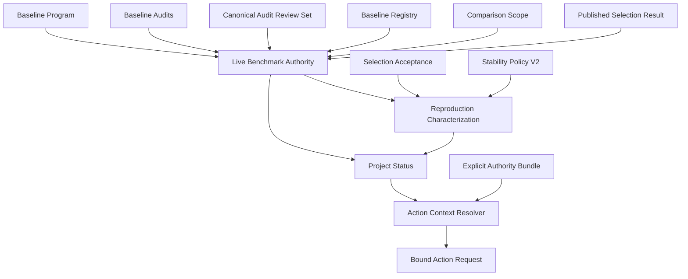

# Benchmark Authority Contract Hardening - Plan

## Goal Capsule

| Item | Decision |
| --- | --- |
| Objective | Make benchmark status, Reproduction Characterization, and action requests fail closed whenever their current authority records drift. |
| Authority ownership | Comparison Scope owns identity matching; Baseline Registry retains readiness and evidence authority; Live Benchmark Authority correlates current status inputs; the Action Context resolves one request from an explicitly injected Authority Bundle. |
| Execution profile | Change only local, public-safe core contracts, fixtures, CLI, loopback harness, and documentation. Preserve the distinction between Comparison Mode and Reproduction Mode. |
| Deferred design | Do not extract Comparison Mode acceptance from `ComparisonQualification` until a second core adapter needs the same lifecycle. |
| Stop conditions | Do not access real data, create environments, modify imported baselines, deploy to 319, execute experiments, create a remote, or make a commit. |

---

## Product Contract

### Summary

The existing benchmark harness accepts several records independently even though status and launch eligibility depend on their correlation. Harden these contracts so stale selection reviews, stale steward acceptance, incomplete reproduction metrics, and authority rotation block status or action requests rather than silently proceeding.

### Problem Frame

The current modules have correct individual record validation but leave cross-record authority checks in callers. This creates shallow interfaces at the status and harness seams: review-set drift can leave a Selection Result looking current, a Reproduction Characterization can influence status without steward provenance, and browser input repeats digest bindings that the server should derive from current authority.

### Requirements

#### Comparison Scope and Live Authority

- R1. A protocol-owned Comparison Scope module must own the exact identity comparison of protocol version, Dataset Manifest digest, and Adaptation Budget digest while preserving existing public imports.
- R2. Baseline Registry must retain readiness and evidence validation; Comparison Scope must never independently declare a baseline qualified.
- R3. Audit Review sets must serialize canonically and fail closed when matching records contain conflicting pass and fail decisions.
- R4. Live Benchmark Authority must validate the current Baseline Program, audit records, Audit Review set, Registry, Comparison Scope, and published Selection Result before Project Status projects readiness or discovery.
- R5. Live Benchmark Authority must fail closed on any correlated-authority drift and must not rerun selection or silently publish a replacement Selection Result.

#### Selection and Reproduction Evidence

- R6. A durable, content-addressed Selection Acceptance must bind the current Selection Result, selected candidate, reviewer, decision, and issue time.
- R7. A Reproduction Characterization may influence current status only when it binds a usable matching Selection Acceptance and current Live Benchmark Authority.
- R8. Historical V1 Reproduction Characterizations remain parseable but never eligible for current status projection.
- R9. Reproduction Stability Policy V2 must content-address the canonical expected output identifiers `jaccard`, `precision`, `recall`, `f1`, and `mean_medication_count`.
- R10. Missing expected outputs must resolve as `unresolved`; duplicate or unexpected output observations must reject a Characterization.

#### Action Context and Parity

- R11. Callers may provide only an opaque `request_id`; Action Context must derive action, target, snapshot, scope, and authority bindings from the current snapshot and explicitly injected Authority Bundle.
- R12. CLI and loopback harness must use the same Action Context resolver and retain complete bindings in the emitted Action Request.
- R13. Every Harness action-context GET and action POST must reload and strictly parse the configured Authority Bundle. Missing, malformed, rotated, or revoked authority must fail closed without a process restart.

#### Compatibility and Documentation

- R14. Public CLI, fixture, package exports, playbooks, and status examples must describe the hardened contracts without implying scientific advancement or execution capability.
- R15. Candidate 5, generic Comparison Mode acceptance extraction, remains deferred until a second concrete core consumer demonstrates a real seam.

### Actors

- A1. Research steward supplies Selection Acceptance as durable provenance without becoming the selection authority.
- A2. Status publisher provides current public-safe records and receives a deterministic blocked projection when authority drifts.
- A3. Harness reader requests one currently permitted action using only an opaque request identifier.
- A4. Future ARIS consumer receives a fully bound Action Request but remains the only execution owner.

### Key Flows

- F1. Live status projection
  - **Trigger:** A publisher projects status from benchmark records.
  - **Steps:** Canonicalize reviews, validate correlated authority and Selection Result, derive scope-qualified readiness, then project status.
  - **Outcome:** Any drift blocks projection; the projector never reselects a candidate.
  - **Covers:** R1-R5.
- F2. Reproduction characterization
  - **Trigger:** A steward records repeated Reproduction Mode evidence for the selected candidate.
  - **Steps:** Bind Selection Acceptance, policy V2, complete expected output observations, and current authority.
  - **Outcome:** Only valid, complete, accepted characterization affects lane status; it remains non-Comparison evidence.
  - **Covers:** R6-R10.
- F3. Current action request
  - **Trigger:** CLI or Web client asks for an action.
  - **Steps:** Load current Authority Bundle, derive Action Context from current snapshot, accept only `request_id`, and evaluate again on POST.
  - **Outcome:** Rotation between context display and submission blocks the request instead of trusting browser-provided digest bindings.
  - **Covers:** R11-R13.

### Acceptance Examples

- AE1. **Covers R3-R5.** Given a current Selection Result whose saved review-set digest differs from the current canonical review set, when status publishes, then publication fails closed and selection is not rerun.
- AE2. **Covers R6-R8.** Given a valid V2 Reproduction Characterization with no matching Selection Acceptance, when status publishes, then the characterization cannot move the selected lane into characterization or parallel eligibility.
- AE3. **Covers R9-R10.** Given only four expected metric observations, when policy V2 evaluates them, then the result is `unresolved`; duplicate or unknown metric identifiers reject the record.
- AE4. **Covers R11-R13.** Given a browser receives allowed action context and its bundle rotates before POST, when it submits the same `request_id`, then the server returns a blocked decision from the reloaded authority.

### Scope Boundaries

#### Deferred for Later

- Extract a generic Comparison Mode acceptance module or modify `ComparisonQualification` lifecycle semantics before a second core adapter needs it.
- Add execution, remote control, mutable scientific state, a database, or ambient authority discovery.
- Change Baseline Registry readiness or evidence requirements, recreate upstream behavior, or assert Comparison Mode claims from Reproduction Characterization.

#### Outside Product Identity

- Silently republish a different Selection Result when an authority record drifts.
- Treat a durable Selection Acceptance as independent expiry-based authority.
- Accept browser-supplied target, action, snapshot, scope, authorization, or preflight bindings.

### Sources and Research

- `docs/residual-review-findings/2625b7d7cc657942a27f59c0aa3b0741dc96d746.md`
- `research/reusable-lessons.md`
- `docs/plans/2026-07-10-002-feat-medrec-benchmark-harness-plan.md`
- `docs/specs/UNIFIED_RESEARCH_PROTOCOL.md`
- `CONTEXT.md`

---

## Planning Contract

### Key Technical Decisions

- KTD1. **Deepen Comparison Scope, not Registry qualification.** Move the three-field identity matcher behind one Comparison Scope interface and delegate matching to it. Registry remains the authoritative module for readiness and evidence because moving those checks would collapse different scientific responsibilities.
- KTD2. **Make Live Benchmark Authority one status seam.** Build the correlated validation path beside `BenchmarkState`; status calls it once and projects only its validated result. Its interface validates current records and returns a blocked authority state rather than selecting anew.
- KTD3. **Canonical reviews are authority, not display data.** Normalize review ordering for digests and reject matching contradictory decisions before selection-result correlation. This removes caller-side ordering and conflict logic.
- KTD4. **Selection Acceptance is durable provenance.** It has no standalone expiry. Current usability is derived from matching Live Benchmark Authority and Selection Result, which preserves provenance while making drift invalidation automatic.
- KTD5. **Version policy rather than reinterpret records.** Preserve V1 parsing, introduce V2 with expected metric IDs in its content digest, and prohibit V1 records from changing current status.
- KTD6. **Use one Action Context resolver.** Caller input stays opaque, explicit Authority Bundle injection remains the sole authorization dependency, and all adapters share one pure resolution and evaluation path.
- KTD7. **Do not invent candidate-5 abstraction.** One Comparison Mode consumer is a hypothetical seam. Extraction waits until a second core adapter proves leverage and locality.

### High-Level Technical Design

### System-Wide Impact

Status becomes stricter because current selection authority is now correlated with reviews and acceptance. CLI and Web retain their public-safe interfaces but stop accepting binding data that belongs behind the Action Context seam. Historical records retain read compatibility, while new authority-dependent status requires current V2 semantics.

### Risks and Mitigation

- Canonicalizing review order changes content digests: regenerate affected public fixtures only from deterministic serializers and add byte-stability tests.
- Schema migration can let legacy semantics leak into current status: parse V1 only through an explicit version branch and test that it is rejected for status eligibility.
- Harness reload can create inconsistent GET/POST behavior: reload independently for each request and test bundle rotation in the same running server.
- Scope extraction can accidentally move Registry logic: limit delegation to identity matching and retain Registry-owned qualification validation tests.

### Assumptions

- The canonical policy output IDs are the aggregate metrics named by the Unified Research Protocol.
- Existing public status records and fixtures may be migrated where their schema changes, but no restricted artifact is needed.
- A blocked status is a valid result. It must show a stable reason and must not create a new route or record automatically.

---

## Implementation Units

### U1. Extract Comparison Scope and Canonicalize Audit Reviews

**Goal:** Concentrate scope identity matching and review-set canonicalization behind their respective module interfaces without changing Registry readiness ownership.

**Requirements:** R1-R3.

**Dependencies:** None.

**Files:** `src/medrec_research/comparison_scope.py`, `src/medrec_research/benchmark_state.py`, `src/medrec_research/registry.py`, `src/medrec_research/run_record.py`, `src/medrec_research/baseline_audit.py`, `src/medrec_research/__init__.py`, `tests/unit/test_benchmark_state.py`, `tests/unit/test_registry.py`, `tests/unit/test_run_record.py`, `tests/unit/test_baseline_audit.py`.

**Approach:** Create the protocol-owned Comparison Scope module with equality and identity matching operations. Preserve re-exports so callers retain compatibility. Route existing three-field comparisons through it, leaving `BaselineDefinition.qualifies_for()` responsible for readiness and evidence. Canonicalize Audit Review ordering in its serialization and reject a matching pass/fail conflict before any selection or status caller can treat it as authority.

**Execution note:** Add focused failing contract tests for scope matching, stable review serialization, and contradictory matching reviews before production changes.

**Patterns to follow:** Existing frozen content-addressed records in `src/medrec_research/benchmark_state.py`, `src/medrec_research/baseline_audit.py`, and `src/medrec_research/_validation.py`.

**Test scenarios:**

- Scope equality matches only the protocol, Dataset Manifest, and Adaptation Budget identities; different values fail.
- Registry qualification still rejects missing readiness or evidence even when scope identity matches.
- Equivalent review records in different input orders serialize to one digest.
- A matching review pass and fail for one claim rejects the review set.
- Existing imports and Run Record validation continue to use the re-exported Comparison Scope type.

**Verification:** Focused scope, registry, run-record, and audit-review tests pass with no changed public readiness semantics.

### U2. Introduce Live Benchmark Authority for Status Projection

**Goal:** Put program, audit, review, registry, scope, and published selection correlation behind one validated status module.

**Requirements:** R3-R5.

**Dependencies:** U1.

**Files:** `src/medrec_research/benchmark_state.py`, `src/medrec_research/benchmark_program.py`, `src/medrec_research/project_status.py`, `src/medrec_research/cli.py`, `src/medrec_research/__init__.py`, `fixtures/benchmark/selection-result.json`, `fixtures/status/blocked.json`, `fixtures/status/review-pending.json`, `fixtures/status/discovery-eligible.json`, `tests/unit/test_benchmark_state.py`, `tests/unit/test_project_status.py`, `tests/integration/test_status_cli.py`.

**Approach:** Add Live Benchmark Authority beside Benchmark State. It derives current qualification state, validates canonical review digest and all correlated content digests, rejects a blocked or stale Selection Result before discovery is evaluated, and reports deterministic blocking authority state. `publish_medrec_status()` consumes this result instead of reconstructing correlations across helpers. Add a distinct current reviews CLI input; do not overload the existing four-ready human review record.

**Execution note:** Strengthen status tests to fail on review-set rotation and blocked Selection Result before altering the projection path.

**Patterns to follow:** Program and Selection Result content validation in `src/medrec_research/benchmark_program.py`; status blocker ordering in `src/medrec_research/project_status.py`.

**Test scenarios:**

- Current matching program, audits, reviews, registry, scope, and Selection Result project status deterministically.
- Any review-set, program, audit, registry, or scope drift blocks projection without calculating another selection.
- A blocked current Selection Result prevents discovery even when qualification counts otherwise qualify.
- The existing program-registry authority digest retains its deliberate exclusion of later comparison qualifications.
- CLI publication rejects missing or malformed current reviews with a public-safe error.

**Verification:** Project-status and CLI integration tests show that stale selection evidence cannot advance a lane or discovery state.

### U3. Bind Selection Acceptance and Reproduction Stability Policy V2

**Goal:** Require steward provenance and complete canonical output evidence before Reproduction Characterization affects current status.

**Requirements:** R6-R10.

**Dependencies:** U2.

**Files:** `src/medrec_research/benchmark_program.py`, `src/medrec_research/project_status.py`, `src/medrec_research/__init__.py`, `fixtures/benchmark/selection-acceptance.json`, `fixtures/benchmark/reproduction-characterization.json`, `tests/unit/test_benchmark_program.py`, `tests/unit/test_project_status.py`.

**Approach:** Add immutable Selection Acceptance adjacent to Selection Result. It binds only the selected candidate, current result digest, reviewer, decision, issue time, and content digest. Migrate new Characterizations to bind acceptance digest and policy V2. Keep a version-aware policy reader so V1 records parse but cannot qualify for current status. Make V2 own its ordered expected output IDs and validate observations as a complete one-to-one set.

**Execution note:** Create failing V2 completeness and stale-acceptance tests before changing record schemas; retain a V1 parsing regression fixture.

**Patterns to follow:** `HumanReviewRecord`, `SelectionResult`, and content-addressed records in `src/medrec_research/benchmark_program.py`.

**Test scenarios:**

- Create and round-trip a Selection Acceptance only for the selected candidate and matching current Selection Result.
- Missing, mismatched, or stale acceptance prevents Characterization from influencing status.
- V1 Characterization parses but yields a deterministic current-status blocker.
- V2 policy digest changes when expected output IDs change.
- Omitted expected output yields `unresolved`; duplicate or unknown IDs reject the Characterization; over-tolerance expected outputs fail.
- Characterization remains Reproduction Mode evidence and cannot create Comparison Qualification.

**Verification:** Benchmark-program and status tests prove accepted, complete V2 evidence is necessary and sufficient for the characterization branch.

### U4. Replace Action Intent with Shared Action Context Resolution

**Goal:** Remove client-controlled authority bindings and centralize current action resolution behind a small pure interface.

**Requirements:** R11-R12.

**Dependencies:** U2, U3.

**Files:** `src/medrec_research/action_gate.py`, `src/medrec_research/cli.py`, `src/medrec_research/__init__.py`, `tests/unit/test_action_gate.py`, `tests/integration/test_status_cli.py`.

**Approach:** Replace the wire-facing Action Intent record with opaque request input containing `request_id`. Add an Action Context resolver that receives current Project Status and Authority Bundle directly, derives exactly one available action and its target/digest bindings, and passes them to existing request construction internally. Preserve full content-addressed bindings in Action Request. Refuse unavailable, ambiguous, stale, or drifted contexts with stable blocked decisions.

**Execution note:** Add denial and parity tests first, including the case where no single action context can be resolved.

**Patterns to follow:** Pure `evaluate_action()` behavior and strict record parsing in `src/medrec_research/action_gate.py`.

**Test scenarios:**

- External request input accepts only `request_id` and rejects target or digest fields.
- Resolver derives a deterministic allowed context from one current action and bundle.
- Missing, malformed, ambiguous, expired, or drifted authority returns unavailable or blocked without emitting a request.
- Emitted Action Request contains all current authority, snapshot, scope, authorization, preflight, target, and remote revision bindings.
- CLI and direct module invocation return the same allowed or blocked decision for equal snapshot, bundle, and clock.

**Verification:** Unit and status CLI tests demonstrate that callers no longer construct authority-bound intent.

### U5. Reload Harness Authority and Update Public Adapters

**Goal:** Make loopback GET and POST consume fresh configured authority while keeping client and CLI surfaces aligned.

**Requirements:** R12-R14.

**Dependencies:** U4.

**Files:** `src/medrec_research/harness.py`, `src/medrec_research/cli.py`, `src/medrec_research/web/app.js`, `fixtures/status/action-allowed.json`, `fixtures/status/action-blocked.json`, `tests/integration/test_harness_cli.py`, `tests/integration/test_status_cli.py`.

**Approach:** Replace startup-retained bundle state with a strict configured-bundle loader called once for each action-context GET and again for each action POST. The JavaScript client requests context only for display and posts only `request_id`; it neither receives nor echoes target/digest selection. Handle absent, malformed, or rotated bundle files as unavailable context or blocked decision, never as fallback to stale memory.

**Execution note:** Use a same-server bundle-rotation integration test before changing the browser request shape.

**Patterns to follow:** Harness loopback request validation and CLI authority-bundle loading patterns in `src/medrec_research/harness.py` and `src/medrec_research/cli.py`.

**Test scenarios:**

- Valid bundle permits context and action request through the shared resolver.
- Atomic replacement with revoked or malformed bundle makes the next GET unavailable and next POST blocked without restart.
- Restoring a valid bundle recovers the next request without retaining stale bindings.
- Browser payload contains only `request_id`; cross-origin and host checks retain their current behavior.
- CLI and Harness decisions remain byte-equivalent for the same snapshot, bundle, and clock.

**Verification:** Harness integration tests prove fresh authority behavior and public client payload minimization.

### U6. Update Fixtures, Playbooks, and Public Contract Coverage

**Goal:** Make fixtures and operator documentation describe the new authority lifecycle accurately and preserve the candidate-5 deferral.

**Requirements:** R14-R15.

**Dependencies:** U1-U5.

**Files:** `CONTEXT.md`, `docs/PLANS.md`, `README.md`, `docs/playbooks/PROJECT_STATUS_HARNESS_PLAYBOOK.md`, `docs/playbooks/BASELINE_INTEGRATION_PLAYBOOK.md`, `fixtures/benchmark/selection-result.json`, `fixtures/benchmark/selection-acceptance.json`, `fixtures/benchmark/reproduction-characterization.json`, `fixtures/benchmark/audit-reviews.json`, `fixtures/status/*.json`, `tests/integration/test_harness_cli.py`, `tests/integration/test_status_cli.py`.

**Approach:** Regenerate public-safe fixtures through canonical serializers after schema changes. Describe current Live Benchmark Authority, Selection Acceptance, policy V2, fresh Action Context behavior, and the explicit non-extraction trigger for Comparison Mode acceptance. Keep all documentation clear that no baseline readiness, real execution, or experimental evidence has changed.

**Execution note:** Treat generated JSON as contract data: validate and diff it after serialization changes rather than hand-editing content digests.

**Patterns to follow:** Existing public-safe fixtures and operational boundaries in `docs/playbooks/PROJECT_STATUS_HARNESS_PLAYBOOK.md` and `docs/playbooks/BASELINE_INTEGRATION_PLAYBOOK.md`.

**Test scenarios:**

- Each updated fixture strict-parses and recomputes to its declared digest.
- Status and action fixtures contain no restricted values or private paths.
- Playbooks distinguish durable provenance from current authority and make bundle rotation failure behavior clear.
- Documentation records that Comparison Mode acceptance stays in Registry/qualification code until a second core adapter creates a real seam.

**Verification:** Fixture parser, public-safe checks, Markdown lint, and integration tests pass with documentation consistent with implementation.

---

## Verification Contract

| Gate | Command or Evidence | Applies To | Pass Signal |
| --- | --- | --- | --- |
| Focused contract tests | `rtk proxy /opt/homebrew/bin/uv run pytest tests/unit/test_benchmark_state.py tests/unit/test_baseline_audit.py tests/unit/test_registry.py tests/unit/test_run_record.py` | U1 | Scope delegation and canonical review behavior pass. |
| Focused authority tests | `rtk proxy /opt/homebrew/bin/uv run pytest tests/unit/test_benchmark_program.py tests/unit/test_project_status.py` | U2-U3 | Selection, acceptance, policy V2, and status drift behavior pass. |
| Focused action tests | `rtk proxy /opt/homebrew/bin/uv run pytest tests/unit/test_action_gate.py tests/integration/test_status_cli.py tests/integration/test_harness_cli.py` | U4-U6 | CLI and same-server Harness authority rotation behavior pass. |
| Full tests | `rtk proxy /opt/homebrew/bin/uv run pytest` | U1-U6 | Entire public-safe test suite passes. |
| Ruff lint | `rtk proxy /opt/homebrew/bin/uv run ruff check .` | U1-U6 | No lint findings. |
| Ruff format | `rtk proxy /opt/homebrew/bin/uv run ruff format --check .` | U1-U6 | No formatting drift. |
| Markdown | `rtk markdownlint '**/*.md' --ignore '.agents/**'` | U6 | Modified Markdown passes repository policy. |
| Diff review | Diff-scoped review after all gates pass | U1-U6 | No unresolved correctness, authority, compatibility, or privacy finding remains. |

---

## Definition of Done

- Comparison Scope has one protocol-owned identity matcher, Registry still owns readiness/evidence qualification, and current imports remain compatible.
- Canonical Audit Review sets reject contradictory authority and Live Benchmark Authority blocks all correlated drift without reselecting.
- Selection Acceptance is durable provenance, status requires current matching acceptance, and V1 Characterization is parse-compatible but status-ineligible.
- Stability Policy V2 owns the canonical expected metric universe and enforces missing, duplicate, unexpected, and over-tolerance semantics.
- Action Context accepts opaque caller input, derives bindings from explicitly injected current authority, and preserves them in emitted Action Requests.
- CLI and loopback harness reload current configured authority for each context and action evaluation; bundle rotation fails closed without restarting the server.
- Fixtures, package exports, CLI help, README, status playbook, and baseline integration playbook reflect the contract with no claim of experimental progress.
- Candidate 5 remains deferred with its second-core-adapter trigger documented.
- All focused gates, full tests, Ruff checks, Markdown lint, fixture parsing, public-safe scans, and diff-scoped code review pass.
- The final diff contains no speculative generic acceptance module, ambient authority read, client-controlled digest binding, dead-end migration path, or uncommitted restricted artifact.
