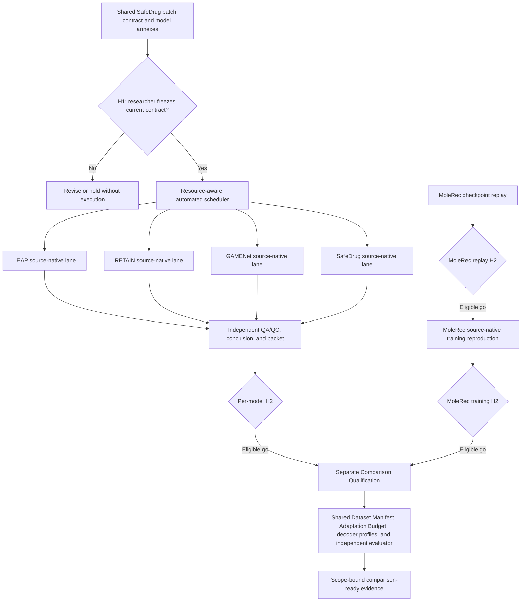
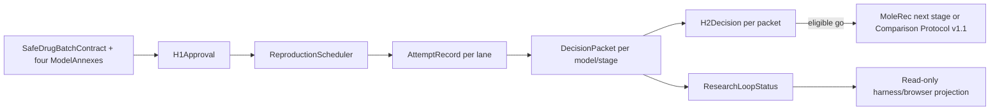

# Researcher HITL Reproduction Decision Loop - Plan

## Goal Capsule

- **Objective:** Give one accountable researcher a two-gate evidence loop for a four-model SafeDrug Reproduction Mode batch, a staged MoleRec reproduction, and later five-model Comparison Qualification under one protocol-owned scope.
- **Product authority:** The research owner signs H1 and every H2; Reproduction Contracts own source-native claims; the Unified Research Protocol owns comparison claims; neither Codex, ARIS, nor the browser may override scientific evidence.
- **Execution profile:** Code and documentation live in the Active Research Home, while real EHR processing, baseline environments, training, checkpoint inference, and GPU evaluation remain on 319 after a fresh remote preflight.
- **Open blockers:** Local synthetic implementation may proceed, but real execution remains blocked by 319 authority and data checks, unresolved SafeDrug license evidence, and source-backed per-model acceptance intervals that must be frozen at H1.

---

## Product Contract

### Summary

Build a researcher-centered Human-in-the-loop system that freezes scientific intent before execution, automates auditable work between gates, and returns one decision-ready evidence packet for each model or stage.
The v1 research program covers source-native reproduction of LEAP, RETAIN, GAMENet, and SafeDrug, then staged MoleRec replay and retraining; only separately qualified results may enter the five-model comparison surface.

### Problem Frame

The archived `New-Search` system accumulated idea stages, route state, experiment harnesses, reports, and duplicated projections across many locations.
Idea framing hardened into workflow structure, while the researcher still had to reconstruct what ran, whether the run was valid, what the evidence meant, and which action remained legitimate.

The current repository has immutable source identities, fail-closed action gates, public-safe records, and an explicit Reproduction Mode versus Comparison Mode boundary.
Its accepted HITL plan still treats one GAMENet run as the v1 proving ground and defers the other four baselines, so it no longer matches the confirmed research program.

First-principles practice requires a contract before results, separate QA/QC, independently stated failure signals, equal comparison conditions, and a claim-to-evidence chain.
The system must remove repetitive execution work without turning model agreement into evidence, checkpoint replay into training reproducibility, or source-native numbers into a fair leaderboard.

### Key Decisions

- **SafeDrug four-model batch replaces the single-model v1.** Governs R5, R10-R20. (session-settled: user-directed — chosen over a single GAMENet proving run or mixed baseline repositories: one pinned SafeDrug source provides the selected LEAP, RETAIN, GAMENet, and SafeDrug implementations while each model remains independently decidable.)
- **The actual `main` branch commit is authoritative.** Governs R10, R18. (session-settled: user-directed — chosen over the README's historical `master` wording or an archived paper branch: immutable source identity is stronger than a moving or stale branch label.)
- **One shared H1, independent H2 decisions.** Governs R5-R9, R20. (session-settled: user-directed — chosen over four duplicated contracts or one monolithic batch verdict: shared facts freeze once while one model's failure cannot block another model's trust decision.)
- **Researcher traceability outranks automation coverage.** Governs R1-R9, R44. (session-settled: user-directed — chosen over review-time reduction or automation percentage as the primary outcome: a faster opaque decision would repeat the archive's failure.)
- **Reproduction acceptance and comparison readiness remain separate claims.** Governs R18-R20, R28-R38. (session-settled: user-approved — chosen over using README or paper proximity as the complete comparison authority: source-native agreement does not establish a shared cohort, decoder, adaptation budget, or evaluator.)
- **MoleRec enters through three evidence stages.** Governs R21-R27. (session-settled: user-directed — chosen over checkpoint replay alone or immediate undifferentiated retraining: replay, training reproducibility, and comparison qualification answer different questions.)
- **SafeDrug `main` defines Comparison Protocol v1's data lineage.** Governs R26, R28-R30. (session-settled: user-directed — chosen over making MoleRec's `c7218d0` lineage the five-model protocol or deferring MoleRec comparison: the four-model authority remains stable and MoleRec retrains on the shared snapshot.)
- **Comparison decoding uses a layered protocol rule.** Governs R30, R32-R37. (session-settled: user-directed — chosen over retaining every historical threshold or forcing one decoder onto incompatible architectures: equal validation-only selection applies to comparable score surfaces while structural sequence decoding remains visible and unchanged.)
- **Auditable domestic mirrors are preferred.** Governs R39-R42. (session-settled: user-directed — chosen over official-only dependency access or unaudited mirror substitution: domestic mirrors reduce installation friction while artifact digests and logged fallback preserve provenance.)
- **Evidence facts and human actions stay distinct.** Governs R6, R8-R9, R19, R25, R38, R44. (session-settled: user-directed — chosen over human result overrides or agent-made final decisions: H2 may choose an action but cannot rewrite QA/QC or the computed evidence conclusion.)

### Actors

- A1. **Research owner:** Defines scientific intent, approves H1, reviews each Decision Packet, signs H2, and remains accountable for every conclusion and next action.
- A2. **Codex and ARIS control plane:** Drafts contracts, derives known facts, coordinates authorized work, monitors exceptions, assembles evidence, and propagates signed decisions without final scientific authority.
- A3. **MedRec Research Library:** Validates public-safe records, mode boundaries, evidence freshness, protocol scope, and action eligibility without depending on ARIS or imported baseline frameworks.
- A4. **319 execution plane:** Runs isolated source-native and Comparison Mode environments, retains restricted artifacts, and emits only approved public-safe evidence after preflight.
- A5. **Independent core evaluator:** Joins target-free predictions to core-owned targets, recomputes protocol metrics, and rejects incomplete, malformed, stale, or scope-mismatched evidence.

### Requirements

- **Research authority and HITL gates**
  - R1. One named research owner must remain accountable for every H1 and H2; agent consensus and automated checks cannot substitute for that owner.
  - R2. H1 must freeze the research target, source identities, data lineage, execution mode, expected evidence, acceptance and rejection rules, repair budget, resource ceiling, stopping rules, and non-waivable boundaries before relevant results are visible.
  - R3. Scientific-field changes must create a new contract version and invalidate dependent signatures, while copy, formatting, and spelling changes leave scientific authority current.
  - R4. Execution must fail closed when authority, source, data, privacy, environment, budget, or required evidence is missing or stale.
  - R5. The SafeDrug batch must use one shared H1 for source, data, environment, common evaluation semantics, and total resources, with a separate annex for every model's native behavior and criteria.
  - R6. Every model or MoleRec stage must receive its own QA/QC, evidence conclusion, Decision Packet, and H2 action instead of inheriting a batch-level verdict.
  - R7. Work between current H1 and H2 gates must be automated until a named exception changes scientific validity, authority, privacy, legality, or resource exposure.
  - R8. H2 must allow `go`, `revise`, `kill`, or `hold`, but `go` is available only for current `usable + accepted` evidence and cannot rewrite the evidence conclusion.
  - R9. `revise` may remain in one contract family only while the model, pinned source, scientific mode, and research target remain unchanged.
- **SafeDrug four-model Reproduction Mode batch**
  - R10. LEAP, RETAIN, GAMENet, and SafeDrug must use `ycq091044/SafeDrug@88ce5c377dcdc2aa01aaa88f5478dfa4373ba49a`, whose actual branch identity is `main`.
  - R11. The four models must run as logically parallel work with resource-aware scheduling; physical concurrency is optional and cannot exceed the H1 resource ceiling.
  - R12. Each Reproduction Mode annex must preserve its recorded preprocessing, eligible visits, split, feature access, training, checkpoint, prediction, threshold or decoder, and evaluation behavior.
  - R13. Shared files and metric labels must not be treated as proof that the four implementations evaluate identical visits or apply identical prediction semantics.
  - R14. Training must preserve upstream seed behavior, and multi-seed training is required only when the pinned implementation natively defines it.
  - R15. Evaluation must reproduce the source's ten rounds of 80% test-set bootstrap sampling with replacement, and the resulting uncertainty must not be described as training-seed variance.
  - R16. Every model's required outcome set must contain DDI rate, Jaccard, F1, PRAUC, and average medication count.
  - R17. H1 must predeclare one statistical agreement interval for every required outcome, and failure on one required outcome cannot be compensated by strength on another.
  - R18. Matching-branch README, code, and paper evidence may define source-native targets, while branch-mismatched paper values remain contextual and missing independent targets cap the affected model at `inconclusive`.
  - R19. Each attempt must be classified `usable`, `usable-with-limits`, or `invalid` before its model conclusion becomes `accepted`, `rejected`, or `inconclusive`.
  - R20. One model's invalid, rejected, or inconclusive evidence must not block another model from receiving an independent trusted conclusion.
- **MoleRec staged evidence**
  - R21. MoleRec must use `yangnianzu0515/MoleRec@dd5afaf0a503fd3de3229f86ec7f26b345d10e3a`, with `ycq091044/SafeDrug@c7218d0976e5ee5588aeaf5bdbc86b338126bba5` recorded only as its source-native preprocessing lineage.
  - R22. Checkpoint replay must bind the selected MoleRec variant, checkpoint provenance, vocabulary order, preprocessing artifacts, DDI artifacts, and BRICS-derived substructure artifacts as one immutable bundle.
  - R23. Successful checkpoint replay may establish only that the declared bundle can reproduce its expected evaluation behavior; it cannot establish from-scratch training reproducibility or Comparison Qualification.
  - R24. From-scratch training reproduction must use the pinned MoleRec source and its matching source-native artifacts, split, selection, and evaluation semantics as a separate characterization.
  - R25. Advancement from checkpoint replay to training reproduction, and from training reproduction to comparison work, must require an eligible H2 `go` for the preceding evidence claim.
  - R26. MoleRec Comparison Qualification must retrain under the SafeDrug-main-derived Comparison Protocol v1 snapshot and may not reuse `c7218d0` source-native results as comparison evidence.
  - R27. The MoleRec repository's reuse of GAMENet and SafeDrug pipeline concepts must not be treated as executable reproduction support for LEAP, RETAIN, GAMENet, or SafeDrug.
- **Unified comparison qualification**
  - R28. Comparison Protocol v1 must treat the SafeDrug `main@88ce5c3` processing lineage as a version boundary distinct from MoleRec's `c7218d0` Reproduction Mode lineage.
  - R29. One Dataset Manifest built on 319 must freeze cohort rules, patient-disjoint split membership, eligible visits, medication vocabulary, preparation identity, and public-safe digests for all five methods.
  - R30. A versioned Unified Research Protocol amendment must own the five required outcomes, uncertainty procedure, decoder classes, and selection rules before any Comparison Mode test evaluation.
  - R31. Source-native reproduction results must never enter a relative-performance table or ranking unless the corresponding method has separate current Comparison Qualification for the exact Comparison Scope.
  - R32. A Prediction Adapter may translate storage, identifiers, invocation, and output representation but must not change a Baseline Core, feature information, training objective, ranking, threshold, decoder, or prediction set.
  - R33. The SafeDrug family may share one transport adapter with explicit model profiles, while MoleRec must use a separate adapter and profile bound to its own artifact lineage.
  - R34. Reproduction profiles must preserve source-native visit inclusion, threshold, decoder, and evaluation differences instead of normalizing them behind shared metric names.
  - R35. Comparison profiles for score-producing methods must use one predeclared validation-only threshold selection rule and equal budget, while structure-defined sequence decoders retain native behavior and declare their decoder class.
  - R36. The independent evaluator must recompute every protocol metric from complete target-free predictions and core-owned targets without accepting baseline-reported aggregates as authority.
  - R37. One Adaptation Budget must fix the selection metric, allowed search, trial or compute allowance, stopping rule, seed policy, and mechanical integration allowance for every compared method.
  - R38. `comparison_ready` must require at least one current Comparison Qualification; `accepted` Reproduction Mode evidence, a provided checkpoint, or close paper numbers cannot create it.
- **Repair, evidence, and privacy boundaries**
  - R39. Public dependencies must prefer auditable domestic mirrors, with official fallback and the selected endpoint, artifact identity, and digest recorded.
  - R40. Agents may perform compatibility repairs only within the H1 repair budget and must fail closed when that budget is exhausted.
  - R41. A repair that changes dependency or build artifacts must leave the attempt `usable-with-limits` until independent equivalence evidence supports an upgrade, while an endpoint-only change with the same artifact digest does not change evidence status.
  - R42. A researcher may waive scientific completeness for exploratory continuation only when `go` remains disabled and the conclusion is capped at `inconclusive`; privacy, legality, authority, and resource ceilings are non-waivable.
  - R43. Patient data, split membership, patient-level predictions, model weights, private traces, credentials, and restricted paths must remain outside Git and public-safe packets.
  - R44. Every Decision Packet must bind the current contract, attempt history, QA/QC, required outcomes, uncertainty, deviations, repair evidence, limitations, allowed claims, blockers, and action consequences without requiring the researcher to reconstruct state elsewhere.

The authority and evidence flow is:

### Key Flows

- F1. **Freeze the SafeDrug batch**
  - **Trigger:** The research owner selects the four SafeDrug implementations for Reproduction Mode.
  - **Actors:** A1, A2, A3
  - **Steps:** Known shared facts populate one contract, model-specific semantics populate four annexes, unresolved targets and limits are surfaced, and A1 signs H1 only after all protected fields are visible.
  - **Outcome:** One current contract authorizes bounded work for four independent evidence lanes.
  - **Covered by:** R1-R5, R10, R17-R18
- F2. **Execute and characterize four models**
  - **Trigger:** H1 and remote authority are current.
  - **Actors:** A2, A3, A4
  - **Steps:** The scheduler performs preflight, source-native runs, monitoring, bootstrap evaluation, repair control, and public-safe intake while isolating model failures.
  - **Outcome:** Each model reaches its own QA/QC and conclusion without a batch-wide scientific verdict.
  - **Covered by:** R4, R6-R7, R11-R20, R39-R43
- F3. **Review one model and sign H2**
  - **Trigger:** A model lane ends, stops, or becomes blocked and its current Decision Packet is complete.
  - **Actors:** A1, A2, A3
  - **Steps:** The packet compares evidence with the frozen annex, exposes limitations and action consequences, and records A1's rationale and eligible action.
  - **Outcome:** The signed action advances, revises, closes, or holds only that model lane.
  - **Covered by:** R6, R8-R9, R17-R20, R44
- F4. **Progress MoleRec through staged evidence**
  - **Trigger:** The pinned checkpoint bundle or the preceding MoleRec stage is authorized.
  - **Actors:** A1, A2, A3, A4
  - **Steps:** The system validates the bound bundle, separates replay from training evidence, and requires a current H2 before opening the next claim.
  - **Outcome:** MoleRec evidence states exactly whether replay, training reproduction, or both were accepted.
  - **Covered by:** R21-R27, R39-R44
- F5. **Qualify methods for fair comparison**
  - **Trigger:** An eligible H2 opens Comparison Qualification under a frozen Comparison Scope.
  - **Actors:** A1-A5
  - **Steps:** Each unchanged Baseline Core trains or runs on the shared manifest under the equal budget, emits target-free predictions, and receives independent protocol evaluation.
  - **Outcome:** Only scope-bound qualifications contribute to a five-model comparison surface.
  - **Covered by:** R26, R28-R38, R43-R44

### Acceptance Examples

- AE1. **Covers R3-R4.** Given a signed H1, when a source revision, data identity, scientific mode, target, metric, interval, decoder rule, repair budget, or stopping rule changes, then the signature becomes stale and execution remains blocked until a new contract is signed.
- AE2. **Covers R5-R6, R20.** Given one current SafeDrug batch H1, when GAMENet completes and RETAIN remains blocked, then GAMENet may receive H2 without waiting for RETAIN or changing RETAIN's evidence state.
- AE3. **Covers R12-R13, R34.** Given RETAIN and SafeDrug share processed artifacts, when their source-native visit inclusion or thresholds differ, then Reproduction Mode preserves both profiles and does not describe their metric rows as identical-semantics evidence.
- AE4. **Covers R16-R19.** Given usable source-native results where four required outcomes pass and PRAUC misses its predeclared interval, when the annex defines that miss as rejection evidence, then the model conclusion is `rejected` without weighted compensation.
- AE5. **Covers R18-R20.** Given a model has no source-matched independent numeric target, when usable execution completes, then its conclusion is `inconclusive` and the other three models remain independently decidable.
- AE6. **Covers R22-R23.** Given a MoleRec checkpoint without its exact vocabulary or BRICS-derived artifacts, when replay is requested, then the bundle fails QA/QC and cannot support checkpoint reproducibility.
- AE7. **Covers R23-R25.** Given accepted MoleRec checkpoint replay, when no from-scratch training evidence exists, then the packet permits only the next reproduction stage and forbids a training-reproducibility claim.
- AE8. **Covers R26, R31, R38.** Given accepted MoleRec training reproduction on `c7218d0` lineage, when no current qualification exists for the main-derived Comparison Scope, then MoleRec remains absent from the fair leaderboard.
- AE9. **Covers R30, R35, R37.** Given a score-producing method, when its threshold is selected using test outcomes or more validation trials than the shared budget allows, then the run is invalid for Comparison Mode.
- AE10. **Covers R32-R35.** Given a Prediction Adapter changes RETAIN's threshold or LEAP's stop-token decoder, when qualification is evaluated, then the result is a modified method rather than the registered baseline.
- AE11. **Covers R39, R41.** Given a domestic mirror and official endpoint resolve to an artifact with the same digest, when the endpoint changes, then provenance records the endpoint change without downgrading the evidence.
- AE12. **Covers R40-R42.** Given a compatibility repair changes a dependency artifact within budget, when the run succeeds without equivalence evidence, then QA/QC is at most `usable-with-limits`, `go` remains disabled if scientific completeness was waived, and privacy or resource failures remain non-waivable.
- AE13. **Covers R8, R19, R44.** Given an invalid attempt or an `inconclusive` conclusion, when H2 opens, then the researcher may choose `revise`, `kill`, or `hold` but cannot choose `go` or relabel the evidence.

### Success Criteria

- One shared SafeDrug H1 and four independent H2 decisions remain reconstructible from immutable packets without reading raw logs, source files, or chat history.
- LEAP, RETAIN, GAMENet, and SafeDrug each receive independent QA/QC and `accepted`, `rejected`, or `inconclusive` conclusions against all five required outcomes.
- Source-native uncertainty is reported as ten rounds of 80% test-set bootstrap sampling and is never mislabeled as multi-seed training variance.
- MoleRec checkpoint replay, from-scratch training reproduction, and Comparison Qualification remain three separately attributable claims bound to their exact artifacts and data lineage.
- No Reproduction Mode result, paper table, provided checkpoint, registry string, or baseline-reported aggregate can enter the fair comparison surface without current scope-bound qualification.
- Comparison Mode uses one shared Dataset Manifest, versioned metric and decoder contract, equal Adaptation Budget, unchanged Baseline Cores, and independent evaluation.
- The normal path automates execution and evidence assembly while keeping contract freeze and final action under the named research owner's authority.
- Review time, execution latency, repair frequency, and automation coverage remain secondary diagnostics; decision traceability is the primary system outcome.

### Scope Boundaries

#### Deferred for later

- New medication-recommendation ideas, mechanism hypotheses, ablations, and paper claims that depend on this trusted baseline foundation.
- Baselines beyond LEAP, RETAIN, GAMENet, SafeDrug, and MoleRec.
- Multi-researcher approval, cryptographic signatures, external notifications, and general experiment scheduling beyond the resource-aware batch need.
- A separate idea-reframing loop for competing hypotheses and failure-driven research direction changes.

#### Outside this product's identity

- A clinician or patient decision-support system; the accountable human is the researcher.
- An end-to-end Research OS, idea leaderboard, autonomous paper factory, or browser for raw Workflow Traces.
- AI authority to approve scientific conclusions, change post-result criteria, suppress failed attempts, or revive a killed route.
- Local real-data training, restricted evidence in Git, or imported baseline source trees without license, provenance, and need review.
- Any leaderboard assembled by copying source-native or paper results across mismatched data, split, decoder, budget, or evaluator scopes.

### Dependencies and Assumptions

- SafeDrug source identity remains pinned to `88ce5c377dcdc2aa01aaa88f5478dfa4373ba49a`; its current audit does not yet establish a license disposition.
- MoleRec source identity remains pinned to `dd5afaf0a503fd3de3229f86ec7f26b345d10e3a`; regenerated BRICS-derived artifacts require a new bound bundle and may require retraining.
- A fresh 319 remote preflight must pass before any real-data, baseline-environment, training, checkpoint, GPU, or restricted-artifact action.
- Required MIMIC-III and auxiliary assets remain subject to access, privacy, license, integrity, and provenance constraints.
- Source-backed acceptance intervals may differ by model; if credible targets cannot be established before H1, the affected model remains eligible only for an `inconclusive` reproduction conclusion.
- The current Unified Research Protocol `1.0` does not yet own every metric and decoder rule required here, so R30 must be satisfied through an explicit versioned amendment rather than silent reinterpretation.
- Logical parallelism assumes the scheduler can serialize GPU-heavy work while preserving independent model state and total-budget accounting.

## Planning Contract

### Product Contract preservation

Product Contract unchanged. This enrichment resolves the planning questions below without changing the meaning or numbering of R1-R44, F1-F5, AE1-AE13, or the session-settled Key Decisions. The implementation units are additive to the current core boundary; they do not turn Reproduction Mode records into Comparison Run Records or authorize real-data execution locally.

### Key Technical Decisions

- **KTD1. Reproduction evidence uses a separate contract family.** Add `src/medrec_research/reproduction_contract.py` for the shared SafeDrug batch, model annexes, H1 approval, per-lane attempts, Decision Packets, H2 decisions, repair evidence, and MoleRec stage contracts. Do not extend `RunRecord`, whose Comparison-only invariant remains load-bearing. (Governs R1-R9, R21-R27, R44.)
- **KTD2. Scientific identity is a protected-field digest.** `SafeDrugBatchContract` and every stage contract compute a content SHA-256 from protected scientific fields only. Display labels, explanatory notes, evidence URLs, and timestamps are presentation metadata; changing them does not stale H1. Changing source revisions, data lineage, mode, required outcomes, intervals, decoder/threshold rules, repair/resource/stopping limits, or non-waivable boundaries changes the digest and invalidates dependent H1/H2 records. (Governs R2-R4, AE1.)
- **KTD3. One H1, independent lane packets.** H1 binds exactly four ordered SafeDrug `ModelAnnex` records, the common source/data/environment/evaluation identity, total resource ceiling, repair budget, acceptance intervals, stopping rules, and non-waivable boundaries. Each lane produces its own `AttemptRecord` and `DecisionPacket`; a blocked or failed lane is represented as evidence for that lane only. (Governs R5-R7, R11-R20, AE2.)
- **KTD4. H2 is a scientific action record, not an Action Gate.** `H2Decision` binds the current contract digest and packet digest, a named researcher, rationale, and one of `go`, `revise`, `kill`, or `hold`. `go` validates only when the packet is current, `usable`, and `accepted`; `inconclusive`, `rejected`, `invalid`, stale, privacy, authority, and resource failures cannot be upgraded by H2. The existing `ActionContext` remains the sole execution authorization surface. (Governs R8-R9, R19-R20, R25, R42, AE13.)
- **KTD5. Reproduction uncertainty is explicit and source-native.** Add `src/medrec_research/reproduction_evaluation.py` with the five required outcomes (`ddi_rate`, `jaccard`, `f1`, `prauc`, `average_medication_count`), a fixed ten-round, 80%-of-test, with-replacement bootstrap specification, source-backed acceptance intervals, and attempt/conclusion classification. Bootstrap uncertainty is never serialized as training-seed variance. A missing credible source interval caps the affected model at `inconclusive`. (Governs R15-R19, AE4-AE5.)
- **KTD6. Comparison Protocol v1.1 is an explicit amendment.** Add `src/medrec_research/comparison_protocol.py` and `docs/specs/UNIFIED_RESEARCH_PROTOCOL_V1_1.md`. It defines the five outcomes, `score_threshold` versus `structural_sequence` decoder classes, validation-only threshold selection, equal Adaptation Budget fields, and independent evaluator inputs. Existing Protocol 1.0 and existing records remain readable; only a v1.1 `ComparisonQualification` may use the new profile fields. (Governs R28-R38, AE8-AE10.)
- **KTD7. MoleRec bundle identity is exact and staged.** Add `src/medrec_research/molerec.py` with an immutable `MoleRecArtifactBundle` digest over variant, pinned source revisions, checkpoint, vocabulary, preprocessing, DDI, and BRICS artifacts. `MoleRecStageContract` permits replay, training reproduction, and comparison qualification as separate stages; each later stage requires the prior packet's eligible H2 `go`. Replay never implies training or comparison readiness. (Governs R21-R27, AE6-AE8.)
- **KTD8. Scheduler ownership stays at the Mac/ARIS boundary.** Add only a deterministic public-safe `src/medrec_research/reproduction_scheduler.py` contract for logical lanes, resource ceilings, exception routing, and repair accounting. It produces a schedule/decision description and never opens SSH, reads restricted data, launches Conda, or mutates an Action Gate. ARIS remains responsible for remote submission/monitoring and 319 remains responsible for restricted execution. (Governs R4, R7, R11, R39-R43.)
- **KTD9. Browser status is additive and read-only.** Add `src/medrec_research/research_loop_status.py` for per-model/stage packet completeness, conclusion, H2 eligibility, stale state, and blockers. Expose it through a read-only `/api/research-loop` harness response and render progressive disclosure in the existing status page; no browser action may approve H1/H2 or execute work. (Governs R6-R8, R20, R25, R44.)
- **KTD10. Fixtures precede production wiring.** Add public synthetic fixtures for H1, one accepted/rejected/inconclusive packet, H2 decisions, MoleRec bundle/stages, v1.1 protocol profiles, bootstrap/interval evidence, scheduler lanes, and browser status. Use these fixtures to drive schema and projection tests before any real-data integration is considered. (Governs R4, R15-R17, R22-R26, R30-R37, R43.)

### Protected scientific fields

The protected digest set is fixed in code and documented in the contract module. It includes: `contract_version`, `batch_id`, `research_target`, `mode`, ordered model/stage identities, every pinned repository and commit, dataset lineage and manifest digests, split/eligible-visit rules, feature access, required outcome names and order, source acceptance intervals, bootstrap specification, decoder/threshold policy, Adaptation Budget, repair budget, resource ceiling, stopping rules, and non-waivable boundaries. It excludes display names, prose notes, evidence URLs, reviewer timestamps, and packet presentation ordering. Serialization sorts maps and records by stable identifiers before hashing.

### High-Level Design

Core records are frozen dataclasses with strict JSON round-trips, content-addressed IDs, and public-safe field validation. The scheduler accepts lane/resource declarations and emits deterministic next-lane decisions; ARIS translates those decisions into the existing Action Context and remote playbook. The evaluator consumes complete target-free predictions plus core-owned targets and emits a packet-ready outcome/uncertainty record. No unit imports ARIS or a baseline framework.

## Implementation Units

### U1. Reproduction contracts and HITL records

**Files:** create `src/medrec_research/reproduction_contract.py`; modify `src/medrec_research/__init__.py`; create `tests/unit/test_reproduction_contract.py`; create `fixtures/benchmark/safedrug-batch-h1.json`, `fixtures/benchmark/decision-packet-accepted.json`, `fixtures/benchmark/decision-packet-inconclusive.json`, and `fixtures/benchmark/h2-decisions.json`.

**Approach:**

1. Define the enums and immutable records named in KTD1-KTD4. Require lowercase identifiers, public-safe strings, non-empty unique ordered annexes, and SHA-256 digests through `_validation.py` helpers.
2. Make `SafeDrugBatchContract.create()` derive `contract_sha256` from the protected payload and reject fewer/more than the four pinned SafeDrug model IDs or a mismatched `main@88ce5c3` source revision.
3. Make `H1Approval.create()` require a complete contract, named owner, explicit `accepted` decision, and current contract digest; expose `is_current()` for stale detection.
4. Model attempts with immutable QA/QC, evidence conclusion, deviation/repair records, and public-safe artifact digests. A packet must include the current contract digest, all attempted/completed lane IDs, required outcomes, uncertainty, limitations, allowed claims, blockers, and action consequences.
5. Enforce H2 rules in constructors: packet and contract digests must match; `go` is legal only for `usable` + `accepted`; `revise` stays in the same contract family and source/mode/target; `kill`/`hold` do not authorize execution.
6. Represent MoleRec stage transitions as a separate contract family and reject a stage whose parent packet lacks current H2 `go`.

**Tests:** round-trip every record; reject scientific-field mutation with stale H1; allow presentation-only edits; isolate one failed lane; reject missing interval/required outcome/repair evidence; reject `go` for rejected, inconclusive, invalid, stale, privacy, or resource-capped packets; reject MoleRec stage skipping and contract-family drift.

### U2. Reproduction outcomes, bootstrap, and conclusion classification

**Files:** create `src/medrec_research/reproduction_evaluation.py`; modify `src/medrec_research/reproduction_characterization.py` only where shared validation can be reused; modify `src/medrec_research/__init__.py`; create `tests/unit/test_reproduction_evaluation.py`; extend `tests/unit/test_evaluation.py`; create `fixtures/benchmark/reproduction-outcomes.json`, `fixtures/benchmark/bootstrap-intervals.json`, and `fixtures/benchmark/source-acceptance-intervals.json`.

**Approach:**

1. Define `ReproductionMetric`, `OutcomeObservation`, `BootstrapSpec(rounds=10, sample_fraction=0.8, with_replacement=True)`, `BootstrapEstimate`, and `SourceAcceptanceProfile` records. Reject non-finite values, missing required metrics, invalid intervals, and sample sizes that cannot produce an 80% bootstrap sample.
2. Compute DDI rate and PRAUC only from explicitly supplied, validated core-owned inputs; retain existing set metrics and medication-count semantics. Keep the existing `EvaluationResult` API stable for Protocol Check and legacy callers.
3. Implement deterministic bootstrap sampling with a declared seed and source profile. Store the ten estimates and an 80% interval per metric; never call the field `seed_variance`.
4. Compare each estimate against its predeclared source interval without weighted compensation. Missing source-backed intervals produce `inconclusive`; one required-outcome miss produces `rejected`; complete passing evidence produces `accepted`.
5. Map attempt validity (`usable`, `usable-with-limits`, `invalid`) before model conclusion, and downgrade dependency/build repairs without equivalence evidence to `usable-with-limits`.

**Tests:** deterministic ten-round sampling; exact 80% sample size and replacement; bootstrap-vs-training-seed labeling; DDI/PRAUC edge cases; all-required-outcomes rule; missing target interval -> inconclusive; artifact-changing repair -> usable-with-limits; complete pass/fail classification; no cross-lane aggregation.

### U3. Comparison Protocol v1.1 and independent qualification profile

**Files:** create `src/medrec_research/comparison_protocol.py`; create `docs/specs/UNIFIED_RESEARCH_PROTOCOL_V1_1.md`; modify `src/medrec_research/comparison_scope.py` and `src/medrec_research/registry.py` with backward-compatible optional amendment/profile digests; extend `src/medrec_research/evaluation.py` only through additive metric helpers; create `tests/unit/test_comparison_protocol.py`; extend `tests/unit/test_registry.py`, `tests/unit/test_process_adapter.py`, and `tests/unit/test_run_record.py`; create `fixtures/protocol/comparison-v1-1.json` and `fixtures/protocol/decoder-profiles.json`.

**Approach:**

1. Define `DecoderClass` (`score_threshold`, `structural_sequence`), `ThresholdSelectionRule` (validation-only, predeclared metric, bounded trials), `AdaptationBudget`, and `ComparisonProtocolV1_1` with a content digest.
2. Require every score-producing profile to select thresholds from validation only, reject test-peeking or budget overrun, and preserve structural decoders unchanged. Bind the profile/amendment digest to `ComparisonScope`/`ComparisonQualification` without changing existing v1 records.
3. Require complete target-free prediction coverage and core-owned target joins for the five protocol outcomes. Baseline-reported aggregates remain descriptive only.
4. Document the SafeDrug-main lineage boundary and MoleRec's separate source-native lineage in the amendment; prohibit source-native rows from comparison tables without exact current qualification.

**Tests:** round-trip amendment/profile/budget; reject test-based threshold selection, extra trials, decoder mutation, incomplete predictions, scope/profile drift, and c7218d0 lineage reuse; preserve v1 scope and RunRecord fixtures; accept valid score and structural profiles under equal budget.

### U4. MoleRec immutable artifact bundle and staged evidence

**Files:** create `src/medrec_research/molerec.py`; modify `src/medrec_research/reproduction_contract.py` to bind stage records; modify `src/medrec_research/__init__.py`; create `tests/unit/test_molerec.py`; create `fixtures/benchmark/molerec-replay-bundle.json`, `fixtures/benchmark/molerec-stage-contracts.json`, and `fixtures/benchmark/molerec-equivalence.json`.

**Approach:**

1. Validate the pinned MoleRec commit and record SafeDrug `c7218d0` only as preprocessing lineage; never infer support for the four SafeDrug models.
2. Hash variant, checkpoint, vocabulary order, preprocessing, DDI, and BRICS artifact identities as one `MoleRecArtifactBundle`.
3. Permit replay evidence only for the declared bundle; require exact bundle equivalence for a training stage; require a new v1.1 Comparison Scope for comparison qualification.

**Tests:** missing/mismatched artifact rejection; replay accepted without training claim; training blocked without replay H2 `go`; c7218d0 evidence excluded from comparison qualification; regenerated BRICS digest invalidates the bundle.

### U5. Deterministic lane scheduler and bounded repairs

**Files:** create `src/medrec_research/reproduction_scheduler.py`; modify `src/medrec_research/__init__.py`; create `tests/unit/test_reproduction_scheduler.py`; create `fixtures/benchmark/scheduler-lanes.json` and `fixtures/benchmark/scheduler-exceptions.json`.

**Approach:**

1. Define `LaneSpec`, `ResourceCeiling`, `LaneState`, `ScheduleDecision`, `RepairBudget`, and `ExceptionDisposition` as public-safe pure records.
2. Schedule all four SafeDrug lanes logically in stable annex order while enforcing total CPU/GPU/memory limits; physical concurrency is an execution-plane choice.
3. Keep authority, privacy, legality, and resource exceptions non-waivable. Route scientific/dependency exceptions through the declared repair budget and mark the affected attempt `usable-with-limits` when equivalence evidence is absent.
4. Emit no SSH/Conda/process commands. ARIS consumes the decision and calls the existing Action Context/remote playbook once; there is no second gate or ambient state loader.

**Tests:** deterministic ordering; resource ceiling never exceeded; one lane failure does not cancel independent lanes; repair budget exhaustion fails closed; non-waivable exception cannot be waived; serialization contains no paths, credentials, or patient data.

### U6. Read-only status, harness, and browser projection

**Files:** create `src/medrec_research/research_loop_status.py`; modify `src/medrec_research/harness.py`; modify `src/medrec_research/web/app.js`, `src/medrec_research/web/index.html`, and `src/medrec_research/web/app.css`; extend `tests/unit/test_project_status.py`; create `tests/unit/test_research_loop_status.py` and `tests/integration/test_research_loop_harness.py`; create `fixtures/status/research-loop-pending.json`, `fixtures/status/research-loop-mixed.json`, and `fixtures/status/research-loop-stale.json`.

**Approach:**

1. Project each model/stage as `LaneProgress` with packet completeness, attempt state, conclusion, H2 action eligibility, current/stale marker, blockers, and public evidence links. Keep aggregate `ProjectStatus` semantics unchanged.
2. Add a read-only harness loader/`/api/research-loop` response that fails closed on malformed or stale loop status and never returns restricted paths or raw traces.
3. Render progressive disclosure: shared H1 summary first, per-lane status rows next, packet evidence/details on demand, and visible blockers/limits. Preserve existing action-context behavior and mobile layout.

**Tests:** current/mixed/stale projection; independent lane status; blocked H2 action visibility; malformed snapshot fail-closed; harness route contract; browser fixture rendering and no execution/write endpoint; accessibility and responsive smoke checks.

### U7. Public exports, CLI/fixture wiring, and documentation

**Files:** modify `src/medrec_research/__init__.py` and `src/medrec_research/cli.py`; extend `tests/integration/test_status_cli.py` and `tests/integration/test_harness_cli.py`; update `docs/specs/UNIFIED_RESEARCH_PROTOCOL.md` only for cross-links; add the fixture files listed above.

**Approach:** expose JSON validation/projection commands for synthetic contract and packet fixtures only. Do not add a command that starts a remote run or accepts private paths. Keep existing CLI output and exit codes backward-compatible.

**Tests:** fixture round-trips through public exports; CLI validation of accepted/rejected/inconclusive packets; invalid/stale H1/H2 exit non-zero; legacy commands and fixtures remain green.

## Sequencing and Dependencies

1. U1 establishes the content-addressed authority and packet vocabulary.
2. U2 supplies the outcome and uncertainty evidence consumed by U1 packets.
3. U3 defines Comparison v1.1 and is independent of U2's source-native evaluator, but its qualification binding follows U1's mode boundary.
4. U4 depends on U1 and feeds the staged H2 transitions.
5. U5 depends on U1's repair/attempt records and is pure scheduling only.
6. U6 depends on U1 packet shapes and U5 lane states; it must remain read-only.
7. U7 wires exports/fixtures/CLI after the schemas stabilize.

Execution-time gates remain outside this local implementation: SafeDrug license disposition, 319 remote preflight and data authorization, MIMIC/auxiliary asset access, and source-backed acceptance intervals must pass before any real baseline action. No local synthetic pass is experimental evidence.

## Verification Contract

- **Unit proof:** new U1-U5 tests cover every constructor invariant, digest/staleness transition, mode boundary, interval/classification rule, bootstrap parameter, repair budget, and scheduler exception. Existing tests for `run_record`, `comparison_scope`, `evaluation`, `benchmark_state`, `project_status`, and adapters remain unchanged or gain only additive cases.
- **Integration proof:** synthetic fixture round-trips through package exports and CLI; harness serves current/mixed/stale loop snapshots; malformed or restricted fields fail closed.
- **Behavior-change evidence:** ce-work must report relevant units, existing tests inspected, tests added/changed or intentionally reused, at least one red characterization for changed semantics where applicable, the exact verification command, and any deliberate exception. LFG does not invent a test strategy.
- **Required local commands:** `rtk proxy /opt/homebrew/bin/uv run pytest`, `rtk proxy /opt/homebrew/bin/uv run ruff check .`, `rtk proxy /opt/homebrew/bin/uv run ruff format --check .`, and `markdownlint '**/*.md' --ignore '.agents/**'`.
- **Forbidden verification:** no real-data, GPU, baseline Conda, restricted artifact, SSH, or remote-execution command on the Mac harness.

## Risks and Mitigations

| Risk | Mitigation |
| --- | --- |
| New records accidentally become Comparison evidence | Separate module and explicit `mode`/scope checks; keep `RunRecord` Comparison-only. |
| Digest includes mutable presentation text | Central protected-field projection with tests for presentation-only edits and scientific-field staleness. |
| DDI/PRAUC inputs are incomplete or target-bearing | Require explicit validated inputs and complete target-free prediction coverage; cap at invalid/inconclusive. |
| Existing Protocol 1.0 fixtures break | Make v1.1 fields optional/additive and preserve legacy constructors/parsers. |
| Scheduler becomes a second authority gate | Pure schedule/exception records only; ARIS invokes the existing Action Context. |
| Browser implies scientific authorization | Read-only route, packet completeness display, and no H1/H2 mutation endpoint. |
| Restricted data leaks into public fixtures | Public-string/path validators, synthetic-only fixtures, and serialization tests for forbidden fields. |
| User worktree contains unrelated documentation edits | Keep implementation changes scoped to U1-U7 paths; do not revert or fold unrelated edits into feature decisions. |

## Definition of Done

- Plan metadata is `artifact_contract: ce-unified-plan/v1`, `artifact_readiness: implementation-ready`, and `execution: code`.
- One shared SafeDrug contract produces a current H1 digest and four independently decidable model packets/H2 records with no private fields.
- Reproduction evidence reports all five outcomes and the declared ten-round 80% bootstrap interval, with correct invalid/usable/inconclusive/accepted/rejected semantics.
- MoleRec replay, training reproduction, and Comparison Qualification are separate immutable stages with exact artifact bundles and H2 gating.
- Comparison Protocol v1.1 owns decoder/threshold/budget rules and cannot be satisfied by source-native or baseline-reported aggregates.
- Scheduler decisions enforce the resource/repair/non-waivable boundaries without remote side effects or a second action gate.
- Read-only status/harness/browser projection exposes shared H1, independent lanes, packet completeness, blockers, stale state, and H2 eligibility while preserving existing status/action contracts.
- Synthetic fixtures, unit/integration tests, lint/format, and Markdown validation pass; ce-work returns the route-aware receipt and verification evidence required by LFG.

## Execution-time Questions (must remain blockers, not guesses)

- Has the SafeDrug license been cleared for the selected commit and each model lane?
- Has the fresh 319 remote preflight, data authorization, and isolated environment check passed?
- Are MIMIC and auxiliary assets available with acceptable privacy, license, integrity, and provenance evidence?
- Can a source-backed acceptance interval be cited for every required metric before H1? If not, mark that lane `inconclusive` and keep `go` disabled.
- Do regenerated MoleRec BRICS artifacts match the pinned bundle, or is retraining required?

## Sources and Research

- `docs/guides/first-principles-research-practice.md` owns contract-before-results, QA/QC separation, fair comparison, evidence chains, stopping rules, and researcher accountability.
- `docs/guides/first-principles-research-practice-sources.md` records the guide's evidence provenance and access limits.
- `CONTEXT.md`, `ARCHITECTURE.md`, and `docs/specs/UNIFIED_RESEARCH_PROTOCOL.md` define domain language, trust boundaries, Reproduction Mode, Comparison Mode, Baseline Core, Prediction Adapter, Dataset Manifest, Adaptation Budget, and Comparison Qualification.
- `baselines/registry.toml`, `baselines/audits/`, and `docs/plans/2026-07-14-007-chore-final-five-baseline-program.md` pin the five active source identities and current readiness boundary.
- [SafeDrug main at `88ce5c3`](https://github.com/ycq091044/SafeDrug/tree/88ce5c377dcdc2aa01aaa88f5478dfa4373ba49a) contains the selected LEAP, RETAIN, GAMENet, and SafeDrug implementations and their source-native entry points.
- [SafeDrug](https://arxiv.org/abs/2105.02711) reports the paper evaluation outcomes and bootstrap procedure but is not an exact target for a branch-mismatched contract.
- [MoleRec at `dd5afaf`](https://github.com/yangnianzu0515/MoleRec/tree/dd5afaf0a503fd3de3229f86ec7f26b345d10e3a) provides two MoleRec variants and best-model weights, binds processing lineage to SafeDrug `c7218d0`, and warns that regenerated BRICS artifacts may require retraining.
- `New-Search@9971464253c556345262b22ed6d44b2cc14c9da8:research-wiki/experiments/egsf_e3b_strong_followup.md` and `New-Search@9971464253c556345262b22ed6d44b2cc14c9da8:refine-logs/CRC_PS_R006_FAILURE_ANALYSIS.md` provide governance replays for valid negative evidence and route closure, not medication-recommendation reproduction evidence.
