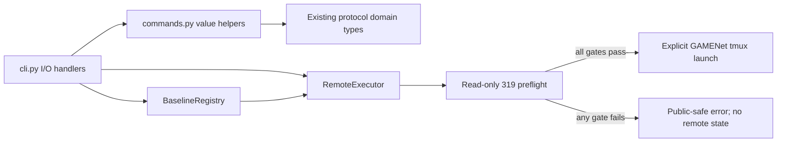
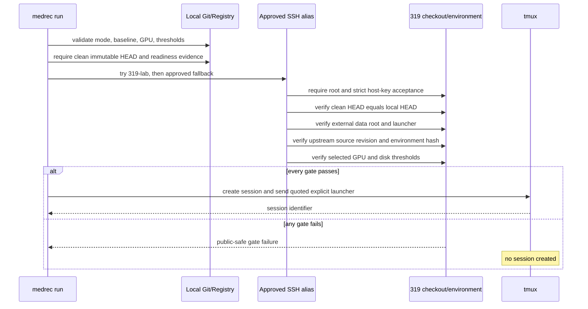

# Refactor: Address Architecture Friction Points

## Goal Capsule

Refactor two proven friction points without recreating the orchestration layer removed in `ce2e71f`: isolate value-level CLI behavior for fast unit tests, and make the existing remote baseline launcher explicit, testable, and fail closed behind the 319 execution preflight.

The hidden critical question is not whether local and remote execution can share an interface. Project policy already answers that: external baseline environments and real computation belong only on 319. The question is whether the current remote path can submit a declared baseline without bypassing source, readiness, environment, data-root, GPU, or disk checks. Today it cannot because `RemoteExecutor.run_baseline()` invents a `run_<baseline>.py` entrypoint and performs no preflight, while GAMENet actually uses `baselines/scripts/run_gamenet_319.sh`.

This work preserves all four existing CLI commands, adds one remote-only Reproduction Mode submission command, and does not run a real baseline during implementation or verification.

## Product Contract

### User workflow

1. A developer can test prediction parsing, comparison acceptance, evaluation, and registry formatting in-process without constructing `argparse.Namespace` objects or spawning a CLI subprocess.
2. Existing `reference`, `accept-comparison`, `evaluate`, and `baseline list` invocations retain their arguments, outputs, and exit-code behavior.
3. `medrec run --mode reproduction --baseline-id gamenet --gpu <index>` selects only an approved 319 SSH alias, runs the complete read-only preflight, and submits the declared GAMENet launcher only if every gate passes.
4. `medrec run --dry-run ...` validates local inputs and prints the planned remote command without opening SSH, creating tmux state, or claiming that remote preflight passed.
5. A failed gate produces a public-safe error and creates no tmux session.

### Success conditions

- Repeated prediction-file parsing lives in one tested function.
- Comparison acceptance receives every scientific input as a structured value; it does not read paths or print output.
- CLI handlers retain file I/O, hashing of input bytes, output writes, and presentation.
- Remote execution has no local production variant and no generic `ExecutionTarget`, `RunSpec`, or `RunHandle` hierarchy.
- The GAMENet launcher is an explicit argument vector; no fallback `run_<baseline>.py` convention remains.
- Submission accepts only Reproduction Mode in this change. Comparison execution remains blocked until a launcher emits protocol-valid Prediction Records and the baseline has matching Comparison Qualification evidence.
- The current project registry remains honest: all six entries stay `registered`, so a non-dry GAMENet submission fails the readiness gate today.

### Non-goals

- Running training, touching real data, changing 319 state, creating Conda environments, or advancing baseline readiness.
- Adding or implementing SafeDrug or another baseline. SafeDrug is already registered but has no runnable adapter, verified environment, or readiness evidence.
- Simplifying `registry.py` or the Unified Research Protocol before evidence from a second runnable baseline exists.
- Adding Web/API consumers, a multi-baseline orchestrator, job polling commands, or new pattern documents.
- Treating the legacy GAMENet aggregate `result.json` as a Comparison Mode Run Record.

## Planning Contract

### Requirements

- **R1: Focused CLI seam.** Extract only deterministic value transformations currently embedded in CLI handlers. File access and terminal output remain in `cli.py`.
- **R2: Compatibility.** Preserve the existing CLI surface and public-safe Comparison Mode acceptance semantics.
- **R3: Remote-only submission.** Add no local baseline launcher. Production submission targets only the approved `319-lab` and `319-lab-via-server` SSH aliases and requires remote `root` identity.
- **R4: Mandatory preflight.** Before creating tmux state, verify local source immutability, remote identity and host-key acceptance, clean exact remote checkout, external data root, registered source identity, baseline readiness, live Conda environment identity, launcher presence, selected GPU capacity, and disk capacity.
- **R5: Explicit launcher.** GAMENet resolves to `bash baselines/scripts/run_gamenet_319.sh gamenet` in the verified remote checkout. Unsupported baselines fail before SSH submission.
- **R6: Fail-closed security.** Quote every remote argument, reject unapproved hosts and unsafe identifiers, never expose SSH credentials or private remote output, and create no remote state when validation or preflight fails.
- **R7: Evidence-scaled scope.** Keep Registry and Protocol evaluation deferred until at least two baseline implementations have runnable, mode-relevant evidence.

### Key technical decisions

- **KTD1: Value helpers, not a command framework.** Add a small `commands.py` module for prediction payload parsing, comparison acceptance, and registry table formatting. `reference` already delegates to `run_reference_slice()` and does not need another wrapper.
- **KTD2: Complete pure-function inputs.** `accept_comparison_command()` receives a `DatasetManifest`, `BaselineDefinition`, parsed `PredictionRecord` values, parsed run-config mapping, the canonical medication vocabulary, adaptation-budget checksum, and prediction-artifact checksum. It returns a `RunRecord` and performs no path I/O.
- **KTD3: One production target means no target protocol.** Extend `RemoteExecutor` directly. Unit tests inject its command runner or override its SSH boundary; no production `FakeTarget` type is added.
- **KTD4: Declaration separate from scientific readiness.** A small immutable GAMENet launcher declaration in `remote_executor.py` names its command, Conda environment, and upstream checkout. `BaselineRegistry` remains the authority for source revision, adapter revision, environment checksum, supported mode, and readiness.
- **KTD5: Live evidence, not presence checks.** Preflight hashes `conda list --explicit` for the declared environment and compares it with `BaselineDefinition.environment_sha256`; merely finding an environment name is insufficient. It also verifies the upstream checkout revision against `baseline.source.revision`.
- **KTD6: Reproduction first.** The legacy shell launcher trains and emits native aggregate metrics, not strict Prediction Records. The new command therefore rejects Comparison Mode rather than pretending the output satisfies the Unified Research Protocol.

### Deferred decision matrix

| Decision | Prerequisite evidence | Keep current design when | Simplify when |
| --- | --- | --- | --- |
| Registry nesting | A second baseline reaches `smoke_ready` and attempts `comparison_ready` with checked-in public-safe evidence | The second baseline uses distinct readiness or qualification scopes that the current types express without caller leakage | Both runnable baselines use the same smaller state transition and callers still traverse nested evidence directly |
| Protocol structure | Two baselines emit strict Prediction Records under one protocol version and complete qualification review | Decoder, threshold, amendment, or method-profile variation is observed and affects acceptance | A type or rule has no producer, consumer, or falsification case across both qualified paths |

Any follow-up must cite the two baseline IDs, their readiness evidence, the exercised protocol fields, and failing or passing tests. Registration alone does not satisfy the prerequisite.

## Architecture Sketches





## Implementation Units

### U1. Extract deterministic CLI values

**Requirements:** R1, R2

**Files:**

- Create `src/medrec_research/commands.py`.
- Modify `src/medrec_research/cli.py`.
- Create `tests/unit/test_commands.py`.

**Implementation:**

1. Add `parse_prediction_records(payload: object) -> tuple[PredictionRecord, ...]`. It enforces the existing strict `{schema_version, predictions}` envelope, requires schema version 1, requires a list, and delegates each item to `PredictionRecord.from_dict()`.
2. Add `accept_comparison_command(...) -> RunRecord` with the complete structured inputs described in KTD2. Move qualification matching, canonical vocabulary validation, evaluation, `RunParameter` construction, split-membership binding, and `RunRecord.create()` into it.
3. Add `format_baseline_table(registry: BaselineRegistry) -> str` that preserves the current headings, widths, ordering, and mode formatting.
4. Change `_accept_comparison()` to read and parse files, compute SHA-256 digests from the original bytes, call the helper, and write the returned record.
5. Change `_evaluate()` to use the shared prediction parser, then keep JSON writing or printing in the handler.
6. Change `_baseline_list()` to retain the missing-file branch and registry read in the handler, then print the helper result.
7. Leave `_reference()` as the existing thin call to `run_reference_slice()`; do not add a redundant helper.
8. Remove the unused `clock` parameter from `_accept_comparison()`.

**Edge cases:**

- Invalid JSON remains a `ProtocolValidationError` produced by `parse_json_object()` in the handler.
- Unknown envelope fields, wrong schema version, non-list predictions, and invalid records fail before evaluation.
- Empty predictions retain the domain evaluator's current behavior.
- Noncanonical or duplicate medication vocabulary entries fail before Run Record creation.
- Missing qualification, invalid run-config fields, non-finite parameters, and a missing test split retain public-safe failures.

**Verification:**

- Unit-test each helper with valid and invalid structured inputs.
- Keep the existing subprocess integration tests unchanged except where a test must assert the newly shared schema-version check.

### U2. Make remote preflight explicit and non-bypassable

**Requirements:** R3, R4, R5, R6

**Files:**

- Modify `src/medrec_research/remote_executor.py`.
- Modify `tests/unit/test_remote_executor.py`.

**Implementation:**

1. Replace the permissive `SSHConfig` defaults (`319-wild`, username, key, and arbitrary port) with approved alias selection: primary `319-lab`, fallback `319-lab-via-server`. OpenSSH configuration owns user, key, proxy, and port details; repository code stores none of them.
2. Add strict SSH options `BatchMode=yes`, `ConnectTimeout=10`, and `StrictHostKeyChecking=yes`. Accept a host only when `id -un` returns exactly `root`.
3. Add one immutable launcher declaration for GAMENet: baseline ID, `medrec-gamenet` Conda environment, `/root/zhb/SafeDrug` upstream root, and argument vector `bash baselines/scripts/run_gamenet_319.sh gamenet` relative to the verified remote repository root.
4. Add a preflight method that accepts the chosen `BaselineDefinition`, local source revision, selected GPU index, remote checkout root, external data root, and explicit minimum free-GPU-memory and free-disk thresholds.
5. Verify before submission: supported Reproduction Mode; at least `smoke_ready`; immutable adapter revision and environment checksum present; clean remote checkout; exact remote/local revision match; data root exists and is outside the checkout; launcher exists; upstream checkout is clean and matches the registered source revision; declared Conda environment exists; hash of its explicit package export matches `environment_sha256`; selected GPU exists, has utilization 0, has no less than the requested free memory, and has no visible compute process; target filesystem has no less than the requested free space.
6. Return only a small public-safe preflight result containing selected host and verified identifiers. Do not return command output, paths discovered from the environment, process tables, or credentials.
7. Change `run_baseline()` to accept the verified baseline and explicit launch inputs. It must call preflight itself immediately before creating tmux, so callers cannot submit against a stale or skipped report.
8. Build the remote command as an argument vector with explicit `MEDREC_DATA_ROOT`, `GPU_ID`, and `CONDA_ENV` values, use `shlex.join()`, and quote the full tmux payload. Remove the fictional Python entrypoint default and deprecated string-generating helpers.
9. Preserve status polling and result collection only where their current behavior remains valid; do not broaden them into a scheduler API.

**Edge cases:**

- Primary connection failure may try the approved fallback once; wrong identity, host-key failure, or both aliases failing blocks submission.
- A `registered` baseline, missing launcher declaration, dirty checkout, revision drift, missing data root, environment hash drift, busy GPU, visible compute process, insufficient capacity, or unsafe path blocks before `tmux new-session`.
- SSH or parsing failures become a public-safe `ProtocolValidationError` that names the failed gate without embedding raw remote stderr.
- `dry_run` resolves and quotes the local declaration but performs no SSH call and reports preflight as not run.

**Verification:**

- Use an injected subprocess boundary with deterministic SSH responses; never contact 319 in tests.
- Assert exact command ordering and prove that zero tmux calls occur for every failed gate.
- Add quoting tests for paths and reject newline/control-character inputs.

### U3. Add the remote-only Reproduction submission command

**Requirements:** R2, R3, R4, R5, R6

**Files:**

- Modify `src/medrec_research/cli.py`.
- Modify `src/medrec_research/commands.py` only if a small value-validation helper removes duplication.
- Create `tests/integration/test_run_cli.py`.

**Implementation:**

1. Add `medrec run` with required `--mode reproduction`, `--baseline-id`, `--gpu`, `--min-free-gpu-mib`, and `--min-free-disk-gib`; optional `--registry`, `--remote-root`, `--data-root`, and `--dry-run` use documented safe defaults from the 319 playbook.
2. Do not expose `--local`, arbitrary SSH host, user, key, port, raw entrypoint, or shell-command flags.
3. Resolve the baseline from the registry and obtain the local Git HEAD only after requiring a clean worktree. A non-dry run passes that immutable revision to `RemoteExecutor.run_baseline()`.
4. Print a public-safe JSON result with the baseline ID, mode, selected approved host, and tmux session ID. Dry-run output must say that remote preflight was not run.
5. Extend `main()` error handling only for expected local Git or remote-execution failures, normalizing them to concise public-safe messages. Do not print captured stderr.

**Edge cases:**

- Omitted or non-Reproduction Mode, negative GPU index, nonpositive thresholds, unknown baseline, dirty local source, and current `registered` readiness all fail deterministically.
- Integration tests inject the executor boundary or run dry-run only. They must not open SSH or create remote state.

**Verification:**

- Existing CLI integration tests still pass byte-for-byte where they assert output.
- New integration tests cover dry-run output, unsupported mode/baseline, dirty-source handling through an injected unit boundary, and public-safe error text.

### U4. Align durable documentation

**Requirements:** R2, R3, R7

**Files:**

- Modify `README.md` only if it documents the CLI command list.
- Modify `ARCHITECTURE.md` to describe value helpers and the single remote executor without presenting a second adapter interface.
- Modify `docs/playbooks/REMOTE_319_EXECUTION_PLAYBOOK.md` to document the exact `medrec run` surface, dry-run limitation, and current readiness blocker.
- Modify `docs/PLANS.md` to track this accepted implementation.

**Implementation:**

1. State that `medrec run` is remote-only, Reproduction-only, and preflight-gated.
2. State that the current registry makes no readiness claims, so implementation does not authorize a real run.
3. Keep existing manual preflight commands as the operator-level source of truth; the CLI mirrors those checks and does not mutate a checkout or environment to make them pass.
4. Add no `docs/patterns/` files and no future Web/API examples.

## Verification Contract

### Focused checks

```bash
rtk proxy /opt/homebrew/bin/uv run pytest tests/unit/test_commands.py tests/unit/test_remote_executor.py tests/integration/test_accept_comparison_cli.py tests/integration/test_run_cli.py
rtk proxy /opt/homebrew/bin/uv run ruff check src/medrec_research tests
rtk proxy /opt/homebrew/bin/uv run ruff format --check src/medrec_research tests
```

### Repository gates

```bash
rtk proxy /opt/homebrew/bin/uv run pytest
rtk proxy /opt/homebrew/bin/uv run ruff check .
rtk proxy /opt/homebrew/bin/uv run ruff format --check .
rtk markdownlint '**/*.md' --ignore '.agents/**'
```

### Mechanical safety assertions

- Search confirms no `LocalTarget`, `ExecutionTarget`, `run_<baseline>.py`, arbitrary host flag, or local baseline subprocess was introduced.
- Mocked failure tests confirm no tmux command follows a failed preflight gate.
- Test command logs confirm no SSH connection was attempted.
- `git diff --check` passes.

No real-data, baseline Conda, GPU, training, or remote mutation command is part of verification.

## Risks and Rollback

- **Remote parsing drift:** Human-oriented command output is brittle. Emit and parse fixed sentinel fields, validate every field count and type, and fail closed on unknown or missing output.
- **Time-of-check/time-of-use drift:** Capacity can change after preflight. Keep preflight inside `run_baseline()` immediately before tmux creation and recheck the selected GPU in the final preflight call. This reduces but cannot eliminate the race.
- **Legacy launcher limitations:** The GAMENet script performs preprocessing and emits native aggregate metrics. Restrict it to Reproduction Mode; do not route its output into `accept-comparison`.
- **Compatibility:** `RemoteExecutor` has no production callers, but its public exports and current unit tests exist. Update exports deliberately and retain status/result methods unless tests prove they are dead.
- **Rollback:** Revert `commands.py`, the CLI handler delegation, the `medrec run` parser branch, and the `RemoteExecutor` changes. Existing four commands then return to their prior implementation. No data or remote rollback is required because implementation verification performs no remote mutation.

## Definition of Done

- All R1-R7 requirements are implemented or, for R7, recorded with the explicit evidence matrix.
- Existing four CLI commands remain compatible and pass integration tests.
- Focused helpers have unit coverage for valid, boundary, and failure cases.
- Remote submission cannot choose a local target, arbitrary host, raw command, or unverified baseline.
- Every required preflight failure is tested to occur before tmux creation.
- Current GAMENet non-dry submission fails honestly at readiness until separate reviewed work advances it.
- Existing architecture and remote-execution documentation match the implemented behavior.
- Focused checks, repository gates, Markdown lint, and `git diff --check` pass.
- No real run, remote write, environment change, or readiness claim occurred.

## Review Record

The mandatory non-interactive document review used coherence, feasibility, product, security, scope, and adversarial lenses. It found no P0 issue and eight blocking P1 themes, all resolved in this revision: prohibited local execution, missing preflight, fictional launcher mapping, incomplete comparison-helper inputs, stale SafeDrug assumptions, unfalsifiable deferred work, hypothetical Web/API consumers, and unnecessary pattern documents. One safe wording correction was auto-applied. Cross-model routes were attempted but returned provider authorization or availability errors, so they contributed no findings and were not retried.
