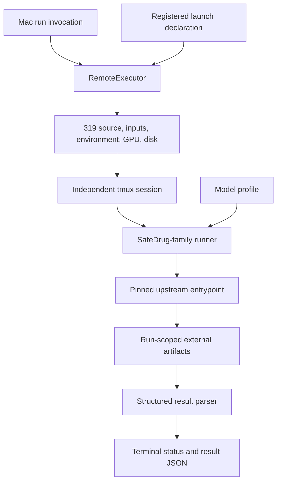
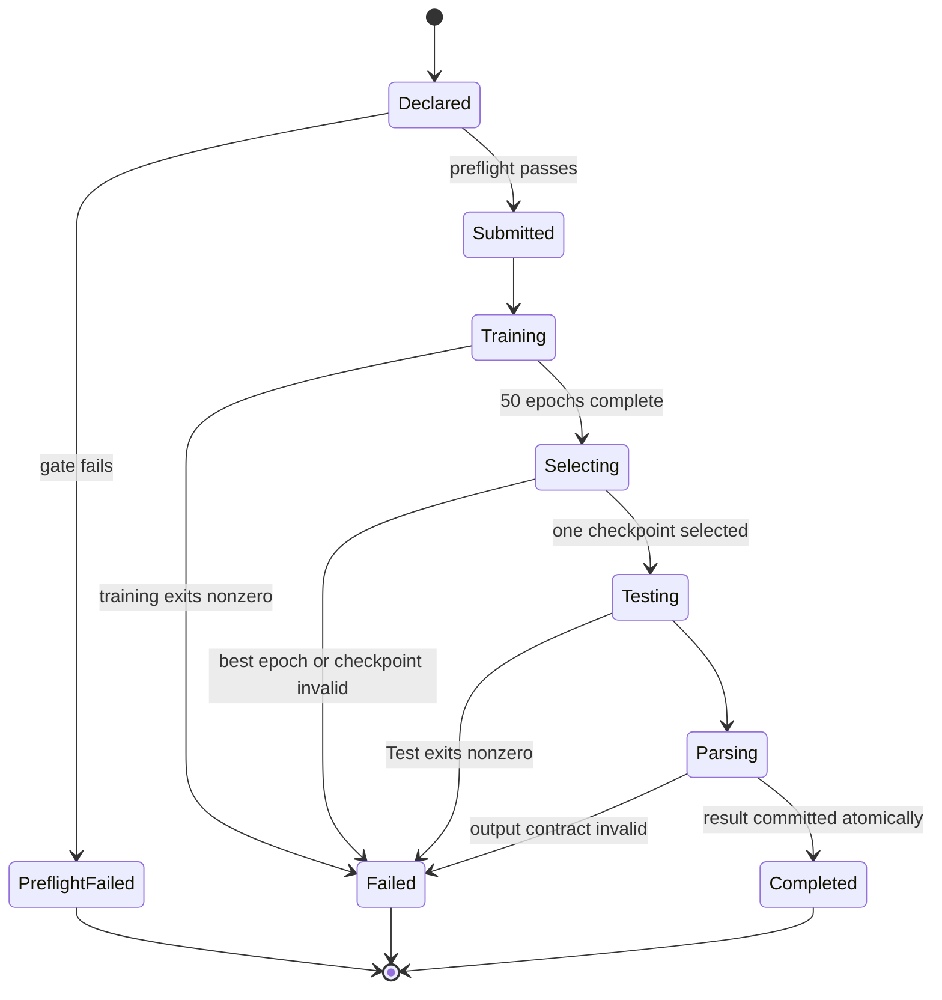
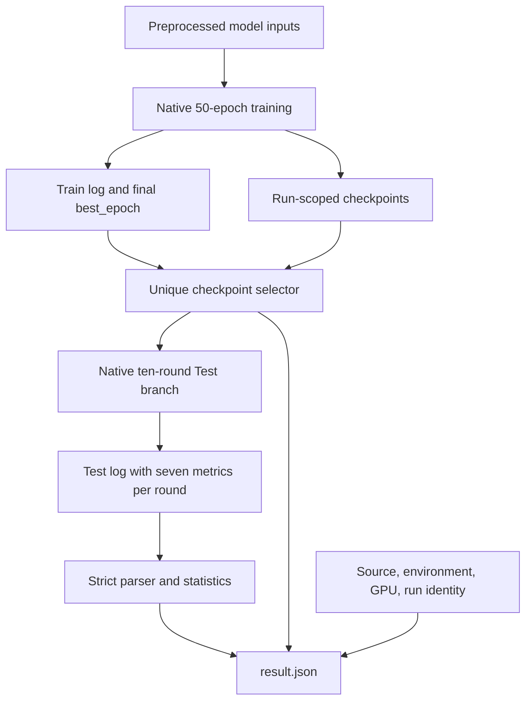

# SafeDrug Family Three-Model Reproduction - Plan

## Goal Capsule

- **Objective:** Complete source-native Reproduction Mode runs for SafeDrug, RETAIN, and LEAP on 319, with each model producing a trained best checkpoint, ten-round Test evaluation, complete metrics, logs, and a terminal result.
- **Means:** Extend the working GAMENet remote seam with one SafeDrug-family runner, repair and reuse the shared Conda environment, then run three independent tmux lanes concurrently on three physical GPUs (KTD1-KTD8).
- **Authority:** This focused historical plan governed the completed three-model SafeDrug-main execution. The pinned source owned model behavior, and `docs/playbooks/REMOTE_319_EXECUTION_PLAYBOOK.md` owned the 319 operating boundary.
- **Execution profile:** Local work is limited to launcher code, parser code, tests, registry declarations, and documentation. Environment repair, imports, training, checkpoints, Test evaluation, and restricted artifacts run only on 319.
- **Stop conditions:** A lane stops only on a concrete source, environment, input, GPU, disk, training, checkpoint, Test, or result-validation failure. A failed lane does not stop the other two. After the batch finishes, repair and rerun only failed lanes until all three complete or a genuine external blocker is demonstrated.
- **Tail ownership:** The implementing agent commits on the current branch without opening a PR, synchronizes the accepted commit to 319, executes the three lanes, monitors them to terminal states, and returns one result table covering all three models.

---

## Product Contract

### Summary

Add the minimum shared runner and remote declarations needed to execute SafeDrug, RETAIN, and LEAP from the already pinned SafeDrug checkout.
Submit all three models in the same batch on separate GPUs so their 50-epoch training runs overlap.
Each lane must select the source-owned best epoch, run the model's native `--Test` path, and leave independently auditable restricted artifacts.

### Problem Frame

GAMENet has already exercised the SafeDrug repository, data preparation, SSH/tmux shape, and GPU execution path.
The remaining work is not a new orchestration system.
It is a three-profile extension of the same Reproduction Mode seam.

The current implementation still blocks these models before useful execution.
Only GAMENet has a declared launcher, `RemoteExecutor` requires `smoke_ready`, the three registry entries have no adapter or environment identity, and the shared `medrec-gamenet` environment currently fails `import torch` with `iJIT_NotifyEvent`.
The current upstream cleanliness check also rejects untracked training outputs even though the source writes checkpoints under `src/saved/`.

The plan resolves those direct blockers, then runs the models.
Prediction Records, Comparison Qualification, a fair leaderboard, and the idea loop remain separate because they do not help answer whether these three pinned source programs execute and reproduce their native outputs.

### Key Decisions

- **GAMENet is excluded from this batch.** Governs R1 and R15. (session-settled: user-directed — chosen over rerunning all four SafeDrug-family entries: GAMENet has already completed and the fastest useful result is the other three models.)
- **The three target models run concurrently on distinct physical GPUs.** Governs R3-R5. (session-settled: user-directed — chosen over serial training: the models are independent processes with read-only shared inputs and separate outputs, so serial execution adds elapsed time without adding evidence.)
- **Source-native execution precedes comparison infrastructure.** Governs R2, R13-R15. (session-settled: user-directed — chosen over waiting for readiness promotion, Prediction Records, or Comparison Qualification: real execution is needed first to expose the actual remaining defects.)

### Requirements

#### Target and scheduling

- R1. The batch must target exactly `safedrug`, `retain`, and `leap-safedrug` from `ycq091044/SafeDrug@88ce5c377dcdc2aa01aaa88f5478dfa4373ba49a`; it must not rerun GAMENet.
- R2. Every target must complete native 50-epoch training, best-checkpoint selection, native `--Test` evaluation, and terminal result generation.
- R3. The first batch attempt must assign one distinct idle physical GPU to each model and expose only that device to its process as logical CUDA device `0`.
- R4. All three submissions must be attempted independently, and their training intervals must overlap after preflight rather than wait for prior model completion.
- R5. A preflight, launch, training, or evaluation failure in one lane must not cancel, roll back, or prevent the other lanes.

#### Source-native fidelity

- R6. The runner must preserve each entrypoint's source-defined data split, seed behavior, model arguments, optimizer behavior, epoch count, prediction behavior, and evaluation code.
- R7. Checkpoint selection must use the final source-printed `best_epoch`, reject epoch `0`, and require exactly one matching checkpoint before Test; Test metrics must never choose the checkpoint.
- R8. Test evaluation must preserve the source's ten samples of 80% of `data_test` with replacement and must not add a NumPy seed where the pinned entrypoint does not define one.
- R9. The result must retain all seven metrics emitted by every Test round: DDI rate, Jaccard, PRAUC, average precision, average recall, average F1, and average medication count.
- R10. The result must retain the exact upstream five-metric mean/std summary and separately label seven-metric mean/std values computed from the ten printed rounds as harness-derived.

#### Execution and artifacts

- R11. The shared `medrec-gamenet` environment must be repaired and reused first; a separate environment may be created only after a concrete remaining import or runtime incompatibility is observed and recorded.
- R12. Each lane must use a run-ID-specific external artifact directory containing train log, Test log, schema-valid terminal status, selected checkpoint identity, source, adapter, input, environment, GPU, epoch, and timing identities, per-round metrics, summaries, and `result.json` as defined by the Artifact Contract below.
- R13. Preflight must verify the pinned source revision, tracked/staged source cleanliness, exact regular-file model inputs and their SHA-256 receipts, the recomputed launcher/adapter content digest, environment digest, required imports, selected GPU, and disk before creating that lane's tmux session.
- R14. Source-native Reproduction launch eligibility must not depend on `smoke_ready`, Comparison Qualification, Prediction Records, or Comparison Mode evidence.
- R15. The outputs must be described only as source-native reproduction results; they must not be accepted by `accept-comparison`, ranked with qualified methods, or used to start the idea loop in this work.

### Key Flows

- F1. **Prepare one shared execution environment**
  - **Trigger:** The pinned checkout and preprocessed inputs are present on 319.
  - **Steps:** Repair the known PyTorch/MKL failure, verify the shared import chain and CUDA, compute the new explicit-package digest, and bind that digest to the four declarations that reference the environment.
  - **Outcome:** One observed environment can run the three model entrypoints before any model-specific environment is considered.
  - **Covered by:** R11, R13
- F2. **Submit three independent lanes**
  - **Trigger:** The accepted harness commit is synchronized and three GPUs pass immediate preflight.
  - **Steps:** Submit SafeDrug, RETAIN, and LEAP as three independent `run` invocations, capture each submission response, and continue the remaining submissions if one fails.
  - **Outcome:** Up to three tmux sessions train concurrently with distinct GPU and run identities.
  - **Covered by:** R1-R5, R13-R14
- F3. **Train, select, and Test one model**
  - **Trigger:** A lane's tmux session starts.
  - **Steps:** Run native training, parse the final `best_epoch`, resolve one checkpoint, invoke the profile-specific Test command, parse ten complete metric rounds, and write terminal artifacts.
  - **Outcome:** The lane is either `completed` with a validated result or `failed` with a stage and exit status.
  - **Covered by:** R2, R6-R10, R12
- F4. **Converge failed lanes without delaying completed lanes**
  - **Trigger:** At least one lane terminates unsuccessfully while another continues or completes.
  - **Steps:** Preserve all lane artifacts, diagnose the first concrete failing stage, apply the smallest in-scope repair, and rerun only that model on an idle GPU.
  - **Outcome:** Completed lanes remain final while failed lanes converge independently.
  - **Covered by:** R5, R11-R13

### Acceptance Examples

- AE1. **Covers R1-R5.** Given three idle GPUs, when the three submissions are issued, then SafeDrug, RETAIN, and LEAP receive distinct physical GPUs and session IDs, and their recorded UTC training intervals satisfy `max(training_started_at) < min(training_ended_at)`.
- AE2. **Covers R5, R13.** Given SafeDrug is missing `ddi_mask_H.pkl`, when its preflight fails, then RETAIN and LEAP are still submitted and SafeDrug creates no tmux session.
- AE3. **Covers R7.** Given the final training log reports `best_epoch: 17`, when selection runs, then exactly one epoch-17 checkpoint is selected without reading Test metrics; zero or multiple matches fail the lane.
- AE4. **Covers R7, R12.** Given the selected checkpoint belongs to RETAIN, when Test runs, then the runner passes only the checkpoint basename because RETAIN prepends `saved/<model_name>/`; SafeDrug and LEAP receive their direct checkpoint paths.
- AE5. **Covers R8-R10.** Given Test emits ten complete seven-metric lines and exactly one summary line containing five `mean $\pm$ std &` pairs in upstream order, when parsing completes, then `result.json` contains all ten rounds, seven harness-derived population mean/std pairs, the verbatim summary line, and its five parsed pairs.
- AE6. **Covers R9-R10, R12.** Given Test emits nine rounds, an extra round, a non-finite value, or no upstream summary, when parsing runs, then the lane terminates as `result_validation_failed` instead of writing zero defaults or `completed`.
- AE7. **Covers R11, R13.** Given the MKL repair changes the Conda explicit export, when preflight compares the old digest, then launch remains blocked until the newly observed digest is deliberately recorded for every declaration using the shared environment.
- AE8. **Covers R12-R13.** Given the upstream checkout contains untracked generated artifacts, when preflight runs, then it accepts the pinned tracked source; a tracked or staged change to an entrypoint or model file still blocks launch.
- AE9. **Covers R5, R12.** Given training succeeds but Test fails in one lane, when tmux exits, then that lane writes a failed terminal status with stage and exit code while other sessions remain untouched.

### Success Criteria

- SafeDrug, RETAIN, and LEAP each finish one complete source-native train-select-Test lifecycle from the pinned source.
- The initial full batch uses three distinct GPUs, and status timestamps prove a non-empty common overlap across all three training intervals.
- Every model has one unique selected checkpoint and a validated result with ten complete seven-metric Test rounds.
- The operator-only final handoff reports model, baseline ID, GPU, run/session ID, attempt count, terminal state, best epoch, selected checkpoint digest, all seven Test mean/std metrics, upstream summary, and an opaque `<baseline-id>/<run-id>` artifact reference for all three models; public-safe Git updates never include the restricted root path.
- No Prediction Adapter, Comparison Qualification, Comparison Run Record, or idea-loop claim is created from these outputs.

### Scope Boundaries

#### Deferred to Follow-Up Work

- Prediction Records and adapters that make the models eligible for `accept-comparison`.
- Comparison Qualification, a shared protocol leaderboard, source-target agreement decisions, and idea-loop experiments.
- `status` and `collect` CLI commands; this run uses session IDs, terminal status files, and the remote playbook for observation and intake.
- A general multi-baseline scheduler, GPU reservation service, queue, retry daemon, or distributed execution abstraction.
- Durable public research evidence intake beyond the operator-facing aggregate result table.

#### Outside This Plan

- Rerunning or changing GAMENet scientific behavior.
- Editing the pinned SafeDrug model, loss, split, seed, decoder, threshold, or evaluation implementation.
- Moving restricted data, raw logs, checkpoints, model weights, or patient-level output into Git.

---

## Planning Contract

### Key Technical Decisions

- KTD1. **Use one data-driven SafeDrug-family runner.** Add one shell runner and one standard-library result parser with immutable profiles for `safedrug`, `retain`, and `leap-safedrug`. Each profile owns entrypoint, upstream model name, required files, checkpoint pattern, and Test resume-argument form. This removes duplicated lifecycle logic without introducing an execution interface.
- KTD2. **Keep the existing single-baseline CLI and submit three times.** The implementing agent issues three independent `medrec-research run` invocations and captures every response even when one invocation fails. A batch scheduler or new CLI surface is unnecessary because each successful call returns immediately after tmux submission. (session-settled: user-directed — chosen over serial model completion: independent submissions create the requested three-GPU concurrency while preserving failure isolation.)
- KTD3. **Separate Reproduction launchability from readiness.** Replace the `smoke_ready` gate in the Reproduction-only remote path with a narrow launchability check for pinned source, an exact declared adapter digest recomputed from the runner and parser bytes, and the observed environment digest. Registry readiness remains `registered`, and Comparison semantics do not change. (session-settled: user-directed — chosen over fabricating readiness evidence or waiting for Comparison infrastructure: readiness answers a broader evidence question than whether a pinned source-native program may execute.)
- KTD4. **Repair and reuse the shared environment before splitting.** Apply the documented MKL compatibility repair, verify `torch`, `dnc`, `rdkit`, `pandas`, `dill`, `sklearn`, the model import chain, and CUDA on the selected device, then record the new explicit-package digest. Create a separate environment only if this verified environment still fails a model-specific import or runtime check.
- KTD5. **Select checkpoints from source-owned state.** Parse the final source-printed `best_epoch`, reject epoch zero, and require one run-scoped checkpoint. Use direct resume paths for SafeDrug and LEAP and a basename for RETAIN. Do not maximize filename Jaccard or inspect Test metrics.
- KTD6. **Keep restricted outputs external through a run-scoped symlink.** Give every invocation sanitized single-component IDs, create an owner-only checkpoint directory canonically contained under `${MEDREC_DATA_ROOT}/baselines/<baseline-id>/<run-id>/`, and expose it to upstream as `src/saved/<model_name>` through an atomically created run-specific symlink. Exit/signal cleanup unlinks the path only after confirming that it is still the exact symlink to this lane's checkpoint directory; the external target is always preserved.
- KTD7. **Make terminal evidence explicit.** The runner writes the Artifact Contract status atomically on start, stage transitions, failure, and completion. Train and Test logs are separate. The parser requires ten finite seven-metric Test records, retains and parses the exact upstream five-metric summary, computes labeled seven-metric population statistics, and never substitutes `0.0` for missing output.
- KTD8. **Permit generated files but not tracked source drift.** The upstream Git probe uses a command-local safe-directory override, verifies the exact revision, ignores untracked generated artifacts, and rejects every tracked or staged change. The harness checkout retains its existing strict cleanliness rule.

### High-Level Technical Design

#### Component Flow



#### Lane Lifecycle



#### Artifact Data Flow



#### Artifact Contract

`status.json` and `result.json` use `schema_version: 1` and are written through a temporary file plus atomic rename. Unknown fields are allowed for forward compatibility, but every required field below is type-checked and no required value may be inferred from a filename.

- The status envelope requires `baseline_id`, `run_id`, `attempt`, `model_name`, `state`, `stage`, `exit_code`, `started_at`, `training_started_at`, `training_ended_at`, `finished_at`, `physical_gpu`, and `logical_cuda_device`. Timestamps are UTC RFC 3339 values; fields not yet reached are `null`. `state` is `running`, `completed`, `failed`, or `interrupted`; `stage` is `prepare`, `training`, `selecting`, `testing`, `parsing`, or `terminal`.
- The identity envelope requires `source_revision`, `adapter_revision`, `environment_sha256`, and `input_sha256`, where `input_sha256` maps each profile-required upstream-relative input path to its lowercase 64-hex digest.
- Training evidence requires `epochs_expected: 50`, `epochs_completed: 50`, and the final source-printed `best_epoch`. Completion means the process exited zero after the train log contained the ordered source headers `epoch 1` through `epoch 50`; an interrupted or early-zero exit never advances to checkpoint selection.
- Checkpoint evidence requires `relative_path`, `sha256`, `size_bytes`, and `best_epoch`. The selected object must be one regular non-symlink file inside this run's canonical checkpoint directory, and its basename must match the profile's delimiter-anchored epoch grammar so epoch `1` cannot match epochs `10` through `19`.
- `test_rounds` is an array of exactly ten objects. Every object has finite numeric `ddi_rate`, `jaccard`, `prauc`, `avg_precision`, `avg_recall`, `avg_f1`, and `avg_medications` fields.
- `upstream_summary` contains the exact single source line plus five parsed mean/std pairs in source order: `ddi_rate`, `jaccard`, `avg_f1`, `prauc`, and `avg_medications`. The line must contain exactly five `mean $\pm$ std &` pairs. Because upstream aggregates full-precision values while round lines are printed with limited precision, the parser preserves both forms and does not require numerical equality after re-aggregation.
- `harness_summary` contains all seven metric keys, each with the arithmetic mean and population standard deviation computed only from the ten printed round values. The result also repeats the status and identity envelopes so one file is independently auditable.

The three initial attempts overlap only when all have non-null training timestamps and `max(training_started_at) < min(training_ended_at)`. Submission time or tmux existence is not accepted as overlap evidence.

### Implementation Constraints

- The core package must not import Torch, RDKit, DNC, or other baseline dependencies.
- The runner and parser execute inside the declared baseline environment and use only pinned upstream behavior plus standard-library parsing.
- The three model processes may read the same preprocessed files concurrently, but no lane may write another lane's artifact directory or model name.
- GPU availability is rechecked immediately before each launch. This plan does not add a reservation or preemption mechanism.
- The environment name may remain `medrec-gamenet` for this execution even though it serves the SafeDrug family; identity comes from the observed digest, not the display name.
- Any compatibility change to the pinned upstream Python files is out of scope. Repair the environment or wrapper representation instead.
- The runner starts with `umask 077`; run directories and files remain owner-only. Remote command arguments and environment assignments use the executor's existing POSIX-shell quoting path, and identifiers are validated before they become path or tmux components.

### Dependencies and Assumptions

- The pinned SafeDrug checkout remains tracked-file clean at the declared revision. Untracked existing GAMENet artifacts may remain.
- `records_final.pkl`, `voc_final.pkl`, `ddi_A_final.pkl`, `ddi_mask_H.pkl`, and `atc3toSMILES.pkl` remain available in the upstream generated-data directory.
- The documented MKL pin resolves the observed `iJIT_NotifyEvent` failure without changing model code.
- At least three 24 GiB GPUs become idle at the same time. The exact indices are selected from a fresh observation, not fixed by this document.
- SafeDrug seeds NumPy as pinned upstream defines. RETAIN and LEAP do not gain a new NumPy seed, so their native bootstrap output need not be bit-identical across reruns.

---

## Implementation Units

### U1. Repair and identify the shared 319 environment

**Goal:** Turn the existing shared Conda environment into a verified runtime for all three entrypoints and obtain its post-repair identity.

**Requirements:** R11, R13

**Dependencies:** None

**Files:** modify `environments/gamenet.yml` only to reflect verified shared dependencies; later U4 records the observed digest in `baselines/registry.toml`.

**Approach:**

1. Capture the current explicit package export outside Git, apply the documented `mkl=2021.4.0` and `mkl-service=2.4.0` repair to `medrec-gamenet`, and do not rebuild the environment preemptively.
2. Verify imports for Torch, DNC, RDKit, pandas, dill, scikit-learn, `models`, and `util` from the pinned upstream `src` working directory. Record the observed RDKit package source and version in `environments/gamenet.yml` with the other verified shared dependencies.
3. Import the GAMENet entrypoint and its model dependencies in the repaired environment as a compatibility probe; do not train or Test GAMENet.
4. Verify CUDA availability with one explicitly visible idle GPU and confirm the process sees it as logical device `0`.
5. Compute the post-repair `conda list --explicit` SHA-256 using the same pipeline as `RemoteExecutor.preflight` and retain the exact value for U4.
6. If a model-specific import still fails, record that concrete error before deciding whether the shared environment needs another dependency or only the affected model needs a separate environment.

**Execution note:** Start this remote operation first because it is already a known blocker and can run while U2's local implementation is prepared.

**Patterns to follow:** `docs/playbooks/REMOTE_319_EXECUTION_PLAYBOOK.md` known-environment issue and `RemoteExecutor.preflight` environment identity check.

**Test scenarios:**

- The repaired environment imports the full shared dependency chain and reports CUDA available on one visible GPU.
- The GAMENet import-only compatibility probe passes before its shared-environment digest declaration changes.
- An import still fails after repair; preserve the exact package/runtime error and do not start training.
- The post-repair digest differs from the old registry value; treat the old value as stale rather than forcing it to match.

**Verification:** The shared environment passes the import/CUDA probe, and one exact post-repair digest is available for registry binding.

### U2. Add the run-scoped family runner and result parser

**Goal:** Implement the complete train-select-Test lifecycle once while preserving the three entrypoints' different path and input contracts.

**Requirements:** R2, R6-R10, R12

**Dependencies:** None

**Files:** create `baselines/scripts/run_safedrug_family_319.sh`; create `baselines/scripts/parse_safedrug_family_results.py`; create `tests/unit/test_safedrug_family_results.py`.

**Approach:**

1. Define three immutable profiles. SafeDrug uses `SafeDrug.py`, model name prefix `SafeDrug`, `records_final.pkl`, `voc_final.pkl`, `ddi_A_final.pkl`, `ddi_mask_H.pkl`, and `atc3toSMILES.pkl`, the `Epoch_<n>_TARGET_...` checkpoint grammar, and a direct Test path. RETAIN uses `Retain.py`, prefix `Retain`, `records_final.pkl`, `voc_final.pkl`, and `ddi_A_final.pkl`, the `Epoch_<n>_JA_...` grammar, and a checkpoint basename. LEAP uses `Leap.py`, prefix `Leap`, the same three inputs and checkpoint grammar as RETAIN, and a direct Test path.
2. Require `MEDREC_RUN_ID`, `MEDREC_DATA_ROOT`, `SAFEDRUG_ROOT`, `CONDA_ENV`, and one-device `CUDA_VISIBLE_DEVICES`; reject unknown profiles, identifiers that are not safe single path components, non-absolute roots, and canonical paths outside the declared roots before creating output.
3. Start with `umask 077`, create one owner-only external run directory and unique upstream `model_name`, and atomically create only that run's `saved/<model_name>` symlink after verifying its canonical target is the external checkpoint directory. Refuse every collision instead of replacing it.
4. Hash every profile-required regular non-symlink input into the identity envelope, write running status, execute native training with `--cuda 0`, and store a separate train log without changing model arguments or seeds.
5. Require a zero training exit and the ordered headers `epoch 1` through `epoch 50`, then parse the final `best_epoch`, require a nonzero value, and select exactly one regular checkpoint using an epoch-delimited basename match. Record its SHA-256 before executing the profile-specific `--Test` resume form into a separate Test log.
6. Parse exactly ten complete finite seven-metric lines and exactly one five-pair upstream summary, compute labeled per-metric population mean/std, and write the Artifact Contract `result.json` atomically.
7. On any error, write a terminal failed status with stage and exit code. Install exit and signal traps that unlink only a still-matching run-specific symlink and never remove its external checkpoint directory.

**Execution note:** Characterize parsing and failure behavior with synthetic logs before relying on a 50-epoch remote run.

**Patterns to follow:** `baselines/scripts/run_gamenet_319.sh` for Conda activation, visible-GPU mapping, and remote directory conventions; replace its zero-default parsing and shared output path.

**Test scenarios:**

- Each profile resolves the expected entrypoint, required files, checkpoint pattern, and Test resume form.
- A valid ten-round Test log yields all seven round metrics, seven mean/std pairs, and the exact upstream summary.
- Nine or eleven rounds, a missing metric, NaN/infinity, a summary with other than five ordered pairs, a missing summary, or duplicate summary fails result generation.
- `best_epoch: 0`, a missing final best epoch, or zero/multiple checkpoint matches fails before Test.
- A zero exit with fewer than the ordered 50 epoch headers fails as incomplete training before Test.
- Training, selection, Test, and parsing failures produce distinct terminal stages and nonzero status.
- A run-ID collision or pre-existing nonmatching symlink fails without overwriting another run.
- SafeDrug and LEAP receive a direct checkpoint path; RETAIN receives the basename under its model directory.
- Epoch `1` selection does not match an epoch `10` through `19` checkpoint, and cleanup refuses a symlink whose target changed after creation.

**Verification:** The parser tests cover all profile and output contracts, and shell syntax validation passes for the runner.

### U3. Declare the three launchers and narrow Reproduction preflight

**Goal:** Make the existing remote seam launch all three registered source-native profiles after only execution-relevant checks pass.

**Requirements:** R3-R5, R12-R14

**Dependencies:** U2

**Files:** modify `src/medrec_research/remote_executor.py`; modify `tests/unit/test_remote_executor.py`.

**Approach:**

1. Add launcher declarations for `safedrug`, `retain`, and `leap-safedrug`, all using the shared environment, upstream root, family runner, and profile-specific required files.
2. Generate the session/run ID before the launch command and pass it as `MEDREC_RUN_ID` so the tmux identity and external artifact directory agree.
3. Replace `_require_readiness` on this Reproduction-only path with a declaration check that requires pinned source, the exact registry command, an `adapter_revision` in `sha256:<64 lowercase hex>` form, and the environment digest while leaving readiness `registered`.
4. Define the adapter digest as SHA-256 over a fixed ordered byte stream containing each UTF-8 relative filename, a NUL separator, its raw bytes, and a trailing NUL for `run_safedrug_family_319.sh` followed by `parse_safedrug_family_results.py`. Recompute this digest from the synchronized remote harness files and compare it to the registry before any tmux creation.
5. Add one remote preflight probe that requires every profile input to be a regular non-symlink file and records its raw-byte SHA-256, plus one environment/runtime probe that imports the shared dependency and model modules with only the selected GPU visible.
6. Verify upstream Git through a command-local safe-directory override, exact revision, and tracked/staged cleanliness while ignoring untracked generated artifacts. Keep the harness checkout's strict clean check unchanged.
7. Preserve immediate GPU/process/disk checks, physical-to-logical CUDA mapping, unique tmux sessions, and cleanup of only the session whose launch fails. Serialize every remote environment assignment, path, and tmux argument through `shlex.quote` after identifier validation.

**Patterns to follow:** Existing `BaselineLauncher`, `_LAUNCHERS`, `_launch_command`, `preflight`, and tmux cleanup flow in `src/medrec_research/remote_executor.py`.

**Test scenarios:**

- Every target ID resolves to the expected runner profile, shared environment, upstream root, and required files.
- A fully declared `registered` Reproduction baseline passes launchability; a missing adapter command, mismatched launcher, mutable adapter revision, missing environment digest, or unpinned source fails before tmux.
- The locally computed adapter digest matches the remote runner-plus-parser digest; changing either file without updating the registry fails before tmux.
- Existing untracked generated artifacts are allowed, while tracked or staged upstream changes fail.
- A missing profile-specific input or failed import/runtime probe creates no tmux session for that lane.
- Dry-run performs no SSH and includes the correct profile, run ID, `SAFEDRUG_ROOT`, `MEDREC_DATA_ROOT`, `CONDA_ENV`, and `CUDA_VISIBLE_DEVICES`.
- A tmux launch failure cleans up only its generated session.
- GAMENet dry-run behavior remains compatible and Comparison submission remains unavailable.
- Whitespace, quotes, shell substitutions, semicolons, newlines, and leading dashes in configurable values remain literal or are rejected; none can add a remote shell token.

**Verification:** Unit tests prove the new launchability boundary, all three command constructions, exact preflight order, and unchanged failure isolation.

### U4. Bind registry identities and update operator documentation

**Goal:** Make declarations, tests, and the playbook match the runner and repaired environment that will actually execute.

**Requirements:** R1, R11, R13-R15

**Dependencies:** U1-U3

**Files:** modify `baselines/registry.toml`; modify `tests/unit/test_registry.py`; modify `tests/integration/test_run_cli.py`; modify `docs/playbooks/REMOTE_319_EXECUTION_PLAYBOOK.md`; modify `docs/PLANS.md`.

**Approach:**

1. Add each target's exact family-runner `adapter_command`, the runner-plus-parser `adapter_revision` defined in U3, and U1 environment digest while keeping readiness `registered`.
2. After U1's GAMENet import-only compatibility probe passes, update GAMENet's environment digest because it references the same repaired Conda environment, without scheduling or rerunning GAMENet.
3. Extend registry and CLI dry-run tests for all three IDs, including the public registry name `leap-safedrug` and the expected profile argument.
4. Replace the stale playbook statement that SafeDrug automation must not be attempted. Document the shared environment repair, three independent submissions, three-GPU assignment, run artifact layout, terminal status interpretation, and failed-lane-only rerun path.
5. Add this plan to `docs/PLANS.md` as the focused active three-model execution and state that GAMENet is complete and excluded.

**Patterns to follow:** The GAMENet registry identity fields and existing `run --dry-run` integration coverage.

**Test scenarios:**

- The checked-in registry loads with all entries still `registered` and the four SafeDrug-family entries sharing the observed environment digest.
- Each target dry-run returns its own baseline ID, unique session/run ID, correct runner profile, and no SSH contact.
- The LEAP display name remains human-readable while its executable registry ID stays `leap-safedrug`.
- Documentation never describes source-native aggregate results as Comparison Mode evidence.

**Verification:** Registry and integration tests pass, and the playbook supplies enough exact operational detail for a fresh agent to submit, monitor, diagnose, and rerun one lane without chat history.

### U5. Commit, synchronize, and submit the three-GPU batch

**Goal:** Put the accepted implementation on 319 and start all three model runs with maximum useful overlap.

**Requirements:** R1-R5, R11-R14

**Dependencies:** U4 and all local verification gates

**Files:** no repository files; this unit changes the current branch history and creates restricted runtime state outside Git on 319.

**Approach:**

1. Commit the verified implementation on the current branch without opening a PR, then synchronize the remote harness checkout to that exact immutable commit and leave tracked files clean.
2. Run all three dry-runs and inspect their commands, profile arguments, environment, source root, data root, GPU mapping, and run IDs.
3. Observe current GPU capacity and select three distinct idle devices. Do not reuse the stale example indices from a document.
4. Issue three independent non-dry submissions in quick succession, one per selected GPU. Capture every JSON response and continue to the next target if one submission fails.
5. Confirm every successful submission created its named tmux session and running status file, then verify the three selected GPUs show the corresponding processes. Preserve each response's baseline, GPU, run ID, session ID, and artifact reference as the execution receipt.
6. Re-resolve the local and 319 harness revisions after submission; both must equal the verified commit, and both tracked worktrees must remain clean.

Use these as three separate invocations, first with `--dry-run` appended and then without it after assigning three fresh distinct GPU indices:

```bash
rtk proxy /opt/homebrew/bin/uv run medrec-research run --mode reproduction --baseline-id safedrug --gpu "$GPU_SAFEDRUG" --min-free-gpu-mib 20000 --min-free-disk-gib 100
rtk proxy /opt/homebrew/bin/uv run medrec-research run --mode reproduction --baseline-id retain --gpu "$GPU_RETAIN" --min-free-gpu-mib 20000 --min-free-disk-gib 100
rtk proxy /opt/homebrew/bin/uv run medrec-research run --mode reproduction --baseline-id leap-safedrug --gpu "$GPU_LEAP" --min-free-gpu-mib 20000 --min-free-disk-gib 100
```

Do not wrap these commands in a fail-fast shell. Capture one response before issuing the next command, but do not wait for training completion between submissions.

**Execution note:** Submission is deliberately non-transactional. Successful lanes begin training immediately; a failed submission is recorded and retried separately after the other two have been attempted.

**Patterns to follow:** The GAMENet `medrec-research run` invocation and SSH/tmux observation steps in `docs/playbooks/REMOTE_319_EXECUTION_PLAYBOOK.md`.

**Test scenarios:**

- Three idle GPUs produce three submitted sessions with distinct IDs; their status files later prove the common training overlap using the Artifact Contract predicate.
- One GPU becomes busy before its launch; that lane fails preflight, the other two launch, and the failed lane is resubmitted on another idle GPU.
- One profile fails input/import preflight; no session exists for it, but remaining profiles are still attempted.
- One tmux launch fails; only that generated session receives cleanup.

**Verification:** The execution receipt contains one submission outcome per model, distinct GPU assignments, exact synchronized commit identities, and evidence that every successful lane entered training; the three status files later establish whether the requested common overlap occurred.

### U6. Monitor, repair failed lanes, and close the result set

**Goal:** Reach three validated terminal results and return a concise complete reproduction report.

**Requirements:** R2, R4-R5, R7-R10, R12, R15

**Dependencies:** U5

**Files:** modify `docs/playbooks/REMOTE_319_EXECUTION_PLAYBOOK.md` and `docs/PLANS.md` only with public-safe final status; restricted logs, checkpoints, and result artifacts remain outside Git.

**Approach:**

1. Resolve each restricted artifact directory as `${MEDREC_DATA_ROOT}/baselines/<baseline-id>/<run-id>/`, poll its Artifact Contract status, and tail only aggregate/progress-safe log content. Track the lanes independently rather than waiting on them in launch order.
2. Validate completed results against the Artifact Contract: exact source, adapter, input, environment, GPU, timing, and epoch identities; one selected checkpoint; ten Test rounds; seven finite metrics per round; and one exact five-pair upstream summary.
3. For a failed lane, identify its first failed stage from status and logs, apply the smallest in-scope environment/runner repair, rerun that lane alone on an idle GPU, and preserve earlier failed-attempt artifacts.
4. If tmux disappears while status remains nonterminal, poll once more after the playbook grace interval; then record `infrastructure_lost` in the operator receipt and preserve the partial run rather than treating absence as success.
5. Continue until SafeDrug, RETAIN, and LEAP each have one completed validated attempt or until repeated concrete evidence proves an external blocker that cannot be repaired within this plan.
6. Validate the initial-attempt overlap predicate from the three status files and report it independently of eventual success or retry outcomes.
7. Return one operator-only table with model, baseline ID, GPU, run/session ID, attempt count, best epoch, checkpoint digest, all seven Test mean/std metrics, upstream summary, terminal status, and opaque `<baseline-id>/<run-id>` artifact reference. Resolve the private root only through the playbook, not in public-safe Git text.
8. Update the playbook snapshot and `docs/PLANS.md` with public-safe completion/failure status only. Do not commit raw logs, paths containing sensitive identifiers, checkpoints, or patient-level data.

**Patterns to follow:** The remote monitoring and result-intake boundaries in `docs/playbooks/REMOTE_319_EXECUTION_PLAYBOOK.md`.

**Test scenarios:**

- All three lanes complete on their first attempt and produce one consolidated table.
- One lane fails Test after successful training; its checkpoint and logs remain, the other results close, and only the failed lane is repaired and rerun.
- A terminal `completed` status exists but the result has missing or non-finite metrics; validation rejects it and the lane remains incomplete.
- A rerun succeeds after a prior failure; the report identifies both attempts and uses the completed attempt without deleting the failure evidence.
- A tmux session disappears without terminal status; the operator receipt records infrastructure loss after the grace poll and never fabricates a completed result.

**Verification:** All three model rows satisfy the result contract, every attempt remains attributable, and the final report makes no Comparison Mode or idea-loop claim.

---

## Verification Contract

| Gate | Applies to | Required proof |
| --- | --- | --- |
| Parser and executor unit tests | U2-U4 | `rtk proxy /opt/homebrew/bin/uv run pytest tests/unit/test_safedrug_family_results.py tests/unit/test_remote_executor.py tests/unit/test_registry.py` passes. |
| CLI integration | U4 | `rtk proxy /opt/homebrew/bin/uv run pytest tests/integration/test_run_cli.py` passes for GAMENet and all three new profiles. |
| Full Python suite | U1-U6 | `rtk proxy /opt/homebrew/bin/uv run pytest` passes. |
| Static quality | U1-U6 | `rtk proxy /opt/homebrew/bin/uv run ruff check .` and `rtk proxy /opt/homebrew/bin/uv run ruff format --check .` pass. |
| Shell syntax | U2 | `rtk bash -n baselines/scripts/run_safedrug_family_319.sh` passes. |
| Markdown | U4, U6 | `markdownlint '**/*.md' --ignore '.agents/**'` passes. |
| Shared environment runtime | U1 | The repaired environment imports the full shared dependency/model chain, sees the assigned GPU as logical device `0`, and has one recorded explicit-export digest. |
| GAMENet compatibility | U1, U4 | Its import-only probe passes before the shared environment digest is updated; GAMENet training and Test are not run. |
| Remote dry-run | U4-U5 | Each target resolves to the expected profile and contains no SSH side effect. |
| Remote synchronization | U5 | The local and 319 harness checkouts both equal the verified commit and retain clean tracked worktrees after submission. |
| Remote preflight and launch | U5 | Each submitted lane passes exact source, tracked/staged cleanliness, input-file hashing, adapter digest, environment, import, GPU, and disk checks immediately before tmux creation. |
| Concurrent execution | U5-U6 | The three initial attempts use distinct physical GPUs, and their UTC training timestamps satisfy the common-overlap predicate. |
| Scientific lifecycle | U6 | Each model completes the ordered 50-epoch log contract, selects one source-owned checkpoint with a recorded digest, executes native Test, and produces ten complete seven-metric rounds plus the exact five-pair upstream summary. |
| Privacy and mode boundary | U6 | Restricted data, logs, weights, checkpoints, and private paths stay outside Git; no output enters Comparison Mode acceptance. |

Real-data training is never a local verification command.
The local test suite proves control flow and parsing with synthetic logs; only the three 319 runs prove the requested source-native execution.

---

## Risks and Mitigations

| Risk | Consequence | Mitigation |
| --- | --- | --- |
| The MKL repair changes the environment identity | Preflight rejects every shared-environment launcher | Compute the post-repair digest once and deliberately update all four declarations that name the environment. |
| Prior checkpoints make selection ambiguous | Test may load the wrong epoch or attempt | Use a unique model name and external checkpoint directory per run, then require one checkpoint for the source-printed best epoch. |
| A loose checkpoint glob matches epoch `1` and epochs `10` through `19` | Selection fails or Test loads the wrong model | Use the profile's delimiter-anchored basename grammar and require one regular file in the run-scoped directory. |
| RETAIN's resume path differs from SafeDrug and LEAP | Test fails after a full training run | Keep resume-argument form in the profile table and cover all three forms in parser/runner tests. |
| A model exits after tmux disappears | Operator cannot distinguish success from failure | Write stage-aware terminal status outside Git and validate `result.json` before calling the lane complete. |
| One submission command fails early | Remaining GPUs sit idle | Execute and capture the three submissions independently; never use fail-fast batch shell semantics. |
| Concurrent jobs contend for CPU or I/O | Training slows or a lane becomes unstable | Keep GPU assignments separate, observe system pressure, and only serialize a failed lane if measured contention is the demonstrated cause. |
| Upstream untracked outputs trip cleanliness checks | Valid pinned source cannot launch concurrently | Ignore untracked artifacts, reject tracked/staged changes, and verify the immutable revision. |
| Runner or parser content drifts after registry binding | Preflight authorizes code other than the declared adapter | Recompute the fixed runner-plus-parser digest on 319 before tmux creation and compare it to the registry. |
| Harness-derived seven-metric statistics are mistaken for upstream output | Reproduction claim overstates source reporting | Preserve the exact upstream five-metric summary and label the seven-metric aggregation as derived from printed Test rounds. |

---

## Definition of Done

- The current branch contains the family runner, strict result parser, three launcher declarations, registry identities, focused tests, and updated 319 documentation in one or more verified commits, with no PR required.
- `medrec-gamenet` imports the full shared dependency/model chain after the documented repair, and the checked-in registry uses its observed post-repair digest.
- SafeDrug, RETAIN, and LEAP each have one validated completed attempt from the pinned SafeDrug revision.
- The initial batch used three distinct physical GPUs and overlapping training sessions; later retries, if any, affected only failed lanes.
- Every completed result satisfies the Artifact Contract, including source/adapter/input/environment/GPU/run identities, UTC timing, ordered 50-epoch training evidence, nonzero best epoch, unique selected checkpoint digest, ten complete seven-metric Test rounds, harness-derived population mean/std, exact upstream summary, logs, and terminal status.
- The implementing agent returns the required three-row result table and identifies all failed/retried attempts without deleting them.
- All Verification Contract gates pass, abandoned implementation attempts are removed from the code diff, and restricted artifacts remain outside Git.
- GAMENet is not rerun, and no source-native output is represented as Comparison Mode evidence or an idea-loop result.

---

## Sources and Research

- `ARCHITECTURE.md` defines `RemoteExecutor` as the single remote submission seam and separates Reproduction Mode from Comparison Mode.
- `CONTEXT.md` defines Reproduction Mode, Baseline Environment, Baseline Registry, Readiness Evidence, and the 319 execution boundary.
- `baselines/scripts/run_gamenet_319.sh` supplies the proven Conda, CUDA visibility, tmux-compatible logging, and external data-root pattern; its zero-default metric parsing and shared result path must not be copied.
- `src/medrec_research/remote_executor.py` owns launch declarations, 319 preflight, GPU validation, tmux submission, and launch cleanup.
- `src/medrec_research/registry.py` permits identity fields on `registered` entries while reserving readiness evidence for readiness transitions.
- `docs/playbooks/REMOTE_319_EXECUTION_PLAYBOOK.md` records the known `iJIT_NotifyEvent` failure, MKL repair, approved SSH aliases, and private artifact boundary.
- `research/baseline-preflight/safedrug-main-four-model-source-audit.md` records the shared pinned source, entrypoints, preprocessing lineage, and metric family.
- `SafeDrug@88ce5c377dcdc2aa01aaa88f5478dfa4373ba49a:src/SafeDrug.py`, `src/Retain.py`, and `src/Leap.py` own the 50-epoch loops, source-defined best epoch, checkpoint names, Test resume behavior, ten-round bootstrap, and emitted metrics.
