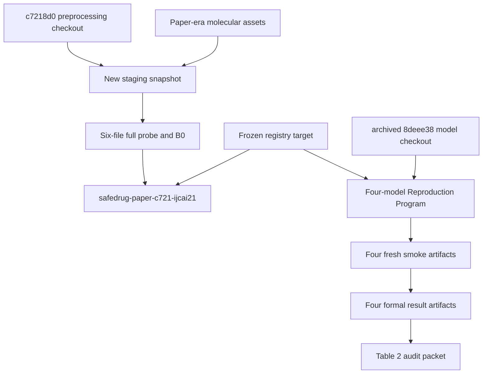
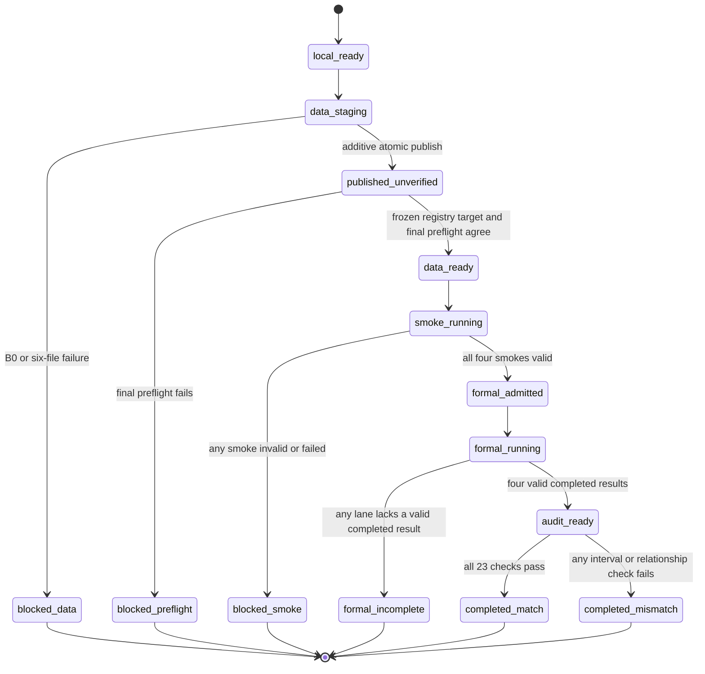

# SafeDrug Archived Four-Model Full Reproduction - Plan

## Goal Capsule

- **Objective:** Produce an auditable SafeDrug paper-lineage reproduction outcome for GAMENet, SafeDrug, RETAIN, and LEAP, including an honest match or mismatch verdict against IJCAI 2021 Table 2.
- **Means:** Rebuild the cohort with the SafeDrug `c7218d0` preprocessing lineage, execute the archived four-model program, and apply a deterministic Table 2 audit (KTD1, KTD5, KTD7).
- **Authority order:** The Product Contract in this plan overrides the earlier preparation-only stop; the SafeDrug paper and pinned upstream revisions own scientific semantics; repository playbooks own remote operating safety.
- **Execution profile:** Reproduction Mode on 319, four independent idle GPUs, one 50-epoch training run per model, one selected checkpoint per run, and exactly ten upstream test rounds per model.
- **Stop conditions:** Stop before formal submission when the data, environment, code, or four-smoke admission gate fails. An observed failed gate is terminal for this attempt; resuming after an interruption may revalidate the last proved artifact but may not rerun a failed gate. After formal submission, do not retrain or tune a failed or mismatched lane. A destructive remote cleanup, replacement of the rejected snapshot, or termination of another process still requires separate user approval.
- **Tail ownership:** Gemini executes through the terminal reproduction packet. Codex reviews that packet after the user returns with the results. The research owner decides any follow-up experiment.

---

## Gemini Execution Directive

This document is the user's authorization for one end-to-end four-model attempt. Gemini is to implement U1, U8, and U9, freeze and deploy that verified revision in U2, and then execute U3 through U7 in order. It must not stop after data preparation or the four smokes merely to request another GO: four valid fresh smokes are the automatic admission condition for the four formal 50-epoch submissions and original ten-round tests. If a declared gate fails, the authorized completion is the corresponding blocked or incomplete terminal packet, not a repair, retry, or scope expansion.

Execution order: `U1 + U8 + U9 -> U2 -> U3 -> U4 -> U5 -> U6 -> U7`.

---

## Product Contract

### Summary

Execute one complete four-model SafeDrug Reproduction Mode attempt. First recreate a paper-lineage 14,995-visit dataset without altering the rejected 15,032-visit snapshot. Then run fresh non-evidence smokes. When all four smoke lanes pass, continue in the same execution to four formal 50-epoch runs and their original ten-round tests. Finish with a public-safe Table 2 audit packet.

### Problem Frame

The completed preparation used 15,032 visits and therefore failed the accepted paper cohort gate. Its four smoke runs prove only that the environment and execution path can run against that rejected snapshot. They cannot authorize formal training.

The scientific authority is split. MoleRec states that it follows SafeDrug preprocessing after commit `c7218d0976e5ee5588aeaf5bdbc86b338126bba5`, while the SafeDrug repository directs paper-result reproduction to the archived model lineage. Treating either revision as the sole authority would conflate dataset construction with model behavior and would make later MoleRec onboarding inconsistent.

### Actors

- A1. The research owner authorizes this plan and receives the final match or mismatch result.
- A2. Gemini implements the remaining harness support, operates the 319 workflow, and owns the ignored runtime ledger.
- A3. The 319 host performs real-data preprocessing, GPU training, checkpoint testing, and restricted artifact storage.
- A4. Codex reviews the terminal packet and repository diff after execution finishes.

### Key Decisions

- **Use 14,995 visits as the paper cohort boundary.** (session-settled: user-directed — chosen over accepting 15,032 visits: both SafeDrug and MoleRec report 14,995, and no primary evidence establishes a paper typo.) Governs R1, R3, R7, and R11.
- **Authorize one continuous smoke-to-formal execution.** (session-settled: user-directed — chosen over another preparation-only handoff: the requested deliverable is the complete four-model reproduction.) Governs R8 and R9.
- **Separate data and model authorities.** (session-settled: user-directed — chosen over treating the archived model commit as the data authority: future MoleRec must share its declared `c7218d0` preprocessing lineage.) Governs R2, R5, and R16.
- **Keep the current run to four models.** (session-settled: user-directed — chosen over adding MoleRec now: this execution reproduces the four SafeDrug Table 2 baselines while preserving a reusable data boundary for the fifth baseline.) Governs R15 and R16.

### Requirements

#### Paper-lineage data

- R1. The only admissible formal dataset has exactly 6,350 patients, 14,995 visits, 131 medications, 448 undirected DDI pairs, and 491 molecular substructures.
- R2. Cohort construction, diagnosis/procedure/medication mapping, visit grouping, and vocabulary construction follow SafeDrug commit `c7218d0976e5ee5588aeaf5bdbc86b338126bba5`; run-scoped path substitutions may point it at authorized 319 inputs, but its filtering and mapping algorithms must not change.
- R3. The published snapshot contains the six regular-file inputs `records_final.pkl`, `voc_final.pkl`, `ddi_A_final.pkl`, `ddi_mask_H.pkl`, `ehr_adj_final.pkl`, and `idx2drug.pkl`, and their shapes, index domains, vocabulary links, and matrix invariants pass the archived program's full probe under the frozen environment.
- R4. Publish the accepted data additively as `snapshots/safedrug-paper-c721-ijcai21`; preserve `snapshots/safedrug-archived-ijcai21` as rejected diagnostic provenance.

#### Archived program and admission

- R5. GAMENet, SafeDrug, RETAIN, and LEAP use SafeDrug model, hyperparameter, checkpoint-selection, split, and evaluation behavior from commit `8deee38cfdb2a38882377ff95cce5922d6d9e8d6` through the existing archived Reproduction Program.
- R6. Every remote submission uses one clean immutable harness revision, the registered explicit Linux environment identity, the pinned archived source revision, and an assigned GPU proven idle by that submission's current remote preflight; formal admission also requires four assignable idle GPUs before the first formal submission.
- R7. Run four fresh one-epoch smokes against the R1-R6 identities; each smoke is non-evidence, selects its epoch-0 checkpoint, and produces neither `test.log` nor `result.json`.
- R8. Gemini submits formal training immediately after all four fresh smokes reach validated terminal completion; any missing, failed, identity-mismatched, or evidence-polluted smoke blocks all formal submissions without another human decision.

#### Formal execution and scientific verdict

- R9. Submit exactly one independent formal lane for each of the four baselines; a submission or runtime failure in one lane does not cancel lanes already submitted or prevent attempts for the remaining lanes.
- R10. Each successful formal lane contains exactly 50 parsed training epochs, the checkpoint selected by the archived best-epoch rule, the original upstream `--Test` path, and exactly ten parsed test rounds.
- R11. A lane is complete only when its terminal `status.json` and mode-specific artifact validate; process exit, tmux disappearance, or a checkpoint alone never establishes completion.
- R12. Compare all 20 reproduced means with the SafeDrug Table 2 mean ± two reported standard deviations, using inclusive interval bounds, and separately test the three declared cross-model relationships in Appendix A.
- R13. A formal runtime failure or Table 2 mismatch is a valid terminal reproduction result; it does not authorize hyperparameter tuning, source changes, a second seed, checkpoint substitution, or automatic retraining.

#### Artifacts and future compatibility

- R14. Raw EHR rows, patient or split membership, predictions, weights, checkpoints, and raw logs remain on 319 or under ignored runtime paths; the handoff contains only allowlisted aggregate metrics, public identities, gate outcomes, and public-safe failure summaries.
- R15. This attempt remains Reproduction Mode and must not call Comparison Mode, Prediction Adapters, comparison qualification, or `accept-comparison`.
- R16. Record the preprocessing revision, molecular/DDI asset source and generation entrypoint, exact B0 counts, six-file interface, vocabulary-alignment summary, and final snapshot subdirectory so a later MoleRec plan can consume the same data product without changing this four-lane result.

### Key Flows

- F1. **Build and publish the paper dataset.** Gemini verifies the source and environment, runs the frozen `c7218d0` preprocessing boundary into staging, completes the six-file bridge, proves R1 and R3, publishes the new snapshot at the registry target already declared by the immutable harness revision, then runs final preflight. Covers R1-R6 and R16.
- F2. **Admit formal execution.** Gemini submits four fresh smokes, waits for all terminal artifacts, validates the shared identities and non-evidence boundary, then either stops the whole formal stage or immediately submits all four formal lanes. Covers R7-R9 and R11.
- F3. **Complete independent formal lanes.** Gemini monitors all submitted lanes until each has a validated terminal outcome and never converts a disappeared session into success. Covers R9-R11 and R13.
- F4. **Produce the scientific verdict.** The audit reads only the four formal aggregate results and the runtime identity ledger, evaluates R12, and emits a public-safe terminal packet for review. Covers R12-R16.

### Acceptance Examples

- AE1. **Covers R1-R4.** Given staging with 6,350 patients and 15,032 visits, when the full probe runs, then publication and every smoke submission remain blocked; the executor does not delete visits to force 14,995.
- AE2. **Covers R3.** Given 14,995 visits but a missing or vocabulary-misaligned molecular artifact, when the six-file probe runs, then the snapshot remains staging and the failure names the structural gate.
- AE3. **Covers R7-R9.** Given three completed smokes and one failed smoke, when Gemini evaluates admission, then no formal lane is submitted and all four smoke outcomes remain in the ledger.
- AE4. **Covers R8-R11.** Given four valid smokes, when admission passes, then Gemini submits one formal attempt per model without asking for another GO and waits for terminal artifacts from every submitted lane.
- AE5. **Covers R9, R11, and R13.** Given one formal lane loses its tmux session without a terminal artifact while three lanes complete, when monitoring closes, then the missing-artifact lane is failed, the other results are preserved, and no lane is retrained.
- AE6. **Covers R12-R14.** Given four valid results and one reproduced mean outside its inclusive two-SD interval, when the audit runs, then the packet records a reproduction mismatch and contains no patient-level or raw-log content.

### Success Criteria

- A scientifically complete attempt has four validated formal result artifacts, each with 50 training epochs and ten test rounds.
- The terminal audit reports each of the 20 interval checks and all three relationship checks, including the observed value, paper target, interval, and boolean verdict.
- The final aggregate state distinguishes paper match, paper mismatch, and incomplete formal execution without tuning or rerunning any lane.
- The repository and handoff contain no restricted artifact and retain an explicit data boundary suitable for later MoleRec onboarding.

### Scope Boundaries

#### In scope

- Minimal harness support for deterministic Table 2 auditing.
- `c7218d0` paper-lineage data regeneration and six-file validation on 319.
- Additive dataset publication at a registry target predeclared before revision freeze.
- Four fresh smokes, four formal 50-epoch lanes, ten upstream tests per successful lane, monitoring, audit, and handoff.

#### Outside this attempt

- Comparison Mode, shared-protocol qualification, prediction adapters, or first-party evaluation.
- Multi-seed robustness runs, ablations, hyperparameter searches, result repair, and post-hoc checkpoint selection.
- Destructive removal or replacement of existing datasets, historical runs, environments, or another operator's processes.

### Deferred to Follow-Up Work

- Add MoleRec as the fifth baseline against the accepted `safedrug-paper-c721-ijcai21` data interface.
- Diagnose a mismatch only after this attempt has closed with an immutable failure or mismatch record.

### Dependencies

- The exact read-only 319 inputs in the 319 Input Contract must remain available; a missing, ambiguous, or identity-mismatched input blocks U3 rather than inviting another path choice.
- The 319 checkout, external data root, Conda environment, four idle GPUs, and free disk must pass `docs/playbooks/REMOTE_319_EXECUTION_PLAYBOOK.md` at execution time.
- The environment lock and registry identity remain valid only if the full program probe reproduces their current observed behavior.

### 319 Input Contract

The following operational values were resolved read-only on 319 on 2026-08-25. They remove path selection from Gemini's execution-time discretion:

| Role | Authoritative 319 value | Required public-safe identity check |
| --- | --- | --- |
| Harness checkout | `/root/zhb/medrec-research` | Clean at the U2 frozen revision |
| Archived model checkout | `/root/zhb/SafeDrug` | Clean at `8deee38cfdb2a38882377ff95cce5922d6d9e8d6` |
| Preprocessing checkout | `/root/zhb/SafeDrug-c7218d0` | Clean at `c7218d0976e5ee5588aeaf5bdbc86b338126bba5`; code-only convergence is allowed after remote-root proof |
| External data root | `/root/zhb/medrec-data` | Matches the approved `MEDREC_DATA_ROOT` and remains outside every checkout |
| Staging parent | `/root/zhb/medrec-data/snapshots` | Candidate is `.safedrug-paper-c721-ijcai21.<formal-id>.staging`; final target is absent before U4 |
| Prescriptions | `/root/zhb/Search/dataset/mimic-iii-1.4/PRESCRIPTIONS.csv.gz` | MIMIC-III 1.4, required upstream columns, 4,156,450 data rows |
| Diagnoses | `/root/zhb/Search/dataset/mimic-iii-1.4/DIAGNOSES_ICD.csv.gz` | MIMIC-III 1.4, `ROW_ID,SUBJECT_ID,HADM_ID,SEQ_NUM,ICD9_CODE`, 651,047 data rows |
| Procedures | `/root/zhb/Search/dataset/mimic-iii-1.4/PROCEDURES_ICD.csv.gz` | MIMIC-III 1.4, `ROW_ID,SUBJECT_ID,HADM_ID,SEQ_NUM,ICD9_CODE`, 240,095 data rows |
| Drug interactions | `/root/zhb/Search/restricted/rxedit_ccf/wave21_official_repro_rebuild_20260428/molerec_official_data_mimic3/drug-DDI.csv` | SafeDrug-published asset lineage, `STITCH 1,STITCH 2,Polypharmacy Side Effect,Side Effect Name`, 4,649,441 data rows |
| Pinned mapping/molecule assets | `data/idx2SMILES.pkl`, `data/ndc2atc_level4.csv`, `data/drug-atc.csv`, `data/ndc2rxnorm_mapping.txt`, `data/voc_final.pkl`, `data/ddi_mask_H.pkl` under the preprocessing checkout | Git-tracked by the exact `c7218d0` revision |

U2 writes these resolved values and checks to the restricted 319 artifact `runs/safedrug-archived/<formal-id>/input-manifest.json`. The ignored local ledger stores only that path relative to `MEDREC_DATA_ROOT`; absolute paths never enter the public-safe handoff. The three `.csv.gz` files are passed directly to pandas, which infers gzip compression from the filenames; no decompressed copy is created.

The selected DDI file was observed on 2026-08-25 to contain 4,649,442 lines including its header and to be byte-equal by direct comparison to the other two copies found on 319. Those copies are corroboration, not fallback inputs: this attempt uses only the path declared above.

### Sources

- [SafeDrug IJCAI 2021 paper](https://www.ijcai.org/proceedings/2021/0514.pdf), especially the dataset description and Table 2.
- [SafeDrug repository reproduction guidance](https://github.com/ycq091044/SafeDrug), which distinguishes the archived paper-result lineage from current processing.
- [SafeDrug preprocessing at `c7218d0`](https://github.com/ycq091044/SafeDrug/blob/c7218d0976e5ee5588aeaf5bdbc86b338126bba5/data/processing.py).
- [MoleRec repository](https://github.com/yangnianzu0515/MoleRec), which declares SafeDrug-after-`c7218d0` preprocessing.
- [SafeDrug `c7218d0` molecular mask source](https://github.com/ycq091044/SafeDrug/blob/c7218d0976e5ee5588aeaf5bdbc86b338126bba5/data/ddi_mask_H.py) and [molecule-map source](https://github.com/ycq091044/SafeDrug/blob/c7218d0976e5ee5588aeaf5bdbc86b338126bba5/data/get_SMILES.py).
- `docs/plans/2026-08-23-archived-single-baseline-plan.md` for the accepted model-program decision history.
- `docs/plans/2026-08-25-1748-feat-archived-reproduction-preparation-plan.md` for the completed environment, probe, and smoke mechanics; its preparation-only authorization boundary is superseded by this plan.

---

## Planning Contract

### Key Technical Decisions

- KTD1. **Use dual pinned authorities.** (session-settled: user-directed — chosen over one archived revision owning both stages: future MoleRec requires the `c7218d0` data lineage.) R2 owns preprocessing behavior and R5 owns model behavior; the two checkouts never substitute for each other.
- KTD2. **Keep orchestration agent-owned and run-scoped.** Gemini acts as an external coordinator around the existing submission-only CLI, persists each lane response before the next submission, and monitors terminal artifacts through read-only remote inspection. Do not add lifecycle, polling, resume, or retry behavior to `RemoteExecutor`, the reproduction CLI, a daemon, or a job database.
- KTD3. **Predeclare the additive registry target before revision freeze.** Set `dataset_subdirectory` to `snapshots/safedrug-paper-c721-ijcai21` in the same tracked revision as the runner, probe, and auditor. Before publication, use explicit staging paths for data validation; after one atomic publish, the already-frozen registry resolves the final target. No executable or registry commit occurs between U2 revision freeze and the last formal submission.
- KTD4. **Bridge only the data interface.** Use `c7218d0` `data/processing.py` for `records_final.pkl`, `voc_final.pkl`, `ddi_A_final.pkl`, and `ehr_adj_final.pkl`. Require the regenerated ordered medication vocabulary to equal the pinned commit's own `data/voc_final.pkl`, then publish that commit's `data/ddi_mask_H.pkl` and `data/idx2SMILES.pkl` bytes as `ddi_mask_H.pkl` and the archived consumer filename `idx2drug.pkl`. Record `data/ddi_mask_H.py` as the public generator provenance, but do not rerun its unordered `list(set(...))` column construction when the pinned paper-lineage output already exists. Extend the harness probe to validate the vocabulary bijection, record medication indices, exact molecule-map key contract, symmetric zero-diagonal binary adjacency matrices, and the `ddi_mask_H` row/column domain. Block when source identity, path-only substitution, byte equality, or exact ordered-vocabulary equality cannot be proved; never trim, reserialize, reorder, or patch scientific values to satisfy R1-R3.
- KTD5. **Make the smoke gate the sole formal admission.** (session-settled: user-directed — chosen over a second human GO: this plan itself authorizes formal continuation after R7 and R8 pass.) Gemini records the admission decision once and submits the four existing single-lane `reproduce <baseline>` calls on the pass branch, persisting each response before the next call so a partial submission outcome is unambiguous.
- KTD6. **Use at-most-once lane submission.** A lane receives one smoke submission and, after aggregate admission, one formal submission. Failed formal lanes become terminal failures while unaffected lanes continue.
- KTD7. **Add one deterministic Reproduction Mode auditor.** Version the 20 paper means and standard deviations separately from code. The auditor validates the existing schema-version-1 result fields, takes result-file locations explicitly, obtains harness/snapshot/preprocessing identities from the ledger, calculates R12, and publishes one canonical allowlisted JSON packet through `write_json_atomic` without calling Comparison Mode.
- KTD8. **Keep restricted and review artifacts separate.** Runtime state may name registry-relative remote artifacts but never embeds raw logs or absolute remote paths. Only the final public-safe aggregate packet is handed to Codex.

### High-Level Technical Design

The first diagram separates the two scientific authorities and the artifact flow.

The second diagram is the authoritative execution state machine. The ledger records transitions; it does not replace lane terminal artifacts.

### Runtime Ledger Contract

The ignored ledger has schema version `1` and kind `safedrug_archived_formal_reproduction_state`. It contains only these public-safe groups:

| Group | Required content |
| --- | --- |
| Attempt | `formal_id`, aggregate state, next action, UTC update time |
| Authorities | Harness revision, `c7218d0` preprocessing revision, archived model revision, input-manifest artifact ID, molecular/DDI asset source and generator entrypoint, environment identity, lock path, snapshot subdirectory |
| Dataset | Unique staging candidate ID, publication state, the five R1 counts, six canonical filenames, and semantic bridge-check summary |
| Smoke lanes | Four baseline IDs with GPU, session ID, state, terminal artifact ID, and failure code |
| Formal lanes | Four baseline IDs with GPU, session ID, state, best epoch, terminal artifact ID, and failure code |
| Audit | Reference version, packet artifact ID, interval pass count, relationship pass count, and terminal verdict |
| Blocker | Gate, stable failure code, and one public-safe summary, or `null` |

Every lane state is `pending`, `submitted`, `running`, `completed`, or `failed`. Artifact IDs are paths relative to the verified external run or snapshot root. Gemini resolves them only on the verified 319 host; it passes the four resolved `result.json` paths explicitly to the auditor and preserves only the relative IDs in the ledger and handoff. Gemini may resume after an interruption from the last proved state by read-only revalidation of named artifacts, but an observed failed gate remains terminal. It must not resubmit a lane whose submission ID is already present. If an interruption occurs between remote launch and response persistence, Gemini first discovers one unambiguous matching session and run root; ambiguity blocks resubmission.

Gemini assigns failure codes from a small public-safe monitoring vocabulary such as `submission_blocked`, `session_missing_terminal`, `training_failed`, `testing_failed`, and `invalid_terminal_artifact`. It never copies a raw exception or log excerpt into the ledger.

### Assumptions and Implementation-Time Notes

- The authorized 319 raw inputs and mapping assets can reproduce the `c7218d0` cohort. If they cannot, the resulting B0 mismatch is a blocker, not a reason to infer or delete 37 visits.
- The frozen NumPy 1.23.5 environment remains acceptable if the environment probe, preprocessing startup, six-file load, and formal program all pass. Change a pin only after an observed compatibility failure, then regenerate the explicit lock and registered identity before any smoke.
- GPU numbers are selected at execution time. Examples that use `0,1,2,3` do not reserve those devices.
- The pinned `c7218d0` tree supplies the concrete cohort entrypoint (`data/processing.py`), molecule-mask provenance (`data/ddi_mask_H.py`), committed mask (`data/ddi_mask_H.pkl`), committed ordered vocabulary (`data/voc_final.pkl`), and committed molecule map (`data/idx2SMILES.pkl`). The archived checkout supplies only the consumer filename and model behavior; it does not replace these data authorities.

### Sequencing

U1, U8, and U9 must land before any remote execution so the final verdict, semantic data gates, concrete preprocessing boundary, and final registry target are frozen in one harness revision. U2 then freezes and deploys that revision. U3 proves data at an explicit staging path; U4 performs data-only publication and final preflight without changing tracked code. U5 is the only route into U6. U7 consumes terminal outputs and never changes a scientific input.

### System-Wide Impact

- **Archived program:** The full probe gains semantic data checks. Training, loss, checkpoint selection, and ten-round testing remain unchanged.
- **CLI:** One narrow `c7218d0` staging command and one audit command are added. Existing formal and smoke commands remain submission-only and keep their independent-lane error behavior.
- **Remote operation:** Gemini owns polling and resume through ignored state. No reusable monitor or scheduler enters the Python package.
- **Data lifecycle:** One additive snapshot is published through the `published_unverified` interruption seam. The rejected snapshot remains addressable and excluded.
- **Research lifecycle:** This attempt produces Reproduction Mode evidence only. The recorded `c7218d0` interface becomes an input to a later MoleRec plan, not a Comparison Mode qualification.

---

## Implementation Units

### U1. Add deterministic Table 2 reproduction auditing

- **Goal:** Add the missing public-safe, Reproduction Mode verdict path before launching expensive work.
- **Requirements:** R10-R15; KTD7-KTD8.
- **Dependencies:** None.
- **Files:** `research/baseline-preflight/safedrug-table2-reference.json`, `src/medrec_research/reproduction_audit.py`, `src/medrec_research/cli.py`, `tests/unit/test_reproduction_audit.py`, `tests/integration/test_run_cli.py`.
- **Approach:**
  1. Store Appendix A's four-by-five paper mean and standard-deviation values in a strict versioned JSON reference.
  2. Add a small standard-library auditor that accepts exactly four explicit formal `result.json` paths plus the ignored runtime ledger. Validate `schema_version`, `baseline_id`, `source_revision`, `dataset_counts`, `environment`, `test_rounds`, `harness_summary`, `upstream_summary`, and terminal `status`; take the harness revision, snapshot subdirectory, preprocessing revision, and lock identity from the ledger.
  3. Publish the allowlisted packet with `_validation.write_json_atomic` so canonical serialization, parent creation, fsync, and replace behavior match existing repository practice.
  4. Expose `medrec-research audit-safedrug-table2 --ledger <state.json> --gamenet-result <result.json> --safedrug-result <result.json> --retain-result <result.json> --leap-result <result.json> --output <table2-audit.json>`. Keep it separate from `accept-comparison`, registry readiness, and prediction evaluation.
- **Execution note:** Start with failing tests for the reference schema, inclusive interval calculation, and four-result admission.
- **Patterns to follow:** Strict field validation and `write_json_atomic` in `src/medrec_research/_validation.py`, plus CLI error handling in `src/medrec_research/cli.py`.
- **Test scenarios:**
  - Happy path: four result fixtures with shared R1, R5, and R6 identities and exactly ten rounds produce 20 passing interval entries, three relationship entries, and `completed_match`.
  - Boundary path: an observed mean exactly equal to either two-SD bound passes.
  - Mismatch path: one mean outside its interval produces `completed_mismatch`, preserves the observed value, and exits without changing any input.
  - Relationship path: interval checks pass but one declared cross-model inequality fails; the aggregate verdict is still `completed_mismatch`.
  - Error path: duplicate or missing baseline, non-finite value, wrong source revision, wrong B0 count, environment mismatch, or a result without ten rounds prevents packet publication.
  - Privacy path: extra raw-log, absolute-path, patient, prediction, checkpoint-path, or weight fields in an input never propagate into the output.
- **Verification:** Targeted tests prove all 20 metric names map to the correct paper cells, all three inequalities use the correct operands, invalid inputs fail closed, and the CLI never enters Comparison Mode.

### U8. Add semantic validation for the six-file bridge

- **Goal:** Turn R3 from a shape/count claim into a machine-checked medication-index contract.
- **Requirements:** R1-R3 and R16; KTD4.
- **Dependencies:** None.
- **Files:** `baselines/safedrug_archived.py`, `tests/unit/test_safedrug_archived_program.py`.
- **Approach:**
  1. Extend the existing full canonical-input probe without changing model inputs or upstream scientific source.
  2. Validate that all three vocabularies' `idx2word` and `word2idx` maps form contiguous bijections. Recursively require every patient to contain admissions shaped exactly as `[diagnosis_codes, procedure_codes, medication_codes]`; require each modality to be a list of unique integer indices inside its corresponding vocabulary domain.
  3. Require `idx2drug` keys to equal the 131 ordered `med_voc.idx2word` code values plus exactly the two upstream string keys `seperator` and `decoder_point`. Require both special values to be empty mappings and every medication value to be a non-empty SMILES collection; reject integer keys, missing codes, and all other extras.
  4. Validate that DDI and EHR matrices are medication-sized, binary, symmetric, and zero-diagonal.
  5. Validate that `ddi_mask_H` is finite and binary with one row per medication and 491 columns, and require the staging proof to show exact ordered equality between the regenerated `med_voc.idx2word` and the pinned `c7218d0` `data/voc_final.pkl` medication vocabulary used by the committed mask.
  6. Add named bridge-check results to the full probe output so U3 can record an allowlisted summary.
- **Execution note:** Add failing synthetic fixtures for each reachable index or matrix mismatch before extending the validator.
- **Patterns to follow:** Existing `load_and_validate_canonical_inputs`, `count_dataset`, and `require_paper_counts` behavior in `baselines/safedrug_archived.py`.
- **Test scenarios:**
  - Happy path: the paper-shaped six-file fixture passes every named bridge check and preserves the existing B0 result.
  - Records path: an empty or malformed patient/admission, wrong modality count, non-list modality, non-integer or out-of-range diagnosis/procedure/medication index, or duplicate code within one modality fails the full probe.
  - Vocabulary path: a non-contiguous or non-bijective vocabulary, a missing molecule-map drug code, a non-empty special value, a misspelled or extra special key, or any other extra key fails the full probe.
  - Matrix path: an asymmetric, non-binary, or non-zero-diagonal DDI/EHR matrix fails even when shape and pair count still appear plausible.
  - Mask path: a non-finite, non-binary, or wrongly shaped molecular mask fails before smoke submission.
  - Formal regression: unchanged valid fixtures still enter the four model profiles without altering training, loss, checkpoint, or test behavior.
- **Verification:** The full probe returns named passing bridge checks for the synthetic paper fixture and rejects every semantic mismatch without modifying any input.

### U9. Freeze the concrete `c7218d0` staging boundary and final registry target

- **Goal:** Make data regeneration directly executable while ensuring every later remote submission uses the same immutable tracked revision.
- **Requirements:** R2-R4, R6, R14, and R16; KTD1, KTD3, and KTD4.
- **Dependencies:** None.
- **Files:** `src/medrec_research/safedrug_c721.py`, `src/medrec_research/cli.py`, `baselines/registry.toml`, `tests/unit/test_safedrug_c721.py`, `tests/unit/test_registry.py`, and `tests/integration/test_run_cli.py`.
- **Approach:**
  1. Add `medrec-research stage-safedrug-c721 --preprocessing-checkout <checkout> --prescriptions <PRESCRIPTIONS.csv.gz> --diagnoses <DIAGNOSES_ICD.csv.gz> --procedures <PROCEDURES_ICD.csv.gz> --drug-ddi <drug-DDI.csv> --staging-directory <new-directory>`. U3 supplies the exact 319 Input Contract values rather than choosing paths. The command runs under the caller's frozen Conda environment and invokes the copied upstream script with that environment's Python.
  2. Require the preprocessing checkout to be clean at exactly `c7218d0976e5ee5588aeaf5bdbc86b338126bba5`. In a run-scoped work directory, copy `data/processing.py`, `idx2SMILES.pkl`, `ndc2atc_level4.csv`, `drug-atc.csv`, and `ndc2rxnorm_mapping.txt`; change only the copied script's four path assignments for the three MIMIC tables and `drug-DDI.csv`. The pinned checkout remains byte-for-byte untouched.
  3. Execute that copied `processing.py` with the work directory as current directory. Move only its four canonical generated outputs into the staging root after successful exit; retain `data_final.pkl` only in the restricted work area as diagnostic material.
  4. Load the regenerated and pinned `voc_final.pkl` files under the frozen environment and require exact ordered equality of `med_voc.idx2word`. On equality, copy the pinned `data/ddi_mask_H.pkl` bytes to staging and the pinned `data/idx2SMILES.pkl` bytes to staging as `idx2drug.pkl`; prove each destination is byte-equal to its source with direct file comparison rather than a new checksum authority.
  5. Read the U2 restricted input manifest and reject any path, release, row-count, or required-column mismatch. Emit an ignored `staging-proof.json` atomically beside the candidate; record the input-manifest artifact ID, source revision, upstream entrypoints, four substituted field names, public DDI source identity, ordered-vocabulary equality, six output names, and data-root-relative artifact IDs, but no raw rows or absolute private paths.
  6. In the same tracked change, set every archived lane's registry `dataset_subdirectory` to `snapshots/safedrug-paper-c721-ijcai21`. Local dry runs may name this not-yet-published target, but no full data preflight may claim readiness until U4.
- **Execution note:** This command is a narrow reproducibility boundary, not a new preprocessing implementation. It executes the pinned upstream algorithm and owns only path injection, staging isolation, exact artifact bridging, and proof emission.
- **Test scenarios:**
  - Happy path: a fixture checkout at the pinned revision receives exactly four path substitutions, the upstream process exits successfully, ordered vocabularies agree, six outputs appear, and the proof names the expected sources.
  - Source path: a dirty or wrong-revision checkout, input-manifest mismatch, missing pinned asset, or script whose four expected assignments cannot be matched blocks before execution.
  - Output path: an existing staging target, failed upstream process, missing generated file, vocabulary-order difference, or non-equal bridge copy blocks publication and leaves the final registry target absent.
  - Registry path: all four baseline definitions resolve to `snapshots/safedrug-paper-c721-ijcai21` in the same revision as the staging command and U8 probe.
  - Privacy path: absolute MIMIC and external-data locations are used for execution but do not enter the proof, tracked files, or later public-safe handoff.
- **Verification:** Targeted tests prove the exact command boundary and predeclared registry target; a dry run reports the pinned source, new staging target, four path fields, and two byte-preserving bridge operations without touching the source checkout or final snapshot.

### U2. Freeze the executable revision and converge 319

- **Goal:** Establish one clean harness, archived source, preprocessing source, and environment identity for the attempt.
- **Requirements:** R2, R5, R6, R14, and R15; KTD1-KTD2.
- **Dependencies:** U1, U8, and U9.
- **Files:** All files changed by U1, U8, and U9, `docs/PLANS.md`, and ignored `runtime/reproduction-formal/<formal-id>/state.json`.
- **Approach:**
  1. Run targeted and repository-wide local gates, then create one immutable local revision through the normal review workflow.
  2. Follow `docs/playbooks/REMOTE_319_EXECUTION_PLAYBOOK.md` to prove the approved remote roots, capacity, and non-overlap with the external data root before any code sync.
  3. Resolve the exact 319 Input Contract without searching for substitutes. Validate the MIMIC table release, data-row counts, and columns referenced by the pinned upstream functions; validate the DDI row count and four-column header; write the restricted input manifest and record only its data-root-relative artifact ID in the ledger.
  4. Converge only the harness checkout, the archived model checkout, and the preprocessing checkout at the declared contract paths; preserve data, runs, checkpoints, weights, raw inputs, and unrelated environments. Confirm that the frozen registry already names the absent final R4 target.
  5. Re-run the environment-scope probe and record the initial ledger identities.
- **Test scenarios:**
  - Happy path: all three code identities are clean and exact, the input manifest matches the 319 Input Contract, the locked environment passes its probe, and the ledger advances to `local_ready`.
  - Error path: a revision, dirty-tree, raw-input identity, remote-root, environment, GPU, or disk check fails; no preprocessing or training begins.
  - Safety path: an intended operation resolves inside the external data or run root; the operation stops before mutation.
- **Verification:** The attempt has one immutable harness revision, two distinct pinned upstream revisions, the observed registered environment identity, and no unrecorded code change.

### U3. Regenerate and prove the paper-lineage six-file dataset

- **Goal:** Produce a staging snapshot that satisfies R1-R3 without modifying existing data.
- **Requirements:** R1-R3, R14, and R16; KTD1 and KTD4.
- **Dependencies:** U2.
- **Files:** Ignored `runtime/reproduction-formal/<formal-id>/state.json`; all generated data remains outside Git under the external snapshot parent.
- **Approach:**
  1. Create a new run-scoped staging directory under the same parent as the final R4 target.
  2. Invoke the U9 staging command once using the exact preprocessing checkout, three compressed MIMIC-III 1.4 table paths, DDI path, and staging candidate defined by the 319 Input Contract and validated by the U2 manifest. Do not invoke `processing.py`, a copied script, or a molecular tool ad hoc outside that boundary.
  3. Require the U9 ordered-vocabulary equality and byte-preserving publication of the pinned c721 mask and molecule map; do not regenerate BRICS columns, crawl current DrugBank, or source molecular artifacts from the archived model checkout.
  4. Record the asset source revision, `data/processing.py` and `data/ddi_mask_H.py` entrypoints, the no-parameter committed mask provenance, ordered medication vocabulary equality, and unique staging candidate ID in the ignored staging proof.
  5. Run the extended full six-file program probe under the frozen environment and compare all five B0 values with R1.
  6. Leave any failed staging directory unpublished for diagnosis and record its candidate ID and a public-safe blocker; never clean, overwrite, repair, or reuse it within this attempt.
- **Execution note:** Treat the first complete preprocessing output as characterization evidence. Do not edit records or mappings to make a failed count pass.
- **Test scenarios:**
  - Happy path: the six files deserialize, their linked shapes and vocabulary indices agree, and all R1 values match exactly.
  - Count path: 15,032 visits, 112 medications, or any other B0 mismatch blocks publication even when every pickle loads.
  - Molecular path: the mask row order differs from the proved ordered vocabulary, or `idx2drug.pkl` lacks the exact 131 drug-code plus two-special-key contract; the full probe fails.
  - Error path: a raw table, mapping asset, generated file, or preprocessing dependency is missing; the ledger records `blocked_data` and no final target appears.
  - Isolation path: the staging and rejected snapshot have distinct resolved locations and no existing file changes during generation.
- **Verification:** One staging directory passes every structural and B0 gate, and its ledger identity names `c7218d0`, the archived model revision, and the six canonical filenames.

### U4. Publish the new snapshot at the frozen registry target

- **Goal:** Make the proved staging data available at the target already named by the immutable harness revision without deleting the rejected snapshot or changing tracked code.
- **Requirements:** R3, R4, R6, and R16; KTD3.
- **Dependencies:** U3.
- **Files:** Ignored `runtime/reproduction-formal/<formal-id>/state.json`; publication changes only the external snapshot root.
- **Approach:**
  1. Prove the new final target is absent and shares a filesystem parent with staging.
  2. Publish staging with one atomic rename to the exact R4 subdirectory.
  3. Immediately record `published_unverified` with the final target ID and U3 proof. If a later gate fails, preserve that target and close the attempt with its blocker; never rename, replace, merge, republish, or retry the failed gate.
  4. Without editing, committing, or resyncing tracked files, prove that the deployed clean revision's predeclared registry target resolves to the newly published directory.
  5. Run the normal full preflight against the final target from that same clean frozen revision.
  6. Advance to `data_ready` only after the immutable deployed revision, published target, U3 proof, and final preflight agree.
- **Test scenarios:**
  - Happy path: the new target appears atomically, the old target remains unchanged, and all four baseline definitions resolve to the new subdirectory.
  - Existing-target path: the new target already exists; stop without merge, overwrite, rename, or deletion.
  - Interrupted recovery path: publication succeeds but execution is interrupted before a preflight verdict; resume read-only revalidates the existing final target and performs the not-yet-attempted preflight without another publish or code change.
  - Failed-preflight path: publication succeeds and final preflight fails; state advances to terminal `blocked_preflight`, preserves the published target, and does not retry within this attempt.
  - Registry path: a dry run and remote preflight both resolve `snapshots/safedrug-paper-c721-ijcai21` and observe the R1 counts.
  - Regression path: the environment identity, archived source revision, baseline order, run subdirectory, and six required filenames do not change.
- **Verification:** The one frozen harness revision points all four lanes to the newly published B0-valid snapshot, the rejected snapshot still exists as untouched diagnostic provenance, and no post-freeze tracked change occurred before formal submission.

### U5. Run fresh smokes and perform formal admission

- **Goal:** Prove the final code, environment, data, and four lane paths, then continue directly to formal submission on the pass branch.
- **Requirements:** R6-R9, R11, R13-R15; KTD2, KTD5, and KTD6.
- **Dependencies:** U4.
- **Files:** Ignored `runtime/reproduction-formal/<formal-id>/state.json`; smoke roots remain outside Git.
- **Approach:**
  1. Select four currently idle GPUs and submit one `medrec-research reproduce-smoke <baseline> --gpu <gpu>` call at a time. Persist each returned session or blocked state before calling the next baseline; the sessions then execute concurrently.
  2. Poll every lane's `status.json` and `smoke.json` until terminal; preserve independent failures and treat a vanished session without terminal artifacts as failed.
  3. Validate R7 and the shared R1, R5, and R6 identities across all four lanes.
  4. Record one immutable `formal_admitted` transition only when every lane passes. Confirm four assignable GPUs are idle, then attempt one `medrec-research reproduce <baseline> --gpu <gpu>` submission at a time. Each invocation must pass the complete built-in remote preflight for the frozen harness/source/environment/data identities, selected idle GPU, and disk immediately before creating its session; persist each response before the next call.
- **Test scenarios:**
  - Happy path: four fresh smokes complete with one epoch, one epoch-0 checkpoint, no test/result artifact, and shared identities; four formal attempts are made and four sessions start.
  - Evidence-pollution path: a smoke contains `test.log`, `result.json`, or ten-round metrics; aggregate admission fails.
  - Identity path: one smoke used another snapshot, harness revision, archived source, or environment; aggregate admission fails.
  - Independence path: one smoke fails while three complete; all terminal outcomes remain recorded and no formal lane is submitted.
  - Partial formal-submission path: one lane's complete formal preflight blocks after earlier lanes started; Gemini records that attempt as `submission_blocked`, attempts the remaining lanes with their own complete preflights, preserves successful sessions, and does not retry the blocked lane.
  - At-most-once path: Gemini resumes after formal admission with recorded formal session IDs; it monitors those IDs and does not submit duplicates.
- **Verification:** The ledger shows either a terminal smoke blocker with zero formal attempts or one immutable admission followed by four recorded attempts, with successful session IDs distinct from blocked submissions.

### U6. Monitor and validate the four formal lanes

- **Goal:** Close every formal lane with a truthful completed or failed outcome.
- **Requirements:** R9-R11 and R13-R15; KTD2 and KTD6.
- **Dependencies:** U5.
- **Files:** Ignored `runtime/reproduction-formal/<formal-id>/state.json`; formal run roots remain outside Git.
- **Approach:**
  1. Use read-only remote session and artifact inspection outside the Python package to poll all submitted lanes independently until each reaches a validated terminal state.
  2. For a completed lane, validate the full training log, selected checkpoint identity, terminal status, schema-version-1 result fields, ten rounds, and harness/upstream summary agreement through the existing program contract.
  3. For a blocked, failed, or missing-terminal lane, assign one KTD2 public-safe failure code and continue monitoring the other lanes.
  4. Advance to `audit_ready` only with four valid completed results; otherwise close as `formal_incomplete` after all submitted lanes are terminal.
- **Test scenarios:**
  - Happy path: every lane observes epochs 1 through 50, selects the logged best epoch, completes the original test path, and publishes ten valid rounds.
  - Runtime failure path: one lane fails during training or testing; three lanes continue and no replacement session starts.
  - Terminal path: tmux disappears before a terminal status; the lane fails rather than inheriting success from a checkpoint or log tail.
  - Result path: a terminal `completed` status has a missing, malformed, identity-mismatched, or non-finite `result.json`; the lane fails validation.
- **Verification:** All four lane entries are terminal, each completed entry points to a valid formal result, and the count of formal session IDs per baseline is at most one.

### U7. Audit Table 2 and assemble the review handoff

- **Goal:** Produce the final scientific verdict and a restricted-safe packet for Codex.
- **Requirements:** R12-R16; KTD7-KTD8.
- **Dependencies:** U6.
- **Files:** `runtime/reproduction-formal/<formal-id>/table2-audit.json`, `runtime/reproduction-formal/<formal-id>/handoff.json`, and `docs/PLANS.md`; raw formal artifacts remain outside Git.
- **Approach:**
  1. When U6 reaches `audit_ready`, resolve each ledger artifact ID under the verified external run root and pass exactly those four `result.json` paths plus the ledger to the U1 auditor on 319.
  2. When U6 closes `formal_incomplete`, emit a handoff that names missing or failed lanes and skips the 20-cell comparison rather than fabricating absent values.
  3. Scan the packet against the R14 allowlist and update `docs/PLANS.md` with only the public-safe terminal summary after Codex accepts it.
  4. Stop without tuning, rerunning, promoting comparison readiness, or onboarding MoleRec.
- **Test scenarios:**
  - Match path: all 20 inclusive intervals and three inequalities pass; aggregate state is `completed_match`.
  - Mismatch path: every formal result is valid but at least one audit check fails; aggregate state is `completed_mismatch` and each failed check is named.
  - Incomplete path: fewer than four valid formal results exist; no four-model Table 2 verdict is claimed and the handoff is `formal_incomplete`.
  - Privacy path: the packet contains only allowlisted identities, aggregate values, booleans, session IDs, registry-relative artifact IDs, and public-safe errors.
- **Verification:** Codex can determine the exact data/model/environment identities, all four lane outcomes, all applicable paper checks, and the next decision from the packet without accessing patient data, raw logs, or weights.

---

## Verification Contract

| Gate | Applies after | Proof | Pass outcome |
| --- | --- | --- | --- |
| Table 2 auditor tests | U1 | Targeted unit and CLI integration tests cover all U1 scenarios | The deterministic audit surface is frozen before remote work |
| Repository completion | U1, U8, and U9 before U2 | `rtk proxy /opt/homebrew/bin/uv run pytest`; `rtk proxy /opt/homebrew/bin/uv run ruff check .`; `rtk proxy /opt/homebrew/bin/uv run ruff format --check .`; repository Markdown lint | The exact submitted harness revision is clean and mechanically verified |
| Remote execution preflight | U2 and every submission | `docs/playbooks/REMOTE_319_EXECUTION_PLAYBOOK.md` plus the program environment/full probes | Code, environment, data root, GPU, and disk facts match R6 |
| Dataset B0 and semantics | U3-U4 | Extended full probe deserializes all six inputs, passes every U8 bridge check, and reports the five exact R1 values from staging and final target | Publication and then smoke become permitted |
| Snapshot publication and activation | U4 | The ledger records the one-time candidate-to-final transition, the old target remains unchanged, the frozen deployed registry names the new target, and final preflight passes | State advances from `published_unverified` to `data_ready` |
| Four-smoke admission | U5 | Four terminal smoke records satisfy R7 and shared identities; test/result artifacts are absent | Gemini records `formal_admitted` and submits formal once |
| Four formal lanes | U6 | Each completed lane proves epochs 1-50, selected checkpoint, original test path, ten rounds, and terminal result consistency | Four valid results advance to `audit_ready`; otherwise `formal_incomplete` |
| Scientific audit | U7 | The auditor reports 20 inclusive interval checks and three relationships from Appendix A | Terminal verdict is `completed_match` or `completed_mismatch` |
| Privacy and handoff | U7 | Allowlist review of ledger, audit, and handoff packet | No restricted content enters Git or the review packet |

No local synthetic test, dry run, smoke result, process exit, or historical 15,032-visit run counts as formal evidence.

---

## Definition of Done

The plan is complete when one of these terminal outcomes is true and documented:

- **Paper match:** The new data snapshot satisfies R1-R4, all four smokes pass, all four formal lanes satisfy R9-R11, and all 23 R12 checks pass.
- **Paper mismatch:** The same data and execution gates pass, four formal results are valid, and the deterministic audit records every failed R12 check without any tuning or rerun.
- **Blocked or incomplete attempt:** A named data, environment, smoke, submission, or formal-lane failure prevents a four-result audit; the handoff states the blocker, preserves unaffected outcomes, and makes no paper-match claim.

In every terminal outcome:

- Every submitted lane has at most one smoke session and at most one formal session.
- The rejected 15,032-visit snapshot and all historical run artifacts remain untouched.
- Any `published_unverified` final target or failed staging candidate remains named and unmodified; completion never hides it through cleanup or a second publication.
- No abandoned audit implementation, temporary compatibility patch, manually edited scientific artifact, or dead-end tracked code remains in the repository diff.
- The local completion gates pass for every tracked change.
- The ignored ledger and handoff packet contain only the R14 allowlist.
- Gemini stops and returns the packet to the user for Codex review.

---

## Appendix

### Appendix A: SafeDrug Table 2 Targets

The auditor versions these published means and standard deviations. R12 defines the acceptance rule; the intervals are calculated, not copied into a second authority.

| Baseline | DDI rate | Jaccard | F1 | PRAUC | Avg. medications |
| --- | --- | --- | --- | --- | --- |
| RETAIN | 0.0835 ± 0.0020 | 0.4887 ± 0.0028 | 0.6481 ± 0.0027 | 0.7556 ± 0.0033 | 20.4051 ± 0.2832 |
| LEAP | 0.0731 ± 0.0008 | 0.4521 ± 0.0024 | 0.6138 ± 0.0026 | 0.6549 ± 0.0033 | 18.7138 ± 0.0666 |
| GAMENet | 0.0864 ± 0.0006 | 0.5067 ± 0.0025 | 0.6626 ± 0.0025 | 0.7631 ± 0.0030 | 27.2145 ± 0.1141 |
| SafeDrug | 0.0589 ± 0.0005 | 0.5213 ± 0.0030 | 0.6768 ± 0.0027 | 0.7647 ± 0.0025 | 19.9178 ± 0.1604 |

The three relationship checks are:

1. SafeDrug Jaccard is greater than GAMENet Jaccard.
2. SafeDrug F1 is greater than GAMENet F1.
3. SafeDrug DDI rate is lower than LEAP DDI rate.
