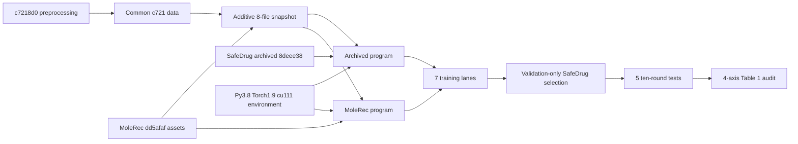
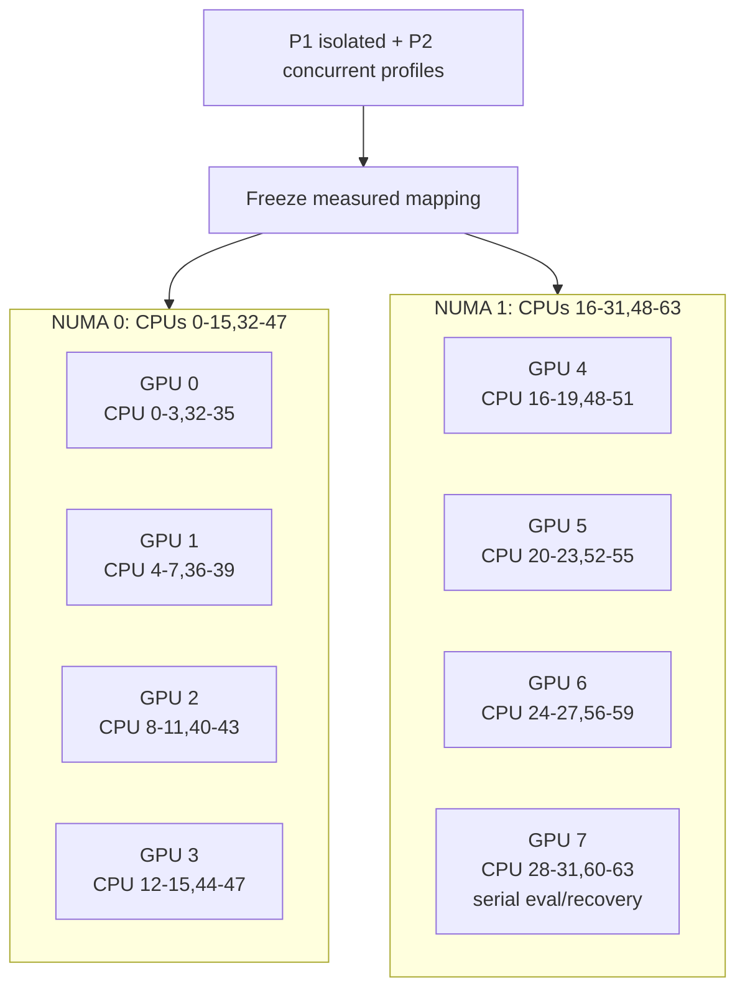

# MoleRec Table 1 Five-Model Full Reproduction

## Goal Capsule

Produce a clean, auditable, full Reproduction Mode attempt for the five-model subset in MoleRec Table 1: RETAIN, LEAP, GAMENet, SafeDrug, and MoleRec. The attempt must preserve the recorded upstream scientific behavior, use the accepted `c7218d0` data lineage, run seven training lanes and five test evaluations without test-set selection, maximize measured aggregate throughput on the real eight-GPU server, and end with an honest multi-axis `completed_match`, `completed_mismatch`, or incomplete verdict.

This plan supersedes the execution scope of `docs/plans/2026-08-25-2140-feat-four-model-full-reproduction-plan.md`; it does not rewrite or invalidate that completed historical attempt.

## Product Contract

### Summary

The current repository can reproduce four SafeDrug-family models through one archived adapter. The completed attempt `formal-20260826-025500` proved the mechanical path but matched only 12 of 20 strict point intervals. It also exposed four structural problems before MoleRec can be added safely:

1. `baselines/safedrug_archived.py` mixes scientific contracts, data validation, source adaptation, probing, log parsing, and orchestration in one 1,300-line module.
2. The registry, CLI, probe validator, status schema, and audit code assume four scientific models are also four execution lanes.
3. The existing environment is a modern compatibility stack, while official MoleRec records Python 3.8, PyTorch 1.9, and PyG 2.0.3.
4. The previous audit allowed correct directional relationships to be described too strongly despite point-estimate mismatch.

The successor must fix those execution-system defects without changing the four archived Baseline Cores or MoleRec's scientific behavior.

### Problem Frame

The hidden critical question is not “can five programs run on five GPUs?” It is: **can one attempt prove that all five reported systems used compatible authorities, one semantically aligned data product, validation-only model selection, complete upstream evaluation, and non-overwritten evidence?**

The causal risks are:

- treating five model names as five jobs loses the three disclosed SafeDrug learning-rate candidates;
- forcing all sources behind one generic plugin interface can silently change archived behavior;
- blindly preserving MoleRec's CUDA 10.2 record cannot support RTX 3090's Ampere architecture;
- reusing the old attempt's checkpoints would turn a successor reproduction into post hoc continuation;
- maximizing GPU occupancy without measuring CPU, I/O, thermal, and NUMA interference can increase total wall time and reduce reproducibility;
- testing all SafeDrug learning rates would leak test information into model selection;
- deleting old environments before proving the replacement creates an avoidable recovery failure.

### Claim Map

| Claim | Evidence required | Claim limit |
| --- | --- | --- |
| The five-model attempt executed faithfully | frozen authority identities, seven terminal training artifacts, one validation-only selection record, five complete ten-round test results | Reproduction Mode only; not Unified Research Protocol Comparison Mode |
| MoleRec's Table 1 point estimates were reproduced | 25 inclusive checks against reported mean ± two reported standard deviations | A miss remains a mismatch even if the direction is correct |
| MoleRec preserves its reported advantage over SafeDrug | MoleRec > SafeDrug for Jaccard, F1, and PRAUC; MoleRec < SafeDrug for DDI | Aggregate proxy metrics do not establish clinical safety |
| The compatibility environment is scientifically usable | frozen environment lock, CUDA/PyG/import/forward probes, fresh lane smokes | It is a disclosed compatibility environment, not exact historical hardware fidelity |
| GPU use was optimized | isolated and concurrent non-evidence profiles plus a frozen measured schedule | “Optimized” means lower measured makespan under constraints, not 100% instantaneous utilization |

### Key Decisions

1. **Five scientific models, seven training lanes.** RETAIN, LEAP, GAMENet, and MoleRec each train once; SafeDrug trains at learning rates `1e-5`, `1e-4`, and `5e-4`. `session-settled: 1A, 7B, 9B`
2. **One frozen compatibility environment.** All seven lanes use a new MoleRec-family Python 3.8 / PyTorch 1.9 / CUDA 11.1 environment. CUDA 11.1 is the minimum necessary RTX 3090 compatibility deviation from the recorded CUDA 10.2 stack. `session-settled: 6A, 8C, 12B`
3. **Static adapters, no dynamic plugin framework.** The registry remains the controller. SafeDrug archived and MoleRec are two explicit Reproduction Programs with static lane declarations. `session-settled: 16B, 17`
4. **Split the large archived adapter by existing responsibilities.** Preserve `baselines/safedrug_archived.py` as a thin façade and CLI entrypoint so current imports and tests remain valid. `session-settled: 16B`
5. **Official paired MoleRec molecular assets.** Copy `ddi_mask_H.pkl` and `substructure_smiles.pkl` byte-for-byte from the same frozen MoleRec revision. Do not regenerate unordered BRICS columns. `session-settled: 18`
6. **Validation-only SafeDrug selection.** Select the SafeDrug lane by maximum full-precision validation Jaccard, then lower validation DDI, then smaller learning rate as the deterministic administrative tie-break. Only the selected lane is tested. `session-settled: 7B, 10C`
7. **Measured two-stage scheduling.** Profile isolated architecture cost, then seven-lane concurrency. Freeze the lower measured makespan schedule that also passes memory, thermal, CPU, I/O, and isolation gates. `session-settled: 3 accepted, 5C, 9B`
8. **GPU 7 is an evaluation/recovery resource.** It runs completed checkpoints' tests serially and may recover an interrupted lane only under the recorded recovery policy. No synthetic job exists merely to occupy it. `session-settled: 19`
9. **Pilot results are immutable and inadmissible as successor evidence.** The accepted `c7218d0` snapshot may be reused only after the new snapshot bridge proves its identity and semantics. `session-settled: 4B, 20`
10. **Cleanup is narrow and terminal.** Delete only proven dead code during refactoring. Delete only the experiment-owned `medrec-safedrug-archived` Conda environment after the replacement and full attempt are terminal and recoverable. `session-settled: 2 accepted, 3 accepted, 8C, 13B`
11. **China mirrors are repository policy, not machine-global mutation.** Conda, pip, and uv use China mirrors first through command-scoped or repository-local configuration; unavailable exact artifacts fall back to official HTTPS authorities with TLS verification enabled. `session-settled: 8C, 14B`
12. **Verdicts are multi-axis.** Execution integrity, paper point fidelity, directional relationships, and artifact completeness remain separate; no relationship-only pass can become an overall match. `session-settled: 10C, 11B`

### Requirements

#### Scientific authority and data

- **R1** Freeze the four legacy Baseline Cores at SafeDrug archived revision `8deee38cfdb2a38882377ff95cce5922d6d9e8d6`.
- **R2** Freeze MoleRec at revision `dd5afaf0a503fd3de3229f86ec7f26b345d10e3a` and use its embedding-table variant invoked by upstream `--embedding`.
- **R3** Freeze preprocessing behavior at SafeDrug revision `c7218d0976e5ee5588aeaf5bdbc86b338126bba5`.
- **R4** Record 15,032 as the executable visit count produced by the frozen preprocessing and 14,995 only as paper-reported metadata. Never trim 37 visits to force agreement.
- **R5** Reuse the accepted `snapshots/safedrug-paper-c721-ijcai21` common data product only after verifying ordered medication vocabulary and common-file semantics; never reuse its four-model checkpoints, logs, or metrics.
- **R6** Publish a new additive snapshot under the registry name `snapshots/molerec-table1-c721-www23`; do not mutate either source snapshot or external upstream checkout.
- **R7** The new snapshot must expose exactly these eight consumer artifacts:
  - `records_final.pkl`
  - `voc_final.pkl`
  - `ddi_A_final.pkl`
  - `ehr_adj_final.pkl`
  - MoleRec-revision `ddi_mask_H.pkl`
  - its paired `substructure_smiles.pkl`
  - MoleRec-revision `idx2SMILES.pkl`
  - byte-identical `idx2drug.pkl` compatibility alias
- **R8** Prove that the ordered medication vocabulary in the accepted c721 data exactly equals the ordered medication vocabulary used by the frozen MoleRec assets and therefore aligns mask rows.
- **R9** Validate the archived six-file consumer contract and MoleRec's runtime consumer contract independently against the same new snapshot.

#### Code architecture and cleanup

- **R10** Split `baselines/safedrug_archived.py` into flat responsibility modules while retaining the original module as a stable façade and executable entrypoint.
- **R11** Preserve exact archived source adaptation, reversible byte check, checkpoint regexes, RETAIN basename behavior, 50-epoch formal training, one-epoch non-evidence smoke behavior, and ten-round upstream test parsing.
- **R12** Delete the proven-dead `load_archived_values` helper and fix the five-value return annotation of `load_and_validate_canonical_inputs`; do not perform unrelated deduplication or broad style rewrites.
- **R13** Add a separate `baselines/molerec.py` Reproduction Program. Do not add dynamic discovery, abstract plugin bases, compatibility wrappers, or a new adapters framework.
- **R14** Preserve the old four-baseline CLI selectors and add registry-driven static successor lane selectors; `all` must no longer be implemented as a hardcoded four-item tuple.
- **R15** Generalize remote probe validation only enough to make the program declare its probe kind, required checks, required inputs, and scientific count validation. The executor must not own a hardcoded SafeDrug count table.

#### Environment and dependency policy

- **R16** Create `medrec-molerec-table1` from a reviewed declarative environment and explicit Linux lock. Keep Python `3.8.16`, PyTorch `1.9.0`, PyG `2.0.3`, NumPy `1.23.5`, RDKit `2022.09.1`, pandas `1.5.3`, scikit-learn `1.2.0`, and SciPy `1.10.0` unless a recorded, reproduced compatibility failure forces a narrower deviation.
- **R17** Use `torch==1.9.0+cu111`, matching torchvision/torchaudio, and PyG extension wheels for `torch-1.9.0+cu111`; do not use CUDA 10.2 on RTX 3090 merely because a wheel exists.
- **R18** Resolve Conda, pip, and uv through China mirrors first. Use version-specific official HTTPS sources such as PyTorch and PyG only when the exact artifact is unavailable from the mirror. Never use `--trusted-host`, `ssl_verify: false`, or machine/user-global package-manager configuration.
- **R19** Do not trust the server's existing global Conda configuration. Every environment build, export, and rebuild must explicitly retain TLS verification.
- **R20** The environment gate requires a clean rebuild from the frozen declaration/lock plus imports, CUDA allocation, RDKit BRICS, PyG native extensions, model forward paths, and fresh process-level smoke for every scientific architecture.

#### Lane, selection, and artifact semantics

- **R21** Declare seven unique lane identities. Three SafeDrug learning-rate lanes must never share an artifact directory or overwrite one another.
- **R22** Bind every status and result artifact to attempt ID, lane ID, scientific baseline ID, program ID, profile ID, harness revision, model-source revision, preprocessing revision, snapshot ID, environment identity, mode, and terminal state.
- **R23** A process exit, tmux disappearance, log presence, or checkpoint alone is not terminal evidence. A lane is terminal only when its final status and mode-specific artifact validate together.
- **R24** Every formal training lane runs at most once after the final code/environment/data freeze. No mismatch-driven tuning, retry, seed search, checkpoint substitution, or source patch is allowed.
- **R25** The SafeDrug selector consumes full-precision validation metrics from all three terminal training candidates and writes `selection.json` before any SafeDrug test command can be planned.
- **R26** Missing or invalid SafeDrug candidate evidence produces `selection_incomplete`. Non-selected SafeDrug candidates are marked `not_tested_by_design`.
- **R27** RETAIN, LEAP, GAMENet, selected SafeDrug, and MoleRec each receive exactly the frozen upstream ten-round test procedure. The expected formal evidence is seven training results and five scientific test results.
- **R28** Final artifacts are atomically finalized into the attempt namespace; auditors reopen the finalized sibling status/result artifacts instead of trusting in-memory summaries or path names. Only the active submission identity for a lane may finalize. Artifacts arriving from a superseded or recovered submission are `stale_rejected` and never admissible.

#### GPU scheduling and execution

- **R29** Keep one formal process per GPU and disjoint CPU affinity. Respect the server's two NUMA groups and avoid cross-node CPU allocation unless profiling proves it beneficial.
- **R30** Stage P1 runs one isolated, one-epoch, non-evidence profile for each of the five architectures. Stage P2 runs all seven training profiles concurrently on GPUs 0–6 while GPU 7 remains reserved.
- **R31** Select the schedule with the lowest measured projected aggregate makespan only if it has no OOM, thermal throttling, material CPU/I/O contention, other-user interference, or lane-isolation violation. Otherwise retain the safe measured alternative.
- **R32** Assign the two longest measured architectures to different NUMA nodes, fill remaining lanes alternately, and break equal-cost ties by lane ID. Never freeze a schedule based on assumed model complexity.
- **R33** GPU 7 runs tests serially as eligible checkpoints become available. If GPU 7 is unavailable, evaluation waits; training does not steal other users' resources or silently change the frozen schedule.

#### Audit, memory, and cleanup

- **R34** Audit all 25 MoleRec Table 1 cells against inclusive `[reported mean - 2 × reported std, reported mean + 2 × reported std]` intervals using unrounded observed values.
- **R35** Audit four directional relationships: MoleRec Jaccard, F1, and PRAUC greater than SafeDrug; MoleRec DDI lower than SafeDrug.
- **R36** Report `execution_integrity`, `paper_point_fidelity`, `directional_relationships`, and `artifact_completeness` separately.
- **R37** Use `completed_match` only when all four axes pass; use `completed_mismatch` when a complete, valid execution misses any scientific interval or direction; otherwise use a specific incomplete/blocked terminal state.
- **R38** Add durable Decision and Failure Records before implementation. Correct the previous report's percentage wording: the Jaccard and F1 differences were percentage-point changes, not the stated relative percentages.
- **R39** Do not commit restricted data, split membership, weights, patient-level predictions, or private traces. Public-safe aggregate packets require Codex review before promotion from ignored runtime storage.
- **R40** Delete `/root/anaconda3/envs/medrec-safedrug-archived` only after the successor environment, seven training lanes, five tests, and final audit are terminal; verify no process uses it and preserve its lock as recovery. Never delete `/home/zhangcr/anaconda3/envs/molorec`, `/root/anaconda3/envs/xytf/medrec-gamenet`, or any unowned environment.

### Key Flows

#### Flow A: Freeze and admission

1. Write the Decision Record, Failure Record, reusable lessons, and mirror policy.
2. Refactor behind characterization tests; no scientific execution is admitted.
3. Register the two programs and seven lanes.
4. Build and rebuild the replacement environment under mirror/TLS policy.
5. Materialize and validate the additive eight-file snapshot.
6. Run fresh non-evidence smokes for all seven lane profiles.
7. Run P1/P2 profiling and freeze the measured schedule.
8. Freeze the final clean harness revision and open a new attempt namespace.

#### Flow B: Formal training and selection

1. Launch seven 50-epoch training lanes once under the frozen schedule.
2. Validate each finalized training status/result pair.
3. When all three SafeDrug candidates are terminal, generate `selection.json` from validation metrics only.
4. Admit the selected SafeDrug checkpoint to testing; mark two candidates `not_tested_by_design`.

#### Flow C: Evaluation and audit

1. Evaluate RETAIN, LEAP, GAMENet, MoleRec, and the selected SafeDrug checkpoint for ten upstream rounds each on GPU 7, serially as available.
2. Require five complete metric vectors and their upstream summaries.
3. Build the four-axis audit packet using full-precision values.
4. Produce a public-safe handoff; do not promote it to Git until Codex review.

#### Flow D: Terminal environment cleanup

1. Confirm the new environment remains rebuildable and the attempt has a terminal audit.
2. Resolve the exact old environment prefix and confirm it belongs to this experiment.
3. Confirm no live process references the prefix.
4. State impact: old commands using `medrec-safedrug-archived` will stop; about 5.6 GiB is reclaimed. Recovery remains possible from `environments/safedrug-archived-linux-64.lock`.
5. Remove only that named environment. If any check fails, preserve it and record cleanup as pending without altering scientific results.

### Acceptance Examples

#### Complete scientific mismatch

All seven training lanes and five tests are valid; all artifacts are complete; 23 of 25 point intervals and all four relationships pass. The aggregate state is `completed_mismatch`, not `completed_match` and not “fully reproduced.”

#### Relationship-only success

MoleRec beats SafeDrug in all four required directions, but several point intervals miss. `directional_relationships=passed`, `paper_point_fidelity=failed`, aggregate `completed_mismatch`.

#### Selection leakage prevention

Two SafeDrug candidates tie in validation Jaccard. The selector uses validation DDI and never reads test metrics. Only the selected lane is tested; the other two remain `not_tested_by_design`.

#### Missing SafeDrug candidate

One SafeDrug lane lacks a valid terminal result. No SafeDrug checkpoint is selected or tested; the attempt becomes `selection_incomplete` even if the other four models completed.

#### Safe environment cleanup

The full attempt is terminal, but a process still imports from `medrec-safedrug-archived`. The old environment remains untouched, cleanup is recorded pending, and no other user's environment is inspected beyond the minimum path/ownership check.

#### Mirror fallback

A China mirror lacks an exact PyG wheel. The installer records mirror miss and uses `https://data.pyg.org` with TLS verification. It does not disable SSL verification or mutate global Conda/pip configuration.

### Success Criteria

- The repository has two explicit Reproduction Programs and seven non-colliding successor lanes.
- The SafeDrug façade split passes all characterization and regression tests with no scientific behavior change.
- The compatibility environment rebuilds from its frozen declaration/lock and passes every program-level probe.
- One additive eight-file snapshot passes both program contracts and records 15,032 executable / 14,995 paper-reported visits without retroactive filtering.
- Seven fresh smokes and the two profiling stages complete as non-evidence.
- Seven formal 50-epoch training lanes run once; validation selects one SafeDrug candidate; five ten-round tests complete.
- The four-axis audit reports exactly what matched and what did not.
- No restricted artifact enters Git and no unrelated environment is removed.
- The old experiment environment is either safely removed under the terminal gate or explicitly retained with a truthful pending reason.

### Scope Boundaries

In scope:

- targeted SafeDrug adapter decomposition;
- static registry/lane/provenance generalization;
- a separate MoleRec reproduction adapter;
- compatibility environment and mirror policy;
- additive snapshot bridge;
- seven-lane scheduling, execution, validation selection, testing, audit, and terminal cleanup.

Out of scope:

- Unified Research Protocol Comparison Mode;
- patient-level re-splitting or cohort manipulation;
- hyperparameter tuning beyond the paper-disclosed SafeDrug learning rates;
- new model implementations, behavior-changing source edits, or performance optimization inside Baseline Cores;
- dynamic plugin discovery or a generalized experiment framework;
- clinical conclusions;
- deletion of historical attempts, snapshots, locks, other users' environments, or unknown Conda prefixes.

### Dependencies and Sources

- [Official MoleRec repository at frozen revision](https://github.com/yangnianzu0515/MoleRec/tree/dd5afaf0a503fd3de3229f86ec7f26b345d10e3a): model source, invocation, environment declaration, and paired assets.
- [MoleRec paper](https://yangnianzu0515.github.io/files/paper5-molerec.pdf): Table 1 targets and experimental claims.
- [SafeDrug preprocessing lineage](https://github.com/ycq091044/SafeDrug/tree/c7218d0976e5ee5588aeaf5bdbc86b338126bba5): common data processing authority.
- [NVIDIA CUDA architecture matrix](https://docs.nvidia.com/datacenter/tesla/drivers/cuda-toolkit-driver-and-architecture-matrix.html): Ampere requires CUDA 11.0 or newer.
- [CUDA 11.1 release notes](https://docs.nvidia.com/cuda/archive/11.1.0/pdf/CUDA_Toolkit_Release_Notes.pdf): driver compatibility.
- [PyTorch previous versions](https://docs.pytorch.org/get-started/previous-versions/): official PyTorch 1.9 CUDA 11.1 artifacts.
- [PyG 2.0.3 installation](https://pytorch-geometric.readthedocs.io/en/2.0.3/notes/installation.html) and [matching wheel index](https://data.pyg.org/whl/torch-1.9.0%2Bcu111.html): supported PyTorch/CUDA/Python combination.
- `research/baselines/failures/safedrug-reproduction-b0-failure-2026-08-25.md`: immutable 14,995-versus-15,032 failure history.
- `research/baselines/preflight/safedrug-four-model-reproduction-report.md`: completed pilot outcome and mismatch evidence.
- `research/memory/reusable-lessons.md`: durable claim and execution controls.

## Planning Contract

### Key Technical Decisions

#### KTD1: Two program authorities behind one static controller

`registry.toml` and `RemoteExecutor` remain the control plane. The four legacy models use the cleaned `safedrug-archived` program; MoleRec uses `molerec`. The common contract is data/provenance/status semantics, not a shared model class. `session-settled: 16B, 17`

Why: the upstream sources expose different commands and data consumers. Static declarations make those differences visible and testable without inventing a plugin framework.

#### KTD2: Scientific model identity is distinct from execution lane identity

A declarative `ReproductionLane` maps `lane_id` to `scientific_baseline_id`, `program_id`, and `profile_id`. The controller addresses lanes; the auditor groups them into five scientific systems. `session-settled: 7B, 9B`

| Lane ID | Scientific model | Program/profile | Formal test |
| --- | --- | --- | --- |
| `molerec-retain` | RETAIN | archived RETAIN | yes |
| `molerec-leap` | LEAP | archived LEAP | yes |
| `molerec-gamenet` | GAMENet | archived GAMENet | yes |
| `molerec-safedrug-lr-1e-5` | SafeDrug | archived SafeDrug, LR `1e-5` | only if selected |
| `molerec-safedrug-lr-1e-4` | SafeDrug | archived SafeDrug, LR `1e-4` | only if selected |
| `molerec-safedrug-lr-5e-4` | SafeDrug | archived SafeDrug, LR `5e-4` | only if selected |
| `molerec-embedding` | MoleRec | MoleRec `--embedding` | yes |

#### KTD3: SafeDrug façade decomposition preserves import and behavior seams

Create these flat modules:

- `baselines/safedrug_archived_contract.py`
- `baselines/safedrug_archived_data.py`
- `baselines/safedrug_archived_logs.py`
- `baselines/safedrug_archived_probe.py`
- `baselines/safedrug_archived_runner.py`

Keep `baselines/safedrug_archived.py` as the import/re-export façade and `main`. Existing tests load it by file path and monkeypatch its symbols, so the façade is part of the compatibility contract. Do not merge smoke and formal semantics into one configurable generic runner. `session-settled: 16B`

#### KTD4: One additive snapshot, two independently validated consumers

The common four c721 files come from the accepted executable snapshot. MoleRec molecular files come as one paired set from the frozen MoleRec revision. The compatibility alias is byte-identical; no scientific values are transformed. `session-settled: 18`

| Artifact | Authority | Validation |
| --- | --- | --- |
| records/voc/DDI/EHR files | accepted c721 snapshot | common counts, ordered vocabulary, matrices |
| `ddi_mask_H.pkl` | frozen MoleRec revision | binary matrix, 131 rows, paired column count |
| `substructure_smiles.pkl` | same MoleRec revision | column count/order matches mask |
| `idx2SMILES.pkl` | same MoleRec revision | keys align ordered medication vocabulary |
| `idx2drug.pkl` | byte-identical alias | byte equality to `idx2SMILES.pkl` |

#### KTD5: Compatibility environment minimizes necessary deviation

The recorded MoleRec CUDA 10.2 environment predates RTX 3090's SM86 support. Keep the scientific package versions and change only the CUDA binary target to 11.1 plus matching official PyTorch/PyG wheels. Record this as an environment compatibility deviation, not as exact historical reproduction. `session-settled: 12B`

#### KTD6: China-mirror-first policy remains local and secure

The root `AGENTS.md` owns the stable repository-wide default. Playbooks and environment docs own procedures. Exact version-specific artifacts may fall back to official HTTPS sources. TLS stays enabled and no user's global Conda/pip/uv configuration changes. `session-settled: 8C, 14B`

#### KTD7: SafeDrug model selection is a first-class immutable artifact

`selection.json` contains all three candidate lane IDs, learning rates, checkpoint identities, validation Jaccard/DDI at full precision, ordered comparison decisions, selected lane, and confirmation that no test metric was available to the selector. Missing candidates fail closed. `session-settled: 7B, 10C`

#### KTD8: GPU optimization is empirical and topology-aware

The server has eight RTX 3090 GPUs without NVLink and two NUMA groups. P1 measures architecture cost alone; P2 measures concurrent interference. The formal mapping is frozen from evidence, not from model reputation. GPU 7 is reserved for serial evaluation/recovery. `session-settled: 5C, 9B, 19`

#### KTD9: Provenance schema v2 makes path collisions detectable

Every terminal artifact explicitly carries its identities. The auditor requires equality between ledger, status, result, registry, and attempt namespace. It does not infer identity from a filename and does not add redundant per-row hashes.

#### KTD10: Terminal cleanup is reversible and subordinate to evidence

The old environment is removed only after the replacement and scientific attempt are terminal. Its explicit lock remains versioned, so removal does not erase the ability to reconstruct it. Cleanup failure never changes a scientific metric verdict. `session-settled: 8C, 13B`

### High-Level Technical Design

#### Authority and artifact flow



#### Attempt state machine

```mermaid
stateDiagram-v2
    [*] --> contracts_frozen
    [*] --> blocked_contract
    contracts_frozen --> code_ready
    contracts_frozen --> blocked_code
    code_ready --> environment_ready
    code_ready --> blocked_environment
    environment_ready --> snapshot_ready
    environment_ready --> blocked_snapshot
    snapshot_ready --> smokes_ready
    snapshot_ready --> blocked_smoke
    smokes_ready --> schedule_frozen
    smokes_ready --> blocked_profile
    schedule_frozen --> training
    training --> selection_ready: 7 training artifacts valid
    training --> formal_incomplete: lane failure or missing artifact
    training --> non_safedrug_testing: eligible checkpoint enqueued
    non_safedrug_testing --> training: test terminal, training remains
    selection_ready --> testing: selection.json valid; SafeDrug admitted
    selection_ready --> selection_incomplete: missing/invalid candidate
    testing --> audit_ready: 5 test artifacts valid
    testing --> formal_incomplete: evaluation failure
    audit_ready --> completed_match: all 4 axes pass
    audit_ready --> completed_mismatch: complete execution, scientific miss
    completed_match --> cleanup
    completed_mismatch --> cleanup
    blocked_contract --> [*]
    blocked_code --> [*]
    blocked_environment --> [*]
    blocked_snapshot --> [*]
    blocked_smoke --> [*]
    blocked_profile --> [*]
    selection_incomplete --> [*]
    formal_incomplete --> [*]
    cleanup --> [*]
```



Every blocked/incomplete node is a preserved terminal attempt state. U10 environment removal is reachable only from `completed_match` or `completed_mismatch`; a preparation or formal incomplete state preserves the old environment.

#### GPU and NUMA scheduling surface



The CPU sets are initial disjoint candidates, not scientific constants. P2 may select a different disjoint binding only when its evidence is recorded and the lane-isolation requirements remain true.

### Runtime Ledger Contract

The ignored attempt ledger must contain:

- authority identities and final clean harness revision;
- environment declaration/lock identity and compatibility deviations;
- snapshot identity, executable counts, paper metadata counts, and both consumer-contract verdicts;
- seven lane declarations, submission identities, assigned GPU/CPU set, state, checkpoint, validation metrics, and final artifact paths;
- GPU 7 evaluation queue and recovery events;
- `selection.json` identity and selected SafeDrug lane;
- five test result identities and ten-round completeness;
- four audit axes and aggregate terminal state;
- cleanup state for the old environment.

Allowed lane states are explicit and monotonic: `declared`, `submitted`, `training`, `training_terminal`, `eligible_for_selection`, `selected_for_test`, `not_tested_by_design`, `testing`, `completed`, or a specific failure state. Never infer success from a missing process.

Identity authority is not self-reported by the same artifact being checked:

| Field | Authority | Conflict behavior |
| --- | --- | --- |
| program, profile, scientific baseline, lane | frozen registry declaration | reject artifact |
| harness revision and attempt ID | frozen attempt ledger created by the controller | reject artifact |
| model/preprocessing revisions | frozen Decision Record plus program declaration | block admission or reject artifact |
| snapshot and environment identities | passed remote preflight bound into the attempt ledger | reject artifact |
| mode and active submission identity | controller-issued lane admission | mark non-current submission `stale_rejected` |
| checkpoint, validation, and test payload | finalized Program result | validate scientifically; never use as identity authority |

The Reproduction Program owns mode-specific execution and atomic status/result finalization. `RemoteExecutor` owns declaration resolution, preflight, submission identity, collection, and identity/schema validation; it does not interpret scientific success. The auditor reopens finalized sibling artifacts and owns selection/audit aggregation.

GPU 7 uses an explicit FIFO evaluation queue. A non-SafeDrug lane may enter when its training artifact is terminal and identity-valid. SafeDrug has an additional hard barrier: all three candidates are terminal and `selection.json` is valid. Queue state is persisted so a restart cannot submit the same test twice.

### Sequencing and System Impact

- U1–U4 are local code/document work and create the contracts that later evidence depends on.
- U5 creates the replacement environment but deliberately retains the old one.
- U6 creates the additive snapshot and fresh admission smokes.
- U7 profiles and freezes the formal schedule; profiling artifacts remain non-evidence. P1 costs generate at least two safe, deterministic lane-to-NUMA candidate mappings for P2: cost-balanced alternating placement and longest-pair-separated greedy placement. P2 measures both; ties prefer the simpler cost-balanced mapping.
- U8 is the only formal training phase. Tracked code and dependency declarations are frozen before it begins.
- U9 owns evaluation admission, validation selection, audit, and handoff. Its non-SafeDrug evaluation queue may consume terminal U8 checkpoints while other training lanes remain active; this overlap does not make tests part of U8 and never bypasses the SafeDrug selection barrier. It must not patch code after seeing results.
- U10 performs the already-authorized, narrowly scoped old-environment cleanup only after terminal evidence.

The only destructive action is U10's removal of the exact experiment-owned Conda environment. It does not remove snapshots, historical runs, locks, other users' environments, or any Git artifact.

### Risks and Mitigations

| Risk | Mechanism | Mitigation |
| --- | --- | --- |
| Unified environment changes archived behavior | old sources were prepared under a newer stack | full five-architecture imports/forward/smokes; record compatibility lineage; stop rather than patch science |
| Molecular columns are misaligned | BRICS generation used unordered collections | copy official paired mask/list from one revision and prove vocabulary/shape alignment |
| SafeDrug test leakage | three LR lanes tempt test-based choice | selector runs before SafeDrug test and accepts validation fields only |
| Artifact overwrite | three lanes map to one scientific model | unique lane IDs and directories; identity equality in finalization/audit |
| GPU oversubscription | seven training lanes plus evaluation compete | one process/GPU; GPU 7 reserved; tests serial; measured schedule |
| CPU/NUMA contention | all processes default to all CPU cores | disjoint affinity, P2 interference measurement, two longest lanes split across NUMA nodes |
| Historical evidence contamination | pilot artifacts already exist | new attempt namespace; old results inadmissible; auditor binds attempt identity |
| Destructive environment cleanup | prefix is in use or ownership is ambiguous | replacement-first, terminal-only, exact prefix/process/ownership gate, preserved lock |
| Mirror lacks exact binary | old package versions are sparsely mirrored | official version-specific HTTPS fallback with TLS enabled |
| Over-refactoring | monolith cleanup expands into framework redesign | characterization tests, flat modules, thin façade, only one proven-dead deletion |

## Implementation Units

### Unit Index

<!-- markdownlint-disable MD036 -->

| Unit | Outcome | Depends on | Formal evidence allowed |
| --- | --- | --- | --- |
| U1 | durable policy, failure, and decision memory | none | no |
| U2 | behavior-preserving SafeDrug adapter split | U1 | no |
| U3 | static seven-lane control plane and provenance v2 | U2 | no |
| U4 | MoleRec program, selector, and Table 1 auditor | U3 | no |
| U5 | rebuilt compatibility environment | U4 | no |
| U6 | additive snapshot and seven fresh smokes | U5 | smokes are non-evidence |
| U7 | measured GPU/NUMA schedule | U6 | profiles are non-evidence |
| U8 | seven formal 50-epoch training lanes | U7 | yes |
| U9 | selection, five tests, audit, and handoff | U8 | yes |
| U10 | narrowly scoped old-environment cleanup | U9 terminal | operational only |

### U1: Codify lessons, authority, and dependency policy

**Files**

- Modify `AGENTS.md`.
- Modify `docs/PLANS.md`.
- Modify `docs/playbooks/REMOTE_319_EXECUTION_PLAYBOOK.md`.
- Modify `docs/playbooks/SAFEDRUG_ARCHIVED_PREPARATION_PLAYBOOK.md`.
- Modify `environments/README.md`.
- Modify `research/README.md` and `research/memory/reusable-lessons.md`.
- Add `research/baselines/failures/safedrug-four-model-table2-mismatch-2026-08-26.md`.
- Add `research/baselines/decisions/molerec-five-model-reproduction-authority-2026-08-26.md`.

**Implementation**

- Add the stable mirror-first, official-HTTPS-fallback, TLS-required, non-global dependency policy to root `AGENTS.md`; keep installation procedure in the playbooks/environment docs.
- Record that the completed pilot had 12/20 point checks and 3/3 relationship checks, so its terminal scientific state is `completed_mismatch`.
- Correct percentage language: report Jaccard `+0.01312` as `+1.312` percentage points or about `+2.62%` relative; F1 `+0.01328` as `+1.328` points or about `+2.02%` relative.
- Record the two-source model authority, c721 data authority, executable/paper visit distinction, seven-lane design, validation-only SafeDrug selection, compatibility environment deviation, and old-attempt admissibility boundary.
- Make `research/README.md` expose Decision Records as a durable navigation class.

**Acceptance**

- A new agent can determine the five scientific models, seven lanes, three authorities, mirror policy, and claim limits without reading runtime logs.
- No document describes relationship-only success as full reproduction.
- The `AGENTS.md` modification passes the repository's AGENTS/Docs completion gate and Markdown lint.

### U2: Characterize and split the archived SafeDrug adapter

**Files**

- Modify `baselines/safedrug_archived.py`.
- Add the five `baselines/safedrug_archived_*.py` responsibility modules named in KTD3.
- Modify `tests/unit/test_safedrug_archived_program.py`.

**Implementation**

- First freeze behavior with characterization tests for source adaptation/reversal, all profiles, checkpoint regexes, RETAIN test basename, training/test log parsing, six-file validation, smoke non-evidence, and formal 50-epoch/ten-round commands.
- Move contracts/profiles, data validators, log/checkpoint code, probes, and runners to the flat modules.
- Keep the original module's public symbols importable/re-exported and keep monkeypatch seams used by existing tests.
- Delete only `load_archived_values` and repair the five-item return annotation.
- Do not alter learning rates, seeds, source text, metric formulas, split semantics, checkpoint choice, or result values.

**Acceptance**

- Existing and new characterization tests pass before and after the split.
- The façade is small and legible; each new module has one dominant responsibility.
- A byte-level adaptation round trip and all command snapshots are unchanged.

### U3: Add static lane declarations and provenance schema v2

**Files**

- Modify `baselines/registry.toml`.
- Modify `src/medrec_research/registry.py`.
- Modify `src/medrec_research/cli.py`.
- Modify `src/medrec_research/remote_executor.py`.
- Modify `tests/unit/test_registry.py`, `tests/unit/test_remote_executor.py`, `tests/integration/test_run_cli.py`, and the existing legacy reproduction-audit tests.

**Implementation**

- Add a static `ReproductionLane` registry schema and the seven successor lane declarations.
- Preserve old single-baseline and four-baseline selectors. Replace `ARCHIVED_BASELINES`, `_reproduction_lanes`, and both parser choice surfaces with registry-derived declarations; implement successor `all` from registry order and require an explicit GPU mapping/schedule artifact rather than exactly four GPUs.
- Move program-specific count/semantic validation behind program-declared probe contracts. Keep the executor responsible for identity, required check truth, required input presence, and schema validation.
- Replace the current SafeDrug-only probe validator with program-specific executable-count and paper-metadata semantics; a 15,032 executable count must not be confused with the separately recorded 14,995 paper value.
- Introduce status/result schema v2 with the identity fields in R22 and unique lane-scoped final directories.
- Give each submission an active identity. A recovery supersedes that identity before launch; late artifacts from the old submission are retained as stale diagnostics and cannot finalize the lane.
- Require each Program to finalize its own artifacts atomically. Keep `RemoteExecutor` limited to admission/collection/schema identity checks and make the auditor reopen both finalized artifacts.
- Keep Comparison Mode `RunRecord` unchanged; Reproduction evidence remains a distinct schema.
- Preserve `src/medrec_research/reproduction_audit.py` as the legacy four-model Table 2 auditor unless its compatibility tests require a minimal schema reader change; the new Table 1 auditor is additive and must not reinterpret old packets.

**Acceptance**

- Registry validation rejects duplicate lane IDs, missing profiles/programs, and ambiguous scientific-model mappings.
- Three SafeDrug lanes plan to distinct paths and results.
- Old four-model dry-run behavior remains available.
- A forged/mismatched attempt, environment, snapshot, source, lane, or status/result identity is rejected deterministically.
- Legacy four-model Table 2 packets still validate under their original schema, and old CLI integration behavior remains covered.
- An old submission that writes after a recovery is marked `stale_rejected` and cannot overwrite the active lane.

### U4: Add MoleRec program, SafeDrug selector, and Table 1 audit

**Files**

- Add `baselines/molerec.py`.
- Add `src/medrec_research/safedrug_selection.py`.
- Add `src/medrec_research/molerec_reproduction_audit.py`.
- Add `research/baselines/preflight/molerec-table1-reference.json`.
- Add focused unit/integration tests for all three components.
- Add an orchestration integration test for evaluation admission and the SafeDrug selection barrier.

**Implementation**

- Implement a thin process adapter around the frozen external MoleRec checkout; do not vendor or rewrite its Baseline Core.
- Preserve `--embedding`, 50 epochs, recorded defaults, ordered split, validation behavior, ten bootstrap rounds, 80% patient sampling with replacement, NumPy population standard deviation, and upstream metric formulas.
- Add SafeDrug profiles for the three disclosed learning rates without editing archived scientific source beyond the existing reversible mechanical training adaptation.
- Implement the validation-only selector with the exact tie rules in KTD7 and explicit `selection_incomplete` behavior.
- Implement the 25 interval checks, four direction checks, four verdict axes, and aggregate states.
- Validate reference JSON at load time for exact five-model/five-metric coverage, unique keys, numeric values, and metric directions.

**Acceptance**

- Synthetic fixtures reproduce upstream split, bootstrap, and population-standard-deviation semantics.
- The selector cannot accept test fields and makes the same decision independent of candidate input order.
- Boundary values equal to interval endpoints pass.
- A complete directional pass plus one point miss yields `completed_mismatch`.
- No SafeDrug test command can be constructed or submitted without a valid `selection.json`; missing candidate evidence yields `selection_incomplete` and marks no candidate selected.

### U5: Build and prove the MoleRec-family compatibility environment

**Files**

- Add `environments/molerec-table1.yml`.
- Generate and add `environments/molerec-table1-linux-64.lock` after successful resolution.
- Modify the relevant environment declaration in `baselines/registry.toml`.

**Implementation**

- Build `medrec-molerec-table1` on 319 using repository/command-scoped China mirrors with TLS verification.
- Use official PyTorch/PyG HTTPS endpoints only for exact missing binary artifacts and record each fallback.
- Pin the KTD5 stack and matching cu111 wheels; do not consume the server's `ssl_verify:false` global behavior.
- Run imports, CUDA allocation, GPU identity, RDKit BRICS, PyG extension imports, and all five architecture forward/process probes.
- Freeze the explicit Linux lock and environment identity.
- Destroy only a disposable validation copy, rebuild it from the lock, and repeat the full probe. Retain `medrec-safedrug-archived` untouched.
- Commit the final code/declarations/lock before any evidence-producing run and record the clean harness revision.

**Acceptance**

- Clean rebuild and original environment return identical declared package/CUDA identities and both pass full probes.
- All five programs allocate and execute on an RTX 3090 without source patches.
- TLS remains enabled; no global Conda/pip/uv configuration changes.
- Any incompatibility terminates U5 with a Failure/Decision Record proposal; it does not authorize scientific source edits or old-environment deletion.

### U6: Materialize the additive snapshot and pass fresh lane smokes

**Files**

- Add `src/medrec_research/molerec_snapshot.py`.
- Modify `src/medrec_research/cli.py` with a staging command.
- Add snapshot-builder and dual-consumer contract tests.

**Implementation**

- Stage the eight files described in R7 into a run-scoped candidate.
- Prove ordered vocabulary equality, mask-row alignment, mask/substructure-column alignment, compatibility alias byte equality, matrix invariants, common counts, and both program input contracts.
- Atomically publish `snapshots/molerec-table1-c721-www23` only after every check passes.
- Run fresh one-epoch non-evidence smokes for all seven profiles in the new environment and snapshot.
- Require smoke result/status pairs to declare `non_evidence: true` and prohibit test results.

**Acceptance**

- The snapshot reports 6,350 patients, 15,032 executable visits, 131 medications, 448 DDI pairs, and 491 paired molecular columns while separately disclosing 14,995 paper-reported visits.
- All seven smokes complete without test artifacts or collisions.
- Any bridge failure rejects the candidate and blocks profiling/formal admission.

### U7: Profile and freeze the GPU/NUMA schedule

**Artifacts**

- Ignored P1/P2 profile ledger and selected schedule under the new attempt-preparation namespace.
- No tracked code or scientific result changes.

**Implementation**

- Confirm the real 319 topology, free GPUs, current users, driver, CPU/NUMA map, RAM, and storage immediately before profiling.
- P1: profile one one-epoch non-evidence run for each architecture in isolation; SafeDrug needs only one representative learning rate because LR does not change architecture.
- Derive at least two deterministic safe mappings from P1 costs: cost-balanced alternating placement and longest-pair-separated greedy placement.
- P2: measure both seven-lane mappings on GPUs 0–6 with disjoint NUMA-local CPU sets; reserve GPU 7.
- Capture wall time, peak GPU memory, utilization, temperature/throttle state, CPU pressure, I/O wait, and interference notes.
- Compare projected aggregate makespan across the two P2 candidates. Freeze the safe lower-time mapping using R31–R32, including its GPU/CPU assignments and tie resolution; exact ties choose the simpler cost-balanced mapping.
- Rerun a profile only for infrastructure invalidity such as another user's interference, not because a lane is slow.

**Acceptance**

- The selected mapping is derived from observed P1/P2 evidence and is reproducible from the ledger.
- One process/GPU, disjoint CPU affinity, and GPU 7 reserve are explicit.
- There is no OOM, throttle, or material contention that invalidates the chosen comparison.

### U8: Execute seven formal training lanes once

**Artifacts**

- New immutable attempt namespace under ignored runtime storage.
- Seven lane-scoped training status/result/checkpoint/log sets.

**Implementation**

- Run final remote preflight and bind the clean harness, both model revisions, preprocessing revision, environment, snapshot, attempt, registry, and schedule identities.
- Submit all seven 50-epoch training lanes under the frozen GPU/CPU mapping.
- Keep GPU 7 reserved. Through U9's persisted queue, it may begin eligible non-SafeDrug evaluations as checkpoints finalize, but SafeDrug cannot enter the queue before selection.
- Monitor terminal artifacts, not tmux names. Record infrastructure failures exactly; do not resubmit automatically.
- A recovery on GPU 7 is allowed only when the original lane is proven dead, no valid terminal result exists, the scientific command/seed/checkpoint semantics remain identical, and the recovery is recorded as the same attempt's infrastructure continuation. Otherwise terminate incomplete.

**Acceptance**

- Seven training lanes each have exactly one admissible terminal result and non-colliding checkpoint set.
- All identities equal the frozen ledger.
- Every lane completed 50 epochs and emitted the validation fields needed by its downstream contract.
- No code, dependency, data, parameter, or seed changed after formal admission.

### U9: Select SafeDrug, run five tests, audit, and hand off

**Artifacts**

- `selection.json`.
- Five test status/result artifacts containing ten rounds and upstream summaries.
- `molerec-table1-audit-packet.json` and a concise five-model report in ignored runtime storage pending Codex review.

**Implementation**

- Validate all three SafeDrug training candidates and generate `selection.json` before constructing the SafeDrug test command.
- Mark non-selected candidates `not_tested_by_design`.
- Admit identity-valid non-SafeDrug checkpoints to the persisted FIFO queue as they finalize during U8. After selection, admit only the selected SafeDrug checkpoint. Complete all five ten-round tests serially on GPU 7.
- Recompute summaries from the ten raw aggregate rounds and require agreement with parsed upstream summaries under the declared precision contract.
- Run the 25 point checks, four directional checks, artifact completeness, execution integrity, and aggregate verdict.
- Produce an operator handoff with exact identities, lane outcomes, selected LR, metrics, mismatches, failure/recovery events, and claim limits.
- Stop before committing public-safe result artifacts; return them to Codex for integrity review and promotion decision.

**Acceptance**

- Selection is validation-only and deterministic.
- Exactly five test results are present, each with ten valid rounds.
- The queue admits no duplicate test, never admits SafeDrug before valid selection, and can resume without losing or replaying terminal work.
- The report never converts an absolute proportion difference into a relative percentage incorrectly.
- Aggregate state follows R37 and cannot be overridden by relationship success.

### U10: Remove only the superseded experiment environment

**Target**

- Exact environment: `/root/anaconda3/envs/medrec-safedrug-archived`.
- Preserved recovery declaration: `environments/safedrug-archived-linux-64.lock`.

**Implementation**

- Require U9's terminal audit and a final successful probe of `medrec-molerec-table1`.
- Resolve the exact Conda name/prefix, verify experiment ownership, verify it is not the replacement, and scan for processes using the prefix.
- State the destructive impact immediately before execution: old commands tied to the environment stop; approximately 5.6 GiB is reclaimed; historical run/data/checkpoint artifacts remain; reconstruction is possible from the preserved lock.
- Remove only the exact named environment. Do not use a broad path, glob, recursive deletion, or cleanup command that can reach other environments.
- Record `removed`, `retained_in_use`, or `retained_ownership_uncertain`. A retained state is truthful and does not alter U9's scientific verdict.

**Acceptance**

- No other Conda prefix is modified.
- If removed, the exact old prefix is gone and the new environment still passes its probe.
- If not removed, the reason is explicit and no destructive fallback is attempted.

<!-- markdownlint-enable MD036 -->

## Verification Contract

### Local implementation gates

Each implementation unit runs the narrow tests that could detect its own failure. Before the final code freeze, run the repository completion suite:

```bash
rtk proxy /opt/homebrew/bin/uv run pytest
rtk proxy /opt/homebrew/bin/uv run ruff check .
rtk proxy /opt/homebrew/bin/uv run ruff format --check .
markdownlint '**/*.md' --ignore '.agents/**'
```

Because U1 modifies `AGENTS.md`, also run the AGENTS/Docs completion gate declared by the active repository policy. A gate failure blocks the final harness freeze.

### Contract tests

- SafeDrug façade behavior snapshots and monkeypatch seams.
- Seven-lane registry uniqueness and five-model grouping.
- Probe-schema program separation and identity mismatch rejection.
- Provenance schema v2 round trip and finalized sibling re-open.
- SafeDrug selector order independence, tie rules, missing-candidate failure, and test-field rejection.
- MoleRec split/bootstrap/population-std semantics.
- Table 1 reference completeness, interval endpoints, metric directions, and multi-axis verdict aggregation.
- Snapshot paired-asset alignment and compatibility alias equality.

### Remote non-evidence gates

- Replacement environment clean rebuild and full five-architecture probe.
- Dual-consumer snapshot probe.
- Seven fresh one-epoch smokes with no test artifacts.
- P1/P2 profile packet with valid topology and no interference invalidation.

These artifacts admit the formal attempt but are never counted as Table 1 evidence.

### Formal evidence gates

- Final clean harness revision equals the attempt ledger.
- Seven training status/result pairs are terminal and identity-consistent.
- All training lanes contain 50 epochs and expected validation/checkpoint evidence.
- `selection.json` predates and authorizes the sole SafeDrug test.
- Five test pairs contain ten complete rounds and recomputed summaries.
- Audit reopens finalized artifacts and reports 25 point checks plus four direction checks.
- Restricted artifacts remain outside Git.

### Stop conditions

Stop without scientific improvisation when:

- a frozen authority or paired asset cannot be obtained;
- ordered vocabulary or molecular alignment fails;
- the compatibility environment cannot run a Baseline Core without a scientific source patch;
- any fresh lane smoke fails;
- profiling is invalidated and cannot produce a safe measured schedule;
- a formal lane lacks an admissible terminal artifact;
- SafeDrug selection is incomplete;
- any of five formal tests is incomplete;
- code, environment, data, seed, or parameter changes after formal admission.

An incomplete attempt remains preserved. Do not fill missing metrics, reuse pilot results, or relabel it as a scientific mismatch.

## Definition of Done

This plan is complete only when all of the following hold:

- U1–U4 establish reviewed contracts, targeted cleanup, two static programs, seven lanes, validation selection, and four-axis audit semantics.
- U5 produces a rebuildable, frozen `medrec-molerec-table1` compatibility environment with documented CUDA deviation and secure mirror behavior.
- U6 publishes the dual-consumer additive snapshot and completes seven fresh non-evidence smokes.
- U7 freezes a measured GPU/NUMA schedule from valid P1/P2 evidence.
- U8 produces seven admissible 50-epoch training results without post-admission scientific changes.
- U9 produces one validation-only SafeDrug selection, five complete ten-round tests, and an honest terminal audit/handoff.
- U10 records a terminal outcome for the one authorized old environment and touches no other environment.
- All required local, remote, artifact, documentation, and policy gates pass.
- Gemini returns the ignored evidence packet to Codex for review; Gemini does not self-promote it into durable research truth.

## Appendix: MoleRec Table 1 Reference

The auditor stores and evaluates these published means and standard deviations without rounding observed values before comparison.

| Model | DDI rate | Jaccard | F1 | PRAUC | Avg. drugs |
| --- | ---: | ---: | ---: | ---: | ---: |
| RETAIN | 0.0871 ± 0.0013 | 0.4866 ± 0.0034 | 0.6471 ± 0.0032 | 0.7593 ± 0.0035 | 18.5941 ± 0.2186 |
| LEAP | 0.0760 ± 0.0008 | 0.4540 ± 0.0027 | 0.6158 ± 0.0025 | 0.6598 ± 0.0026 | 18.6739 ± 0.0661 |
| GAMENet | 0.0859 ± 0.0005 | 0.5037 ± 0.0015 | 0.6601 ± 0.0014 | 0.7673 ± 0.0024 | 27.2603 ± 0.1929 |
| SafeDrug | 0.0773 ± 0.0006 | 0.5126 ± 0.0028 | 0.6691 ± 0.0023 | 0.7655 ± 0.0022 | 20.8940 ± 0.1086 |
| MoleRec | 0.0724 ± 0.0008 | 0.5305 ± 0.0033 | 0.6843 ± 0.0029 | 0.7736 ± 0.0027 | 21.0893 ± 0.1788 |
