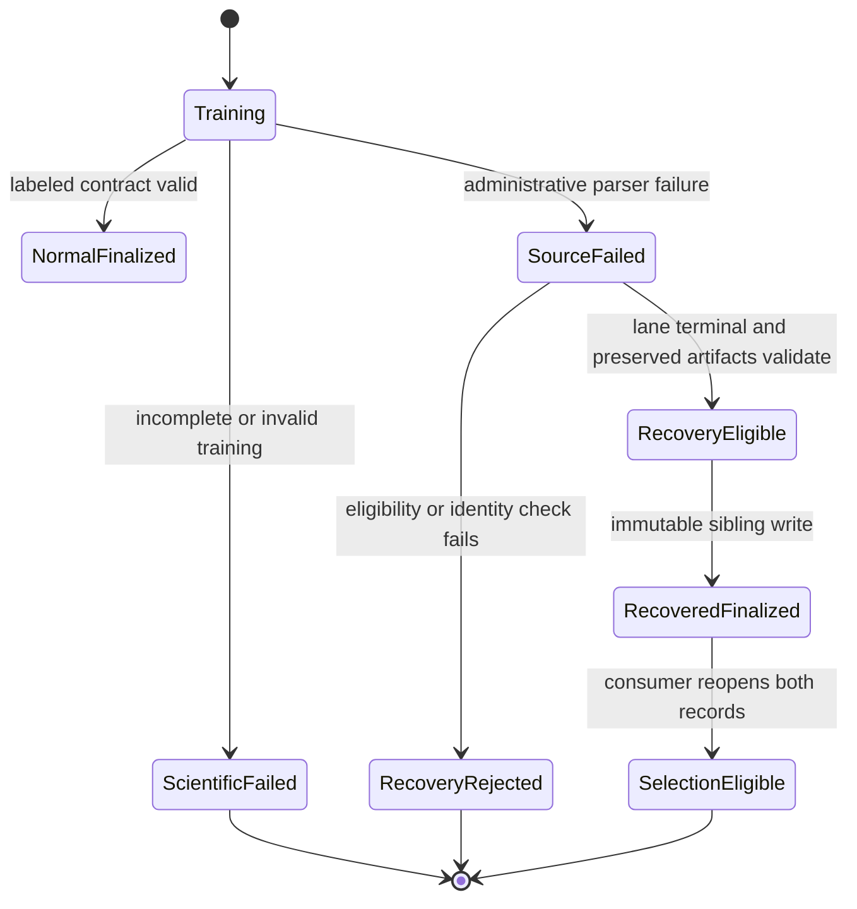
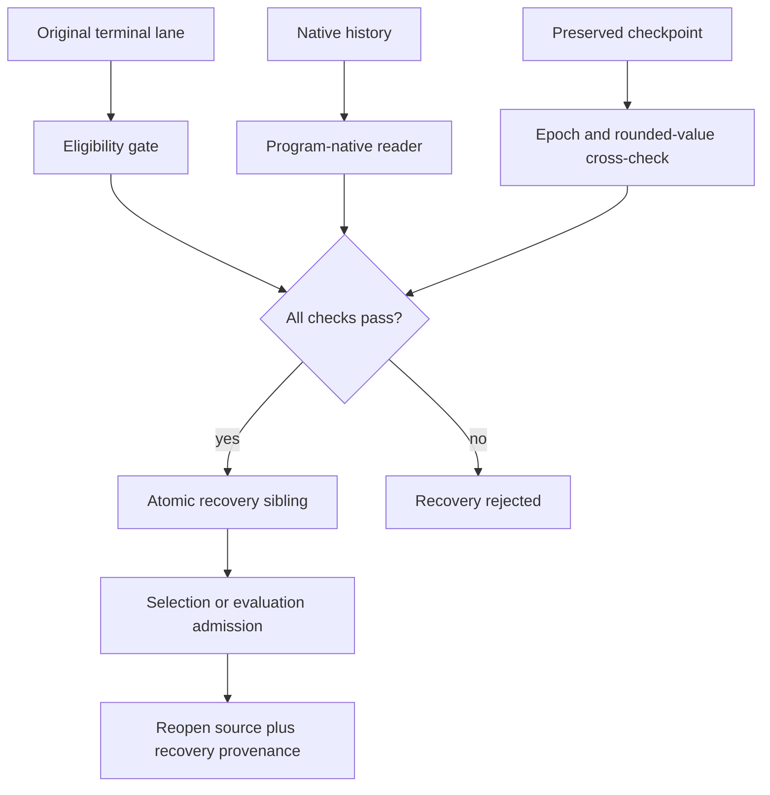

# MoleRec Finalization Recovery - Plan

## Goal Capsule

- **Objective:** Complete the formal MoleRec five-model attempt from scientifically valid preserved training outputs when the harness finalizer cannot parse the frozen upstream log format.
- **Means:** Add a narrow program-native history authority and immutable same-attempt administrative recovery path, then finish the remaining conformance work as bounded follow-up units (KTD1–KTD3).
- **Authority:** The amended reproduction plan remains authoritative except where this plan narrows R24 and R28 for administrative finalization recovery. Frozen upstream source, data, environment, schedule, and checkpoints do not change.
- **Execution profile:** The main agent owns the locally verified hard slice U1–U4. Follow-up agents own U5–U10 after all seven remote lanes are terminal.
- **Stop conditions:** Stop on incomplete training, malformed or non-finite history, checkpoint/history disagreement, identity disagreement, a live lane, or any need to retrain or inspect test output.
- **Tail ownership:** A later remote-execution agent performs U5 under Codex review. Other agents may execute U6–U10 independently when their dependencies are met.

---

## Product Contract

### Summary

The frozen SafeDrug-family and MoleRec training programs print unlabeled validation metrics. The current harness requires labeled validation lines after training, so a scientifically complete lane can fail during administrative finalization. This plan permits recovery from the frozen program-native history and checkpoint artifacts without rerunning training, changing model selection, or overwriting the failed record.

### Problem Frame

The current failure is at the evidence adapter boundary, not in model training. If the harness treats a formatting mismatch as scientific failure, it discards valid outputs. If recovery is too permissive, it can become an unrecorded second interpretation of frozen evidence. The fix must separate scientific execution from administrative finalization and make the new interpretation explicit, narrow, immutable, and auditable.

### Key Decisions

- **Finalize preserved outputs without retraining.** (session-settled: user-directed — chosen over rerunning a clean attempt or abandoning the attempt: completed native histories and checkpoints preserve the one-run scientific execution.) Governs R1–R8.
- **Recover under the same attempt with immutable sibling artifacts.** (session-settled: user-directed — chosen over a new attempt or overwriting the failed result: the scientific execution identity stays stable while finalizer provenance remains visible.) Governs R9–R13.

### Requirements

#### Scientific admissibility

- R1. Recovery must consume only artifacts produced by the original frozen training submission and must not invoke training, test evaluation, checkpoint substitution, seed search, or tuning.
- R2. Program-native full-precision validation history is the metric authority only when the frozen training log lacks the labels required by the existing finalizer. Both frozen programs serialize a mapping with exactly `ja`, `ddi_rate`, `avg_p`, `avg_r`, `avg_f1`, `prauc`, and `med` lists.
- R3. The selected epoch is the full-precision validation-Jaccard argmax used by the frozen upstream checkpoint policy; validation DDI comes from the same history entry.
- R4. Recovery must reject a history whose seven metric lists are not the same expected length, whose values are malformed or non-finite, or whose selected epoch cannot be reconciled with the preserved checkpoint.
- R5. The checkpoint filename's rounded epoch and metrics provide a cross-check only. They must not replace full-precision history values.
- R6. Test output, test metrics, moving averages, and paper targets are inadmissible for training finalization and checkpoint selection.
- R7. The existing labeled-log path remains valid for programs that produce its contract. Native-history recovery is a declared program-specific authority, not a heuristic fallback over arbitrary files.
- R8. A lane whose training did not complete remains failed. Administrative recovery must not convert partial scientific execution into terminal evidence.

#### Recovery identity and artifacts

- R9. Recovery is allowed only when the original v2 pair is terminal `failed` with `artifact_type=training` and `failure_code=training_failed`, the 50-epoch log parser passes, and the frozen validation parser reproduces the exact missing-label error classified as `validation_metrics_unlabeled`.
- R10. Recovery writes a new immutable sibling namespace under the same attempt. It never edits or deletes the original log, status, result, history, or checkpoint.
- R11. The recovered status and result retain the original v2 identity unchanged and carry the same additive `recovery` object. It binds recovery ID, finalizer revision, source relative path, source terminal state, source failure code, parser classification, selected epoch, checkpoint, and full-precision validation metrics.
- R12. Recovered training evidence must pass the normal v2 pair validator plus a recovery validator that reopens the unchanged source pair and requires exact source/recovery identity equality.
- R13. SafeDrug selection and evaluation admission may consume a recovered training result only after its sibling recovery record validates.

#### Follow-up conformance and operability

- R14. SafeDrug selection must require exactly the three declared candidate lane IDs, unique candidates, complete terminal evidence, and a comparison record consistent with the selected winner.
- R15. Probe validation authority must move from executor-owned program-kind/count branches to the static reproduction-program declaration required by the amended plan's predecessor R15.
- R16. Formal submission must bind the frozen schedule artifact, reject overlapping CPU sets, and verify the submitted GPU mapping matches that schedule.
- R17. The evaluation queue must have one production orchestration entrypoint that admits only valid terminal training evidence and serializes GPU 7 evaluation.
- R18. Running status must expose an epoch or heartbeat update without changing scientific output or creating high-volume traces.
- R19. Plan tracking, handoff text, and reproduction playbooks must describe the current attempt and the recovery boundary without claiming unfinished work is complete.

### Acceptance Examples

- **Recoverable finalization failure:** A 50-entry finite history selects epoch 49, its rounded metrics agree with the preserved epoch-49 checkpoint name, and the original status reports the diagnosed parser failure. Recovery writes a sibling result and provenance record; the failed original stays unchanged.
- **Incomplete training:** A lane has 43 history entries for a 50-epoch formal run. Recovery rejects it even when a checkpoint exists.
- **Checkpoint disagreement:** History selects epoch 31 but the only preserved checkpoint encodes epoch 28. Recovery rejects the lane instead of selecting either artifact opportunistically.
- **No selection leakage:** Three valid recovered SafeDrug training results are compared using full-precision validation values. No test command is planned before `selection.json` validates.

### Scope Boundaries

In scope:

- administrative training finalization from frozen native histories and checkpoints;
- immutable same-attempt recovery provenance;
- focused local tests and synthetic fixtures;
- one later remote recovery pass after every lane is terminal;
- the bounded conformance gaps in R14–R19.

Out of scope:

- rerunning or patching any Baseline Core;
- changing the environment, data snapshot, schedule, seed, epoch count, or checkpoint policy;
- reading test metrics during training recovery;
- deleting remote artifacts, terminating live jobs, or cleaning environments;
- broad plugin frameworks, migration layers, or generalized artifact-repair systems.

---

## Planning Contract

### Key Technical Decisions

- KTD1. **Use one validator for the common native history shape.** (session-settled: user-directed — chosen over retraining or abandoning preserved outputs: the native histories contain the full-precision validation sequence produced by the frozen run.) Both programs write the same seven-list mapping. SafeDrug-family history lives at `checkpoint_dir/history_<model_name>.pkl`; MoleRec history lives at `checkpoint_dir/history.pkl`. The two existing contract modules declare only that filename rule. Governs R1–R8.
- KTD2. **Make recovery additive and same-attempt.** (session-settled: user-directed — chosen over a new attempt or in-place rewrite: additive siblings preserve both the original failure and the recovery interpretation.) Recovery writes `run_root/recoveries/<recovery_id>/` through `finalize_v2_pair`. The recovered status and result keep the original v2 identity and carry an identical additive `recovery` object; recovery provenance does not become a second scientific identity. Governs R9–R13.
- KTD3. **Keep normal finalization and recovery separate at the command boundary.** Normal training remains fail-closed. The explicit recovery operation accepts only the exact R9 predicate, does not expose training or test command hooks, and classifies the existing parser exception without broadening normal parsing. Governs R2, R7–R10.
- KTD4. **Validate at the consumer boundary.** SafeDrug selection and evaluation admission reopen recovered artifacts and their provenance instead of trusting paths or in-memory values. Governs R12–R14, R17.
- KTD5. **Prefer static declarations over executor branching.** Probe requirements, native-history authority, and schedule identity belong to existing registry/program records. This follows the repository's static-adapter design and avoids a plugin framework. Governs R7, R15–R16.
- KTD6. **Add low-volume progress evidence only.** A bounded epoch or heartbeat update is sufficient for operators. Training logs remain the detailed trace. Governs R18.

### High-Level Technical Design

### Sequencing and ownership

U1–U4 are the hard local slice and run in order. U5 waits for all seven remote lanes to become terminal and for U1–U4 review. U6 can follow U4. U7–U10 are independent medium or simple follow-ups after U4, except U9 also depends on U6.

---

## Implementation Units

| Unit | Title | Primary files | Depends on |
| --- | --- | --- | --- |
| U1 | Characterize native histories | `tests/unit/test_reproduction_runner.py` | — |
| U2 | Add history metric authority | `baselines/reproduction_history.py` | U1 |
| U3 | Add immutable recovery finalizer | `baselines/reproduction_runner.py` | U2 |
| U4 | Prove local recovery flow | `tests/unit/test_reproduction_artifacts.py` | U3 |
| U5 | Recover the formal attempt | remote attempt artifacts only | U4 |
| U6 | Tighten SafeDrug selection | `src/medrec_research/safedrug_selection.py` | U4 |
| U7 | Move probe authority | `src/medrec_research/remote_executor.py` | U4 |
| U8 | Bind frozen schedule | `src/medrec_research/cli.py` | U4 |
| U9 | Wire the evaluation queue | `src/medrec_research/evaluation_queue.py` | U6 |
| U10 | Add progress and sync docs | `baselines/reproduction_runner.py` | U4 |

### U1. Characterize native history and failure contracts

- **Owner:** Main agent; hard slice.
- **Goal:** Pin the current failure and both supported native history shapes before implementation changes behavior.
- **Requirements:** R1–R8.
- **Dependencies:** None.
- **Files:** `tests/unit/test_reproduction_runner.py`, `tests/unit/test_safedrug_archived_program.py`, `tests/unit/test_molerec_program.py`, synthetic fixture files only when existing factories cannot express the histories.
- **Approach:** Add focused characterization tests for unlabeled complete logs, SafeDrug-family history, MoleRec history, incomplete history, non-finite metrics, and checkpoint disagreement. Remove the runner mock that currently hides the integration boundary where practical.
- **Execution note:** Start with failing tests that reproduce the exact administrative finalization failure.
- **Patterns to follow:** Existing temporary-directory artifact tests and program-specific parser tests.
- **Test scenarios:**
  - A complete 50-epoch SafeDrug-family history and unlabeled log fail under the old runner at the expected parser boundary.
  - A complete MoleRec history exposes the same failure through its different program-specific filename and directory layout.
  - A 49-entry formal history is classified as incomplete.
  - NaN or infinite validation values are rejected.
  - A history-selected epoch that disagrees with the preserved checkpoint is rejected.
- **Verification:** Tests fail for the diagnosed reason before U2 and do not require real patient data.

### U2. Add the program-native validation-history authority

- **Owner:** Main agent; hard slice.
- **Goal:** Extract full-precision selected-epoch validation metrics from declared native history formats.
- **Requirements:** R1–R8.
- **Dependencies:** U1.
- **Files:** `baselines/reproduction_history.py`, `baselines/safedrug_archived_contract.py`, `baselines/molerec_contract.py`, `baselines/safedrug_archived.py`, `baselines/molerec.py`, tests from U1.
- **Approach:** Load the trusted native pickle with `dill`, require the exact seven-list mapping from R2, then validate common length, finite values, deterministic Jaccard argmax, same-entry DDI, and checkpoint rounded-value reconciliation. Add one filename resolver to each existing contract and export it through the existing façades; do not create new program-declaration modules.
- **Patterns to follow:** Static reproduction-program declarations and existing checkpoint filename parsers.
- **Test scenarios:**
  - SafeDrug-family and MoleRec histories return identical normalized fields for equivalent values.
  - Tied Jaccard values follow the frozen upstream first-maximum behavior.
  - Rounded checkpoint values within the filename's display precision pass while a material mismatch fails.
  - Unsupported history authority fails closed without guessing a format.
- **Verification:** The U1 tests pass and full-precision values are preserved in normalized output.

### U3. Add explicit immutable same-attempt recovery finalization

- **Owner:** Main agent; hard slice.
- **Goal:** Turn an eligible administrative failure into a validated recovery sibling without altering the original lane artifacts.
- **Requirements:** R9–R13.
- **Dependencies:** U2.
- **Files:** `baselines/reproduction_runner.py`, `src/medrec_research/reproduction_artifacts.py`, `src/medrec_research/cli.py`, `tests/unit/test_reproduction_runner.py`, `tests/unit/test_reproduction_artifacts.py`.
- **Approach:** Add an explicit recovery operation with a unique recovery ID and the exact R9 eligibility predicate. Write the recovered pair under `run_root/recoveries/<recovery_id>/` with the original identity and identical `recovery` objects in both sibling payloads. Add `reopen_recovered_v2_pair` beside the existing artifact helpers so consumers validate the recovered pair, its provenance, and the unchanged source pair together.
- **Execution note:** Implement recovery test-first and keep normal training fail-closed.
- **Patterns to follow:** Existing immutable attempt namespaces, submission identities, atomic finalization, and stale-submission rejection.
- **Test scenarios:**
  - An eligible terminal parser failure creates one recovery sibling and leaves original bytes unchanged.
  - A live lane, a near-miss parser exception, wrong source state, partial history, or identity mismatch creates no recovery artifact.
  - Reusing a recovery ID is rejected instead of overwriting the sibling.
  - A recovered result carries both revisions and every R11 provenance field while retaining the original v2 identity.
  - Normal labeled-log finalization remains unchanged and does not enter recovery implicitly.
  - The recovery boundary has no training, test, `run_logged`, or subprocess hook and cannot launch a scientific command.
- **Verification:** Focused integration tests prove immutability, eligibility, provenance, and backward compatibility.

### U4. Prove the local recovery flow end to end

- **Owner:** Main agent; hard slice.
- **Goal:** Establish that synthetic preserved artifacts can pass recovery, result validation, and consumer admission without training or test execution.
- **Requirements:** R1–R13.
- **Dependencies:** U3.
- **Files:** `src/medrec_research/reproduction_evidence.py`, `tests/unit/test_reproduction_evidence.py`, `tests/unit/test_reproduction_artifacts.py`, `tests/unit/test_safedrug_selection.py`, `docs/PLANS.md`.
- **Approach:** Mirror the recovered-pair validation contract in the public-safe evidence module. Build one synthetic same-attempt fixture through the public recovery boundary, reopen its source and recovery artifacts, and pass the normalized training evidence into a consumer admission check. Update the plan tracker only with verified local status and the remote hold.
- **Test scenarios:**
  - A recovered RETAIN-like lane validates as training evidence with explicit recovery provenance.
  - Tampering with source identity or recovery provenance makes consumer admission fail.
  - No test result is synthesized or admitted by training recovery.
- **Verification:** Focused tests and the complete local test and lint gates pass. The live remote attempt has not changed.

### U5. Recover the formal attempt after all lanes are terminal

- **Owner:** Follow-up remote agent; medium.
- **Goal:** Apply the reviewed finalizer to eligible lanes in `formal-20260828-a09fcab-u8-b` without retraining.
- **Requirements:** R1–R13.
- **Dependencies:** U4 and all seven source lanes terminal.
- **Files:** Remote ignored runtime artifacts only; no Git-tracked data or model artifacts.
- **Approach:** Follow the remote-execution and MoleRec reproduction playbooks. Verify the remote source revision and immutable source artifacts, deploy the reviewed finalizer revision, recover each eligible lane once, and record per-lane rejection rather than improvising when a gate fails. Invoke only the explicit recovery boundary; its persisted provenance records zero training and test invocations.
- **Test scenarios:**
  - Every eligible lane produces a unique recovery sibling bound to its original submission.
  - An ineligible lane remains failed with a recorded rejection reason.
  - The operation starts no training or test process.
- **Verification:** Remote recovery artifacts reopen successfully, the reviewed recovery boundary has no scientific command hook, its provenance records zero training and test invocations, and a process snapshot provides a supplementary operator check.

### U6. Tighten SafeDrug selection admission

- **Owner:** Follow-up agent; medium.
- **Goal:** Make validation-only selection fail closed on an incomplete or inconsistent three-lane candidate set.
- **Requirements:** R13–R14.
- **Dependencies:** U4.
- **Files:** `src/medrec_research/safedrug_selection.py`, `tests/unit/test_safedrug_selection.py`.
- **Approach:** Validate the exact declared candidate IDs, uniqueness, terminal evidence, recovery provenance when present, deterministic comparison rows, and winner consistency before publishing selection.
- **Test scenarios:**
  - The exact three valid candidates produce the deterministic winner.
  - A missing, duplicate, extra, or wrong candidate fails with `selection_incomplete`.
  - A comparison row or winner inconsistent with full-precision inputs is rejected.
- **Verification:** Selection tests cover normal and recovered candidate evidence without reading test metrics.

### U7. Move probe authority into static program declarations

- **Owner:** Follow-up agent; medium.
- **Goal:** Remove executor-owned program-kind and scientific-count branches while preserving current probes.
- **Requirements:** R15.
- **Dependencies:** U4.
- **Files:** `baselines/program_registry.py`, `src/medrec_research/remote_executor.py`, `tests/unit/test_remote_executor.py`, program-specific tests.
- **Approach:** Extend the existing static declaration only with the probe kind, required checks, required inputs, and scientific count validator needed by current programs. Delete the corresponding hardcoded executor branches after characterization coverage passes.
- **Test scenarios:**
  - Both current programs validate through declarations with unchanged success output.
  - A missing required check, input, or incorrect scientific count fails through the declared contract.
- **Verification:** Remote-executor tests contain no expected program-name/count table in executor code.

### U8. Bind formal submissions to the frozen schedule

- **Owner:** Follow-up agent; medium.
- **Goal:** Reject formal commands whose GPU or CPU allocation differs from the accepted schedule.
- **Requirements:** R16.
- **Dependencies:** U4.
- **Files:** `src/medrec_research/cli.py`, `src/medrec_research/remote_executor.py`, `tests/unit/test_remote_executor.py`.
- **Approach:** Resolve the frozen schedule artifact through the existing attempt configuration, compare each lane's GPU and CPU set, and reject overlap before submission.
- **Test scenarios:**
  - An exact schedule mapping passes.
  - Overlapping CPU sets, duplicate GPUs, omitted lanes, or altered mappings fail before remote submission.
- **Verification:** Dry-run planning cannot produce a formal submission that diverges from the frozen schedule.

### U9. Wire the production evaluation queue

- **Owner:** Follow-up agent; medium.
- **Goal:** Serialize GPU 7 evaluations from validated training evidence and the completed SafeDrug selection.
- **Requirements:** R13, R17.
- **Dependencies:** U6.
- **Files:** `src/medrec_research/evaluation_queue.py`, `src/medrec_research/cli.py`, `tests/unit/test_evaluation_queue.py`.
- **Approach:** Keep `admit_evaluation` as a pure queue primitive. Add an orchestration boundary that resolves an attempt-owned `training_artifact_id` to a source or recovery run root, validates it through `reproduction_evidence.py`, derives the canonical artifact ID from the normalized evidence, and only then calls the queue primitive. Admit RETAIN, LEAP, GAMENet, MoleRec, and only the selected SafeDrug lane.
- **Test scenarios:**
  - Five eligible evaluations are ordered and submitted one at a time.
  - A missing selection, invalid recovery sibling, or already-active GPU 7 blocks admission.
  - Non-selected SafeDrug lanes remain `not_tested_by_design`.
- **Verification:** An integration-style test proves queue admission, serialization, and terminal handoff through public interfaces.

### U10. Add bounded progress evidence and synchronize operator docs

- **Owner:** Follow-up agent; simple to medium.
- **Goal:** Make live status truthful and remove stale execution guidance.
- **Requirements:** R18–R19.
- **Dependencies:** U4.
- **Files:** `baselines/reproduction_runner.py`, `docs/PLANS.md`, `docs/playbooks/MOLEREC_TABLE1_EXECUTION_PLAYBOOK.md`, `docs/playbooks/REMOTE_319_EXECUTION_PLAYBOOK.md`, `Handoff.md`, focused runner tests.
- **Approach:** Atomically update one bounded epoch or heartbeat field. Rewrite only stale status snapshots and recovery instructions; do not claim U5–U9 complete before evidence exists.
- **Test scenarios:**
  - Progress advances during a synthetic multi-epoch log and preserves immutable terminal artifacts.
  - A stalled lane remains distinguishable from one making progress.
  - Documentation names the active attempt, recovery boundary, and remaining gates consistently.
- **Verification:** Focused progress tests pass and modified Markdown passes repository lint.

---

## Verification Contract

| Scope | Gate | Done signal |
| --- | --- | --- |
| U1–U4 focused behavior | `rtk proxy /opt/homebrew/bin/uv run pytest` on the affected unit modules | Recovery, rejection, immutability, and consumer-admission scenarios pass |
| Full local regression | `rtk proxy /opt/homebrew/bin/uv run pytest` | No existing reproduction or protocol test regresses |
| Python quality | `rtk proxy /opt/homebrew/bin/uv run ruff check .` and `rtk proxy /opt/homebrew/bin/uv run ruff format --check .` | Both commands exit successfully |
| Documentation | `markdownlint '**/*.md' --ignore '.agents/**'` | Modified Markdown has no lint findings |
| Remote recovery | Remote preflight plus artifact reopen validation under the two reproduction playbooks | Each source lane is either recovered once or rejected with a specific gate failure; no training process starts |

No local synthetic result is scientific evidence. No remote command may run before U4 passes review and every source lane is terminal.

---

## Definition of Done

- U1–U4 are complete when the explicit recovery path is locally verified, the original normal path still passes, the complete local gates pass, and the remote attempt remains untouched.
- U5 is complete when every eligible source lane has one validated immutable recovery sibling and no lane was retrained.
- U6–U9 are complete when selection, probe authority, schedule admission, and evaluation queue behavior satisfy R14–R17 through public interfaces.
- U10 is complete when progress evidence and operator documentation agree with repository and remote state.
- The full plan is complete only when the five-model attempt reaches a truthful terminal audit or a specific unrecoverable state.
- No restricted data, checkpoints, histories, weights, patient-level output, or private logs enter Git.
- No abandoned helper, duplicate recovery path, or speculative compatibility layer remains in the final diff.

---

## Risks and Dependencies

- Native history is Python pickle and remains a trusted artifact produced by the cooperating frozen program on the experiment server. This plan does not add unrelated serialization hardening.
- The original histories may expose a shape not covered by local synthetic fixtures. U5 must reject and report the exact mismatch; it must not patch the remote artifact.
- A lane that remains running blocks U5 under this plan's conservative all-lanes hold. It is not a reason to kill the job.
- U5 depends on preserving the original attempt directory and on a clean reviewed finalizer revision that can be deployed without altering Baseline Cores.

---

## Documentation and Operational Notes

This plan is the explicit amendment required before post-freeze administrative interpretation. It narrows the predecessor plan only for finalization recovery. The predecessor's scientific authority, one-run rule, test-separation rule, schedule, data, environment, and audit contract remain unchanged.
