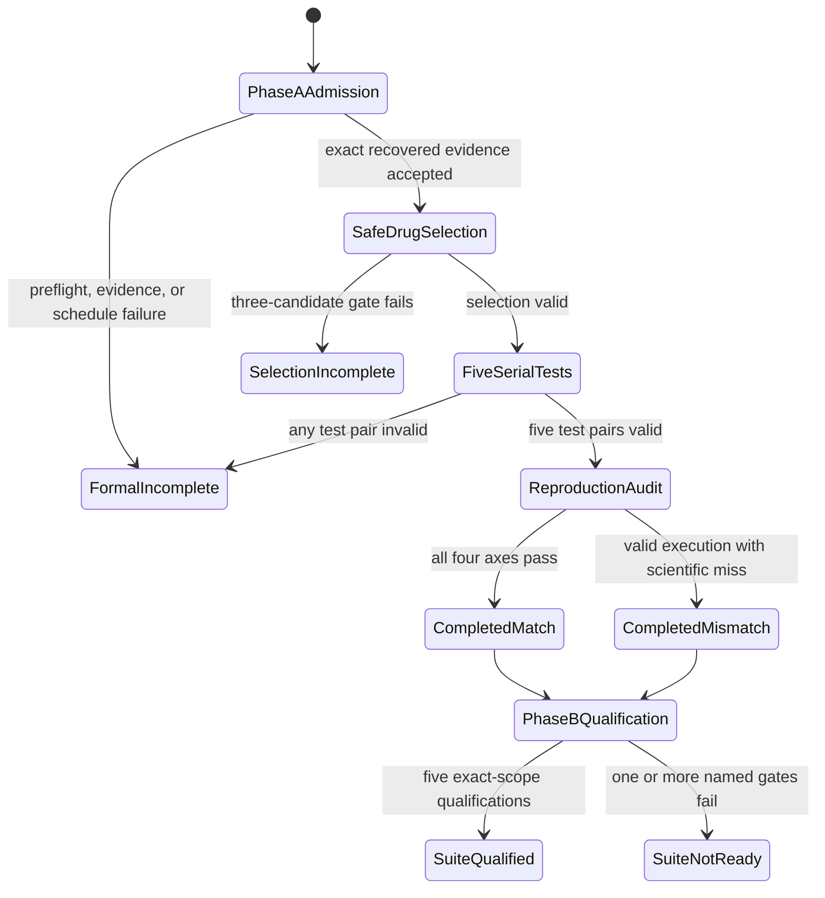
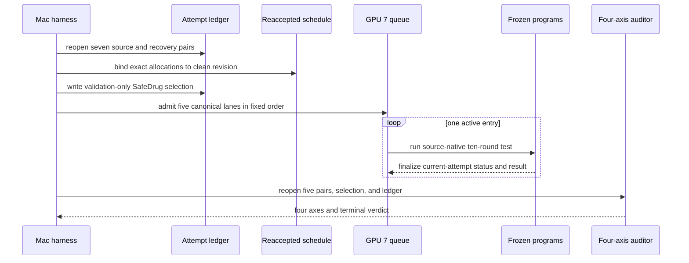
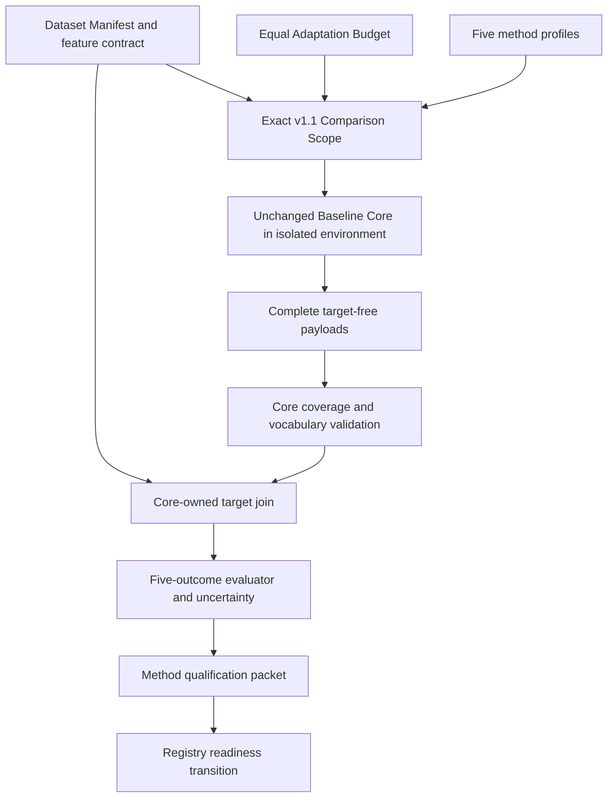

# Five-Model Baseline Readiness - Plan

## Goal Capsule

- **Objective:** RETAIN, LEAP, GAMENet, SafeDrug, and MoleRec have truthful terminal Reproduction Mode verdicts and individually auditable Comparison Mode qualifications in one Unified Research Protocol v1.1 Comparison Scope, or each unresolved model names its single blocking gate.
- **Means:** Finish the existing immutable five-model reproduction attempt first, then run one additive Comparison qualification path from unchanged Baseline Cores through target-free predictions and core-owned evaluation. (KTD1, KTD4)
- **Authority:** `docs/plans/2026-08-28-1718-fix-molerec-finalization-recovery-plan.md` amends recovery only; `docs/plans/2026-08-26-1709-feat-molerec-five-model-reproduction-plan.md` owns Reproduction semantics; `docs/specs/UNIFIED_RESEARCH_PROTOCOL.md` plus `docs/specs/UNIFIED_RESEARCH_PROTOCOL_V1_1.md` own Comparison semantics. Later evidence cannot rewrite these contracts.
- **Execution profile:** The MacBook harness owns local conformance, submission, monitoring, and public-safe intake. The 319 execution plane owns all real-data work, Baseline Environments, model execution, restricted predictions, and core evaluation.
- **Stop conditions:** Stop on identity drift, dirty scientific code after freeze, missing or invalid recovered training evidence, schedule divergence, test leakage, incomplete target-free coverage, Baseline Core behavior change, or any need for mismatch-driven tuning or retry.
- **Tail ownership:** The implementing agent may create local commits needed to establish clean execution revisions. It must not push or create a PR. Public-safe evidence enters Git only after its gate passes.

---

## Product Contract

### Summary

Complete attempt `formal-20260828-a09fcab-u8-b` without repeating any of its seven 50-epoch training lanes, then qualify the same five Baseline Cores under one Comparison Scope. Reproduction paper fidelity and Comparison qualification remain independent axes. A valid `completed_mismatch` may still support `comparison = qualified` when the unified protocol gates pass.

### Problem Frame

The repository has recovered training evidence for seven lanes but no successor test result or final audit. It also has protocol objects, a target-free process seam, registry qualification schemas, and a basic evaluator, but no five-model Comparison qualification path. Treating the recovered checkpoints as test results would falsify Phase A. Treating upstream aggregate metrics as Comparison evidence would falsify Phase B.

### Key Decisions

- **Finish the admitted reproduction before Comparison qualification.** (session-settled: user-directed — chosen over interleaving new Comparison evidence with the unfinished attempt: the two modes answer different questions and require separate evidence.) Governs R1–R10.
- **Reuse the seven immutable recovered training lanes.** (session-settled: user-directed — chosen over retraining, retrying, or allocating new recovery identities: the preserved 50-epoch execution is already the admitted scientific training evidence.) Governs R2–R6.
- **Keep paper fidelity and Comparison qualification independent.** (session-settled: user-directed — chosen over making `completed_match` a prerequisite for qualification: a complete mismatch is a valid reproduction result and does not by itself invalidate an unchanged baseline.) Governs R9, R11, R22.
- **Require one exact Comparison Scope for all five methods.** (session-settled: user-directed — chosen over method-specific cohorts, budgets, or evaluation semantics: only the shared scope supports later mechanism comparisons.) Governs R12–R21.
- **Keep Baseline Cores unchanged and targets core-owned.** (session-settled: user-directed — chosen over adapting model behavior or allowing baseline-native evaluation to define Comparison evidence: representation translation must not change the method or leak test targets.) Governs R14–R20.

### Requirements

#### Phase A: terminal Reproduction Mode

- R1. Remote work must pass the approved 319 preflight immediately before any data or GPU action.
- R2. Attempt continuation must reopen the attempt-owned ledger, all seven source/recovery evidence pairs, and the accepted schedule without mutating the original artifacts.
- R3. Schedule re-acceptance must create an additive artifact bound to the current clean admissible harness revision and an immutable reference to the accepted source schedule. Before publication it must compare the source and continuation artifacts field by field for the exact seven-lane order, GPU mapping, CPU sets, NUMA nodes, source identities, snapshot, environment, selected mapping, attempt owner, and GPU 7 reservation; it must not weaken or overwrite the source schedule.
- R4. No Phase A operation may train, retry, alter a recovery ID, substitute a checkpoint, sweep a seed, or change a Baseline Core.
- R5. SafeDrug selection must consume exactly the three full-precision validation evidence rows and must finish before any SafeDrug test process is constructed.
- R6. The two non-selected SafeDrug candidates must remain `not_tested_by_design` in the attempt ledger and evaluation queue.
- R7. The evaluation queue must test exactly RETAIN, LEAP, GAMENet, the selected SafeDrug lane, and MoleRec, in that order, serially on GPU 7. Every claim, finalization, or verified interrupted-entry requeue must persist the current attempt, submission, executor-claim, and transition provenance; no terminal entry may be duplicated or replayed.
- R8. Each tested model must use its frozen upstream ten-round semantics and publish a valid finalized test status/result pair. Final-audit admission requires one current-attempt, current-submission pair for each canonical lane that reopens through the existing pair validator; queue state, training artifacts, aggregate logs, checkpoints, failed/blocked entries, and older attempts cannot stand in for these pairs.
- R9. The final audit must reopen all five finalized test pairs and report `execution_integrity`, `paper_point_fidelity`, `directional_relationships`, and `artifact_completeness` separately.
- R10. The aggregate Phase A verdict must be `completed_match` only when all four axes pass, `completed_mismatch` for complete valid execution with a point or direction miss, and otherwise the existing specific `selection_incomplete` or `formal_incomplete` state.

#### Phase B: one Unified Research Protocol v1.1 Comparison Scope

- R11. Phase B starts only after Phase A has a legal terminal audit packet; its outcome must not be selected or relabeled from the Phase A metric values.
- R12. One public-safe scope identity must bind protocol v1.1, the v1.1 amendment, Dataset Manifest, archived SafeDrug comparison lineage, patient-disjoint split, eligible visits, medication vocabulary, feature availability, DDI evaluation asset, and one equal Adaptation Budget.
- R13. The Comparison configuration is fixed before Phase A test outcomes are known: one pinned source-native configuration and seed per method, one mechanical integration allowance, and no test-driven search. Immediately after the validation-only SafeDrug selection and before the first Phase A test submission, an immutable public-safe preregistration artifact must bind every discretionary method configuration, seed, decoder declaration, Adaptation Budget rule, and the deterministic procedure that later derives runtime scope identities. The Phase A SafeDrug winner may supply its already validation-selected learning-rate identity, but no Phase A test metric may enter or revise the preregistration or qualification.
- R14. Each method profile must bind the pinned Baseline Core, decoder class, unchanged decoder behavior, adapter revision, environment identity, and the exact R12 scope.
- R15. A Prediction Adapter may translate invocation, local identifiers, storage, and output representation only; it must not change model logic, feature information, objective, ranking, threshold, structural decoder, or prediction set.
- R16. The baseline subprocess must receive no test target, split membership, label, or ground-truth field and must emit exactly one target-free payload for every eligible test visit.
- R17. Score-threshold models must expose the source-native full-vocabulary score surface needed for PRAUC while preserving the frozen threshold and prediction set. Structural-sequence models must expose their unchanged decoded set and a source-faithful score representation without introducing a threshold. The full-vocabulary surface must use an additive vocabulary-aligned representation; it must not be forced into the existing v1.0 `PredictionRecord.scores`, whose positional contract covers predicted medications only.
- R18. The core must validate complete visit coverage and medication vocabulary before joining predictions to core-owned targets.
- R19. The core evaluator must independently recompute DDI rate, Jaccard, F1, PRAUC, and average medication count, then run the declared ten-round 80% with-replacement uncertainty procedure.
- R20. One qualification packet per method must bind the exact shared scope, method profile, expected/prediction/target-join identities, target-free coverage evidence, recomputed outcomes, uncertainty artifact, core-integrity evidence, adapter-determinism evidence, and Adaptation Budget consumption. The five readiness-gate hashes summarize these payloads but cannot replace their linkage and validation.
- R21. A baseline may advance through `registered` to `smoke_ready` and `comparison_ready` only through validated readiness evidence and a current-scope Comparison Qualification. For protocol v1.1, both `protocol_amendment_sha256` and `method_profile_sha256` are mandatory exact values at qualification creation and matching boundaries; a registry string or five generic gate hashes alone have no authority.

#### Reporting and evidence boundary

- R22. The readiness report must list pinned scientific identity, Reproduction verdict, Comparison qualification, downstream mechanism-experiment usability, and the sole blocking gate for each of the five methods.
- R23. The suite may claim `research_baseline_ready` only when all five methods have qualifications that agree on every shared R12 identity; `engineering_ready` and `reproduction_complete` remain separate conclusions.
- R24. No restricted data, split membership, patient-level prediction, checkpoint, model weight, private path, hostname, or raw log may enter Git.
- R25. The implementation ends in local commits only. It must not push, create a PR, add a sixth baseline, introduce a model architecture, or refactor the working reproduction framework beyond the narrow continuation and qualification seams.

### Success Criteria

- Attempt `formal-20260828-a09fcab-u8-b` has one legal five-model audit packet and no repeated training lane.
- Every model has a qualification packet whose shared scope fields match exactly and whose method profile remains model-specific.
- Reproduction paper misses remain visible and do not alter Comparison selection, evaluation, or readiness.
- The final report can truthfully set each of `engineering_ready`, `reproduction_complete`, and `research_baseline_ready` without inferring one from another.

### Acceptance Examples

- AE1. **Complete reproduction mismatch:** Five valid test pairs exist and all four relationships pass, but one paper interval misses. The Phase A verdict is `completed_mismatch`; Phase B remains eligible to proceed.
- AE2. **SafeDrug selection barrier:** The three recovered candidates validate and select `molerec-safedrug-lr-1e-4` by validation evidence. Only that lane enters the queue; the other two remain `not_tested_by_design` even if a manual admission names one of them.
- AE3. **Incomplete reproduction:** MoleRec test finalization fails after the upstream command exits. The attempt stays `formal_incomplete`; no aggregate is inferred from its log and Phase B does not start.
- AE4. **Target-free qualification:** A baseline emits complete payloads with no targets. The core joins them to the exact eligible visits, recomputes all five outcomes, and creates a scoped qualification packet.
- AE5. **Adapter behavior drift:** An adapter changes a threshold or filters the decoded set. Core-integrity validation fails, the method remains unqualified, and no replacement tuning run is authorized.
- AE6. **Mixed scope:** Four packets use one manifest and the fifth uses a different eligible-visit digest. The fifth baseline and the suite are not `research_baseline_ready` even when all aggregate metrics exist.

### Scope Boundaries

In scope:

- attempt-scoped schedule re-acceptance and exact five-test orchestration;
- terminal Phase A audit and public-safe report;
- two static Comparison adapter programs for the SafeDrug-family and MoleRec source lineages;
- v1.1 five-outcome core evaluation and method qualification;
- five registry readiness transitions under one exact scope.

Outside this product's identity:

- a sixth baseline or a 2026 leaderboard;
- new model architecture, objective, decoder, threshold, ranking, or feature information;
- clinical safety, treatment-benefit, or causal claims;
- a dynamic adapter/plugin framework or broad reproduction refactor;
- mismatch-driven retraining, hyperparameter search, checkpoint selection, or repeated test evaluation;
- treating the five models as five independent research lineages.

---

## Planning Contract

### Key Technical Decisions

- KTD1. **Use an additive attempt-continuation artifact.** Re-accept the exact measured schedule against the current clean revision and bind it to the existing ledger and seven recovered pairs; never edit the original schedule or resubmit training. (session-settled: user-directed — chosen over restarting the attempt or rewriting frozen evidence: the admitted recovery siblings already preserve the only allowed training execution.) Governs R1–R4.
- KTD2. **Add one thin operator boundary over existing Phase A primitives.** Reuse `select_safedrug_candidate`, the source-aware GPU 7 queue, immutable evidence-pair finalization, and each program's `run_test_lane_v2` path. The boundary owns order, current-attempt claim/transition provenance, one-time operator-verified interruption recovery, and the five-pair final-audit barrier; it does not own scientific behavior or replace existing evidence writers. Governs R5–R10.
- KTD3. **Keep the existing core-owned `ProcessPredictionAdapter` seam.** The subprocess request and response are target-free; the core's use of expected records for coverage validation and target join is the intended ownership boundary, not a reason to create a second adapter interface. Governs R15–R18.
- KTD4. **Create two static Comparison adapter entrypoints.** One entrypoint serves the four SafeDrug archived profiles and one serves MoleRec. Each wraps only source-native training/inference invocation and representation translation. This follows the repository's two pinned source authorities without introducing dynamic discovery. Governs R14–R17.
- KTD5. **Add an additive v1.1 score/evaluation/qualification path.** Preserve the v1.0 `PredictionRecord.scores`, `EvaluationResult`, Run Record, and schema-1 adapter contracts. In the same `ProcessPredictionAdapter` seam, a schema-2 response adds `vocabulary_scores`: one ordered `MedicationScore` entry for every declared medication. A new `VocabularyScoreSurface` validates and carries that target-free sidecar, and a `ComparisonPredictionBatch` links the joined `PredictionRecord` rows to their surfaces by patient/visit identity. Existing `predict()` remains schema 1; an explicit v1.1 invocation returns the batch without introducing a second adapter class or dynamic framework. The v1.1 qualification packet owns the five outcomes, DDI identity, bootstrap rounds, linked evidence payloads, mandatory amendment/profile identities, five readiness gates, and method-profile scope. Governs R12, R17–R21.
- KTD6. **Advance readiness through the existing transition API.** Move each baseline to `smoke_ready` with smoke evidence, then call `advance_readiness(..., qualifications=(qualification,))` for `comparison_ready`. `add_comparison_qualification` remains the later-scope extension path and is not required for the first qualification. Governs R20–R21.
- KTD7. **Materialize configuration before interpreting Phase A results.** Use one source-native configuration and pinned seed per method. Between validation-only SafeDrug selection and the first five-model test submission, publish a public-safe preregistration that carries the selected SafeDrug LR and every discretionary Comparison choice. U4 may later resolve manifest- and runtime-derived identities only through the preregistered deterministic procedure; it cannot add or alter a choice after Phase A outcomes exist. Any later change creates a different prospective scope and cannot repair this run. Governs R11–R14.
- KTD8. **Deploy clean local commits without publishing a branch.** Use Git-native additive transfer to synchronize the approved commit to the dedicated 319 checkout. Do not push or create a PR. (session-settled: user-directed — chosen over the normal LFG push/PR tail: the requested delivery is a reviewed local commit while remote execution still requires an immutable Git revision.) Governs R1, R24–R25.

### High-Level Technical Design

#### Overall lifecycle

#### Phase A sequence

#### Comparison evidence flow

### Assumptions

- The equal v1.1 Adaptation Budget uses one pinned configuration trial and one pinned seed per method. Mechanical integration does not consume an additional scientific trial.
- The selected SafeDrug learning rate becomes immutable when Phase A writes `selection.json`, before any of the five tests. It is configuration provenance only; its reproduction metrics are not Comparison evidence.
- Comparison qualification uses fresh target-free predictions produced under the R12 scope. Reproduction test outputs and checkpoints do not substitute for the Comparison packet.
- The DDI adjacency and full medication vocabulary are core-owned evaluation inputs bound to the same data lineage and manifest. They are never sent as test targets.
- A Phase A `completed_mismatch` is sufficient to enter Phase B when execution integrity and artifact completeness pass; a Phase A incomplete state is not.

### Sequencing and System-Wide Impact

U1 and U2 establish the clean continuation code revision. U2 materializes the Comparison preregistration after SafeDrug selection and before the first test submission; this records prospective choices but performs no Comparison training, inference, target join, or evaluation. U3 is the only Phase A real-data execution unit. After U3 is terminal, U4 resolves the exact runtime scope against that preregistration. U4–U6 may use synthetic fixtures before remote work, but U7 must not start until U3 is terminal and the final Comparison revision is clean. U8 promotes only public-safe evidence after U7.

The change affects the registry, remote operator CLI, restricted evaluation flow, core evaluator, and Research Memory. It does not change either Reproduction Program's training or test semantics. The registry remains the identity authority; runtime artifacts remain outside Git.

### Risks and Dependencies

- The existing schedule validator rejects an old harness revision. U1 must create a new bound artifact without weakening identity or allocation checks.
- The source-native score surface may differ by decoder class. U5 must characterize all five frozen profiles and reject a profile that cannot expose source-faithful scores; it must not invent ranking or threshold behavior.
- Full-vocabulary PRAUC and DDI evaluation add inputs not present in the v1.0 `EvaluationResult`. U6 must bind them to the scope and preserve v1.0 record readability.
- Phase A and Phase B both depend on the approved 319 alias, exact clean checkout, external data root, environment identity, and available GPU/disk capacity at execution time.
- A legal scientific mismatch is not a recovery trigger. Only infrastructure-invalid work follows an existing explicit resume rule; no metric result authorizes a rerun.

---

## Implementation Units

### U1. Bind the current attempt to a clean continuation revision

- **Goal:** Create one attempt-scoped admission command that proves the seven recovered lanes and produces an additive reaccepted schedule without launching training or testing.
- **Requirements:** R1–R4, R24–R25.
- **Dependencies:** None.
- **Files:** `src/medrec_research/remote_executor.py`, `src/medrec_research/cli.py`, `tests/unit/test_remote_executor.py`, `tests/integration/test_run_cli.py`, `docs/playbooks/MOLEREC_TABLE1_EXECUTION_PLAYBOOK.md`.
- **Approach:**
  1. Reopen the attempt ledger and each normal or recovered training evidence pair through the existing validators.
  2. Copy the accepted schedule into a new continuation artifact with the clean revision and a canonical immutable reference to the source schedule; refuse a missing or mismatched source identity instead of inventing a replacement identity.
  3. Re-run every existing allocation, owner, environment, snapshot, source, selected-mapping, lane-order, CPU/NUMA, and GPU 7 check, including an explicit non-null exact attempt-owner check, before publishing the artifact.
  4. Expose a read-only dry-run summary and an additive write path; neither path has a training or test hook.
- **Execution note:** Characterize the old-revision rejection and exact-mapping acceptance before adding the reaccept path.
- **Patterns to follow:** `FrozenSchedule`, `RemoteExecutor.validate_frozen_schedule`, immutable recovery siblings, and atomic JSON publication.
- **Test scenarios:**
  - A current attempt with seven valid recovered pairs and the exact schedule creates one continuation artifact bound to the supplied clean revision.
  - An altered GPU, CPU/NUMA set, lane order, selected mapping, reserved GPU, source revision, snapshot, environment, source-schedule reference, missing owner, or wrong attempt owner creates no artifact.
  - A missing, duplicate, wrong-attempt, or invalid recovery pair blocks reacceptance before any remote command.
  - Reusing the output identity cannot overwrite the existing continuation artifact.
  - The command surface contains no training, test, recovery-ID allocation, or checkpoint-selection option.
- **Verification:** Focused tests prove additive publication, exact identity preservation, and zero scientific-command reachability.

### U2. Orchestrate validation selection and five serial tests

- **Goal:** Add one attempt-owned Phase A continuation command that selects SafeDrug, persists the five-lane queue, executes one claimed test at a time, and admits the final audit only after five valid pairs.
- **Requirements:** R5–R10, R24.
- **Dependencies:** U1.
- **Files:** `src/medrec_research/safedrug_selection.py`, `src/medrec_research/evaluation_queue.py`, `src/medrec_research/cli.py`, `tests/unit/test_safedrug_selection.py`, `tests/unit/test_evaluation_queue.py`, `tests/integration/test_run_cli.py`.
- **Approach:**
  1. Build `selection.json` from the three reopened training evidence rows and persist the two non-selected ledger states.
  2. Before creating any test submission, publish `five-model-comparison-preregistration.json` with the selected SafeDrug LR, the five pinned source-native configurations and seeds, decoder declarations, Adaptation Budget rule, and deterministic runtime-scope derivation procedure. Refuse an existing or revised preregistration identity.
  3. Initialize and admit the canonical five queue entries in RETAIN, LEAP, GAMENet, selected SafeDrug, MoleRec order.
  4. Claim one entry with current attempt/submission/executor provenance, construct its existing frozen program test invocation, finalize its v2 pair through the existing atomic evidence writer, record the transition, and only then claim the next entry.
  5. Requeue a `running` entry only once after an additive operator-verification record proves the original process is absent and identifies the original attempt, submission, claim, and transition. Never requeue or replay a terminal entry.
  6. Refuse audit admission until the queue, selection, ledger, and exactly five canonical current-attempt/current-submission finalized pairs agree and each pair passes `reopen_finalized_pair()`.
- **Execution note:** Add an integration fixture that runs the full state machine with fake program processes before any 319 execution.
- **Patterns to follow:** `require_selected_safedrug_lane`, `admit_validated_training_evaluation`, `claim_next_evaluation`, `run_test_lane_v2`, and `audit_molerec_table1`.
- **Test scenarios:**
  - Exact recovered evidence selects the deterministic SafeDrug winner without reading test fields.
  - The immutable Comparison preregistration is finalized after selection and before the first test submission; changing a configuration, seed, decoder declaration, budget rule, or derivation procedure is rejected.
  - A missing, extra, duplicate, or inconsistent candidate yields `selection_incomplete` and creates no SafeDrug queue entry.
  - The queue contains exactly five entries in canonical order and at most one `running` entry.
  - A non-selected SafeDrug lane, old attempt artifact, duplicate submission, or terminal replay is rejected.
  - A dead running process may be requeued once after explicit persisted operator verification; a second requeue and every terminal-state requeue are rejected without overwriting history.
  - Audit admission fails on four valid pairs, a merely terminal queue, a failed/blocked lane, a missing marker, or an identity mismatch; it succeeds only when all five finalized identities validate.
- **Verification:** The integration fixture proves selection timing, queue order, serial execution, restart behavior, and final-audit barrier through public commands.

### U3. Complete and audit Phase A on 319

- **Goal:** Produce the attempt's five finalized ten-round test pairs and truthful four-axis terminal audit without another training execution.
- **Requirements:** R1–R10, R22, R24.
- **Dependencies:** U1, U2 and a clean committed continuation revision.
- **Files:** `docs/PLANS.md`, `Handoff.md`, `research/baseline-preflight/molerec-five-model-reproduction-report.md` only after public-safe review; restricted attempt artifacts remain outside Git.
- **Approach:**
  1. Run the playbook preflight and inspect ledger, source/recovery pairs, processes, capacity, and the source schedule.
  2. Deploy the clean commit through Git-native additive transfer and create the reaccepted schedule.
  3. Run selection and the five-entry GPU 7 queue to terminal under the U2 boundary.
  4. Run the existing Table 1 audit once, review the packet for restricted content, and record the exact verdict and four axes.
  5. Preserve every failure as its existing specific terminal state; do not retry because of any scientific metric.
- **Test scenarios:**
  - Covers AE1. A complete metric miss yields `completed_mismatch` and preserves all five result pairs.
  - Covers AE2. Only the validation-selected SafeDrug result exists; the other two lane states remain `not_tested_by_design`.
  - Covers AE3. An invalid fifth pair yields `formal_incomplete`, no inferred metric, and no Phase B execution.
- **Verification:** The audit reopens the five finalized pairs and reports all four axes. A process and ledger audit proves no training command or new recovery identity occurred.

### U4. Freeze the exact v1.1 Comparison Scope and five method profiles

- **Goal:** Create one executable protocol packet that names the shared scope and five unchanged method profiles before any Comparison test evaluation.
- **Requirements:** R11–R14, R20–R21.
- **Dependencies:** U3 terminal with execution integrity and artifact completeness passed.
- **Files:** `src/medrec_research/comparison_protocol.py`, `src/medrec_research/comparison_scope.py`, `src/medrec_research/dataset.py`, `tests/unit/test_comparison_protocol.py`, `tests/unit/test_dataset_manifest.py`, `research/baseline-preflight/five-model-comparison-protocol.json`.
- **Approach:**
  1. Build one restricted Dataset Manifest on 319 and expose only its public-safe identity and aggregates.
  2. Bind feature availability, eligible-visit semantics, medication vocabulary, DDI asset, lineage, protocol amendment, and Adaptation Budget into the protocol packet.
  3. Resolve the five decoder profiles and runtime-derived scope identities from the pre-test Comparison preregistration and SafeDrug selection identity, with no post-outcome discretionary field.
  4. Reject a packet that diverges from the preregistration, whose shared fields diverge across profiles, or whose threshold/decoder declaration changes source behavior.
- **Execution note:** Characterize each frozen decoder and feature path before writing its profile; no Phase A test value may choose a profile field.
- **Patterns to follow:** `DatasetManifest.from_memberships`, `ComparisonScope`, `ComparisonProtocolV1_1`, `DecoderProfile`, and content-addressed public-safe artifacts.
- **Test scenarios:**
  - One patient in two splits, a duplicate eligible visit, an unknown medication code, or a visit outside its patient's split is rejected.
  - All five profiles share manifest, lineage, protocol amendment, budget, feature, vocabulary, and DDI identities.
  - A score-threshold profile with test selection or a structural decoder with a threshold rule is rejected.
  - A SafeDrug profile whose learning rate differs from the pre-test selection artifact is rejected.
  - A source configuration, seed, decoder, budget, or scope-derivation rule that differs from the pre-test preregistration is rejected even if it improves a Phase A or Comparison metric.
  - Phase A paper metrics are absent from the protocol and method-profile inputs.
- **Verification:** The packet round-trips, all five profiles validate, and each method-specific scope differs only by `method_profile_sha256`.

### U5. Implement two static target-free Comparison adapters

- **Goal:** Make the five unchanged Baseline Cores emit complete target-free test payloads with source-faithful decoded sets and score surfaces.
- **Requirements:** R14–R18, R24–R25.
- **Dependencies:** U4.
- **Files:** `baselines/safedrug_comparison.py`, `baselines/molerec_comparison.py`, `baselines/registry.toml`, `src/medrec_research/adapters.py`, `tests/unit/test_process_adapter.py`, `tests/unit/test_comparison_adapters.py`, `tests/unit/test_registry.py`.
- **Approach:**
  1. Characterize each frozen profile's train, validation, inference, threshold, ranking, structural decoder, and all-vocabulary score behavior.
  2. Add one static adapter per pinned source lineage and select the profile through the registry declaration.
  3. Stage target-free eligible-visit features for inference and keep train/validation targets outside the test request.
  4. Preserve schema-1 `predict()` unchanged. For v1.1, emit schema 2 with one payload per eligible visit containing the unchanged decoded set, optional predicted-medication-aligned `scores`, and required `vocabulary_scores` as an ordered list of `{medication_code, score}` objects exactly matching the declared vocabulary.
  5. Parse schema 2 into a `VocabularyScoreSurface` sidecar and return a `ComparisonPredictionBatch` whose joined records and score surfaces have identical patient/visit coverage; never serialize core-owned targets back to the subprocess.
  6. Record adapter revision, environment, Baseline Core identity, deterministic translation evidence, and budget use without embedding private paths.
- **Execution note:** Use characterization-first tests against synthetic source-shaped fixtures before changing the score payload contract.
- **Patterns to follow:** `ProcessPredictionAdapter`, two explicit Reproduction Program authorities, and registry-owned static commands.
- **Test scenarios:**
  - Each of RETAIN, LEAP, GAMENet, SafeDrug, and MoleRec emits exactly one payload for every expected visit.
  - Any target, label, split-membership, ground-truth, missing visit, extra visit, duplicate visit, or unknown medication fails before target join.
  - A fixed synthetic Baseline Core output produces the same prediction set and ordering before and after adapter translation.
  - Score-threshold profiles preserve the frozen threshold; structural-sequence profiles preserve the decoded sequence and do not gain a threshold.
  - Schema 2 requires the exact declared vocabulary order and one finite score per medication, rejects missing/duplicate/unknown codes and record/surface coverage drift, and cannot change the prediction set or v1.0 schema-1 semantics.
  - Registry readiness remains `registered` until adapter smoke evidence exists.
- **Verification:** Synthetic process tests prove target exclusion, complete coverage, deterministic translation, and unchanged output semantics for all five profiles.

### U6. Add v1.1 core evaluation and qualification creation

- **Goal:** Independently recompute the five required outcomes and issue a validated method-scoped qualification packet without reinterpreting reproduction aggregates.
- **Requirements:** R18–R21, R24.
- **Dependencies:** U4, U5.
- **Files:** `src/medrec_research/evaluation.py`, `src/medrec_research/comparison_protocol.py`, `src/medrec_research/registry.py`, `src/medrec_research/commands.py`, `src/medrec_research/cli.py`, `tests/unit/test_evaluation.py`, `tests/unit/test_registry.py`, `tests/unit/test_commands.py`, `tests/integration/test_accept_comparison_cli.py`.
- **Approach:**
  1. Validate visit and vocabulary coverage, then join target-free payloads to core-owned test records.
  2. Recompute DDI rate, Jaccard, F1, PRAUC, and average medication count from core inputs.
  3. Produce the fixed ten bootstrap rounds and 80% percentile interval from the declared deterministic sampling seed.
  4. Validate `IndependentEvaluationInput`, expected/prediction/target-join linkage, outcome and uncertainty artifact identities, the five readiness gates, profile/shared-scope identity, and budget consumption.
  5. Evaluate the seven readiness gates in this fixed fail-fast order: `environment_lock`, `adapter_smoke`, `cohort_identity`, `adaptation_budget`, `core_integrity`, `deterministic_adapter`, `independent_evaluation`.
  6. Publish a public-safe `ComparisonQualificationAttempt` for every method. It records ordered gate states (`passed`, `failed`, or `not_evaluated_after_blocker`), exactly one `first_blocking_gate` for a blocked attempt, and either the successful qualification identity or no qualification. The registry stores only successful qualifications; the readiness report takes a blocked method's sole blocker from this attempt artifact.
  7. Require non-null exact amendment and method-profile identities for every successful v1.1 qualification, publish the additive packet, and use `advance_readiness` for the first `comparison_ready` transition.
- **Execution note:** Start with cross-check fixtures whose expected metrics and bootstrap samples are calculated independently from the production evaluator.
- **Patterns to follow:** immutable Run Record construction, `ComparisonQualification`, `ReadinessEvidence`, and public-safe checksum validation.
- **Test scenarios:**
  - Hand-calculated multi-visit fixtures reproduce all five outcomes, including empty prediction sets and DDI pairs.
  - PRAUC consumes full-vocabulary scores and rejects missing, duplicate, non-finite, or misordered score vectors.
  - A fixed seed produces ten reproducible 80%-with-replacement rounds and the declared percentile interval.
  - A missing or mismatched manifest, profile, amendment, budget, eligible-visit, expected/prediction/target-join, outcome/uncertainty, vocabulary, feature, or DDI identity blocks qualification.
  - Reproduction aggregate metrics cannot populate the independent-evaluation gate.
  - Multiple invalid inputs stop at the first gate in the fixed order, persist later gates as `not_evaluated_after_blocker`, and produce the same sole blocker on replay without creating a failed registry qualification.
  - A `registered` baseline advances to `smoke_ready` with smoke gates, then to `comparison_ready` with one valid qualification; no premature readiness string is accepted.
  - Existing v1.0 Evaluation Results and Run Records remain readable and keep their original semantics.
- **Verification:** Unit and CLI integration tests prove the complete target-free-to-qualification chain and preserve v1.0 behavior.

### U7. Run five Comparison qualifications on 319

- **Goal:** Produce one legal v1.1 qualification packet per model under the same scope, or preserve the first exact blocking gate for that model.
- **Requirements:** R11–R24.
- **Dependencies:** U3, U4, U5, U6 and a clean committed Comparison revision.
- **Files:** `baselines/registry.toml`, `research/baseline-preflight/five-model-comparison-qualification.json`, restricted predictions and model artifacts outside Git.
- **Approach:**
  1. Run the full preflight and build the restricted Dataset Manifest while memberships remain available.
  2. Execute validation/model selection under the frozen one-trial budget before constructing any Comparison test request.
  3. Run each target-free adapter, then the core-owned join, evaluator, and qualification command on 319.
  4. Review the five candidate packets for equality of the shared scope tuple, exact method-specific profiles, linked-payload completeness, and public safety before updating registry evidence. Method-profile identities may differ and therefore are not used as the suite-wide equality key.
  5. Preserve the method's `ComparisonQualificationAttempt`. A blocked attempt reports the deterministic first failed gate and leaves later gates not evaluated; do not retry, tune, borrow evidence, or create a failed registry qualification.
- **Test scenarios:**
  - Covers AE4. Five complete payload sets yield five qualifications whose shared scope fields match exactly.
  - Covers AE5. Adapter behavior drift blocks only that method and names `core_integrity` or `deterministic_adapter` as the gate.
  - Covers AE6. A manifest or eligible-visit mismatch blocks the affected method and the suite readiness conclusion.
  - A complete but scientifically weak Comparison result remains qualified when every protocol gate passes.
- **Verification:** Each accepted packet reopens against the authoritative manifest, protocol, profile, budget, adapter, evaluator, and registry. No restricted field crosses the intake boundary.

### U8. Publish the baseline readiness report and durable state

- **Goal:** Record the per-model two-axis readiness and the three suite-level conclusions without overstating evidence.
- **Requirements:** R22–R25.
- **Dependencies:** U3, U7.
- **Files:** `research/baseline-preflight/five-model-baseline-readiness-report.md`, `docs/PLANS.md`, `Handoff.md`, `baselines/registry.toml`.
- **Approach:**
  1. Summarize each pinned scientific identity, Phase A verdict, current-scope qualification, mechanism-experiment usability, and the sole blocker from its qualification-attempt artifact.
  2. Compute `engineering_ready`, `reproduction_complete`, and `research_baseline_ready` from their separate evidence gates.
  3. Mark the suite research-ready only when all five accepted qualifications match on the shared protocol/manifest/budget/amendment/lineage/eligible-visit/vocabulary/DDI/feature tuple and each separately matches its method-specific profile; do not require the five method-profile-bearing scope hashes to be identical.
  4. Keep paper mismatch, directional results, and Comparison outcomes descriptive; make no clinical claim.
- **Test scenarios:**
  - A five-model qualified suite with one `completed_mismatch` reproduction reports reproduction complete and research baseline ready.
  - Four qualifications and one blocked adapter report engineering status accurately but keep `research_baseline_ready = false` with one named gate.
  - The report contains no private path, hostname, patient/visit identifier, prediction row, checkpoint, weight, or raw log.
- **Verification:** Registry, qualification packet, audit packet, plan tracker, handoff, and report agree on every identity and state; modified Markdown passes lint.

---

## Verification Contract

| Scope | Failure detected | Decision if it fails | Done signal |
| --- | --- | --- | --- |
| U1 attempt continuation tests | Schedule, attempt, or recovered-evidence identity can drift during reacceptance | Fix the continuation boundary; do not contact 319 for scientific work | Exact mapping passes and every drift case creates no artifact |
| U2 selection and queue tests | Test leakage, wrong SafeDrug lane, duplicate test, replay, or audit-before-five | Fix orchestration; do not submit a test | One deterministic selection and one five-entry serial state machine pass |
| U3 remote audit | Any Phase A test result is missing, invalid, or from the wrong attempt | Preserve `selection_incomplete` or `formal_incomplete`; do not start Phase B | Five reopened pairs and one four-axis terminal audit exist |
| U4 protocol/profile tests | The five methods do not share one manifest, budget, lineage, feature, vocabulary, or evaluation identity | Fix the prospective contract before Comparison execution | Protocol packet and five profiles round-trip under one scope |
| U5 adapter process tests | A baseline sees test targets or translation changes its set, ranking, threshold, or decoder | Block that adapter; do not run Comparison test | All five synthetic profiles emit complete deterministic target-free payloads |
| U6 independent evaluator tests | Core metrics, bootstrap, qualification gates, or readiness transitions are wrong | Fix the evaluator/qualification path; discard candidate packets | Independent fixtures and end-to-end CLI qualification pass |
| U7 remote qualification | A method exceeds budget, lacks coverage, drifts behavior, or differs in scope | Preserve its exact failed gate; do not tune or borrow another packet | Five accepted current-scope qualification packets exist |
| Full local regression | The narrow changes regress existing reproduction or v1.0 Comparison behavior | Fix before freezing either execution revision | `rtk proxy /opt/homebrew/bin/uv run pytest` passes |
| Python quality | Code or format violates repository policy | Fix before commit or remote deployment | Ruff check and format checks pass |
| Documentation | Tracked research state is stale or malformed | Fix the public-safe report and docs before final commit | Markdown lint passes on modified Markdown |

Local synthetic checks prove contracts only. They are not Phase A or Phase B scientific evidence. Remote checks run only when their output changes admission, a terminal state, or a readiness decision.

---

## Definition of Done

- U1–U2 are complete when the current attempt can be continued from its seven recovered lanes through a validated, exact, non-training operator path.
- U3 is complete when five source-native ten-round test pairs and one four-axis audit establish `completed_match`, `completed_mismatch`, or a specific incomplete state without a scientific retry.
- U4–U6 are complete when one v1.1 scope, five unchanged profiles, two static adapter programs, and the independent core qualification path pass synthetic and regression gates.
- U7 is complete when each model either has a validated current-scope qualification or one preserved blocking gate; no failure is hidden by a readiness string.
- U8 is complete when the readiness report and all authoritative tracked records agree on the five model states and three suite conclusions.
- `research_baseline_ready` is true only when all five methods are qualified in one exact Comparison Scope. Reproduction paper fidelity does not mechanically decide this state.
- No restricted data, patient-level record, split membership, checkpoint, weight, private trace, or remote-only path enters Git.
- No abandoned adapter experiment, duplicate orchestration path, sixth baseline, dynamic framework, Baseline Core edit, or speculative compatibility layer remains.
- All shipped work is committed locally. No push or PR occurs.
