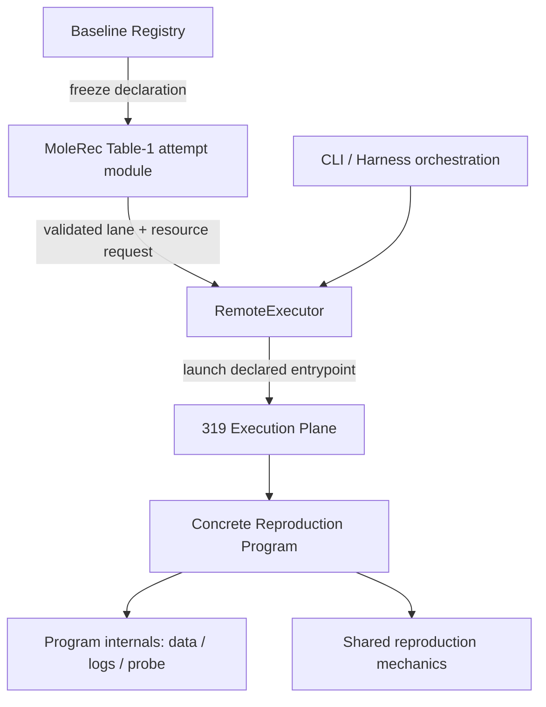
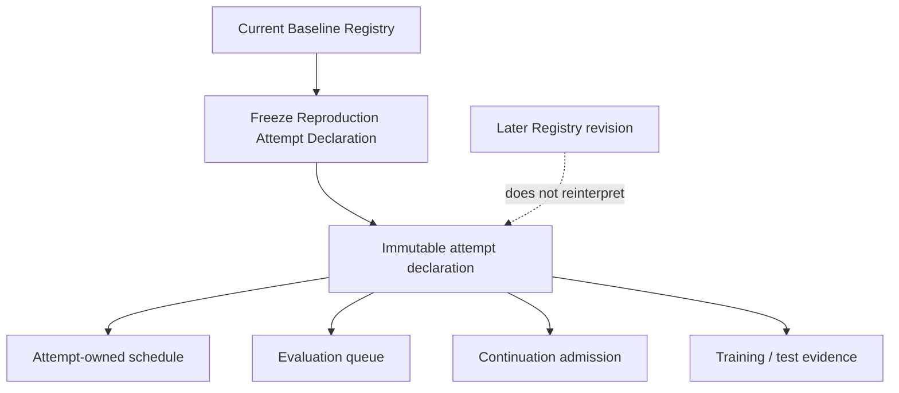
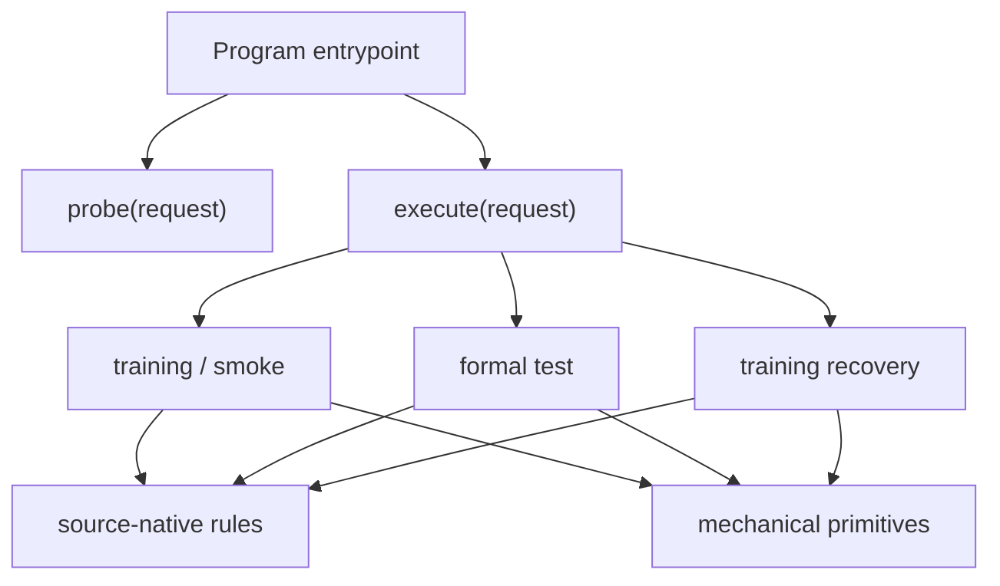

# Refactor Reproduction Architecture

## Goal Capsule

- **Objective:** A maintainer can change generic 319 remote execution, one reproduction attempt, or one Reproduction Program without loading or modifying unrelated attempt-specific or baseline-specific knowledge, while all accepted Reproduction Mode scientific semantics and evidence remain unchanged.
- **Means:** Isolate MoleRec Table-1 attempt policy from `RemoteExecutor`, make the Baseline Registry the sole declaration authority with an immutable per-attempt snapshot, deepen SafeDrug and MoleRec Reproduction Programs behind `probe`/`execute`, and delete the shallow hook/re-export surfaces that currently leak internals. (KTD1–KTD8)
- **Authority:** `CONTEXT.md`, `ARCHITECTURE.md`, ADR-0003, ADR-0004, ADR-0006, `baselines/registry.toml`, and already accepted reproduction evidence remain authoritative. This refactor may reorganize code that interprets those contracts but may not reinterpret prior scientific evidence.
- **Execution profile:** Code, synthetic fixtures, and public-safe artifacts only. No real EHR processing, retraining, new test-set evaluation, or 319 scientific execution is required to complete this plan.
- **Stop conditions:** Stop and re-plan if implementation requires changing Baseline Core behavior, changing Comparison Mode semantics, mutating accepted historical evidence, changing artifact meaning to make the refactor easier, introducing a generic scheduling framework for future hypothetical attempts, or adding a plugin/base-class hierarchy to unify baseline-specific scientific rules.
- **Tail ownership:** Implementation may update code, tests, architecture documentation, and internal public-safe schemas required by this refactor. Landing strategy follows the repository's normal convention; this plan does not authorize new research runs or evidence claims.

---

## Product Contract

### Summary

The current reproduction code has the correct scientific boundaries at the repository level but leaks attempt- and baseline-specific knowledge across module seams. `RemoteExecutor` knows the MoleRec Table-1 seven-lane schedule and continuation rules; `evaluation_queue.py` duplicates lane identity already declared in `baselines/registry.toml`; shared reproduction execution drives SafeDrug and MoleRec through a broad `module: Any` hook bag; and the two program façades re-export implementation details that tests treat as public API.

The target is not a new research framework. It is a locality refactor: scientific decisions should live behind the module that owns them, declaration facts should have one authority, and generic infrastructure should contain only facts that remain true when the current MoleRec Table-1 attempt or either current baseline lineage is deleted.

### Problem Frame

The repository already defines Reproduction Mode, Reproduction Program, Reproduction Lane, Baseline Registry, Remote Preflight, and the 319 Execution Plane clearly. The implementation has drifted from those definitions as the five-model reproduction effort added frozen scheduling, recovery continuation, validation-only SafeDrug selection, and shared v2 training/test finalization.

The result is change amplification. A generic-looking module such as `src/medrec_research/remote_executor.py` contains policy that only makes sense for one completed MoleRec Table-1 attempt. A queue module independently restates scientific lane identity. A shared runner needs to know baseline-specific checkpoint layouts while also discovering program capabilities by string lookup. Tests consequently couple to dozens of implementation symbols instead of the intended program behavior.

This plan restores the existing architecture rather than replacing it.

### Requirements

#### Authority and attempt isolation

- R1. `src/medrec_research/remote_executor.py` must contain only reusable 319 connection, read-only preflight, capacity/resource validation, command construction, and submission behavior; it must not import attempt-specific reproduction modules.
- R2. MoleRec Table-1 schedule semantics, including the seven-lane mapping, reserved GPU policy, preprocessing identity, reacceptance lineage, continuation admission, and recovery-evidence checks, must live in an attempt-owned module under `src/medrec_research/reproduction/`.
- R3. `baselines/registry.toml` and the validated `BaselineRegistry` objects must remain the sole authority for Reproduction Program and Reproduction Lane declarations.
- R4. A MoleRec Table-1 attempt must freeze the relevant Registry lane/program/source declarations into an immutable Reproduction Attempt Declaration before queue, schedule, continuation, or evaluation state is accepted.
- R5. Historical attempt validation must use its frozen declaration for scientific identity. A later edit to `baselines/registry.toml` must not silently change the meaning of an already-created attempt.
- R6. `evaluation_queue.py` must not carry a second hardcoded lane catalog or lane-to-program/profile mapping.

#### Reproduction Program depth

- R7. `baselines/safedrug_archived.py` and `baselines/molerec.py` must each become the deep Reproduction Program module for their pinned source lineage.
- R8. The external program surface must be small: conceptually one probe operation and one execution operation. Smoke, formal training, test, and recovery are execution cases behind that surface rather than separate public hook APIs.
- R9. Each Reproduction Program must own its source-native profile rules, mechanical source adaptation rules, training/test ordering, checkpoint semantics, log interpretation choices, and evidence-publication lifecycle.
- R10. Shared reproduction code (in `baselines/reproduction_runner.py` and `baselines/reproduction_artifacts.py`) may provide only baseline-agnostic mechanics such as process execution, progress heartbeat, atomic artifact writing/finalization, generic identity/path validation, and generic reopen/recovery mechanics. It must not contain SafeDrug/MoleRec lane IDs, candidate learning-rate mappings, selection rules, or program/profile branching, and must not discover baseline behavior by `getattr()`/string hook names.
- R11. `*_data.py`, `*_logs.py`, and `*_probe.py` remain internal modules when they continue to hide substantial dataset, log, or environment complexity. They must no longer be re-exported as the Reproduction Program's public interface.
- R12. `*_contract.py` and lineage-specific `*_runner.py` modules are removed after their durable knowledge is absorbed by the owning Reproduction Program. The shared `baselines/reproduction_runner.py` may remain only if it has been reduced to genuine mechanical primitives.
- R13. SafeDrug and MoleRec may duplicate similar-looking scientific rules when those rules belong to different pinned source semantics. This refactor must not introduce `BaseReproductionProgram`, plugin discovery, factories, strategy hierarchies, or a generic scientific hook registry.

#### Behavior preservation and verification

- R14. Existing registry entrypoints, user-facing `medrec`/`medrec-research` behavior, Reproduction Mode vs Comparison Mode separation, Baseline Environment vs Core Evaluator Environment separation, and Protocol Check Record vs accepted evidence separation must remain unchanged. Concrete Reproduction Programs and their imported dependency closures inside Baseline Environments must remain strictly compatible with their declared Python runtimes (`python=3.8.16` for `environments/molerec-table1.yml`, `python=3.11.9` for `environments/safedrug-archived.yml`). Concrete baseline Programs must not inversely import `src/medrec_research` modules that depend on Python 3.11 core runtime constructs; Harness/Core and Baseline Environments continue to interact strictly through the existing process/entrypoint boundary, never via in-process sharing.
- R15. `attempt_declaration.json` is introduced as a new attempt-level immutable sidecar. By default, existing artifact schemas and meanings for accepted historical training, recovered training, test, selection, evaluation queue, and reproduction audit records must remain strictly unchanged, without batch-rewrite, backfill, or migration frameworks. Historical artifact readers and audit validators must continue reading accepted schemas without requiring a declaration sidecar; new attempt workflows enforce their own frozen declaration. If implementation proves that sidecar + existing identity fields cannot express a required binding, minimal additive schema change is permitted only with proof of necessity, preserving legacy readability with explicit legacy fixture tests.
- R16. Characterization migration must be executed as a hard gate before deleting legacy test contracts: (1) identify required observable contracts while legacy code is intact; (2) construct Program-level interface tests (`probe`/`execute`) to characterize those contracts; (3) prove observable parity between new and legacy behavior (comparing emitted status/result/evidence meaning, identity fields, source adaptation outcome/reversibility, selected checkpoint/history semantics, failure classification, and dry-run/program command intent, without locking internal call graphs); (4) only then delete legacy `SimpleNamespace` hook-bag tests, lineage runner tests, and façade-internal tests; (5) retain only Program public behavior tests, internal data/log/probe/adaptation tests with independent complexity, and generic mechanical primitive tests.
- R17. Permanent retention of both old hook contracts and new Program contracts "for safety" is strictly prohibited. Legacy hook-bag fixtures and pass-through compatibility tests must be deleted once parity is proven under R16.
- R18. The refactor must complete without real-data execution, new scientific evidence, retraining, test-set reruns, or modification of accepted historical evidence.

### Key Decisions

- **Keep this as architecture cleanup after baseline readiness, not an amendment to the completed five-model research plan.** (session-settled: user-directed — chosen over extending the completed readiness plan: the previous plan intentionally excluded broad reproduction refactoring while scientific execution was active.) Governs R14, R15, R18.
- **Treat candidates 1–4 as one causal refactor package.** (session-settled: user-directed — chosen over four independent cleanups: attempt leakage, duplicated authority, shallow program interfaces, and temporal file decomposition are causally coupled.) Governs R1–R13.

### Success Criteria

- `RemoteExecutor` can be understood and tested without any MoleRec Table-1 schedule, recovery, SafeDrug-selection, or seven-lane knowledge.
- Deleting the MoleRec Table-1 attempt module removes all seven-lane/GPU-7/c721/continuation policy while leaving generic remote execution intact.
- A Registry change after attempt creation does not change the frozen attempt declaration or make historical queue/evidence identities reinterpret themselves.
- SafeDrug and MoleRec program tests exercise `probe`/`execute` behavior; no shared runner test fabricates a `SimpleNamespace` containing a dozen scientific hooks.
- The active code path contains no `_LANE_METADATA` duplicate authority and no `_module_value(module, name)`-style program capability discovery.
- The current public CLI entrypoints and artifact semantics remain accepted by the full local test suite without requiring real-data or 319 execution.
- `ARCHITECTURE.md` describes the implemented dependency direction rather than the pre-refactor mixed ownership.

### Acceptance Examples

- AE1. **Registry changes after freeze:** An attempt declaration is created from the seven current Registry lanes. A test then constructs a different Registry declaration. Loading and validating the original attempt state still uses the frozen seven-lane identity and does not silently adopt the later values.
- AE2. **Generic remote run:** A registered Reproduction Program is dry-run through `RemoteExecutor` with a GPU and optional CPU affinity. No frozen MoleRec schedule object is required or imported.
- AE3. **Invalid Table-1 schedule:** A schedule assigns GPU 7 to a training lane or names a lane absent from the frozen attempt declaration. The attempt-owned validator rejects it before `RemoteExecutor` is called.
- AE4. **Program training execution:** SafeDrug `execute` receives a formal training request, applies SafeDrug-native adaptation and checkpoint rules internally, uses shared mechanical process/artifact primitives, and emits the same admissible training evidence shape as before.
- AE5. **Lineage-specific difference:** MoleRec and SafeDrug require different checkpoint layouts. Each Program handles its own rule; the shared reproduction mechanics contain no `baseline_id.startswith(...)` branch.
- AE6. **Internal parser test:** A malformed upstream log remains directly testable through the internal log module, while external program callers do not import the parser from the program façade.
- AE7. **No scientific execution:** The entire refactor passes unit/integration/format/lint verification using synthetic fixtures and dry-run behavior only.

### Scope Boundaries

In scope:

- generic Remote Execution vs attempt-policy separation;
- a frozen Reproduction Attempt Declaration for the MoleRec Table-1 attempt;
- Registry-derived lane identity and queue validation;
- deep SafeDrug and MoleRec Reproduction Program interfaces;
- reducing shared reproduction execution to mechanical primitives;
- deleting obsolete `*_contract.py`, lineage-specific `*_runner.py`, hook-bag tests, and façade re-exports when replacement coverage exists;
- architecture/domain documentation required to describe the new seam.

Outside this product's identity:

- changes to Baseline Core algorithms, hyperparameters, evaluation semantics, or Comparison Mode behavior;
- rerunning the five-model reproduction, changing its terminal verdict, or generating new evidence;
- a generic scheduler intended to serve hypothetical future attempts;
- a third Reproduction Program;
- a plugin system, abstract base-class hierarchy, dependency-injection framework, or dynamic Program discovery;
- cleanup of unrelated comparison, prediction, evaluation, registry-readiness, or research-route code.

### Sources / Research

- `CONTEXT.md` — canonical definitions for Reproduction Program, Reproduction Lane, Baseline Registry, Remote Preflight, and research modes.
- `ARCHITECTURE.md` — current intended module/seam map and dependency direction.
- `baselines/registry.toml` and `src/medrec_research/registry.py` — authoritative program/lane declaration model.
- `src/medrec_research/remote_executor.py` — current mixed generic/attempt execution surface.
- `src/medrec_research/reproduction/evaluation_queue.py` — current duplicated lane authority.
- `src/medrec_research/reproduction/molerec_evaluation.py` — existing attempt-owned Table-1 evaluation orchestration.
- `baselines/reproduction_runner.py` — current shared lifecycle plus dynamic program hook discovery.
- `baselines/safedrug_archived.py`, `baselines/molerec.py` and their `*_contract.py`, `*_data.py`, `*_logs.py`, `*_probe.py`, `*_runner.py` collaborators.
- `tests/unit/test_remote_executor.py`, `tests/unit/test_evaluation_queue.py`, `tests/unit/test_reproduction_runner.py`, `tests/unit/test_safedrug_archived_program.py`, and `tests/unit/test_molerec_program.py` — current test surfaces and coupling.
- `docs/plans/2026-08-29-1541-feat-five-model-baseline-readiness-plan.md` — completed research-readiness plan; retained as historical authority, not edited by this refactor.

---

## Planning Contract

### Key Technical Decisions

- KTD1. **Make Remote Execution generic again.** `RemoteExecutor` keeps SSH policy, preflight, generic resource checks, command construction, dry-run, and tmux submission; MoleRec Table-1 schedule/continuation policy moves out. (session-settled: user-directed — chosen over keeping a mixed executor or moving all remote execution into `reproduction`: 319 execution is reusable capability, while the frozen schedule is attempt policy.) Governs R1, R2, R14.
- KTD2. **Freeze Registry declarations at attempt creation.** The Registry is the authority that creates the attempt declaration; queue, schedule, continuation, and evidence then validate the immutable declaration rather than re-reading current Registry semantics. (session-settled: user-directed — chosen over live Registry reinterpretation or queue-owned metadata: reproducibility requires one declaration authority without making historical attempts mutable.) Governs R3–R6.
- KTD3. **Use a high-leverage Program interface.** Each concrete Reproduction Program exposes conceptually `probe(request)` and `execute(request)`; execution cases stay behind that interface. (session-settled: user-directed — chosen over five phase-specific public methods or a typed bag of low-level hooks: the module should hide source-native lifecycle complexity rather than enumerate it.) Governs R7–R9, R16.
- KTD4. **Program drives lifecycle; shared code provides mechanics.** Call direction is Program → shared mechanical primitives, never shared runner → Program callbacks. (session-settled: user-directed — chosen over preserving a generic callback engine: ownership of source-native ordering and checkpoint/log semantics belongs to the Program.) Governs R9, R10.
- KTD5. **Treat the frozen schedule as MoleRec Table-1 attempt policy.** The seven lanes, GPU-7 reservation, c721 preprocessing, continuation reacceptance, and recovery admission live behind the Table-1 attempt seam. (session-settled: user-directed — chosen over promoting the current schedule into a generic reproduction framework: those facts describe one historical execution strategy, not Reproduction Mode itself.) Governs R2, R4, R5.
- KTD6. **Keep deep internal modules; delete temporal façade layers.** Preserve `*_data.py`, `*_logs.py`, and `*_probe.py` where deletion would spread substantial rules; absorb `*_contract.py` and lineage `*_runner.py` into the owning Program and remove broad re-exports. (session-settled: user-directed — chosen over keeping six-file temporal decomposition or collapsing each lineage into a monolith: module count follows information hiding, not file-count preference.) Governs R7, R11, R12.
- KTD7. **Do not unify scientific internals prematurely.** Share only semantics-free mechanical primitives; leave similar SafeDrug/MoleRec source rules separate until a future third real Program proves a stable internal abstraction. (session-settled: user-directed — chosen over a base class, strategy hierarchy, or plugin framework: two public adapters prove the Program seam but do not prove every internal rule is common.) Governs R10, R13.
- KTD8. **Make the interface the primary test surface.** Program behavior is verified through `probe`/`execute`; internal parsers/invariants keep focused tests; fake-module hook tests and façade-internal tests are removed or narrowed. (session-settled: user-directed — chosen over layering new contract tests on top of the old implementation-coupled suite: keeping both would preserve the shallow architecture in tests.) Governs R16, R17.

### High-Level Technical Design

The target dependency direction is one-way from attempt policy and concrete Programs toward generic mechanics. Generic infrastructure does not call back into scientific modules.

The frozen declaration separates declaration-time authority from historical validation-time authority.

The Program interface hides lifecycle branching rather than exposing it as hooks.

These diagrams define ownership and direction, not exact class or function signatures.

### Information-Hiding / Deletion Test

| Existing surface | Decision | Reason |
| --- | --- | --- |
| `src/medrec_research/remote_executor.py` | Keep and narrow | Deleting it would spread SSH/preflight/submission mechanics; those are genuinely reusable. |
| `src/medrec_research/reproduction/evaluation_queue.py` | Keep, remove declaration duplication | Queue state/claim/finalization is substantial, but lane scientific identity must come from the frozen declaration. |
| `baselines/safedrug_archived.py` / `baselines/molerec.py` | Keep and deepen | They are the stable registry entrypoints and should hide lineage-specific lifecycle complexity. |
| `*_data.py` | Keep internal | Dataset structural validation has independent complexity and focused tests. |
| `*_logs.py` | Keep internal | Upstream log/checkpoint interpretation is complex, source-specific logic. |
| `*_probe.py` | Keep internal | Environment/import/CUDA/runtime probing has independent failure modes. |
| `*_contract.py` | Delete after absorption | Its knowledge is part of the Program's source/profile semantics rather than an independently valuable external seam. |
| lineage `*_runner.py` | Delete after absorption | Lifecycle orchestration belongs in the deep Program; keeping a pass-through runner recreates temporal decomposition. |
| `baselines/reproduction_runner.py` | Keep only if reduced to mechanics | Dynamic hook discovery and scientific lifecycle orchestration must disappear; process/artifact primitives may remain. |
| `baselines/reproduction_artifacts.py` | Keep generic mechanics, strip scientific knowledge | Retain only identity validation, atomic finalization, reopen/recovery mechanics, and path/hash primitives. Remove SafeDrug-specific lane IDs, candidate learning-rate mappings, selection rules, and program/profile admission checks into the SafeDrug Program and Table-1 attempt policy. |

### Sequencing

Phase A establishes authority and dependency direction first, so later Program work cannot accidentally preserve attempt leakage.

- U1 → U2 → U3 establish attempt ownership, RemoteExecutor isolation, and queue authority.
- U4 creates the mechanical substrate that the concrete Programs can call without dynamic hooks and strips scientific semantics from shared artifact helpers.
- U5 and U6 deepen SafeDrug and MoleRec independently after U4; they may proceed in parallel once U4 is stable.
- Characterization gate across U4–U6: new Program interface tests must prove observable parity before legacy hook-bag tests, lineage runner files, and façade re-exports are deleted.
- U7 removes obsolete surfaces, updates architecture/domain documentation, and proves the complete repository.

### System-Wide Impact

| Area | Impact |
| --- | --- |
| Harness / CLI | Public command intent stays the same; internal orchestration resolves attempt policy before invoking generic remote execution. |
| 319 execution | Registry entrypoint paths remain stable; baseline scripts still run inside their declared Conda environments (Python 3.8.16 for MoleRec, Python 3.11.9 for SafeDrug). No new remote service or transport is introduced. |
| Scientific evidence | Existing meanings remain unchanged. Attempt identity becomes more local and explicit; accepted historical artifacts are never rewritten or batch-migrated. |
| Tests | Coverage moves upward to deep module interfaces while retaining targeted parser/data/probe tests. Tests coupled only to hook bags or re-export façades are retired after characterization parity is proven. |
| Future research routes | Root/core stays idea-agnostic; a future research route does not inherit MoleRec Table-1 schedule assumptions merely by using RemoteExecutor or the Baseline Registry. |

### Risks & Dependencies

- **Risk: scientific-semantic drift during file moves.** Mitigation: enforce the characterization gate at the owning Program interface before deleting legacy orchestration; verify observable artifact payloads, identity fields, adaptation reversibility, checkpoint semantics, failure classification, and dry-run intent.
- **Risk: historical artifact incompatibility.** Mitigation: `attempt_declaration.json` sidecar ensures zero schema changes to accepted historical artifacts by default; historical reader/audit logic is preserved without requiring migration or reconstruction frameworks.
- **Risk: Python runtime incompatibility across Baseline Environments.** Mitigation: enforce Python 3.8.16 compatibility for MoleRec runtime closure and prohibit inverse imports from core Python 3.11 modules; verify via declared Conda environments or static AST compatibility checks.
- **Risk: frozen declaration becomes a second Registry.** Mitigation: declaration is created only from validated Registry objects and is immutable attempt evidence; no editable parallel TOML/Python lane catalog is introduced.
- **Risk: accidental live-Registry dependency remains.** Mitigation: queue/schedule/continuation tests explicitly construct a changed later Registry and prove historical attempt identity is unchanged.
- **Risk: `RemoteExecutor` remains indirectly attempt-aware.** Mitigation: its input may carry opaque `attempt_id`, `lane_id`, GPU, and CPU affinity for provenance, but no schedule class, seven-lane set, preprocessing constant, selection rule, or recovery validator.
- **Risk: shared mechanics quietly reacquire baseline conditionals.** Mitigation: shared runtime and artifact tests use neutral fixtures; any rule requiring `baseline_id`, profile type, checkpoint layout, candidate learning rates, selection rules, or log format stays in the Program or attempt policy.
- **Risk: deleting helper re-exports hides useful pure tests.** Mitigation: test complex internal `*_data.py`, `*_logs.py`, `*_probe.py`, and source-adaptation logic directly at their owning module; only the Program's external test contract shrinks.
- **Dependency: current accepted Registry declarations and evidence schemas.** This plan assumes their meaning is correct and intentionally does not reopen them.
- **Dependency: current baseline entrypoint paths.** `baselines/safedrug_archived.py` and `baselines/molerec.py` remain the registry-declared executable modules.

### Deferred Implementation Notes

- Exact placement of shared mechanics between `baselines/reproduction_runner.py` and `baselines/reproduction_artifacts.py` will be settled by the deletion test during implementation without creating new runtime packages.
- Exact Python class/dataclass names, field names, and request/result signatures for `probe`/`execute` will be chosen during implementation, provided the public surface remains conceptually `probe` plus `execute` without low-level hook bags.
- If implementation proves an unavoidable gap where sidecar + existing identity fields cannot express a required binding, minimal additive schema change is permitted only with proof of necessity, preserving legacy readability with explicit legacy fixture tests.

---

## Implementation Units

### U1. Establish the MoleRec Table-1 attempt module and frozen declaration

- **Goal:** Create one deep attempt-owned module that freezes Registry-derived scientific identity and owns Table-1 schedule/continuation policy.
- **Requirements:** R2–R5, R15; KTD2, KTD5.
- **Dependencies:** None.
- **Files:**
  - Create `src/medrec_research/reproduction/molerec_table1_attempt.py`
  - Modify `src/medrec_research/reproduction/molerec_evaluation.py`
  - Modify `src/medrec_research/reproduction/molerec_reproduction_audit.py`
  - Modify `src/medrec_research/cli.py` where Table-1 commands resolve attempt policy
  - Modify `src/medrec_research/reproduction/__init__.py` only if a package-level export is genuinely needed
  - Create `tests/unit/test_molerec_table1_attempt.py`
  - Modify `tests/unit/test_molerec_evaluation.py`
  - Modify `tests/unit/test_molerec_reproduction_audit.py`
- **Approach:**
  1. Move the Table-1 schedule allocation model, frozen schedule validation/reacceptance, accepted preprocessing identity, and continuation admission into the new attempt module.
  2. Add an immutable attempt declaration produced from validated Registry lane/program/baseline objects and persisted as `attempt_declaration.json` in the attempt directory. It binds exactly the lane-level scientific fields needed by schedule, queue, continuation, and evidence admission.
  3. Make schedule and continuation validators consume that declaration rather than re-deriving scientific identity from mutable Registry state.
  4. Move Table-1 test launch command construction into `molerec_table1_attempt.py` so `molerec_evaluation.py` constructs test commands without relying on Table-1 schedule policy in `RemoteExecutor`.
  5. Update `molerec_reproduction_audit.py` to validate lane coverage against the frozen attempt declaration rather than hardcoded module-level constants (`REQUIRED_LANE_IDS`).
  6. Keep recovery-evidence reopening and Table-1-specific invariants behind this attempt seam.
  7. Update `molerec_evaluation.py` and Table-1 CLI entrypoints in `cli.py` to consume the new attempt module and declaration, ensuring `tests/integration/test_run_cli.py` remains runnable across unit boundaries.
- **Execution note:** Add characterization tests for the current valid schedule and continuation behavior before moving the implementation; the evidence meaning must remain byte/field compatible where no schema addition is required.
- **Patterns to follow:** Frozen validation objects in `src/medrec_research/registry.py`; public-safe fail-closed validation style in current reproduction evidence modules.
- **Test scenarios:**
  - Creating a declaration from the current seven Registry lanes yields unique lane IDs and binds each baseline/program/profile/source identity exactly once.
  - Duplicate or inconsistent Registry lane declarations fail declaration creation rather than entering attempt state.
  - A valid existing Table-1 schedule validates against the frozen declaration and resolves every expected lane allocation.
  - A schedule with GPU 7 assigned to a training lane, a missing/extra lane, wrong preprocessing identity, wrong source identity, or overlapping resources fails before remote execution.
  - Reacceptance preserves the source schedule's scientific/resource mapping while binding a new harness/attempt lineage.
  - Continuation accepts exactly one recovered training artifact per declared lane and rejects missing, duplicate, non-recovered, or identity-mismatched artifacts.
  - After declaration creation, a separately constructed later Registry with changed lane metadata does not alter validation of the original declaration.
  - Historical v1/v2 reproduction artifact fixtures (training, recovered training, test, selection, queue, reproduction audit) without `attempt_declaration.json` remain fully readable and auditable by existing artifact readers/audit logic; new attempt workflows enforce their own frozen declaration.
  - `molerec_evaluation.py` rejects training evidence whose identity differs from the frozen declaration even when a live Registry could otherwise resolve it.
- **Verification:** All attempt, continuation, and evaluation tests pass without importing or instantiating `RemoteExecutor`.

### U2. Reduce RemoteExecutor to generic 319 execution

- **Goal:** Remove all Table-1 scheduling and continuation knowledge from the generic remote module while preserving its reusable preflight/submission behavior.
- **Requirements:** R1, R2, R14, R18; KTD1, KTD5.
- **Dependencies:** U1.
- **Files:**
  - Modify `src/medrec_research/remote_executor.py`
  - Modify `src/medrec_research/__init__.py`
  - Modify `src/medrec_research/cli.py` where current commands pass schedule-specific objects into the executor
  - Modify `tests/unit/test_remote_executor.py`
  - Modify `tests/integration/test_run_cli.py`
- **Approach:**
  1. Remove `FrozenSchedule`, `ScheduleAllocation`, Table-1 preprocessing constants, continuation admission, and imports from `medrec_research.reproduction`; update `src/medrec_research/__init__.py` to remove `FrozenSchedule` from re-exports.
  2. Remove schedule validation branches from formal execution and source-native test command construction. Replace Table-1-specific `test_launch_command` with generic `RemoteExecutor.launch_command` / test command construction taking explicit GPU index, CPU affinity, and program parameters, without hardcoded GPU 7 or SafeDrug selection assumptions. The attempt layer resolves allowed lane/resource choices before calling the executor.
  3. Keep opaque provenance (`attempt_id`, `lane_id`, submission identity) only where generic command/artifact correlation needs it.
  4. Keep Registry-driven program resolution, approved-host SSH policy, source/environment/data/program preflight, GPU/disk/CPU validation, generic environment variable composition (sourcing roots/revisions from Program definitions rather than hardcoding `SAFEDRUG_ROOT` and `MEDREC_PREPROCESSING_REVISION`), dry-run command construction, and tmux launch/cleanup.
  5. Make CLI/orchestration call the Table-1 attempt module first when a Table-1 workflow requires schedule policy, then pass the validated resource request into `RemoteExecutor`.
- **Execution note:** Prefer removal over compatibility wrappers. Repository-internal imports of `FrozenSchedule` should be updated to the new owner rather than re-exported from `remote_executor.py`.
- **Patterns to follow:** Current `SSHConfig`, `PreflightResult`, `RemoteSubmission`, and fail-closed `_validate_*` behavior.
- **Test scenarios:**
  - Approved 319 aliases and strict SSH options remain enforced.
  - Generic dry-run for a declared baseline succeeds with explicit GPU/CPU inputs and no schedule object.
  - Preflight still rejects dirty source, source-revision drift, missing dataset/program/input files, environment mismatch, insufficient GPU memory/utilization, and insufficient disk.
  - A Table-1 caller passes a schedule-approved GPU/CPU allocation into `RemoteExecutor`; the executor does not revalidate seven-lane policy.
  - Importing `medrec_research.remote_executor` no longer imports `evaluation_queue` or `reproduction_evidence`.
  - Public CLI dry-run still emits a complete declared program command and preserves current registry entrypoint/profile behavior.
- **Verification:** `test_remote_executor.py` contains no Table-1 schedule fixtures or seven-lane constants; integration dry-run coverage remains green.

### U3. Make the frozen attempt declaration the queue authority

- **Goal:** Remove hardcoded scientific lane metadata from `evaluation_queue.py` and validate queue state against the attempt declaration.
- **Requirements:** R3–R6, R15; KTD2.
- **Dependencies:** U1.
- **Files:**
  - Modify `src/medrec_research/reproduction/evaluation_queue.py`
  - Modify `src/medrec_research/reproduction/molerec_evaluation.py`
  - Modify `src/medrec_research/reproduction/molerec_reproduction_audit.py`
  - Modify `tests/unit/test_evaluation_queue.py`
  - Modify `tests/unit/test_molerec_evaluation.py`
  - Modify `tests/unit/test_molerec_reproduction_audit.py`
- **Approach:**
  1. Delete `QUEUE_LANE_IDS`, `_LANE_METADATA`, or equivalent lane-to-program/profile/scientific-baseline duplicate truth in `evaluation_queue.py` and `molerec_reproduction_audit.py`.
  2. Make queue creation/admission and audit functions load or receive the frozen attempt declaration (`attempt_declaration.json`), ensuring independent CLI worker processes validate queue entries without live Registry queries.
  3. Persist queue operational state separately from declaration identity; queue records may reference lane IDs/declaration identity but do not become an editable declaration source.
  4. Validate claimed/finalized evaluation entries against the declaration and the attempt's selection result, preserving current exact-five-test ordering and `not_tested_by_design` behavior.
  5. Keep queue claim/finalize/transition mechanics in `evaluation_queue.py`; only scientific identity authority moves out.
- **Execution note:** Characterize current queue transition behavior before deleting constants; the refactor should change where identity comes from, not queue semantics.
- **Patterns to follow:** Existing immutable evidence identity validation and current SafeDrug selection barrier.
- **Test scenarios:**
  - Queue creation derives the exact declared lane set from the attempt declaration without reading Python constants.
  - Existing queue and reproduction audit fixtures without `attempt_declaration.json` remain readable for historical verification; new queue creation strictly requires an immutable attempt declaration.
  - A declaration missing a required training lane fails before queue creation.
  - Queue entries whose baseline/program/profile identity conflicts with the declaration are rejected.
  - SafeDrug selection admits only the validation-selected lane; other candidate lanes remain `not_tested_by_design`.
  - Fixed RETAIN/LEAP/GAMENet/MoleRec plus selected SafeDrug test ordering remains unchanged for the Table-1 attempt.
  - A later Registry change does not mutate or reclassify an existing queue.
  - Duplicate claims, terminal replay, or finalization with the wrong attempt/submission identity continue to fail as before.
- **Verification:** `evaluation_queue.py` contains queue state-machine rules but no independent lane scientific catalog.

### U4. Reduce shared reproduction execution to mechanical primitives

- **Goal:** Turn `baselines/reproduction_runner.py` from a generic scientific lifecycle engine into a small internal mechanics module that concrete Programs call, and strip baseline-specific scientific knowledge from `baselines/reproduction_artifacts.py`.
- **Requirements:** R8–R10, R13, R17; KTD3, KTD4, KTD7.
- **Dependencies:** U2.
- **Files:**
  - Modify `baselines/reproduction_runner.py`
  - Modify `baselines/reproduction_artifacts.py`
  - Modify `baselines/reproduction_history.py` only if history/checkpoint reconciliation can remain generic without baseline branching
  - Modify `tests/unit/test_reproduction_runner.py`
  - Modify `tests/unit/test_reproduction_artifacts.py`
- **Approach:**
  1. Identify mechanics that are truly identical for both lineages: process-with-log execution, progress heartbeat, atomic JSON publication, generic terminal pair finalization/reopen support, identity validation, and source-independent path/identity safety.
  2. Delete `_module_value()` and all runtime string-hook discovery from `reproduction_runner.py`.
  3. Strip SafeDrug-specific scientific knowledge from `baselines/reproduction_artifacts.py`: remove `SAFE_DRUG_LANE_IDS`, `SAFE_DRUG_SELECTION_RULE`, candidate learning-rate mappings, `scientific_baseline_id == "safedrug"`, `program_id == "safedrug-archived"`, `profile_id == "safedrug"`, and SafeDrug selection admission validation. Shared artifact helpers retain only generic identity validation, atomic finalization, reopen mechanics, and path/hash primitives.
  4. Characterization hard gate: Establish Program-level characterization tests for observable contracts in U5/U6 before deleting obsolete shared hook helpers and fake-module tests in `test_reproduction_runner.py`.
  5. Remove baseline-ID branching, including checkpoint-path or history-path decisions. A mechanical helper may receive an already-resolved path but must not decide what that path means scientifically.
  6. Rewrite `test_reproduction_runner.py` and `test_reproduction_artifacts.py` to test only neutral mechanical behavior; remove `SimpleNamespace` fake Program hook bags.
- **Execution note:** Characterization-first gate: U4 mechanical helpers and U5/U6 Program implementations must prove observable parity against legacy contracts before legacy hook-bag tests or runner files are deleted; no compatibility shims remain at U7.
- **Patterns to follow:** Atomic/fail-closed artifact helpers already in `baselines/reproduction_artifacts.py`.
- **Test scenarios:**
  - Process/log primitive writes to the requested log, propagates command failure, and does not know a baseline/profile.
  - Progress heartbeat advances while a log grows and stops without mutating terminal artifacts.
  - Generic artifact finalization remains atomic and fail-closed on partial/duplicate terminal state.
  - `reproduction_artifacts.py` tests use neutral synthetic fixtures with zero SafeDrug/MoleRec lane IDs, selection rules, or candidate learning rates.
  - Mechanical helpers operate on explicitly supplied paths identically for SafeDrug- and MoleRec-shaped fixtures.
  - No test constructs a fake object with `adapt_training_source`, `parse_training_log`, `select_checkpoint`, or other scientific hooks.
- **Verification:** `baselines/reproduction_runner.py` and `baselines/reproduction_artifacts.py` contain no dynamic capability lookup and zero SafeDrug/MoleRec identifier, selection rule, or profile branching.

### U5. Deepen the SafeDrug archived Reproduction Program

- **Goal:** Make `baselines/safedrug_archived.py` the single deep owner of SafeDrug-family source semantics and lifecycle while retaining focused internal modules.
- **Requirements:** R7–R13, R16–R18; KTD3, KTD4, KTD6–KTD8.
- **Dependencies:** U4.
- **Files:**
  - Modify `baselines/safedrug_archived.py`
  - Modify `baselines/safedrug_archived_data.py`
  - Modify `baselines/safedrug_archived_logs.py`
  - Modify `baselines/safedrug_archived_probe.py`
  - Delete `baselines/safedrug_archived_contract.py`
  - Delete `baselines/safedrug_archived_runner.py`
  - Modify `tests/unit/test_safedrug_archived_program.py`
  - Add or adjust focused internal tests only where existing program tests currently cover data/log/probe internals through re-export
- **Approach:**
  1. Absorb profile declarations, archived source identity, source adaptation, command construction, checkpoint/source-native lifecycle rules, SafeDrug selection admission validation (from `selection.json`), and training/test/recovery orchestration into the Program module.
  2. Expose a small Program object/surface with probe and execution behavior; keep the existing script path and CLI argument semantics required by the Registry and `RemoteExecutor`. Specify selection artifact path / candidate profile resolution in the `execute(request)` formal test request schema for SafeDrug candidate handoff.
  3. Call U4 mechanical primitives for process/progress/artifact mechanics rather than passing SafeDrug functions outward as callbacks.
  4. Import `safedrug_archived_data.py`, `safedrug_archived_logs.py`, and `safedrug_archived_probe.py` internally. Stop re-exporting their functions/constants through a giant `__all__`. House domain-specific dataset constants in `safedrug_archived_data.py`, log patterns in `safedrug_archived_logs.py`, and probe constants in `safedrug_archived_probe.py` so internal modules do not import back from `safedrug_archived.py`, avoiding circular and dual-module execution bugs under Python `__main__`. Ensure full compatibility with the declared `python=3.11.9` runtime and prohibit inverse imports from core Python 3.11 modules.
  5. Characterization gate: verify observable parity on training, smoke, recovery, test, and selection admission against legacy contracts before deleting `safedrug_archived_contract.py` and `safedrug_archived_runner.py`.
  6. Keep source-adaptation reversibility testable at its owning module even when the helper is not public Program API.
  7. Delete the contract/runner files only after every durable rule has an owning location and replacement tests exist.
- **Execution note:** Preserve direct script execution inside the archived Conda environment; do not replace it with in-process Harness imports.
- **Patterns to follow:** Current registry entrypoint `baselines/safedrug_archived.py`; current source-native profile and adaptation semantics; existing public-safe artifact pair finalization.
- **Test scenarios:**
  - Program probe validates SafeDrug archived source/environment/input/dataset invariants and emits the same public-safe probe meaning.
  - Formal training for GAMENet/RETAIN/LEAP/SafeDrug resolves the correct profile, source entrypoint, learning rate, source adaptation, checkpoint semantics, and training artifact.
  - Smoke execution remains one-epoch/non-evidence and preserves reversible adaptation.
  - SafeDrug candidate learning-rate execution uses the requested Registry lane configuration without changing the default profile semantics.
  - SafeDrug formal test consumes the declared training source/checkpoint and validates `selection.json` candidate winner internally without relying on shared artifact module selection rules.
  - Recovery reopens the admissible training source and emits the same recovery evidence meaning.
  - Malformed archived source, missing required input, environment mismatch, malformed log, or missing/ambiguous checkpoint fails through Program behavior.
  - Characterization parity holds between new Program tests and legacy observable behavior before legacy tests are retired.
  - Focused adaptation tests still prove exact/reversible source edits without requiring those helpers to be imported from the Program façade.
- **Verification:** Registry entrypoint path is unchanged; `test_safedrug_archived_program.py` primarily tests Program behavior and no longer depends on broad re-exports.

### U6. Deepen the MoleRec Reproduction Program

- **Goal:** Make `baselines/molerec.py` the single deep owner of MoleRec source semantics and lifecycle, parallel in public shape but not forced into shared scientific internals with SafeDrug.
- **Requirements:** R7–R13, R16–R18; KTD3, KTD4, KTD6–KTD8.
- **Dependencies:** U4.
- **Files:**
  - Modify `baselines/molerec.py`
  - Modify `baselines/molerec_data.py`
  - Modify `baselines/molerec_logs.py`
  - Modify `baselines/molerec_probe.py`
  - Delete `baselines/molerec_contract.py`
  - Delete `baselines/molerec_runner.py`
  - Modify `tests/unit/test_molerec_program.py`
  - Add or adjust focused internal tests only where existing program tests currently cover data/log/probe internals through re-export
- **Approach:**
  1. Absorb MoleRec profile/source identity, source adaptation, command construction, checkpoint/history semantics, and training/test/recovery orchestration into the Program module.
  2. Match the same high-level probe/execute surface as SafeDrug without introducing a shared base class.
  3. Keep MoleRec-specific checkpoint layout, native history, log parsing, and source rules local even where analogous SafeDrug rules exist. House domain constants and log patterns directly in `molerec_data.py`, `molerec_logs.py`, and `molerec_probe.py` without importing from the Program façade.
  4. Ensure `baselines/molerec.py` and its internal collaborators remain strictly compatible with declared `python=3.8.16` runtime constraints (syntax, typing, standard library APIs); support both direct script execution (`python baselines/molerec.py`) and package import without circular imports or dual module state under Python 3.8; new request/result representation structures must not use Python 3.8-unsupported constructs (e.g. `match`/`case`, generic alias `list[int]` without `typing`, modern typing syntax without `__future__`). Concrete Program must not inversely import `src/medrec_research` modules that rely on Python 3.11 core runtime.
  5. Use the U4 mechanical primitives for process/progress/artifact behavior.
  6. Stop re-exporting internal data/log/probe helpers from the Program façade.
  7. Characterization gate: verify observable parity across training, smoke, test, recovery, and log parsing before deleting `molerec_contract.py` and `molerec_runner.py`.
  8. Delete MoleRec contract/runner files after behavior is covered through the new Program surface.
- **Execution note:** The purpose is parallel depth, not code symmetry. Do not refactor MoleRec internals merely to look identical to SafeDrug. Direct script execution inside the Python 3.8 Conda environment remains primary.
- **Patterns to follow:** Current registry entrypoint `baselines/molerec.py`; current MoleRec source-native history/checkpoint/log semantics.
- **Test scenarios:**
  - Program probe preserves current MoleRec environment/source/input validation under Python 3.8.16 runtime constraints.
  - Direct-script import and entrypoint execution (`python baselines/molerec.py --help` / direct execution) and package import succeed without circular import or dual-module state under Python 3.8 runtime assumptions.
  - Request/result representations use only Python 3.8-supported constructs.
  - Formal training uses MoleRec-native entrypoint, source adaptation, checkpoint directory, history reconciliation, validation metrics, and artifact finalization.
  - Smoke execution preserves non-evidence behavior.
  - Formal test uses the selected/recovered training artifact without retraining and preserves upstream test semantics.
  - Recovery preserves MoleRec source/checkpoint identity and fails closed on mismatched or ambiguous evidence.
  - MoleRec checkpoint/history layout remains local to the Program; shared reproduction mechanics work without knowing the layout.
  - Characterization parity is verified across training, smoke, test, recovery, and log parsing before legacy tests are retired.
  - Malformed source/log/history/checkpoint/environment/input states fail through observable Program behavior.
- **Verification:** Registry entrypoint path is unchanged; `test_molerec_program.py` tests Program behavior without requiring a broad re-export API.

### U7. Remove obsolete surfaces, align documentation, and prove the repository

- **Goal:** Finish the architecture transition without compatibility debris and make the implemented seam discoverable to future maintainers and agents.
- **Requirements:** R1–R18; KTD1–KTD8.
- **Dependencies:** U2, U3, U5, U6.
- **Files:**
  - Modify `ARCHITECTURE.md`
  - Modify `CONTEXT.md`
  - Modify `src/medrec_research/__init__.py`
  - Modify `src/medrec_research/reproduction/molerec_reproduction_audit.py`
  - Modify `tests/unit/test_molerec_reproduction_audit.py`
  - Modify `docs/START_HERE.md` only if it currently points readers at deleted runner/contract surfaces
  - Modify or delete `tests/unit/test_reproduction_runner.py` depending on whether shared mechanical primitives remain material
  - Modify any test/import site still referencing deleted `*_contract.py`, lineage `*_runner.py`, or façade internals
  - Delete any now-empty obsolete module/export surface created solely by the old architecture
- **Approach:**
  1. Remove final imports/re-exports and dead compatibility aliases for deleted contract/runner/hook surfaces.
  2. Update `ARCHITECTURE.md` to show Registry → frozen attempt declaration → attempt policy → generic RemoteExecutor and concrete Program → internal modules/mechanics.
  3. Add `Reproduction Attempt Declaration` to `CONTEXT.md` as the immutable attempt-scoped snapshot derived from Baseline Registry declarations, explicitly distinct from Registry authority and mutable workflow trace.
  4. Document that `baselines/safedrug_archived.py` and `baselines/molerec.py` are deep executable Programs whose internal data/log/probe modules are not public interfaces.
  5. Verify that deleted modules are not mentioned as current architecture in navigation/docs.
  6. Run targeted tests first, then the full repository suite and formatting/lint gates. Do not run real-data or remote scientific workloads.
- **Execution note:** Cleanup is part of done. Do not leave deprecated hook adapters, duplicated lane constants, dead re-export lists, or tests for removed interfaces "for safety."
- **Patterns to follow:** Current architecture vocabulary in `CONTEXT.md`; existing ADR preservation language in `ARCHITECTURE.md`.
- **Test scenarios:**
  - Full unit/integration suite imports cleanly after contract/runner deletions.
  - Dry-run CLI still resolves both Registry program entrypoints and emits valid commands.
  - Existing Comparison Mode tests remain unchanged and green, proving the refactor did not collapse mode boundaries.
  - Existing registry readiness, evaluation, prediction, and evidence tests remain green without modification unless an import path genuinely changed.
  - No current doc or test treats an internal Program helper as a stable external API.
- **Verification:** Full local quality gates pass; static inspection confirms no duplicated lane authority, no dynamic Program hook lookup, and no attempt-specific imports in `remote_executor.py`.

---

## Verification Contract

| Gate | Scope | Command / check | Expected outcome |
| --- | --- | --- | --- |
| Attempt/remote isolation | U1–U3 | `uv run pytest tests/unit/test_molerec_table1_attempt.py tests/unit/test_molerec_evaluation.py tests/unit/test_evaluation_queue.py tests/unit/test_remote_executor.py -q` | Frozen declaration, schedule/continuation, queue, and generic executor behaviors all pass without circular attempt/remote ownership. |
| Characterization parity & program depth | U4–U6 | `uv run pytest tests/unit/test_reproduction_runner.py tests/unit/test_reproduction_artifacts.py tests/unit/test_safedrug_archived_program.py tests/unit/test_molerec_program.py -q` | New Program interface tests demonstrate full behavioral equivalence with legacy observable contracts before legacy tests are deleted; shared mechanics and both concrete Program interfaces pass; no fake hook-bag contract remains. |
| Baseline environment compatibility | U5, U6 | Declared Conda env lightweight import/`--help`/synthetic probe smoke (e.g. `conda run -n molerec-table1 python baselines/molerec.py --help` / `conda run -n safedrug-archived python baselines/safedrug_archived.py --help`), or Python 3.8 AST parse/syntax check (`python3 -c "import ast; ast.parse(open('baselines/molerec.py').read(), feature_version=(3,8))"`) if local machine lacks the environment | `baselines/molerec.py` and its internal closure pass under Python 3.8.16 runtime constraints without circular imports or dual module state, SafeDrug passes under Python 3.11.9, and neither inversely imports Python 3.11 core runtime modules. |
| Historical artifact readability | U1, U3, U7 | `uv run pytest tests/unit/test_molerec_evaluation.py tests/unit/test_molerec_reproduction_audit.py -k "historical or legacy or fixture"` | Historical v1/v2 artifact fixtures remain readable and auditable without `attempt_declaration.json` and without schema mutation. |
| CLI integration | U2, U5, U6 | `uv run pytest tests/integration/test_run_cli.py -q` | Public dry-run and declared entrypoint behavior remain intact. |
| Full behavioral regression | U7 | `uv run pytest -q` | All repository tests pass; Comparison Mode and unrelated core behavior remain unchanged. |
| Lint | U7 | `uv run ruff check .` | No lint/import/dead-code violations. |
| Formatting | U7 | `uv run ruff format --check .` | Formatting is clean. |
| Architecture inspection | U7 | Review active imports/constants after tests | `remote_executor.py` has no attempt imports; queue has no duplicate lane catalog; `baselines/reproduction_runner.py` has no dynamic hook discovery; `baselines/reproduction_artifacts.py` has zero SafeDrug/MoleRec lane IDs, selection rules, or candidate learning rates; deleted contract/runner surfaces have no active references. |
| Scientific boundary | All | No 319 execution or real-data command is part of verification | No new research evidence, retraining, or test-set evaluation is produced by the refactor. |

If the repository's standard local wrapper requires `rtk proxy /opt/homebrew/bin/uv run ...`, use that wrapper around the same underlying commands; the verification contract is the test/lint outcome, not the shell wrapper.

---

## Definition of Done

Global completion requires all of the following:

- R1–R18 are true in the active codebase.
- U1–U7 have landed in dependency order or an equivalent order that preserves a testable tree.
- `RemoteExecutor` is generic and attempt-agnostic.
- MoleRec Table-1 attempt policy has one owning module and one frozen declaration source derived from Registry.
- `evaluation_queue.py` no longer duplicates lane scientific metadata.
- SafeDrug and MoleRec each expose a deep Program behavior surface and internally own their scientific lifecycle.
- MoleRec runtime closure remains strictly compatible with Python 3.8.16, SafeDrug with Python 3.11.9, and concrete baseline Programs do not inversely import Python 3.11 core runtime modules.
- Characterization migration was executed as a hard gate: new Program interface tests proved observable parity before legacy hook-bag/runner tests were deleted, and no dual-contract compatibility cruft remains.
- Historical artifact schemas are untouched by default, historical v1/v2 fixtures remain readable and auditable without declaration sidecars, and no batch-rewrite or migration framework was introduced.
- `baselines/reproduction_artifacts.py` is stripped of all SafeDrug/MoleRec lane IDs, selection rules, and baseline-specific constants, keeping only generic artifact mechanics.
- Shared reproduction code contains only mechanical primitives and no dynamic program hook discovery.
- `*_contract.py` and lineage-specific `*_runner.py` files are deleted when their knowledge has been absorbed.
- Internal data/log/probe complexity remains directly testable without being re-exported as Program API.
- Public CLI/registry entrypoint behavior and accepted artifact semantics remain unchanged.
- Targeted, integration, full-suite, lint, and formatting gates in the Verification Contract pass.
- `ARCHITECTURE.md` and `CONTEXT.md` describe the actual resulting ownership and dependency direction.
- No abandoned compatibility shim, duplicate metadata table, dead hook adapter, obsolete export, or experimental refactor code remains in the diff.
- No real-data run, retraining, new test evaluation, or historical evidence mutation was needed to claim completion.

### Implementation and Verification Outcome

Implementation verification: Python 3.8 syntax compatibility was verified across baseline execution files via AST parsing; no Python 3.8.16 runtime or scientific execution was performed for this architecture refactor.
