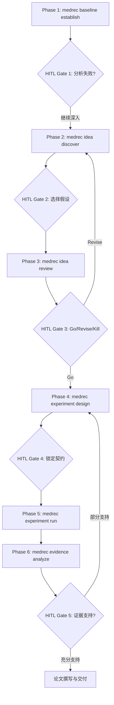

# Idea Loop 快速上手指南 (Quickstart Guide)

> **适用范围**：MedRec 药物推荐科学研究工作流  
> **核心范式**：基线确立 → 失败诊断 → 竞争假设 → 盲审同行评审 → 契约锁定 → 实验验证 → 证据归因决策

---

## 1. 概述与准备

MedRec Research 不仅仅是一个运行基准模型的工具，而是一套**支持从基线复现到创新发现（Idea Loop）的半自动化科研系统**。系统在保证科学严谨性（第一性原理、可证伪性、无数据泄漏）的同时，通过多智能体协作与人机协同决策门（HITL Decision Gates）极大加速科研探索与验证周期。

### 1.1 安装与环境配置

```bash
# 1. 克隆/进入仓库目录
cd medrec-research

# 2. 安装项目环境
uv sync
```

### 1.2 远程计算节点配置 (`~/.medrec/config.yaml`)

创建并编辑 `~/.medrec/config.yaml` 配置远程 GPU 主机信息（如 319-wild）：

```yaml
ssh:
  host: 319-wild
  user: oian
  key_path: ~/.ssh/id_rsa
  remote_data_root: /data/medrec
  port: 22

conda:
  base_env: medrec-core
  baseline_envs:
    safedrug: safedrug-env
    gamenet: gamenet-env
    molerec: molerec-env

teams:
  display_mode: tmux # tmux | in-process
```

---

## 2. Idea Loop 六阶段核心指令



### 阶段 1: 建立基线并定位偏差 (Baseline Establishment)

```bash
# 验证基线配置与执行计划 (Dry-run)
medrec baseline establish safedrug --dry-run

# 正式在远程计算节点运行并记录偏差
medrec baseline establish safedrug
```

- **协作团队**: Baseline Team (3 agents: implementer, reviewer, explore)
- **产出文件**:
  - `research/baselines/safedrug/result.json`
  - `research/baselines/safedrug/analysis.md`
- **HITL 决策点**: 继续分析失败 / 先跑其他基线 / 标记为 baseline-ready

---

### 阶段 2: 剖析失败并提出竞争性假设 (Idea Discovery)

```bash
medrec idea discover safedrug
```

- **协作团队**: Research Team (4 agents: failure analyst, literature, codebase, hypothesis generator)
- **产出文件**:
  - `research/hypotheses/H001-{slug}.md` ~ `H003-{slug}.md`
- **HITL 决策点**: 选择要进入评审与验证的假设编号，或重新生成

---

### 阶段 3: 独立三维度盲审评审 (Idea Review)

```bash
medrec idea review H001
```

- **协作团队**: Review Team (3 reviewers: 新颖性, 可行性, 证据强度)
- **产出文件**:
  - `research/reviews/H001-review.md`
- **HITL 决策点**: `Go` (立项进入实验设计) / `Revise` (修改假设) / `Kill` (终止方向)

---

### 阶段 4: 实验矩阵设计与契约锁定 (Experiment Design & Contract Locking)

```bash
medrec experiment design H001
```

- **协作团队**: Feature Team (3 agents: lead, config engineer, contract generator)
- **产出文件**:
  - `research/contracts/H001-contract.json` (包含不可篡改的成功判据与资源上限)
  - `experiments/H001-exp.yaml` (模型与超参配置)
- **HITL 决策点**: 确认签署并锁定研究契约 / 调整实验设计

---

### 阶段 5: GPU 实验运行与监控 (Execution & Telemetry)

```bash
# Dry-run 预检
medrec experiment run H001-substructure --dry-run

# 远程 GPU 运行
medrec experiment run H001-substructure
```

- **协作团队**: Execution Team (2 agents: deployer, telemetry monitor)
- **运行特征**: 自动监控训练 Epoch 与 Loss 曲线，触发早停或 OOM 保护

---

### 阶段 6: 证据链归因与决策分析 (Evidence Analysis & Decision)

```bash
medrec evidence analyze H001-substructure
```

- **协作团队**: Review Team (3 reviewers)
- **产出文件**:
  - `research/evidence/H001-evidence.md`
- **HITL 决策点**: 证据充分进入论文写作 / 补充区分性实验 / 修正假设 / 结题归档

---

## 3. 全自动快捷研究循环 (Full Loop)

通过 `medrec loop start` 自动串联 1~6 阶段，并在每个关键节点暂停等待研究员做关键决策：

```bash
# Dry-run 模式测试全链路
medrec loop start safedrug --dry-run

# 交互式全流程推进
medrec loop start safedrug
```

---

## 4. 人类决策记录（HITL Audit Ledger）

人类在所有阶段做出的每一个决策都会自动沉淀至：
`research/decisions/{timestamp}-{phase}-decision.json`

包含时间戳、决策上下文、可选列表、最终选择与备注，实现完全可追溯的科研轨迹记录。
