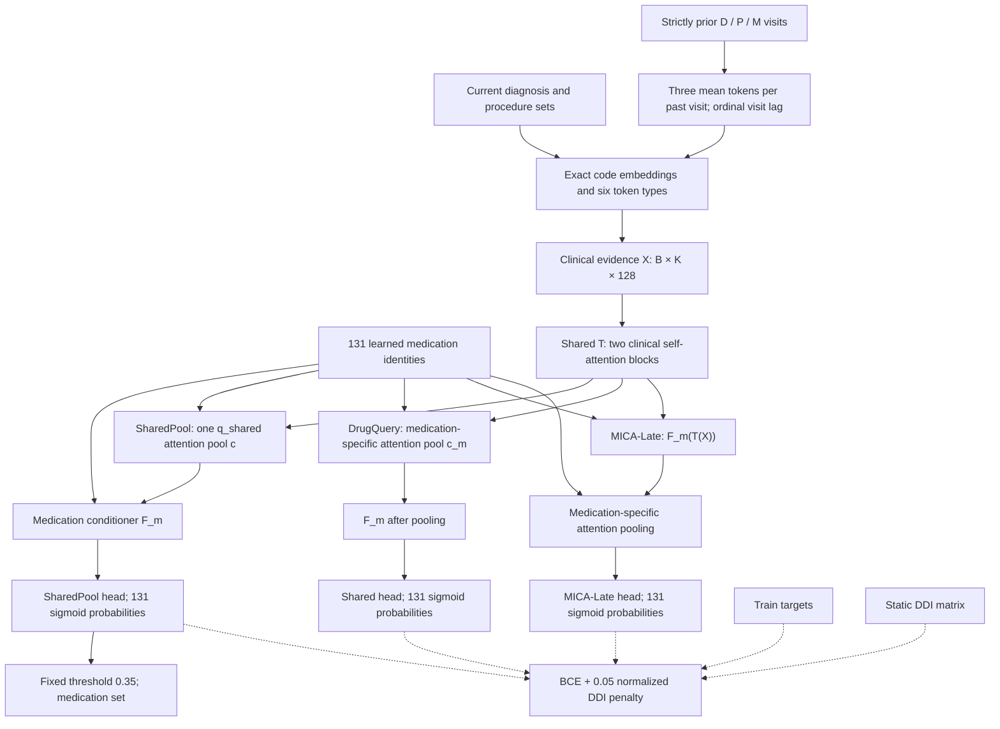

<!-- markdownlint-disable MD013 -->

# MICA: medication-indexed clinical assembly

Status as of 2026-09-15: **three-arm attribution screen complete**. The authoritative starting `origin/main` was `dfec9fb6ebda7893168e3f0263825dd8f1fb44fc`; the implementation and all three runs are bound to immutable revision `cd731bb0abe3dca3ebaa8a3e5346eeff74270f75`. SharedPool, DrugQuery, and MICA-Late each completed the frozen 60-epoch Train/Dev screen; public-safe aggregate evidence is [`result.json`](result.json). The earlier killed Early hypothesis was not rerun. This remains exploratory Train/Dev evidence, not Idea 009, a formal Gate, or a novelty claim. Source binding, strict checkpoint selection, parameter matching, target-free/CUDA preflight, result reporting, and summarizer validation were executed.

## 1. ERAN verdict: REPLACE

An evidence-to-medication attention matrix is insufficient as the central mechanism. DrugDoctor and SSPNet already implement drug-aware clinical reads; local ProblemDrug and MedState also tested medication-specific clinical attention. If allocation means a softmax across drugs, it also assumes that clinical evidence is a scarce resource: one diagnosis would compete to support several medications. The available admission-level targets do not justify that assumption.

From first principles, the supported task is to predict one medication set from the current diagnosis/procedure sets and strictly earlier observed visits. A useful model must preserve that the significance of a clinical code depends on other current evidence and prior clinical context. Different medication decisions can require different interpretations of those relationships. Whether this inductive bias improves prediction remains an empirical question.

**One-sentence hypothesis:** conditioning clinical evidence composition on the candidate medication before evidence aggregation produces better medication-set predictions than parameter-matched medication-specific reads of a shared clinical composition.

- **NEW MODEL OBJECT:** a medication-indexed clinical evidence field `U[b,m,k,d]`, with clinical-to-clinical attention `R[b,m,h,k,l]`. A clinical token can have a different contextual representation for each candidate medication.
- **NEW INFORMATION FLOW:** medication identity enters before current-code/current-code and current-code/history interactions; all evidence is subsequently combined inside that medication's clinical view.
- **NEW COMPUTATION GRAPH:** exact EHR code embeddings → typed current and historical evidence tokens → medication-conditioned clinical views → two clinical interaction blocks per view → medication-specific pooling → 131 membership probabilities → medication set.
- **WHY THIS IS NOT A BACKBONE MODIFICATION:** the complete predictor is trained from EHR inputs. No MoleRec scores, embeddings, checkpoint, patient encoder, residual branch, retrieved candidate set, or existing medication decoder is consumed. The standard attention and conditioning primitives are borrowed; the proposed scientific change is where candidate identity determines clinical computation. Merely using Transformer blocks is not claimed as innovation.

This changes representation object, information flow, candidate-specific computation, patient–medication interaction, and current/history interaction. It retains the supported medication-set prediction granularity.

## 2. Primary-source collision check and motif provenance

The external X-Ray summary at `xray-papers-innovation-summary.md` was used as a discovery aid. Its 64-paper inventory suggests set representation, visit-level evidence, current/history matching, conditional computation, and expansion/continuation motifs. Its reported results are not comparable project baselines.

| Major component / decision | Primary-source verified support | Our synthesis / remaining collision risk |
| --- | --- | --- |
| Clinical sets and attention | [Set Transformer](https://proceedings.mlr.press/v97/lee19d.html) supports attention over sets and invariant pooling. [SSPNet, §§4.2–4.4](https://www.ijcai.org/proceedings/2025/1052.pdf) encodes diagnosis/procedure sets before drug cross-attention. | A separate jointly contextualized clinical token field for each medication; no code-order positions. SSPNet is a close architectural comparator, not a novel ingredient. |
| Medication-conditioned clinical computation | [FiLM](https://ojs.aaai.org/index.php/AAAI/article/view/11671) supports feature-wise affine conditioning as a general primitive. [DrugDoctor, Eqs. 5–13](https://pdfs.semanticscholar.org/8a91/892b947a783104d73a586b69764df8baeb67.pdf) verifies drug/substructure queries over shared clinical encodings and prior-medication queries over previous clinical encodings. | Move conditioning upstream into clinical code-to-code composition. FiLM and label-aware attention themselves are established techniques. The screen tests the location of conditioning, not their invention. |
| Typed historical visit evidence | DrugDoctor supports using preceding clinical and prescription records. [HypeMed, §§4.1–4.2](https://arxiv.org/html/2603.18459v1) preserves visit-level structure and combines history with retrieved visits. | Three compact modality tokens per own preceding visit enter the same medication-conditioned clinical field. No cross-patient retrieval, hypergraph pretraining, or learned state assimilation. Pooling historical codes is an explicit compression limitation. |
| Candidate medication identities | [Rx-Expert](https://www.sciencedirect.com/science/article/pii/S0957417426022839) uses MoE patient processing and multimodal drug representations. | Learned medication identity conditions computation; there are no experts, router load-balancing objective, molecular encoders, or text features. Conditional computation is not itself a novelty claim. |
| Prediction and DDI training | DrugDoctor supports sigmoid medication membership and a differentiable pairwise DDI penalty. | A common fixed decoder and safety objective serve candidate and control. Neither is the contribution. The DDI metric does not establish clinical safety. |
| Diagnosis decomposition collision | [FineMed official repository](https://github.com/liyifo/FineMed) and [publisher record](https://doi.org/10.1016/j.ins.2026.123930) describe diagnosis-level sub-recommendations, diagnosis enhancement, and offline LLM-assisted medication mapping. | MICA has no diagnosis-level medication targets, correspondence labels, severity/lab augmentation, or per-diagnosis prescriptions. FineMed's complete equations were not accessible; exact normalization/history details remain unverified. |
| List-generation collision | [FLAME](https://arxiv.org/abs/2505.20218) uses drug-level filtering and list-wise add/remove alignment. | MICA makes simultaneous decisions from clinical evidence; no LLM policy, provisional prescription, edit sequence, or reward shaping. |

The closest five Medication Recommendation architectures examined were DrugDoctor, SSPNet, FineMed, HypeMed, and Rx-Expert; FLAME and adjacent set/conditioning literature were also checked. The accessed sources did not reveal the exact medication-indexed clinical self-attention computation below. That is enough to justify screening, not a verified novelty finding. A survivor still needs full FineMed text and broader closest-work verification.

**X-Ray-summary priors only:** KERL/HeteroMed suggest expansion versus continuation; ChainCare and DCGM suggest temporal evidence organization. These motivated search but do not establish MICA's mechanism or headroom. Expansion/continuation was not selected because that decomposition is already explicit in those summaries. An intent-slot set generator was not selected because the local TheraCompose formulation failed badly and this screen has no new intent supervision.

**Our inference:** a shared encoder may discard or mix clinical relationships before a downstream drug query can use them. Medication-conditioned encoding offers a different inductive bias, not additional observed information or a universal expressivity theorem. A strong shared encoder can approximate many such functions; the matched experiment decides whether the explicit operation earns its cost.

## 3. Inputs and causal boundary

- Canonical MoleRec-compatible snapshot `molerec-table1-c721-www23`; existing `gate01-train-dev-5752596a-20260913a` arrays.
- Train: 4,233 patients / 10,489 visits. Dev: 1,004 patients / 2,130 visits. Use the existing patient split and row order; never regenerate a random split.
- With 6,350 ordered snapshot patients, Train is the first `floor(2N/3)` patients. Dev is the existing remaining-patient half selected by `SHA256("idea008-gate01-v1:" + patient_index)[:8] / 2^64 < 0.5`, big endian.
- For visit `t`: current `D_t, P_t`; history `(D_j,P_j,M_j)` for every `j<t`. Current `M_t` is a loss/evaluation target only. Observed preceding Dev prescriptions are allowed in the next visit's prefix, matching the benchmark's observed-history task.
- Preserve the ordered 131-medication vocabulary from `voc_final.pkl`; D/P tables use the exact declared vocabulary indices. No hashing, clipping, vocabulary refit, or candidate shortlist.
- No future visits, target-derived features, notes, labs, dose/route labels, external text, molecular features, or learned baseline outputs. DDI is the existing static `131×131` matrix. No EHR co-prescription graph is used.
- The raw snapshot is a shared container; select only Train/Dev patient records for feature materialization. Do not construct or evaluate other cohort examples, nor load their score/target files.
- This is the canonical admission-level prediction entitlement. It does not establish that every current admission diagnosis/procedure was recorded before a real prescription order; no bedside pre-order or causal-treatment-effect claim is made.

## 4. Complete computation specification

### Tokenization

Let `B` be batch size, `M=131`, `d=128`, `H=t−1`, and `K=1+|D_t|+|P_t|+3H` before batch padding.

Use one learned table `E ∈ R[(|D|+|P|+131)×128]` with disjoint D/P/M index ranges. The medication slice is also the candidate identity table. Use six learned type embeddings: null, current diagnosis, current procedure, historical diagnosis, historical procedure, historical medication.

- Current code: one embedding token per distinct D/P code.
- Each preceding visit: one mean of its diagnosis embeddings, one mean of its procedure embeddings, one mean of its medication embeddings. An empty modality has zero mean but retains its type token.
- Null: zero code vector plus the learned null type. Always present; it permits a decision with no useful evidence. It is not a predicted need or intent.
- `X_k = LN(mean(E_codes(k)) + type_k) + PE(lag_k)`.
- `PE(lag)_(2r)=sin(lag/10000^(2r/128))`; odd coordinate uses cosine. Current/null lag is zero; preceding visits use ordinal lag `t−j`. This encodes visit order, not elapsed wall time or within-admission clinical timing.
- Apply dropout `0.1` to `X[B,K,128]` once, before medication expansion. Pad only within each minibatch, mask padded keys, and do not truncate history or codes.

### Attribution variants

`e_m = LN(E_med[m]) ∈ R^128`. One affine conditioner maps `128→256`, split into `g_m,b_m`:

```text
F_m(X) = (1 + 0.5 tanh(g_m)) ⊙ X + 0.5 tanh(b_m)
```

Initialize the entire conditioner weight and bias to zero. All three variants therefore start from copied initial parameters. There is no probability normalization over medications and no evidence-conservation constraint.

The three paths share the same `T`, conditioner, readout, head, loss, decoder, and update budget:

```text
SharedPool: X → T(X) → one shared attention pool c(q_shared) → F_m(c) → head
DrugQuery:  X → T(X) → medication-specific pool c_m → F_m(c_m) → head
MICA-Late:  X → T(X) → F_m(T(X)) → medication-specific pool c_m → head
```

For SharedPool, `q_shared = normalize(mean_m(e_m))` where each `e_m` is the existing normalized medication embedding. The shared query and the existing readout Q/K/V maps produce one mask-aware context; its evidence weights are identical for every medication. DrugQuery uses the existing medication-specific readout query before the existing conditioner. MICA-Late is the frozen prior formulation. Medication identity enters SharedPool only after pooling, through `F_m` and the common prediction head. Computation preserves all 131 predictions and uses fixed medication chunks of 16 where needed.

`T` contains exactly two distinct clinical blocks, with parameters shared across all medications:

```text
A = LN1(Z)
R_m,h = softmax_over_key_tokens(Q_h(A) K_h(A)^T / sqrt(32) + padding_mask)
Z' = Z + W_o concat_h(R_m,h V_h(A))
Z_next = Z' + Linear_256_to_128(GELU(Linear_128_to_256(LN2(Z'))))
```

Four heads, 32 dimensions/head; Q/K/V/output linear maps include biases. No attention or block-FFN dropout. A final `LN` follows the two blocks. All LayerNorms act over the last 128 coordinates with `eps=1e-5`, learnable scale/bias. Tokens already form an admissible prefix, so bidirectional attention inside this prefix is valid; no future/current-medication token exists. There are no drug-to-drug message-passing edges.

### Readout and medication-set output

For each medication, normalize its clinical field with another shared `LN` and use single-head attention:

```text
a_mk = softmax_over_valid_tokens((W_q e_m)^T W_k LN(U_mk) / sqrt(128))
c_m = sum_k a_mk W_v LN(U_mk)
z_m = Linear_128_to_1(Dropout_0.1(GELU(Linear_384_to_128([c_m,e_m,c_m⊙e_m])))) + bias_m
p_m = sigmoid(z_m)
```

Readout Q/K/V maps are bias-free. The two prediction-head linear layers include bias. Initialize `bias_m` with the logit of Train-only medication prevalence, clamped to `[1e-4,1−1e-4]`. Embeddings initialize `Normal(0,0.02)`; other linear weights use Xavier uniform, biases zero; LayerNorm scale/bias start at one/zero.

Decode all `p_m >= 0.35`; output unique medication codes in canonical order. The threshold is frozen for all three arms, with no Dev threshold search. Cardinality is the resulting number of accepted medications: no learned K, target K, MoleRec K, top-K fallback, or DDI filter. This decoder choice addresses a known risk of under-prescription in BCE prototypes; it is not a claimed architecture contribution. Historical reference rows retain their recorded decoder, so only the three matched arms isolate the architectural changes.

### Objective and training

```text
L_BCE = mean_(batch,medication) BCEWithLogits(z,y)
L_DDI = mean_batch(sum_(i<j) D_ij p_i p_j) / 131
L = L_BCE + 0.05 L_DDI
```

All other loss weights are zero: no margin, cardinality, auxiliary-stage, distillation, reconstruction, routing, or contrastive loss. DDI acts during training only; it does not change candidate access or inference.

| Setting | Single frozen value |
| --- | --- |
| Seed | `20260914` for Python, NumPy, PyTorch, CUDA |
| Optimizer | AdamW, betas `(0.9,0.999)`, epsilon `1e-8` |
| Learning rate | constant `3e-4`, no scheduler/warmup |
| Weight decay | `1e-4`, all trainable parameters in one group |
| Batch | 16 visits, last partial batch retained; identical seeded visit permutations in all arms |
| Epochs | 60 complete Train epochs; no early stopping |
| Gradient clipping | global norm 5.0 |
| Precision | float32; no mixed precision; CUDA matmul TF32 off; cuDNN TF32 off; deterministic cuDNN settings |
| Checkpoint | highest full-Dev Jaccard at the fixed decoder; strict improvement only, earliest epoch wins exact ties |
| Final evidence | selected checkpoint on complete Train and complete Dev; also record epoch-60 Dev row |

## 5. Three-arm attribution and matched control

SharedPool removes medication-specific evidence selection while retaining the shared clinical encoder, the existing readout Q/K/V maps, the medication conditioner after pooling, and the common head. DrugQuery restores medication-specific query pooling but keeps the conditioner after pooling. MICA-Late moves that same conditioner before medication-specific pooling.

Everything else is identical across all arms: parameter names/shapes and initialization, exact input tokens and strict history, candidate identities, dropout, 128-dimensional states, two clinical blocks, readout, head, loss, DDI information, decoder, batches, optimizer, epochs, and checkpoint rule. Conditioner parameters remain trainable in every arm. The preflight requires exact parameter-count equality. Per-example compute differs; equal training budget means identical examples, update count, and checkpoint opportunities, so wall time and peak memory are recorded without implying equal FLOPs.

The primary comparison is `Δ_query = Jaccard(DrugQuery) − Jaccard(SharedPool)`, testing medication-specific evidence selection. The secondary comparison is `Δ_film = Jaccard(MICA-Late) − Jaccard(DrugQuery)`, testing incremental value from conditioning clinical token representations before medication-specific pooling. These are attribution comparisons, not novelty verification.

## 6. Why this screen is worth doing, and its limits

The frozen-unary residual result only bounds the tested W-only correction, not relearning clinical representations. MICA can change primary medication evidence on first visits as well as historical visits, and is not restricted to rearranging a strong model's scores. Its central intervention precedes aggregation, unlike NeedCover's regimen-conditioned residual coverage and MedState's persistent post-prediction assimilation.

Expected headroom is a hypothesis. The strongest objections are substantial: the shared control may already encode all useful relations; mean historical modality tokens may lose useful detail; drug identity conditioning can overfit with only 10,489 Train visits; and removing molecular features may make both models weaker than MoleRec. A good mechanism delta against a weak control alone does not justify continuing the paper direction. Modules are limited to tokenization, conditional clinical composition, medication readout, and a common objective. No extra retrieval, MoE, graph, or decoder module is added to manufacture a story.

## 7. Full Train/Dev execution and minimum preflight

Use the existing `medrec-molerec-table1` Baseline Environment on the 319 Execution Plane. The Harness Terminal performs source checks and aggregate intake only. Its runtime was observed as Python 3.8.16 / PyTorch 1.9.0+cu111; reverify on submission. Do not change that environment to satisfy core Python 3.11 tooling. The finalized runner requires an exact clean checkout, an explicit full `--source-revision`, and an output directory outside that checkout.

Allocate GPU 0 to SharedPool, GPU 1 to DrugQuery, and GPU 2 to MICA-Late, subject to immediate Remote Preflight (utilization at most 10%, at least 16 GiB free memory/device, at least 20 GiB free disk). No other GPU lane, seed, or variant is authorized.

Minimum checks and their consequences:

1. Exact clean source on an isolated remote checkout; verify environment/GPU/disk. A mismatch blocks launch rather than running stale code.
2. Check snapshot/vocabulary dimensions, canonical split counts, and exact row-wise target alignment against existing Train/Dev arrays. A failure invalidates comparability and stops before optimization.
3. Inspect target-free forward and strict prefix construction. Reject future/current-medication access; no separate test is needed when code inspection establishes the boundary.
4. One synthetic CUDA forward/backward for all three variants, exact parameter matching, query-pooling equality at zero conditioner where expected, target-free finite logits, and finite nonzero conditioner gradients. This detects a broken tensor path or inactive arm before the full run. It is not an epoch or evidence row.
5. Run the complete declared experiment immediately after these checks. Do not substitute reduced data or an abbreviated epoch budget.

Source synchronization uses a Git bundle or isolated worktree at the implementation commit. Preserve the older remote checkout and unrelated jobs. Each arm runs as an independent detached job with private outputs outside all repositories.

```bash
# On the verified 319 checkout, with the declared environment activated:
CUDA_VISIBLE_DEVICES=0 python research/prototypes/mica/run_mica.py \
  --variant shared_pool --snapshot-root "$SNAPSHOT_ROOT" \
  --train-dev-root "$TRAIN_DEV_ROOT" --source-revision "$RUN_REVISION" \
  --output-dir "$MICA_OUTPUT/shared_pool"

CUDA_VISIBLE_DEVICES=1 python research/prototypes/mica/run_mica.py \
  --variant drug_query --snapshot-root "$SNAPSHOT_ROOT" \
  --train-dev-root "$TRAIN_DEV_ROOT" --source-revision "$RUN_REVISION" \
  --output-dir "$MICA_OUTPUT/drug_query"

CUDA_VISIBLE_DEVICES=2 python research/prototypes/mica/run_mica.py \
  --variant late --snapshot-root "$SNAPSHOT_ROOT" \
  --train-dev-root "$TRAIN_DEV_ROOT" --source-revision "$RUN_REVISION" \
  --output-dir "$MICA_OUTPUT/late"
```

Record public-safe aggregates: exact configuration/revision/environment, parameter count, cohort counts, completed epochs, chosen epoch, Train/Dev BCE, Jaccard/F1/PRAUC/precision/recall, DDI global unordered-pair ratio, mean/count standard deviation, the epoch-60 Dev row, wall time, and peak GPU memory. Store checkpoints, patient-aligned scores/targets, split membership and raw logs privately on 319. Existing MoleRec Dev scores may be read solely to recompute its reference row; GraphRefine-SameK remains a historical diagnostic aggregate with no persisted checkpoint, not a newly reproduced model.

No held-out/test/Audit/G3/G4 evaluation, bootstrap, additional seed, threshold sweep, broad unit/regression suite, or automatic rescue is included.

## 8. Predeclared decision rule

Use the selected full-Dev rows after all three arms complete all 60 epochs. Classify each signed delta by magnitude: `|Δ| <= 0.002` is no material contribution; `0.002 < |Δ| <= 0.004` is weak; `|Δ| > 0.004` is meaningful; `|Δ| >= 0.010` is a strong attribution signal. The routing rules are:

| Observed relation | Frozen conclusion |
| --- | --- |
| `DrugQuery − SharedPool > 0.004` and `MICA-Late − DrugQuery <= 0.002` | preserve DrugQuery as MICA-Core; late FiLM-before-pooling is unnecessary |
| SharedPool is within `0.002` of both DrugQuery and MICA-Late | candidate-specific evidence selection is not carrying the strong surface; retain the shared clinical encoder/history base only |
| `MICA-Late − DrugQuery > 0.004` | pre-pooling medication conditioning has independent value; preserve Late as the strong base |
| any other valid result | record the signed deltas and stop; no automatic rescue or additional ablation |

Report precision/recall, DDI, mean medication count, count standard deviation, NLL, wall time, and peak GPU memory with every arm. This is one seed of exploratory Train/Dev evidence; no held-out selection, formal Gate, novelty claim, or additional diagnostic is authorized.

## 9. Architecture figure



## EXECUTION OUTCOME

The exact clean source, canonical data/split/vocabulary, parameter equality, target-free forward, and single CUDA forward/backward preflights passed. SharedPool, DrugQuery, and MICA-Late each completed all 60 epochs on GPUs 0/1/2 in `medrec-molerec-table1`; aggregate evidence is in [`result.json`](result.json). Selected checkpoints were all epoch 3. DrugQuery minus SharedPool Jaccard is `+0.0098138220` (meaningful); MICA-Late minus DrugQuery is `-0.0005879299` (no material contribution). The frozen conclusion is `PRESERVE_DRUGQUERY_AS_MICA_CORE_LATE_FILM_UNNECESSARY`. Early was not rerun, no Idea 009 or formal Gate was created, and no rescue or additional ablation is authorized.
